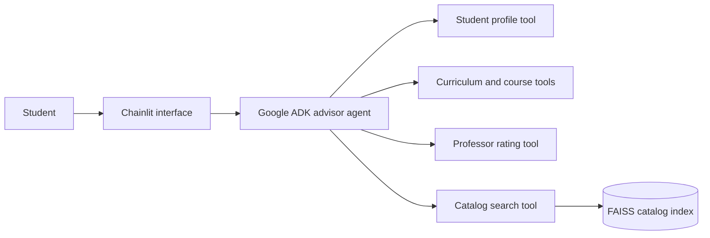
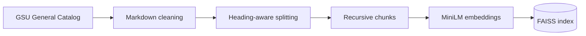

<div align="center">
  
  <h1>GramAssist 2.0</h1>
  <p><strong>An AI academic advisor that helps Grambling State University students understand courses, prerequisites, degree progress, professors, and university policies.</strong></p>
</div>

GramAssist combines a Google ADK agent with structured academic tools and a retrieval pipeline over the GSU General Catalog. It grounds student-specific answers in prototype records and routes policy questions to the catalog instead of asking the language model to guess.

> **Prototype:** Student and professor records are mock data. Curriculum data was extracted from university documents, and academic guidance should be confirmed with an official advisor.

## What it can do

- Compare completed coursework with curriculum requirements.
- Check course information and prerequisites.
- Explain university policies using retrieved catalog passages.
- Summarize and compare available professor rating data.
- Choose among specialized tools based on the student's question.

Try questions such as:

- `Can student S004 take CS 310?`
- `Which required courses does student S004 still need?`
- `Compare Dr. Marcus Reed and Dr. Alicia Bennett.`
- `If I repeat a course, how does the university calculate my GPA?`

## Architecture



The catalog index is prepared separately from the chat runtime:



The ingestion experiments compared pure semantic, heading-aware semantic, and heading-aware recursive splitting. The final pipeline uses Markdown headings followed by recursive chunks of 2,500 characters with 250-character overlap. It retained the catalog's existing structure while avoiding the irregular chunk sizes produced by pure semantic splitting.

## Tech stack

- **Agent:** Google Agent Development Kit and Gemini
- **Interface:** Chainlit
- **Retrieval:** LangChain, FAISS, and `all-MiniLM-L6-v2`
- **Data processing:** LlamaCloud, Ollama, and Pydantic
- **Language:** Python 3.12+

## Run locally

### 1. Install the project

Install [uv](https://docs.astral.sh/uv/getting-started/installation/), then run:

```bash
git clone https://github.com/Thenewgirl04/GramAssist_2.0.git
cd GramAssist_2.0
uv sync
```

### 2. Configure Gemini

Create a [Gemini API key](https://aistudio.google.com/app/apikey), copy the environment template, and replace the placeholder value:

```bash
cp .env.example .env
```

```env
GOOGLE_API_KEY=your_google_api_key
```

The LlamaCloud, Ollama, and NVIDIA variables in `.env.example` are optional. They are only needed to rerun the source-document extraction workflows.

### 3. Start GramAssist

```bash
uv run chainlit run main.py
```

Open [http://localhost:8000](http://localhost:8000). Chat sessions are isolated in memory and reset whenever the server restarts.

## Rebuild the catalog index

A production FAISS index is committed so the application works immediately after setup. To rebuild it from the cleaned catalog Markdown:

```bash
uv run python -m rag_pipeline.ingest_catalog
```

The first run downloads the MiniLM embedding model from Hugging Face.

## Project structure

```text
GramAssist_2.0/
├── advisor_agent/       # ADK agent definition
├── data/                # Source, structured, mock, and indexed data
├── experimentation/     # Chunking experiments and recorded results
├── prompts/             # Grounding and tool-selection instructions
├── public/              # Chainlit branding and interface assets
├── rag_pipeline/        # Catalog ingestion and retrieval
├── tools/               # Student, curriculum, professor, and catalog tools
├── utils/               # Extraction and cleanup utilities
├── main.py              # Chainlit application entry point
└── project_paths.py     # Working-directory-independent resource paths
```

## Troubleshooting

- **GramAssist says it is not connected to Gemini:** confirm `.env` contains `GOOGLE_API_KEY`, then restart Chainlit.
- **The embedding model cannot load:** connect to the internet for the first model download or restore the local Hugging Face cache.
- **Catalog answers are unavailable:** confirm `data/faiss/catalog/index.faiss` and `index.pkl` exist.
- **A student or professor cannot be found:** the prototype only contains the mock records in `data/mock/`.

## License

This project is intended for educational and portfolio use.
