# UNIVERSITY ORGANIZATIONAL CHART

```mermaid
graph TD
    Board["University of Louisiana System Board of Supervisors"]
    President["Dr. Martin Lemelle Jr.President"]
    
    AcademicAffairs["Academic AffairsDr. Connie WaltonProvost and Vice President"]
    StudentAffairs["Student AffairsDr. Rudolph EllisVice President"]
    Advancement["University Advancement and InnovationBrandon LoganVice President"]
    FinanceVP["FinanceVACANTVice President"]
    Operations["OperationsDr. Kenyatta ShamburgerChief Operating Officer"]
    AdminBusiness["Administration and Business AffairsPenya MosesVice President"]

    Board --> President
    
    President --> AcademicAffairs
    President --> StudentAffairs
    President --> Advancement
    President --> FinanceVP
    President --> Operations
    President --> AdminBusiness

    %% Academic Affairs Branch
    AcademicAffairs --> Education["College of EducationDr. Katie Bennett-CraftDean"]
    AcademicAffairs --> Graduate["Graduate studiesDr. Carolyn JacksonInterim Exec. Director"]
    AcademicAffairs --> Library["Digital Library & LCAdrienne WebberDean"]
    AcademicAffairs --> Honors["ELC Honors CollegeDr. Ellen SmileyDean"]
    AcademicAffairs --> Business["College of BusinessDr. Derrick WarrenDean"]
    AcademicAffairs --> Registrar["Records & RegistrationShakira HardisonRegistrar"]
    AcademicAffairs --> ROTC["Military Sci/Army ROTCLTC Mason MooreDepart. Head"]
    AcademicAffairs --> ArtsSciences["College of Arts & SciencesDr. Stacey DuhonDean"]
    AcademicAffairs --> AssocVPAA["Academic AffairsDr. Roshunda Belton-CardozaAssoc. Vice President"]
    
    AssocVPAA --> Distance["Distance LearningDr. Eldrie HamiltonDirector"]
    AssocVPAA --> ProfStudies["College of Prof StudiesDr. Carolyn HesterDean"]
    AssocVPAA --> Testing["Testing ServicesYettie PickensDirector"]
    AssocVPAA --> SACSCOC["CEP/SACSCOC ActivitiesVACANTExecutive Director"]
    AssocVPAA --> ContEd["Cont. Ed. & Serv. LearningDr. Rory BedfordDirector"]
    AssocVPAA --> InstRes["Institutional ResearchDr. Shalena JohnsonDirector"]

    ProfStudies --> SocialWork["School of Social of WorkDr. Jacqueline GarrisonAssoc. Dean"]
    ProfStudies --> Nursing["School of NursingDr. Meg BrownAssoc. Dean"]

    %% Student Affairs Branch
    StudentAffairs --> Housing["Campus Living & HousingCarmella BarfieldDirector"]
    StudentAffairs --> Counseling["Student Counseling Serv.Dr. Colleen SpeedDirector"]
    StudentAffairs --> Health["Health CenterPatrice Lewis-OutleyDirector"]
    StudentAffairs --> DeanExp["Student AffairsTerry LillyDean of Student Exp."]
    
    DeanExp --> Band["BandDr. Nikole RoebuckDirector"]
    DeanExp --> Conduct["Student ConductTundra TurnerDirector"]
    DeanExp --> Engagement["Student Engage. & LeadCharlette FavorsCoordinator"]
    DeanExp --> Intramural["Intramural Sports & RecJamal ForbesDirector"]
    DeanExp --> Activities["Campus Activity & StudMarcus KennedyDirector"]
    DeanExp --> Union["Favrot Student UnionBarbara Waters PayneAssoc. Director"]

    %% Advancement Branch
    Advancement --> AdvServ["Adv. Serv. & Fdn Ops.Russell LedayDirector"]
    Advancement --> Communications["University CommunicationsTisha ArnoldDirector"]
    Advancement --> Career["Career ServicesAntoinette LivingstonDirector"]
    Advancement --> Alumni["Alumni AffairsVACANTExecutive Director"]
    Advancement --> Foundation["PresidentJasmine CherryAssoc. Vice President"]

    %% Finance Branch
    FinanceVP --> FinanceDir["FinanceRachel DavisInterim Sr. Assoc. Vice"]
    FinanceVP --> Budget["Budget & Fin. PlanningJoy CreditInterim Director"]
    FinanceVP --> AuxServ["Aux. Serv. & OperationsCasey ByrdDirector"]
    FinanceVP --> Controller["Controller/AccountingRaymond AbrahamsController"]
    FinanceVP --> AssocController["Controller/AccountingValencia BeadleyAssoc. Controller"]
    FinanceVP --> Enrollment["Enrollment ManagementTasha HeardInterim Assoc. Vice President"]
    
    Enrollment --> Admissions["Admissions, Recruitment & OAPGeorgia D. DouglasDirector"]
    Enrollment --> FinancialAid["Financial AidLatisha Wright SuttonInterim Director"]
    Enrollment --> UnivCollege["University CollegeMilton JacksonInterim Director"]
    
    UnivCollege --> Retention["RetentionVACANTDirector"]

    %% Operations Branch
    Operations --> IT["Information TechnologyMax FergusonChief Experience & DigitalStrategy Officer"]
    Operations --> Emergency["Emergency ManagementVACANTAdvisor"]
    Operations --> Facilities["Facilities Planning & Man.Damian ChatmanDirector"]
    Operations --> Property["Property & ReceivingJohnnie Faye WilliamsDirector"]
    Operations --> Police["University PoliceRodney DemeryChief"]
    Operations --> Safety["Safety & Risk Mgmt.VACANTDirector"]

    %% Admin & Business Branch
    AdminBusiness --> HR["Human ResourcesWayne H. BryantDirector"]
    AdminBusiness --> Compliance["Univ. Compliance Admin.Tasha SmithADA Coordinator"]
    AdminBusiness --> CivilRights["Civil Rights/Title IX Coord.Kennedy JonesDirector"]
    AdminBusiness --> Purchasing["PurchasingErin WalkerDirector"]

    %% Central Vertical Branch (Athletics, Audit, Research)
    President --> Athletics["AthleticsDr. Trayvean ScottVice President/Director"]
    President --> InternalAudit["Internal AuditVACANTDirector"]
    President --> Research["Research & Spons. Progs.Theodore GallierVice President"]
    
    Research --> Grants["Grants AdministrationSharcenda McConnellDirector"]
    Research --> Development["Project DevelopmentDr. Ebony TurnerDirector"]
    Research --> TitleIII["Title III ProgramsTheodore Gallier*Interim Exec. Director"]
```

ORGANIZATIONAL CHART
12/18/2025

\*Dual Responsibilities

## ACADEMIC CALENDARS

*These dates and time are subject to change Please check website frequently to ensure you stay informed of all changes to the University’s Academic Calendar.*

### 2024 Fall Semester

| August |  |
| --- | --- |
| 11-12, Sunday - Monday | Residence Halls Open for Freshmen |
| 16, Friday | Residence Halls Open for Upper Classmen |
| 12 - 16, Monday - Friday | New Student Orientation Week |
| 12 - 15, Monday - Thursday | Registration of New Undergraduate Students |
| 14 - 15, Wednesday - Thursday | Registration of New Graduate Students |
| 16, Friday | Late Registration (late fee of $50.00 applies) |
| 19, Monday | Classes Begin |
| 23, Friday | Last Day to Register or Add Classes |
| September |  |
| 2, Monday | Labor Day Holiday |
| 20, Friday | Final Day for Submitting Applications for 2024 Fall Graduation |
| October |  |
| 7 - 11, Monday - Friday | Mid Semester Examinations |
| 14, Monday | 2nd 9-week Courses Begin; Rising Junior Exam (RJE) |
| 15, Tuesday | Mid Semester Grades Due |
| 22, Tuesday | Deadline for Faculty Submission of "I" Grades Work from Spring |
| 28 - Nov. 1, Monday - Friday | Founder's Day/Week Observance |
| November |  |
| 4, Monday | Registration of Continuing Students for 2025 Spring Semester |
| 11, Monday | Applications for 2025 Spring Graduation Due |
| 14, Thursday | Last Day to Drop Classes or Withdraw with “W” Grades |
| 26, Tuesday, 5:00 p.m. | Thanksgiving Holiday Begins |
| December |  |
| 2, Monday, 7:30 a.m. | Thanksgiving Holiday Ends |
| 2, Monday | Last Day of Classes |
| 2-3, Monday - Tuesday | Final Examinations for Candidates for Graduation |
| 3-4, Tuesday - Wednesday | Reading Period |
| 5-11, Thursday - Wednesday | Final Examinations for Non-Graduating Students |
| 5, Thursday | Deadline for Submitting Grades for Candidates for Graduation |
| 9, Monday | Deadline for Certifying Candidates for Graduation |
| 11, Wednesday at 8:00 pm | Residence Halls Close for Non-Graduating Students |
| 13, Friday at 2:00pm | Residence Halls Close for Graduating Seniors |
| 13, Friday | FALL 2024 COMMENCEMENT |
| 17, Tuesday | Deadline for submission of Final Grades for Non-Graduating Students |
| 20, Friday | University Closes at 11:30am |

# 2025 Spring Semester

| January |  |
| --- | --- |
| 5, Sunday | Residence Halls Open |
| 6, Monday | Holiday Break Ends |
| 6, Monday | New Student Orientation |
| 6-7, Monday - Tuesday | Registration of All Students |
| 8, Wednesday | Classes Begin |
| 8-15, Wednesday - Wednesday | Late Registration (late fee of $50.00 applies) |
| 15, Wednesday | Last Day to Register |
| 20, Monday | Martin Luther King, Jr. Holiday |
| 21, Tuesday | Classes Resume |

| February |  |
| --- | --- |
| 7, Friday | Final Day for Departments to Submit Applications for Spring 2025 Graduation |

| March |  |
| --- | --- |
| 3-5, Monday - Wednesday | Mardi Gras Holiday |
| 6, Thursday | Classes Resume |
| 10-21, Monday - Friday | Mid Semester Examinations |
| 17, Monday | 2nd 9-week Courses Begin |
| 17, Monday | Rising Junior Exam |
| 20, Thursday | Deadline for Faculty Submission of "I" Grades Work from Fall |
| 24, Monday | Registration for Continuing Students for Summer 2025 |
| 28, Friday | Mid-Semester Grades Due |
| 31, Monday | Registration for Continuing Students for Fall 2025 Semester |

| April |  |
| --- | --- |
| 10, Thursday | Last Day to Drop Classes or Withdraw with "W" Grades |
| 11, Friday | Spring Break Begins at the End of the Day |
| 22, Tuesday | Spring Break & Easter Observance ends at 7:30 a.m. |
| 22-23, Tuesday - Wednesday | Final Examinations for Candidates for Graduation |
| 24, Thursday | Last Day of Classes |
| 25, Friday | Reading Period |
| 29, Tuesday | Deadline for Submitting Grades for Candidates for Graduation |
| 28-May 2, Monday-Friday | FINAL EXAMINATIONS |

| May |  |
| --- | --- |
| 2, Friday | Deadline for Submitting Graduation Certifications |
| 4, Sunday | Residence Halls Close |
| 6, Tuesday | Deadline for Submission of Final Grades |
| 9, Friday | 2025 SPRING COMMENCEMENT |
| 9, Friday | Spring Semester Ends |

## 2025 Summer Session I

| May |  |
| --- | --- |
| 18, Sunday | Residence Halls Open |
| 19, Monday | Registration |
| 20, Tuesday | Classes Begin |
| 20-22, Tuesday-Thursday | Late Registration (late fee of $50 applies) |
| 22, Thursday | Last Day to Register for Session I |
| 26, Monday | Memorial Day Observance Begin |
| 27, Tuesday | Classes Resume |
| June |  |
| 5, Thursday | Last Day to Drop Classes or Withdraw with "W" Grades |
| 9, Monday | Last Day of Classes |
| 10-11, Tuesday - Wednesday | FINAL EXAMINATIONS |
| 12, Thursday | Residence Halls Close by Noon |
| 13, Friday | Final Grades Due |

## 2025 Summer Session II

| June |  |
| --- | --- |
| 15, Sunday | Residence Halls Open |
| 16, Monday | Registration |
| 17, Tuesday | Classes Begin |
| 17-19, Tuesday - Thursday | Late Registration (late fee of $50 applies) |
| 19, Thursday | Juneteenth Observation |
| 20, Friday | Last Day to Register for Session II |
| July |  |
| 3, Thursday | Last Day to Drop Classes or Withdraw with "W" Grades |
| 4, Friday | Independence Day Observance |
| 7, Monday | Last Day for Submitting Applications for 2025 Summer Graduation |
| 9, Wednesday | Last Day of Classes |
| 10-11, Thursday - Friday | FINAL EXAMINATIONS |
| 11, Friday | Residence Halls Close By 10 PM |
| 14, Monday | Final Grades Due |
| 14, Monday | Summer School Closes |
| 15, Tuesday | Graduation Certifications Due |
| 18, Friday | Summer Degrees Conferred |

# 2025 Fall Semester

| August |  |
| --- | --- |
| 1, Friday | Residence Halls Open for Freshmen |
| 3, Sunday | Mandatory New Tigers Hall Meeting |
| 5-6, Tuesday-Wednesday | Residence Halls Open for Upper Classmen |
| 4 - 8, Monday - Friday | New Student Orientation Week |
| 4 - 7, Monday - Thursday | Registration of New Undergraduate Students |
| 6 - 7, Wednesday - Thursday | Registration of New Graduate Students |
| 7, Thursday | Late Registration (late fee of $50.00 applies) |
| 7, Thursday | Classes Begin |
| 14, Thursday | Last Day to Register or Add Classes |

| September |  |
| --- | --- |
| 1, Monday | Labor Day Holiday |
| 5, Friday | Final Day for Submitting Applications for 2025 Fall Graduation |
| 29 - Oct. 3, Monday - Friday | Mid Semester Examinations |
| 29, Monday | 2nd 9-week Courses Begin |
| 30, Tuesday | Deadline for Faculty Submission of "I" Grades Work from Spring |

| October |  |
| --- | --- |
| 6, Monday | Rising Junior Exam (RJE) |
| 7, Tuesday | Mid Semester Grades Due |
| 13, Monday | Registration of Continuing Students for 2026 Spring Semester |
| 30 Thursday | Last Day to Drop Classes or Withdraw with "W" Grades |

| November |  |
| --- | --- |
| 3 - 7, Monday - Friday | Founder's Day/Week Observance |
| 3, Monday | Applications for 2026 Spring Graduation Due |
| 14, Friday | Last Day of Classes |
| 17-18, Monday - Tuesday | Final Examinations for Candidates for Graduation |
| 19-24, Wednesday - Monday | Final Examinations for Non-Graduating Students |
| 25, Tuesday | Residence Halls Close for Non-Graduating Students |
| 25, Tuesday | Deadline for Submitting Grades for Candidates for Graduation |
| 25, Tuesday, 5:00 p.m. | Thanksgiving Holiday Begins |

| December |  |
| --- | --- |
| 1, Monday, 7:30 a.m. | Thanksgiving Holiday Ends |
| 2, Tuesday | Deadline for Certifying Candidates for Graduation |
| 5, Friday | Residence Halls Close for Graduating Seniors |
| 5, Friday | FALL 2025 COMMENCEMENT |
| 10, Wednesday | Deadline for submission of Final Grades for Non-Graduating Students |
| 19, Friday | University Closes at 11:30am |

## 2026 Spring Semester

| January |  |
| --- | --- |
| 4, Sunday | Residence Halls Open for All Students |
| 5-9, Monday - Friday | New Student Orientation Week |
| 5-8, Monday - Thursday | Registration of New Undergraduate Students |
| 7-8, Wednesday - Thursday | Registration of New Graduate Students |
| 8, Thursday | Late Registration (late fee of $50.00 applies) |
| 8, Thursday | Classes Begin |
| 15, Thursday | Last Day to Register or Add Classes |
| 19, Monday | Martin Luther King, Jr. Holiday |
| 20, Tuesday | Classes Resume |

| February |  |
| --- | --- |
| 6, Friday | Final Day for Submitting Applications for 2026 Spring Graduation |
| 16-18, Monday-Wednesday | Mardi Gras Holidays |
| 19, Thursday | Classes Resume |

| March |  |
| --- | --- |
| 2-6, Monday-Friday | Mid Semester Examinations |
| 9, Monday | 2nd 9-week Courses Begin |
| 9, Monday | Rising Junior Exam (RJE) |
| 18, Tuesday | Mid-Semester Grades Due |
| 17, Tuesday | Deadline for Faculty Submission of "I" Grades Work from Fall |
| 23, Monday | Registration for Continuing Students for Summer 2026 Begins |
| 27, Friday | Spring Break Begins at the End of the Day |

| April |  |
| --- | --- |
| 7, Tuesday | Spring Break and Easter Observance ends at 7:30 a.m. |
| 9, Thursday | Last Day to Drop Classes or Withdraw with "W" Grades |
| 13, Monday | Registration for Continuing Students for Fall 2026 Semester Begins |
| 22-23, Tuesday - Wednesday | Final Examinations for Candidates for Graduation |

| May |  |
| --- | --- |
| 1, Friday | Last Day of Classes |
| 5, Tuesday, 5:00 p.m. | Deadline for Submitting Grades for Candidates for Graduation |
| 4-8 Monday-Friday | Final Examinations for Non-Graduating Students |
| 10, Sunday | Residence Halls Close for Non-Graduating Students |
| 12, Tuesday | Deadline for Submission of Final Grades for Non-Graduating Students |
| 15, Friday | Residence Halls Close for Graduating Seniors |
| 15, Friday | 2026 SPRING COMMENCEMENT |
| 15, Friday | Spring Semester Ends |

## 2026 Summer Session I

**May**

24, Sunday	Residence Halls Open

25, Monday	Memorial Day Observance Begin

26, Tuesday	Registration

26, Tuesday	Classes Begin

26-28, Tuesday-Thursday	Late Registration (late fee of $50 applies)

28, Thursday	Last Day to Register for Session I

**June**

18, Thursday	Last Day to Drop Classes or Withdraw with "W" Grades

18, Thursday	Juneteenth Observation

22, Monday	Last Day of Classes

23-24, Tuesday-Wednesday	FINAL EXAMINATIONS

25, Thursday	Residence Halls Close

25, Thursday	Final Grades Due

## 2026 Summer Session II

**June**

28, Sunday	Residence Halls Open

29, Monday	Registration

30, Tuesday	Classes Begin

30, Tuesday	Late Registration (late fee of $50 applies)

**July**

1-2, Wednesday-Thursday	Late Registration (late fee of $50 applies)

3, Friday	Independence Day Observance

6, Monday	Last Day to Register for Session II

16, Thursday	Last Day to Drop Classes or Withdraw with "W" Grades

17, Friday	Last Day for Submitting Applications for 2026 Summer Graduation

21, Tuesday	Last Day of Classes

22-23, Wednesday - Thursday	FINAL EXAMINATIONS

24, Friday	Final Grades Due

24, Friday	Summer School Closes

24, Friday	Residence Halls Close

28, Tuesday	Graduation Certifications Due

31, Friday	Summer Degrees Conferred

## INTRODUCTION

### VISION

To be one of the premiere universities in the world that embraces educational opportunity and diversity.

### MISSION

Grambling State University is a comprehensive, historically-black, public institution that offers abroad spectrum of undergraduate and graduate programs of study. Through its undergraduate major courses of study, which are undergirded by a traditional liberal arts program, and through its graduate school, which has a decidedly professional focus, the University embraces its founding principle of educational opportunity. With a commitment to the education of minorities in American society, the University seeks to reflect in all of its programs the diversity present in the world. The University advances the study and preservation of African American history, art and culture.

Grambling State University is a community of learners who strive for excellence in their pursuit of knowledge and who seek to contribute to their respective major academic disciplines. The University prepares its graduates to compete and succeed in careers related to its programs of study to contribute to the advancement of knowledge, and to lead productive lives as informed citizens in a democratic society. The University provides its students a living and learning environment which nurtures their development for leadership in academics, athletics, campus governance, and in their future pursuits. The University affords each student the opportunity to pursue any program of study provided that the student makes reasonable progress and demonstrates that progress in standard ways. Grambling fosters in its students a commitment to service and to the improvement in the quality of life for all persons.

The University expects that all persons who matriculate and who are employed at Grambling will reflect through their study and work that the University is indeed a place where all persons are valued, "where everybody is somebody."

### GOALS

The University aims to produce graduates from its undergraduate programs who (1) possess excellent oral and written communication, numeracy, and computer technology skills, (2) understand the basic laws that describe the physical universe, (3) understand the evolution of biological systems, (4) are able to think critically, (5) understand the development of economic, political, and social systems, (6) understand the history of civilization and the contributions of African Americans, (7) have knowledge of a language and culture other than their own, (8) practice high ethical standards of conduct, and (9) show through their work a commitment to service for humankind, and (10) have acquired skills and knowledge in a major academic discipline that afford them the option of graduate/professional study or career employment. The University also aims through its graduate programs (1) to produce graduates who are able to contribute to the advancement of their fields, and (2) to produce research that advances the academic disciplines in which programs are offered.

### HISTORICAL SKETCH

Grambling State University emerged from the desire of African American farmers in rural north Louisiana who wanted to educate Black children in the northern and western parts of the state. In 1896, the North Louisiana Colored Agriculture Relief Association was formed to organize and operate a school.

After opening a small school west of what is now the town of Grambling, the Association requested assistance from Booker T. Washington of the Tuskegee Institute in Alabama. Charles P. Adams was sent to aid the group in organizing an industrial school, becoming its founder and first president.

Under Adams' leadership, the Colored Industrial and Agricultural School opened on November 1,1901. Four years later, the school moved to its present location and was renamed the North Louisiana Agricultural and Industrial School. By 1928, the school was able to offer two-year professional certificates and diplomas after becoming a state junior college. The school was renamed Louisiana Negro Normal and Industrial Institute.

In 1936, Ralph W. E. Jones became the second president. The program was reorganized to emphasize rural education. It became internationally known as "The Louisiana Plan" or "A Venture in Rural Teacher Education." Professional teaching certificates were awarded when a third year was added in 1936, and the first baccalaureate degree was awarded in 1944 in elementary education.

The institution's name was changed to Grambling College in 1946. Thereafter, the college prepared secondary teachers and added curricula in sciences, liberal arts and business. With these programs in effect, the school was transformed from a single purpose institution of teacher education into a multi-purpose college. The addition of graduate programs in early childhood and elementary education gave the school a new status and a new name—Grambling State University—granted in 1974.

In 1977, Dr. Joseph B. Johnson became the University's third president. During his tenure, an event significant to the future of the University occurred with the signing of a consent decree. The decree provided the University with major legislative appropriations for assistance in capital outlay projects and for implementation of new curricula. Among the various programs established were a doctoral program in developmental education and two professional schools, nursing and social work.

In the athletic arena, Coach Eddie Robinson became the winningest coach in college football with 324 victories on October 5, 1985. The University's leadership changed in 1991 when Dr. Harold W. Lundy became the fourth president. Under his leadership, enrollment continued to increase, and the University continued to enjoy national and international acclaim for its academic and athletic programs, and its marching band.

In July 1994, Dr. Raymond A. Hicks began a new era in the University's history as interim president. On July 1, 1995, the Board of Supervisors of the University of Louisiana System named him the fifth president. During his tenure, the University began implementing a desegregation settlement that provided funding for expansion of facilities and the development of new curricula. As a result of the agreement, a doctoral degree in education was offered through the Louisiana Education Consortium, which included Grambling State University, Louisiana Tech University, and the University of Louisiana at Monroe. Through this program, doctoral studies in educational leadership and curriculum and instruction were offered.

On March 25, 1998, Dr. Steve A. Favors was named interim president at GSU. A little over three months later, on July 1, the Board of Supervisors of the University of Louisiana System selected him as the University's sixth president. Under a "collaborative commitment to excellence," Favors led the institution for nearly three years. Many accomplishments were made during his tenure including a visit by then U.S. President William "Bill" Clinton.

As the year 2001 unfolded and the University prepared to celebrate its centennial year, it did so with a new leader at the helm. Dr. Neari Francois Warner was named acting president. An alumna and the first woman ever to lead the institution, Warner continued to pursue full implementation of the desegregation settlement.

The Board of Supervisors announced on March 26, 2004, the selection of Dr. Horace A. Judson as the seventh president of Grambling State University. He chartered a course to carry the University forward toward excellence in every dimension of its operation.

Dr. Frank G. Pogue was appointed as the eighth President of Grambling State University in June 2010, after serving for seven months as interim president. The leadership of Dr. Pogue, a highly respected educator and administrator with a wealth of experience as an agent of positive institutional change and advancement, focused on a new beginning by building on the institution’s historic foundation. In September 2011, the Atlanta Post named Dr. Pogue one of the top 10 African American college or university presidents in the country.

Dr. Cynthia Warrick, a senior Fellow at the Howard University Center for Minority Health Services Research in Washington, D.C., was named interim president of Grambling State University on July 1, 2014, by the Board of Supervisors for the University of Louisiana System. Under her leadership, major organizational restructuring was initiated and implemented.

On June 4, 2015, the University of Louisiana System Board of Supervisors appointed Dr. Willie D. Larkin as the ninth president of Grambling State University. Dr. Larkin, former chief of staff to the president at Morgan State University, assumed the presidency on July 1, 2015.

By unanimous vote on July 26, 2016, the University of Louisiana System Board of Supervisors appointed former Louisiana State Senator and State Representative Richard J. Gallot Jr., JD as the tenth president of Grambling State University. Under President Gallot’s leadership, the University saw growth in enrollment, expanded academic program offerings, and forged new partnerships. In 2019, he helped strengthen the University’s fundraising efforts by personally contributing $20,000, demonstrating his commitment through both leadership and action.

On January 4, 2024, the Board of Supervisors for the University of Louisiana System’s Executive Committee appointed Dr. Connie Walton, Provost and Vice President for Academic Affairs and Professor of Chemistry, as Interim President of Grambling State University. Dr. Walton has proven her dedication to the institution <u>and its</u> success through her determination and commitment to ensure the advancement of the academic <u>program.</u>

On February 22, 2024, the University of Louisiana System Board of Supervisors unanimously appointed Dr. Martin Lemelle, Jr. as the 11th president of Grambling State University. A third-generation alumnus, Dr. Lemelle brings a strong blend of leadership experience, financial expertise, and a deep commitment to higher education, continuing a family legacy of service to the University. As one of the youngest sitting presidents of a Historically Black College or University (HBCU), he is leading Grambling State into a bold new era. During his investiture in September 2024, Dr. Lemelle announced a $1 million global experiential education endowment to expand international opportunities for students and demonstrated his personal commitment by pledging the first $100,000, setting a clear tone for innovation, engagement, and global reach at GSU.

## LOCATION

The University is located in the heart of Grambling, Louisiana, one-mile north of Highway 80 and a mile and a quarter south of Interstate 20. It is five miles west of Ruston, a city with a population of approximately 25,000. Monroe and Shreveport are large cities located thirty-six miles east and sixty miles west respectively from the campus.

## ACCREDITATION

Grambling State University is accredited by the Southern Association of Colleges and Schools Commission on Colleges to award associate, baccalaureate, masters, and doctorate degrees. Contact the Southern

Association of Colleges and Schools Commission on Colleges at 1866 Southern Lane, Decatur, Georgia 30033 or call 404-679-4500 for questions about the accreditation of Grambling State University.

### Specialized/Programmatic Accreditations

AACSB, the Association to Advance Collegiate Schools of Business

American Chemical Society Committee on Professional Training

ABET Computing Accreditation Commission

ABET Engineering Technology Accreditation Commission

Commission on Accreditation of the Council on Social Work Education

National Association of Schools of Public Affairs and Administration

National Association of Schools of Music

National Association of Schools of Theatre

Council for the Accreditation of Educator Preparation

Accreditation Commission for Education in Nursing

Council on Accreditation of Parks, Recreation, Tourism and Related Professions

### Grambling is a member in good standing of the following associations:

American Library Association

American Association of Colleges for Teacher Education

American Association of Collegiate Registrars and Admissions Officers

American Association of State Colleges and Universities
American Council on Education

Association of Institutional Research
Conference of Louisiana College and Universities
Conference of Southern Graduate Schools
Council of Graduate Schools

Council on Historically Black Graduate Schools
Fulbright Association
HBCU Library Alliance

LOUIS: The Louisiana Library Network

Louisiana Association of Colleges for Teacher Education

Louisiana Association of Collegiate Registrars and Admissions Officers

Louisiana Association of Student Financial Aid Administrators
Louisiana Campus Compact

Louisiana Collegiate Honors Council

Louisiana Library Association

National Association of African American Honors Programs

National Association of College Deans, Registrars, and Admissions Officers

National Association for Equal Opportunity in Higher Education

National Association of Social Workers

National Association of Student Financial Aid Administrators

National Collegiate Athletic Association

National Council for State Authorization Reciprocity Agreements (NC-SARA)

Southern Association of Collegiate Registrars and Admissions Officers

Southern Association of Institutional Research

Southern Regional Honors Council

## GOVERNANCE

Grambling State University is a constituent member of the University of Louisiana System. It is one of nine institutions of higher education which comprise the largest educational system in the State of Louisiana. The University of Louisiana System is one of four systems of public higher education in the State of Louisiana. The others are the Louisiana Community and Technical College System, Louisiana State University System, and the Southern University System. Each system is governed by its own management

board. Overall governance of higher education in the state is provided by the Louisiana Board of Regents.

The faculty, staff, and students are afforded the opportunity to participate in campus governance through standing and ad hoc committees.

## GENERAL INFORMATION

### ACTS, RIGHTS, AND ENTITLEMENTS

#### Americans with Disabilities Act

The Americans with Disabilities Act (ADA) forbids discrimination based on disability in the areas of employment, public accommodations, government services, transportation and communications. Qualified individuals are those with a disability who, with or without reasonable accommodations, can perform the essential functions of the employment position that such individuals hold or desire. Those protected by the ADA include but are not limited to persons with such conditions as hearing, speech and visual impairments, paraplegia and epilepsy, past alcoholism, past drug use and AIDS if there is no direct threat to the health and safety of others. Grambling State University takes affirmative action to ensure that the provisions of this Act are implemented at all levels of administration.

Grambling State University provides equal opportunity and access for persons with disabilities. Students with disabilities participate in curricular and non-curricular activities. For additional information contact the Student Counseling and Wellness Resource Center at 318-274-3277.

It is the policy of Grambling State University to comply with all federal and state laws concerning the employment of persons with disabilities and to act in accordance with regulations and guidance issued by the Equal Employment Opportunity Commission. (EEOC). Furthermore, it is the University’s policy not to discriminate against qualified individuals with disabilities regarding application procedures, hiring, advancement, discharge, compensation, training or other terms, conditions and privileges of employment. Grambling State University will reasonably accommodate qualified individuals with a disability so they can perform the essential functions of a job unless doing so causes a direct threat to these individuals or others in the workplace and the threat cannot be eliminated by reasonable accommodation or if the accommodation creates an undue hardship to the University.

Employees requesting reasonable accommodations provided by the Americans with Disabilities Act as amended should contact the Office for Civil Rights and Title IX at 318-274-2660 or visit [https://www.gram.edu/student-life/titleIX/#dropdown2](https://www.gram.edu/student-life/titleIX/#dropdown2).

#### Family Education Rights and Privacy Act

In accordance with the Family Education Rights and Privacy Act of 1974 (FERPA), students enrolled at Grambling State University are hereby informed of their right to access their official records as described in the Act.

FERPA allows each institution the right to designate certain information concerning students as “directory information.” This information can be released without the student’s permission unless the student has informed the University in writing that such information should not be released. Directory information at Grambling State University includes the student’s name, address, telephone number, date and place of birth, major field of study, participation in officially recognized activities and sport, weight and height of members of athletic teams, dates of attendance, degrees and awards/honors and dates received, classification, photographs, full or part-time status, e-mail address, and the most recent previous educational agency or institution attended by the student. A student may request at any time, in writing, to the Office of the Registrar that directory information be withheld.

Parents may access a dependent child’s records either by the student completing the Release of Information Consent form or providing written permission to the Registrar’s Office. Release of Information Consent Form or parents can provide their current 1040 tax form (front and back) to show that the child is their dependent.

For more detailed information concerning FERPA and the release of student educational records, please contact the Registrar’s Office or visit [https://www.gram.edu/offices/registrar/ferpa/](https://www.gram.edu/offices/registrar/ferpa/).

### Sexual Harassment

Grambling State University explicitly condemns sexual harassment of students, staff, and faculty. Since some members of the University community hold positions of authority that may involve the legitimate exercise of power over others, it is their responsibility to be sensitive to that power. Faculty and supervisors in particular, in their relationships with students and supervisors, need to be aware of potential conflicts of interest and the possible compromise of their evaluative capacity. Because there is an inherent power difference in these relationships, the potential exists for the less powerful person to perceive a coercive element in suggestions regarding activities outside those appropriate to the professional relationship. It is, therefore, the responsibility of faculty and supervisors to behave in such a manner that their words or actions cannot reasonably be perceived as sexually coercive, abusive, or exploitive.

Sexual Harassment is conduct on the basis of sex that satisfies one or more of the following:

1. An employee of the University conditioning the provision of an aid, benefit, or service of the University on an individual’s participation in unwelcome conduct of a sexual nature, whether verbal or physical;

2. Unwelcome conduct determined by a reasonable person to be so severe, pervasive, and objectively offensive that it effectively denies a person equal access to the University’s education program or activity; or

3. “Sexual assault” as defined in 20 U.S.C. 1092(f)(6)(A)(v), “dating violence” as defined in 34 U.S.C. 12291(a) (10), “domestic violence” as defined in 34 U.S.C. 12291(a)(8), or “stalking” as defined in 34 U.S.C. 12291(a) (30). Sexual harassment also includes sexual assault, dating violence, domestic violence, and stalking.

For purposes of this policy, the various forms of prohibited Sexual Harassment are sometimes referred to as “Sexual Misconduct.”

### Statement of Power-Based Violence & Sexual Misconduct

Power-Based Violence which is a broader term that covers gender/sex-based misconduct beyond the Title IX Regulations’ “sexual harassment” definition. Power-based violence is defined as any form of interpersonal violence intended to control or intimidate another person through the assertion of power over the person. It includes but is more expansive than sexual misconduct and Title IX misconduct. These behaviors will not be tolerated in the Grambling State University community of trust. GSU is committed to fostering a community that promotes prompt reporting of power-based violence and sexual misconduct. A timely and fair resolution of creating a safe learning, working, and living environment is the responsibility of all members of the University community.

Grambling State University is committed to providing an environment of study and work free from sexual harassment and to ensuring the accessibility of appropriate grievance procedures for addressing all complaints regarding sexual harassment. A student who believes he/she is the victim of sexual harassment by a member of the University faculty or staff or a student who believes that he/she is the victim of sexual harassment perpetrated by another student may file a complaint with:

For more detailed information concerning Sexual Harassment & Power-Based Violence, please contact the Office for Civil Rights and Title IX at 318-274-2660 or visit [https://www.gram.edu/student-life/titleIX/#dropdown2](https://www.gram.edu/student-life/titleIX/#dropdown2).

### Drug-Free Workplace

In compliance with the Drug-Free Workplace Act of 1988, “The unlawful manufacture, distribution, dispensation, possession, consumption, or use of a controlled substance is prohibited by students and employees while on property owned or leased by the University.” Grambling State University will impose disciplinary sanctions on students and employees (consistent with local, state and federal law), up to and including suspension or expulsion or termination of employment and referral for prosecution, for violation of the standards of conduct. A disciplinary sanction may include the completion of an appropriate rehabilitation program.

### Equal Educational Opportunity

Grambling State University (GSU) reaffirms its policy of administering all of its educational programs and services in a manner which does not discriminate because of a student’s or a prospective student’s race, age, color, religion, sex, national origin, disability or other factors which cannot lawfully be the basis for provisions of such services.

### ORGANIZATION

Grambling State University is organized into eight major divisions: Academic Affairs, Administration & Business Affairs, Enrollment Management, Finance, Operations, Research and Sponsored Programs, Student Affairs, and University Advancement and Innovation. Each division and the Department of Intercollegiate Athletics are administered by a vice president/chief operating officer who also serve as a members of the President’s Cabinet.

The academic programs of the University are offered by the Division of Academic Affairs through four colleges (Arts and Sciences, Business, Education, and Professional Studies), two schools (Nursing and Social Work), and the Office of Graduate Studies.

### BUILDINGS AND GROUNDS

The physical plant of Grambling State University occupies approximately 375 acres. A continuous program of expansion of academic and residence halls has produced over 75 permanent buildings, a five-mile nature trail, an outdoor study pavilion, and an all-purpose assembly building featuring a state-of-the-art basketball arena. The structural motif of many buildings is colonial, with red brick stone, and glass construction. Shrubbery-bordered walks, convenient drives, and beautiful lawns provide a tranquil atmosphere.

### FACILITIES

The major University facilities and residence halls are listed below.

**Administrative**: Lee Hall, Long-Jones Hall, University Police Station, Campus Purchasing Building

**Academic**: Woodson Hall, Charles P. Adams Hall, Army ROTC Building, Brown Hall, Carver Hall, Carver Hall Annex, T. L. James Hall, Nursing Building, Conrad Hutchinson Performing Arts Center, Jacob T. Stewart Hall, Washington-Johnson Complex

**Academic Support**: Grambling Hall, Judicial Affairs Building, T. H. Harris Auditorium, Digital Library & Learning Commons, Student Success Center

**Athletics**: Fredrick C. Hobdy Assembly Center, Men’s Gymnasium, Eddie G. Robinson Stadium, Stadium Support Building

**Student Life**: Dining Hall, Favrot Student Union, Food Court, Foster-Johnson Health Center, Intramural Center

**Residential Student Housing**: Martha Adams Hall, Crispus Attucks Hall, Mary McLeod Bethune Hall, J.D.E. Bowen Hall, Frederick Douglass Hall, Garner Hall, Simmie Holland Hall, Hunter Hall, Jeanes Hall, Jewett Hall, Mildred Jones Hall, Robert Knott Hall, Pinkney Pinchback Hall, Richmond Hall, Robinson Hall, Sojourner Truth Hall, Harriet Tubman Hall, Phyllis Wheatley Hall

**Other**: Eddie G. Robinson Museum, Facilities Annex, and West Campus

## UNIVERSITY POLICE

Grambling State University’s Police Department provides police and security services twenty-four hours a day, seven days a week for the entire University community. The University’s rules and regulations, as well as state and federal statutes and all local laws, are enforced by the University Police Department. Grambling State University Patrol Officers are commissioned Louisiana Police Officers with all the authority and responsibility of any police officer in the state of Louisiana. They are empowered to make arrests in the matters concerning felonies and misdemeanors. The enforcement authority is ACT 269 of the 1974 Legislature, Section 1805 of Title 17 of the Louisiana Revised Statutes of 1950.

University Police Officers are responsible for a full range of public safety services including crime reports, investigations, medical emergencies, traffic accidents, parking violations, enforcement of laws regulating consumption of alcoholic beverages, the use of controlled dangerous substances, weapons, and all other incidents requiring police assistance. In addition, University Police Officers offer students, faculty, and staff safety classes as well as other crime prevention seminars.

University Police compile information, prepare reports, and submit data to state reporting agencies. The department shares information regarding arrests and serious crimes with local and state law enforcement agencies. Computer checks of warrants for wanted persons can be conducted through computer link up with the Louisiana Department of Public Safety. The terminal provides access to the National Crime Information Center (NCIC), which accesses the computer files of all criminal justice systems within the 50 states, the District of Columbia, the Commonwealth of Puerto Rico, the Virgin Islands, and Canada.

Potential criminal or suspicious activity and emergencies on University property can be reported directly by any student, faculty, staff, and/or visitor. University Police can be reached at (318) 274- 2222 or by using the G Safe App on your smart device.

G Safe connects you directly with campus safety forces, while also providing convenience and helping you to save time. The app contains several features including Anonymous Tips, Emergency Resources, and an Emergency Button. The anonymous tips feature allows you to easily submit tips to campus safety forces anonymously. Tips can include safety concerns, suspicious activity, drug use or any other non-emergencies. You can also attach photos / videos when submitting a tip, as well as start a conversation with those who receive the tip. The emergency resources feature gives you access to updated emergency resources, procedures, and additional documentation at your fingertips. When the emergency button slider is activated, campus safety is directly called. Location information is also sent to help cut down on response time. Your location is NOT passively tracked. Location services are only used when you signal for assistance. Additional features such as Friend Watch, Safety Map, and Safe Transport give you extra safety & convenience. Friend Watch acts as a safety timer during potentially dangerous activities. Alerting your friends and/or family members if you’re in trouble. The app is 100% free and can be downloaded from your IOS App Store or Android Google Play.

## LIBRARY AND LEARNING RESOURCE CENTER

Grambling State University has enhanced access and user privileges for students and faculty through the Grambling State University Digital Library and Learning Commons (GSUDLLC). This state-of-the-art, 50,000-square-foot facility supports all aspects of learning, featuring over 150 computer stations and 17,000 square feet of study space, along with multipurpose areas for events, meetings, and seminars.

The GSUDLLC provides a robust digital platform that includes access to library resources, user services, and timely instruction on utilizing its collections through the Library’s Information Literacy Program. Students are introduced to the library with a focus on effectively using its resources and access methods. Instruction is delivered through formal classroom settings, pop-up sessions, and informal one-on-one interactions, making it the ultimate intersection of academics, curiosity, and community.

The collection at GSUDLLC includes 388,716 eBooks to support the university's instructional enterprise, 18,786 special collections, and 144,569 databases, media, and serials that enhance the university’s programs and curriculum. The library is dedicated to meeting the educational, informational, and research needs of the university community, promoting life-long learning and critical thinking.

We foster an interactive, collaborative learning environment, providing services that support instructional, informational, educational, and recreational needs. The library offers access to various electronic resources, including eBooks, e-Journals, and streaming videos, along with reference services and online databases. Facilities include desktop computers, group study rooms, and an interactive instructional classroom. Interlibrary loan services are also available for borrowing resources not included in the Grambling collection, accessible from libraries locally or globally.

As a member of LOUIS: The Louisiana Library Network, the university library has access to EBSCO, providing a wide range of full-text electronic journals, eBooks, and numerous other databases and resources. For more information, visit our website at Grambling State University Library.

## CAMPUS MEDIA

### KGRM-FM Radio Station

KGRM-91.5 FM is a non-commercial, educational radio station licensed to Grambling State University, a public educational institution governed by the State Board of Trustees. KGRM- 91.5 FM began broadcasting in 1973 with an effective radiated power of ten watts and a frequency of 91.3 megahertz, as assigned and authorized by the Federal Communications Commission (FCC) in Washington, D.C. Prior to 1973, the station was only broadcasted in the dormitories. KGRM- FM is currently broadcasting with 50,000 watts on the 91.5-megahertz frequency. The station’s radius reaches Shreveport, LA; Alexandria, LA; El Dorado, AR and Vicksburg, MS. KGRM-FM is also accessible via the University website.

91.5 KGRM-FM radio station offers a unique service to students and to the staff of Grambling State University. The station not only serves as an instructional tool, but also provides an informational and entertainment medium for the community. This media is influential, educational, informational, and entertaining. All programming is designed for, and aired with the listening audience in mind.

### The Lab

The Lab online radio station is a digital platform that provides students training and educational opportunities by broadcasting news, information and entertainment content. Students create, develop and host their own shows, serving as on-air personalities, producers, writers and directors. The Lab also offers them opportunities to engage with industry professionals and other experts via forums and site visits.

### The Gramblinite

The Gramblinite is an award-winning weekly newspaper published during the academic year by the students of Grambling State University as a laboratory function of the Department of Mass Communication. As a student-operated publication, The Gramblinite is written, edited, and designed by students under the guidance of faculty and staff.

### GSU TV Center

The GSU TV Center broadcasts live news, sports and entertainment programs, produces Grambling State University commercials for air on broadcast networks for use during the Annual Bayou Classic and other major events. The GSU TV Center produces live broadcasts of GSU events such as commencement ceremonies and convocations. The GSU TV Center has a multi-camera mobile production unit, eight field production units, operates the audio booth and the replay screen at the Eddie G. Robinson Memorial Stadium and Fredrick C. Hobdy Assembly Center. The GSU TV Center employs students each semester providing the opportunity to work as directors, camera operators, editors, graphic artists, engineering, news, sports and entertainment reporters, programmers, on-air personalities and producers. Programming offerings include an ESPN style, live home football game-day show, “Prez Says” talk shows, Veteran’s Day programs, recruiting videos, podcasts etc. The GSU TV Center works with almost every department at GSU to produce quality in-house and broadcast programming.

### STRATEGIC COMMUNICATIONS AND MARKETING

The Office of Strategic Communications and Marketing is the central marketing and communication team for Grambling State University. The aim of the Office of Strategic Communications and Marketing is to advance the impact of the people, place, and programs at Grambling State to influence enrollment, involvement, and investment.

### ALUMNI ENGAGEMENT

The Office of Alumni Engagement promotes the continuous involvement of every GSU graduate to continue to advance the academic excellence, interests, and legacy of Grambling State University. The department strives to inspire engagement of graduates through meaningful programming, connections, and communications, and serve as the liaison between all alumni and the University.

### DEPARTMENT OF INTERCOLLEGIATE ATHLETICS

Grambling State University has a storied history in intercollegiate athletics for men and women. The University athletics program is certified by the National Collegiate Athletic Association (NCAA). The University competes in fifteen sports, six for men and nine for women, in Division I of the NCAA. Grambling State University is a member of the Southwestern Athletic Conference (SWAC).

The intercollegiate sports for men in which the University competes are baseball, basketball, cross country, football, and indoor and outdoor track and field. The intercollegiate sports for women in which the University competes are basketball, bowling, cross country, soccer, softball, tennis, indoor and outdoor track and field, and volleyball.

# UNDERGRADUATE ADMISSION AND FINANCIAL INFORMATION

## GENERAL PRINCIPLES

Grambling State University seeks to enroll persons with excellent academic preparation, high ethical and moral standards, who aim to become contributors to the advancement of society. The University uses criteria for admissions; however, its historic commitment to educational opportunity remains central to all of its programs. Any person who desires to attend the University, but does not meet the criteria for admission is encouraged to contact the Office of Admissions to inquire about using summer and/or community college referral programs to gain admission. Grambling State University is committed to assisting those who matriculate with the achievement of educational goals.

## FIRST-TIME FRESHMEN

A first-time freshman is defined as an entering freshman who has never attended any college (or other postsecondary institution). Includes students enrolled in the fall term who attended college for the first time in the prior summer term. Also includes students who entered with advanced standing-college credits earned before graduation from high school. Students interested in attending Grambling State University should submit an on-line application, along with all required documents to the Office of Admissions.

Applicants with Certificate of Achievement diplomas and General Equivalency Diplomas (GED)are not eligible for admission to Grambling unless 25 years of age or older; however, we can assist you with a referral to a community college to complete the minimum requirements to be admitted to Grambling State University.

All applicants must <u>submit the general admissions documents</u>, and new freshmen must meet the following criteria for admission. Admission to the University is conditional until evidence of graduation from high school and completion of required core units are received.

| GRAMBLING STATE UNIVERSITY MINIMUM ADMISSION STANDARDS for FIRST-TIME FRESHMEN <25 years of age |  |
| --- | --- |
| REQUIRED STANDARDS |  |
| High School Curriculum | 19 units from Required Core 4 Curriculum (see below) |
| Minimum HS GPA | Overall 2.0 GPA (on 4.0 scale) |
| Developmental Course Requirement | Require no more than one developmental course requirement for students meeting specific requirements. ACT 18 English or 19 Math SAT 450 Critical Reading or 460 Math (Before March 2016)) NEW SAT: 25 Writing & Language, Math 510 or EBRW 500 (optional) Admitted students with an ACT Math sub score of 16, 17 or 18 or an ACT English sub score of 15, 16 or 17 may participate in the Developmental Pilot Program that requires enrollment in specific courses. |
| Gateway Standard | Overall 3.0 & Above GPA- No Test Scores Required |
| AND ONE OF THE FOLLOWING |  |
| HS GPA | 2.00 GPA |
| Test Score | ACT Composite: 20 or SAT (Verbal and Math combined): 940 (before March 2016) SAT (Verbal and Math combined): 1030-1050 |

| Required Core 4 Curriculum | 19 units |
| --- | --- |
| English I, English II, English III, English IV | 4 |
| - Algebra I or Applied Algebra 1A & 1B (count as 1 unit); - Algebra II (1 unit); - Geometry (1 unit); - One unit from: Algebra III, Advanced Math-Functions and Statistics, Pre-Calculus, IB Math Methods I (Mathematical Studies SL); Calculus, AP Calculus AB, or IB Math Methods II (Mathematics SL); AP Calculus BC, Calculus, Probability and Statistics or AP Statistics, IB Further Mathematics HL, IB Mathematics HL, Integrated Mathematics I, II, and III or an approved Advanced Math Substitute | 4 |
| - Biology (1 unit); - Chemistry (1 unit); - Two units from: Earth Science, Environmental Science, Physical Science, Agriscience I and Agriscience II (one unit combined), Chemistry II, AP Chemistry, IB Chemistry II, AP Environmental Science, IB Environmental Systems, Physics I, AP Physics B, IB Physics I, AP Physics C, Electricity and Magnetism, AP Physics C, Mechanics, IB Physics II, AP Physics I and AP Physics II, Biology II, AP Biology, IB Biology II, Human Anatomy and Physiology, or an approved Advanced Science substitute | 4 |
| - Civics, Government or AP American Government (1 unit); - U.S. History, AP U.S. History, or IB U.S. History (1 unit); - Two units from: World History, World Geography, Western Civilization, European History, AP European History, AP Human Geography, IB Geography, AP World History, IB World History, History of Religion, Economics, IB Economics, AP Macroeconomics, AP Microeconomics, Law Studies, Psychology, AP Psychology, Sociology, African American Studies, or approved Social Studies substitute. (Note: Religion I, II, III, IV are approved substitutes for optional course(s)). | 4 |
| - Fine Arts Survey or one unit from the following: - Art, Dance, Music, Theatre Arts, Applied Arts, Media Arts I-IV, Photography I, Photography II, and Digital Photography, or an approved Arts substitute | 1 |
| -Foreign Language (two units from same language) or 2 Speech courses | 2 |

**Note:** *Those courses in **bold** print must be taken and those separated by commas provide the students with choices.*

| ADDITIONAL OPTIONS FOR OUT-OF-STATE NEW FRESHMEN |  |
| --- | --- |
| Options | Conditions |
| Option 1: (must meet all conditions) | Same admission standards as in-state students |
| Option 2: (must meet all conditions) | 17or 18 units from Core 4 Curriculum |
| Minimum 2.00 GPA on Core 4 Curriculum |  |
| ACT 18 English or 19 Math or SAT 450 Critical Reading or 460 Math (Before March 2016) NEW SAT: 25 Writing & Language, Math 510 or EBRW 500 |  |
| ACT Composite: 20 or SAT 1030-1050 (ERBW & Math combined) |  |
| Minimum 2.00 overall GPA (on 4.0 scale) |  |
| Require no more than one developmental course |  |
| (See Developmental Course Minimum above) |  |
| Option 3: (must meet all conditions) | ACT Composite: 23 or SAT 1130-1150 (EBRW & Math combined) |
| Minimum 2.00 overall GPA (on 4.0 scale) |  |
| Require no developmental coursework (See Developmental Course Minimum above) |  |

**Note:** *Admitted students with an ACT Math sub score of 16, 17 or 18 or an ACT English sub score of 15, 16 or 17 must participate in a Co-Requisite Program that requires enrollment in specific courses.*

| MINIMUM ADMISSION STANDARDS for TRANSFER STUDENTS |  |
| --- | --- |
| Minimum College-Level Hours Earned | 18 Student must have completed a college-level English and Math. |
| Minimum GPA on College-Level Courses | 2.0 GPA |
| Standing | Eligible to return to previous school |
| MINIMUM ADMISSION STANDARDS for ADULT STUDENTS |  |
| AGE 21 - 25 |  |
| Freshmen: Must meet the minimum freshman admission standards in place at the time of graduation from high school. |  |
| AGE 25 or OLDER |  |
| Freshmen: Degree-seeking applicants who are 25 years of age or older may be admitted without meeting the core requirements of a traditional new freshman, and without submitting ACT scores. However, for placement in appropriate English and mathematics courses, placement examinations will be administered and the results will be used to determine course entry level. |  |

## APPLICATION FOR ADMISSION

Apply online at the University website: [http://www.gram.edu/admissions/apply/](http://www.gram.edu/admissions/apply/). Applications are accepted until the published priority deadlines for each semester.

*P*lease Note: Applicants at least 16 years of age or older with Certificate of Achievement Diplomas and General Equivalency Diplomas (GED) are eligible for admission to Grambling State University.

The following credentials must be received in the Office of Admissions and Recruitment by the published priority deadlines for fall, spring, or summer:

* **Application for Admission**
* **Non-refundable $20 application fee.** Application fee waivers are not allowed. Application fees can be paid:
    - Online when submitting the web application.
    - Via mail with a money order or check.
    - Via credit card by calling (318) 274-2671 or 274-6254.
* **ACT or SAT scores.** Test scores are required of all freshman students. Scores may be emailed to [admissions@gram.edu](mailto:admissions@gram.edu). (GSU Test Codes: ACT: 1582 and SAT: 6250)
* **Official High School Transcript** (New Freshman Applicants) - *Please Note: Transcripts may be emailed to [admissions@gram.edu](mailto:admissions@gram.edu).*
    - **Louisiana Applicants:** We will request your final high school transcript from the Board of Regents and the Louisiana Department of Education’s Student Transcript System (STS). It will not be necessary to have final transcripts sent to Grambling State University from your high school, unless you graduated before 2004 or the high school has not updated in the STS system.
    - **Out-of-State Applicants:** must submit an official, sixth or seventh semester transcript that indicates a minimum cumulative, un-weighted GPA of 2.0 on a 4.0 scale. The final transcript must be mailed to us immediately after graduation.
    - **All New Freshman Applicants:** We must determine if you are on the required core curriculum. If your current classes are not on your transcript, you must fax your 12th grade class schedule along with your transcript.

**Note:** *Students that do not meet the minimum test score requirements on the ACT, SAT, or Accuplacer can substitute those test scores with Dual Enrollment college level Math and/or English courses or Developmental Writing and/or Introductory Algebra credits from Grambling Global Academy (Straighterline). Students must have earned a passing grade of C or better. ([https://global.gram.edu/](https://global.gram.edu/))*

* **Official College Transcript** (Transfer Applicants) - <u>*Transcripts cannot be faxed.*</u>
    

    * Submit official transcript(s) from all regionally accredited institutions you have attended (even if the credits appear on another transcript).

* **Proof of Immunization/TB Questionnaire (Mandatory)**
    

    * All students are required to submit a Medical History/Proof of Immunization form and TB Questionnaire to our Health Center before they can begin the registration process. The required forms may be downloaded from the University website. Immunization records must be submitted through the Med+Proctor Portal.

* Application Priority Deadlines
    

    - Fall Semester – June 1st
    

    - Spring Semester – December 1st
    

    - Summer Sessions – May 1st

**Note:** If the student does not enroll for the semester applied, written notification to change to the next semester must be received. The application fee and credentials can only be applied to the subsequent semester of the initial application.

## TRANSFER STUDENTS

Students who have attended a regionally, accredited institution since graduating from high school are considered transfer applicants. In order to be admitted, transfer applicants must:

* Submit an application fee of $20,

* Submit proof of immunization, and

* Submit **official transcript** from **EACH** regionally, accredited institution attended, regardless if credits appear on another transcript. An official transcript is defined as one mailed directly from one institution to another. It bears the institution's seal, signature of the registrar, the date of issuance, and is issued to Grambling State University – Office of Admissions. (**Note:** A sealed transcript issued to the student is not official; it must be issued to us), and have earned at least 18 semester hours of college-level course work (excluding developmental courses) – **Note: Student must have completed a college-level English and math course designed to fulfill general education requirement**, and

* Have earned a cumulative GPA of at least 2.0 on college-level courses, and

* Be in good standing and eligible to return to the last college or university of attendance, and

* Submit Dean of Certification Form for behavioral conduct.

If the transfer applicant has a cumulative GPA of at least 2.0 on college-level work and has earned less than 18 semester hours of course work (excluding developmental courses), the applicant must meet the admission criteria for new first-time freshmen. **NOTE:** The applicant will be admitted as a transfer student, but will be evaluated using the new freshman criteria.

## ACCEPTANCE OF TRANSFER CREDITS

Transfer credits will be evaluated by the Admissions Office and added to the permanent record only for persons who are enrolled as degree seeking students. All students who transfer from a regionally, accredited institution will be given credit for courses in which a grade of D or higher was earned, and that correspond to courses in the University’s curriculum. All courses will be used to calculate the cumulative grade point average.

The equivalence of a course taken at a state institution to a University course is determined by use of the Board of Regents transfer equivalency matrix. The equivalence of all other courses is determined by the appropriate department head. Credit is not given for course work taken at a college or university that is not regionally accredited. Courses accepted for credit are not necessarily used toward a degree.

Students can access the transfer articulation matrices that indicate the correlation of courses among Louisiana’s public colleges and universities by going to the Board of Regents website and viewing the *Master Course Articulation Matrix*.

## FORMER STUDENTS

Any student not attending GSU for one regular semester, excluding summers, must apply for readmission. The readmission application and other required items must be submitted to the Office of Admissions at least thirty (30) days prior to registration. Former students who have attended other regionally accredited institutions during their absence from the University must submit official transcripts from each college attended. Items needed in order to be considered for readmission are:

* Online application for admission

* Application fee of $20.00

* Official transcript from accredited college(s) attended while absent from Grambling State University

* Proof of Immunization

**Note:** Proof of immunization must be provided even though Grambling State University was previously attended. Contact the <u>Foster-Johnson Health Center</u> for additional information.

## NON-TRADITIONAL STUDENTS

Degree-seeking applicants who are 25 years of age or older may be admitted without meeting the core requirements of a traditional new freshman, and may need no more than one developmental course. However, for placement in appropriate English and mathematics courses, placement examinations will be administered and the results will be used to determine course entry level.

## COMMUNITY COLLEGE STUDENTS

First-time freshmen (in-state and out-of-state) who do not meet GSU admissions criteria are encouraged to take classes through a community college. After completion of developmental classes and the completion of 12 college credit hours with a 2.000 grade point average (excluding developmental grades), students will be able to continue their education at GSU as transfer students.

Community college students will have the opportunity to engage in a multitude of college activities. They will be eligible for financial aid, counseling, and health services.

Prospective students who do not meet GSU admissions requirements will be referred to a community college as a pathway to becoming a GSU student.

For more information, contact the GSU Office of Admissions at (318) 274-6183.

## INTERNATIONAL STUDENTS

International applicants are students who are not United States citizens. An international student applying for admission to Grambling State University must complete secondary school with appropriate certificate or diploma. The applicant must have a high degree of competence in the English language. In order to be admitted, the following requirements must be met:

* The same core requirements in math and science as domestic applicants,

* GPA of 2.00 on a 4.00 scale,

* A minimum English score of 18 and Math score of 19 on the ACT; or a 25 Writing and Language Score or Math score of 510 on the SAT, or Evidence Based Reading/Writing Score of 500 on the SAT
* Application for admission
* $30 application fee (cashier’s check or money order),
* Affidavit of Sponsorship,
* TOEFL Score (minimum score of 500 paper-based, 173 computer-based, 61 internet-based),
* Official high school transcript certifying completion of secondary school, and
* Medical history form-immunization record and TB Questionnaire.

Applicants seeking to transfer to the University from an institution outside the United States must:

* Request a *Comprehensive Course by Course Report* from an approved foreign credentials evaluator.
* Have a cumulative grade point average 2.50 on a 4.00 scale,
* Be in good standing and eligible to return to the last institution attended, and
* Have earned at least 18 college-level credits (must have taken a college-level math and English).

If a transfer applicant has a 2.0 or higher cumulative GPA, but has earned less than 18 college-level credits, then the admission criteria of a new freshman must be met.

International transfer applicants must follow the same application procedures described for new international students.

The Educational Testing Service located in Princeton, New Jersey administers the Test of English as a Foreign Language (TOEFL) abroad several times per year at established and supplementary testing centers. Official TOEFL scores must be sent directly to the Office of Admissions. TOEFL IS WAIVED IN ENGLISH SPEAKING COUNTRIES AND WHERE THE APPLICANT SHOWS PROOF OF ENGLISH PROFICIENICY. In addition, the applicant must be in good physical condition.

## DUAL ENROLLMENT

### General Criteria

* Student must be at least a high school sophomore, junior or senior who is on track to completing Regents/TOPS curriculum at a public Louisiana high school.

* Student must have either PLAN or ACT (or SAT) scores on file at the high school.

* Student must be in good standing at the high school and meet the University’s enrollment criteria.

* Student must have permission from the high school principal and his/her parent/guardian to participate.

* Student must be enrolled in a college course for which dual credit (both college and high school credit) is attempted and recorded on the student's secondary and postsecondary academic record.

## RIGHT TO APPEAL

Any prospective new student who is denied admission to Grambling State University has the right to appeal the decision by writing to the Admissions Appeal Committee – 403 Main Street, Box 4200 - Grambling, LA 71245.

**New Freshman Applicants**: A letter of appeal from the applicant and two (2) letters of recommendation from the principal, teacher or counselor must be submitted to the Admissions Appeal Committee. The prospective student will be notified of the decision by regular mail or email.

**Transfer Applicants:** A letter of appeal from the applicant describing special circumstances which contributed to student’s inability to meet the admission criteria, and two (2) letters of recommendation from an official at the school previously attended must be submitted to the Admissions Appeal Committee. The prospective student will be notified of the decision by regular mail or email.

All decisions of the Admissions Appeal Committee are final.

## OUT-OF-STATE FEE EXEMPTION

For tuition purposes, new students from other states (U.S. citizens) may be treated as residents of Louisiana when applying for admission to Grambling State University dependent upon fund availability and satisfying the following minimum requirements:

* Students must first satisfy the admission requirements of the institution.

* Students must apply for the out-of-state fee exemption.

Additional minimum admission criteria include:

**First-time New Freshmen** (with less than 18 college-level credits)

* GPA of 2.5 (4.0 scale), or

**Transfer students** (who have completed at least 18 credits of college-level work)

* Cumulative GPA of 2.5 on college level-work,

* Have no need for developmental course work, and

* Be eligible to return to previous institution.

### Spirit Group

A non-resident, undergraduate student with high achievement in dance, debate, visual arts, music, or theater performance may be considered a resident of Louisiana for tuition/fee purposes. Cheerleaders, flag corps, University-recognized or sponsored spirit groups that perform at athletic game activities, and the SGA president, may also be considered in this group. The applying student must meet each of the following criteria:

* Demonstrate high achievement in the appropriate performance area.

* Have a preceding semester and minimum cumulative GPA of 0.0 (4.0 scale). If applying prior to entering college, must have a minimum cumulative GPA of 2.5 (4.0 scale).

* Demonstrate leadership.

* Receive a satisfactory rating in an interview. Interview must be documented.

* Commit to participate in the appropriate performance area.

### Ambassadors

The Ambassadors is an organization open to non-resident and resident students who are interested in serving as student recruiters for the University. The Office of Admissions and Recruitment is responsible for the oversight of the Ambassadors program. Ambassadors assist with campus tours and serve as hosts at selected recruitment, University, and alumni events. Additionally, Ambassadors are required to work assigned office hours in the Office of Admissions and Recruitment or other University offices as assigned. Non-resident students who participate in the Ambassadors program may be treated as residents of Louisiana if they meet the following minimum criteria:

* Have a preceding semester and cumulative GPA of 2.5

* Demonstrate leadership ability

* Must apply and gain a favorable rating during the interview process

*All students receiving the out-of-state fee exemption* must sign a statement of understanding which outlines the conditions for retaining the exemption. There will be an evaluation of the student’s academic standing at the end of the academic year to determine if the conditions of the exemption have been met. Any student who fails to retain the exemption will be notified, and any future registrations adjusted accordingly.

*Non-academically*, a student will qualify regardless of high school or college grade point average (transfer student) if:

* One of the biological parents or legal guardian graduated from GSU (must submit birth certificate)

* Living with a biological parent who is an established resident of Louisiana

* Parent is a current member of the armed forces (not Reserve or Guard) and the home of record is Louisiana

***

## ADVANCED STANDING AND CREDIT BY EXAMINATION

The University awards course credit for selected introductory courses to a student who makes an acceptable score on an examination. These examinations include (1) Advanced Placement (AP) Examinations, which are a part of the Advanced Placement Program available in some secondary schools, (2) the College-Level Examination Program (CLEP), and (3) credit by departmental examination.

### Advanced Placement (AP) Program

By means of the Advanced Placement Program, beginning students may be awarded college credit in some subjects. These are highly qualified students who have taken college level courses in conjunction with their high school programs. Annually, during the month of May, advanced placement examinations are provided to students who are involved in advanced placement courses. The following is a summary of courses for which credit is awarded by GSU along with the minimum examination scores.

| AP EXAM | MIN. SCORE | GSU COURSE(S) | CR. HRS. |
| --- | --- | --- | --- |
| Art 2D Design* | 3 | ART 105 and/or ART 210 and/or THEA 100 | 3-9 |
| Art History | 3 | Art 215 | 3 |
| Biology | 3 | Biology 113, 115 | 4 |
| Calculus AB | 3 | Mathematics 153 | 3 |
| Calculus BC | 3 | Mathematics 153 | 3 |
| Chemistry | 3 | Chemistry 105, 107 or 111, 113 | 4 |
| Computer Science A | 3 | Computer Science 107 | 3 |
| Computer Science AB | 3 | Computer Science 110 | 3 |
| Economics Macro | 3 | Economics 201 | 3 |
| Economics Micro | 3 | Economics 202 | 3 |
| English Language and Composition | 3 | English 101 | 3 |
| English Literature and Composition | 3 | English 200 | 3 |
| Environmental Science | 3 | Chemistry 101 | 3 |
| French Language | 3 | French 101 | 3 |
| Government & Politics US | 3 | Political Science 201 | 3 |
| Human Geography | 3 | Geography 201 | 3 |
| Physics B | 3 | Physics 109, 111 | 4 |
| Physics C: Mechanics | 3 | Physics 153, 153L | 4 |
| Physics C: Electricity & Magnetism | 3 | Physics 154, 153L | 4 |
| Psychology | 3 | Psychology 200 | 3 |
| Spanish Language | 3 | Spanish 101 | 3 |
| Statistics | 3 | Mathematics 273 | 3 |
| Studio Art Drawing | 3 | Art 101 | 3 |

| U.S. History | 3 | History 201 | 3 |
| --- | --- | --- | --- |
| World History | 3 | History 101, History 104 | 6 |

\*Students would have to test out of Drawing and Basic Design

## College Level Examination Program (CLEP)

A student at Grambling State University may gain credit in a number of subjects by scoring on a Subject Examination at or above the level recommended by the CLEP.

Scores are provided by the Educational Testing Service with the exception of the essay for English composition which is scored by Grambling State University’s English Department. Students are graded on a pass/fail basis and must earn the minimum scores indicated for a passing grade. The grade is not computed in the student’s cumulative grade point average nor does it replace an earned letter grade. Students may not attempt credit by examination more than once for a given course. Credit by means of Subject CLEP Examinations is limited to 30 semester hours. Whether or not this credit is applicable to a student’s program will be determined by the department responsible for the academic program. Information on the subject examinations currently available and approved by GSU can be obtained in the Office of the Registrar, the Center for Academic Assessment, and on the University website.

| College-level Examination Program Credit |  |  |  |
| --- | --- | --- | --- |
| CLEP Exams | GSU Equivalent Course | Passing Score | Sem. Hrs. |
| Business |  |  |  |
| Introductory Business Law | General Business 301 | 50 | 3 |
| Financial Accounting | Accounting 201/202 | 50 | 3 |
| Information Systems and Computer | Computer Information Systems | 50 | 3 |
| Principles of Management | Management 301 | 50 | 3 |
| Principles of Marketing | Marketing 301 | 50 | 3 |
| Composition and Literature |  |  |  |
| American Literature | English 203/204 | 50 | 6 |
| College Composition w/o Essay | English 213 | 50 | 3 |
| College Composition w/ Essay | English 213 | 50 | 6 |
| English Literature | English 205/206 | 50 | 6 |
| College Composition | English 101/102 | 50 | 6 |
| Humanities | HUM 200, 201, 202, 301, or HIST | 50 | 6 |
| World Languages |  |  |  |
| French Language, L1 | French 101/102 | 50 | 6 |
| French Language, L2 | French 101/102/201/ 202 | 59 | 12 |
| German Language, L1 | German 101/201 | 50 | 6 |
| German Language, L2 | German 102/202 | 50 | 12 |
| Spanish Language, L1 | Spanish 101/102 | 50 | 6 |
| Spanish Language, L2 | Spanish 101/102/201/ 202 | 63 | 12 |
| History and Social Sciences |  |  |  |
| American Government | Political Science201 | 50 | 3 |
| History of the U.S. I | History 201 | 50 | 3 |
| History of the U.S. II | History 202 | 50 | 3 |
| Human Growth and Development | Education 200 | 50 | 3 |
| Intro to Educational Psychology | Education 300 | 50 | 3 |
| Introduction Psychology | Psychology 200 | 50 | 3 |
| Social Sciences and History | Social Science Electives | 50 | 6 |
| Western Civilization I | History 101 | 50 | 3 |
| Western Civilization II | History 102 | 50 | 3 |
| Science and Mathematics |  |  |  |
| Biology | Biology 103/104 | 50 | 6 |
| Calculus | Mathematics 153 | 50 | 3 |
| Chemistry | Chemistry 111/112 | 50 | 6 |

| College Algebra | Mathematics 147 | 50 | 3 |
| --- | --- | --- | --- |
| College Mathematics | Mathematics 131 | 50 | 3 |
| Natural Sciences | Physical Science 105 and Biology | 50 | 6 |
| Precalculus | Mathematics 148 | 50 | 3 |

### Credit by Departmental Examination

Several departments within the University prepare, administer, score, and award credit for their own examinations. These examinations are administered for the benefit of the students who believe they have already attained the level of knowledge required in the course(s).

The procedure for registering for credit by examination is listed below.

* Students may register for credit by examination in any approved course, but only during regular registration periods. No examination can be given to a student who has not properly registered for the examination. Permission to take a credit examination in a given course will be denied to students who have previously attempted the course for credit, who have earned credit in a higher sequence course, or who have audited the course

* Each credit examination must be approved in advance by the student’s advisor, the head of the department in which course is offered, and the dean of the college in which the department is located. Credit by examination should be approved only if a student has already gained a fundamental knowledge of the course.

* Permission to take a credit examination is granted only to students currently enrolled at Grambling State University.

* Credit for a course taken by examination can be awarded only if the student is officially registered for the course.

* If a student has registered in a course or failed a prior credit examination in the course, the student will not be permitted to take a credit by examination in the course. A credit examination, once failed, may not be repeated.

* No instructor should give a credit examination until the official application is completed by the student and approved by the proper officials.

* The maximum number of credits which can be awarded through credit by examination is 24 semester hours, with not more than six semester hours in any semester. This includes credit by examination earned by transfer students prior to being admitted to Grambling State University.

***

### FINANCIAL AID AND SCHOLARSHIPS

The mission of the Office of Student Financial Aid and Scholarships is to enhance the overall mission of the University and to help students achieve their educational potential by providing appropriate financial resources. We will use our knowledge of institutional, state, and federal guidelines to manage the financial resources, to educate students and families, and to assist in removing financial barriers for those who wish to pursue a postsecondary education.

The University offers three types of financial aid: gifts, loans, and student employment.

* **Gifts**: Scholarships, grants, and tuition fee waivers

* **Loans**: Direct Subsidized and Direct Unsubsidized Loans, Direct Parent PLUS Loans and Non-Federal Alternative Loans

* **Student Employment**: Federal Work-Study and Institutional Wages

## Applying for Federal Financial Aid

Students who are interested in applying for federal aid must follow these steps:

* Complete the Free Application for Federal Student Aid (FAFSA) at [www.studentaid.gov](http://www.studentaid.gov/) by March 1 of each year.

* Receive the Student Aid Report (SAR) within two to four weeks. The Student Aid Report will list the Student Aid Index (SAI) calculated by the federal processor. SAI is used to determine eligibility for federal aid programs. The Office of Financial Aid will receive the FAFSA results electronically if GSU’s federal code (002006) is listed on the student’s FAFSA.

* Return all documents requested by the University by the end of the spring semester or before May 1 of each year. Most of the requested documents are available online at the University website: [http://www.gram.edu/finaid/](http://www.gram.edu/finaid/)

* Accept federal aid awards via BannerWeb.

## University Policy

All students must be accepted for admission to the University before federal aid is awarded. To receive federal aid, students must meet the minimum academic progress standards which are sometimes referred to as the Satisfactory Academic Progress (SAP) Policy. Students are expected to review the Satisfactory Academic Progress policy available on the University website or pick up a copy of the policy from the Financial Aid Office.

The University reserves the right to review, adjust, or cancel financial aid awards due to one or more of the following changes: enrollment hours, housing status, residential status, and dependency status. Other reasons for aid cancellation or adjustments include: default on federal loans, conflicting information received, and failure to comply with University regulations. A student who withdraws from school or receives all “F” grades may owe the University due to the required federal Return of Title IV calculations. Awards are made on the assumption that a student will complete the semester and earn grades for the courses attempted. Awards in excess of a student’s financial aid need or budget will be reduced; otherwise, the student must repay the amount over-awarded.

## Grants

* **Pell Grants:** Available to undergraduate students based on eligibility determined by the federal processor. The maximum Pell grant award for 2025-2026 is $7395.

* **Supplemental Education Opportunity Grants (SEOG):** Available to undergraduate students with exceptional financial need. The base grant amount for the year at GSU is $1500.00. Awards are based on availability of funds.

* **Louisiana Go Grant:** Available to students who are Pell Grant eligible and are from moderate and low-income Louisiana families. The base award amount per academic year is $2600 for full-time students and $1500 for part-time students.

* **TEACH Grant:** Available to students who intend to teach in a public or private elementary, middle, or secondary school that serves students from low-income families. The TEACH grant is available to students that have declared education as their intended major. The award amount per academic year is up to $4000.

## Student Employment

* **Federal Work-Study:** Gives undergraduate and graduate students the opportunity to work part-

time while attending school. Students are paid once a month at the minimum wage rate. Students are eligible to work up to the amount of their authorized hours. The Office of Financial Aid must have the student’s electronic Student Aid Report (SAR) on file and the student must be making acceptable academic progress before awards are made. Students must apply early because of limited funding. Students must be authorized to work by the Office of Financial Aid and complete the required W-4, I-9, and L-4 forms. All forms can be printed from the financial aid website at [www.gram.edu](http://www.gram.edu/).

*   **University Wage Program:** A state-funded program that does not require financial need. Wage recipients are paid once a month at a wage rate determined by their department. Undergraduate Students must have at least a cumulative 2.0 Cum GPA and Graduate Students must have a 3.0 Cum GPA meet the academic progress standards.

## Direct Loan Programs

*   **Direct Subsidized and Unsubsidized Loans:** Direct Stafford loans are available for undergraduate and graduate students. Direct loans can be subsidized and unsubsidized. A subsidized loan is awarded to students who have financial aid need. The student is not charged interest while enrolled at least half time. An unsubsidized loan is not awarded on the basis of financial aid need. Recipients are charged interest from the time the loan is disbursed until the loan is paid in full.

*   **Parent Loans for Undergraduate Students (PLUS):** Parents of dependent students may apply for credit-based Direct Parent PLUS loans to pay the students’ educational expenses. The yearly limit on a PLUS loan is equal to the cost of attendance minus any aid received. Students must complete the Free Application for Federal Student Aid (FAFSA) and must meet the minimum standards for satisfactory academic progress specified in the federal SAP policy.

## MEASURES MANDATED BY FEDERAL REGULATION

*   First-time borrowers who have earned less than 30 credit hours must attend classes for 30 days prior to receiving loan proceeds.

*   First-time borrowers must complete the <u>entrance counseling</u> prior to receiving loan proceeds. At this time, borrowers are counseled regarding their rights, responsibilities, and obligations pertaining to repayment of their student loan(s).

*   All borrowers who graduate, transfer, resign, or do not return to Grambling the subsequent semester must complete the exit counseling. All graduating seniors must complete <u>exit counseling.</u> At this time, borrowers are counseled regarding their rights, responsibilities, and obligations pertaining to repayment of their student loan(s).

*   The University must notify the lending institution of the Guarantee Agency within 60 days after borrower ceases to be enrolled at least half-time (six credit hours).

*   Borrowers with defaulted student loans are not eligible to receive any further Title IV assistance until the loan is fully repaid or satisfactory repayment arrangements have been made.

## COST OF ATTENDANCE

Cost of attendance is the estimated total amount it will cost to attend an institution. It is determined by the Office of Financial Aid using rules established by the U.S. Congress. Cost of attendance is based on average costs incurred by students, and it includes tuition, room/board, books, transportation, and personal miscellaneous expenses. These figures are used solely for the determination of financial aid and does not represent an amount owed to Grambling State University.

## Grambling State University
## Estimated Cost of Attendance for Louisiana Residents Fall 2025 and Spring 2026
## (Out of State Fees are an additional $4511.50 per semester)

| Expenses | Resident | Resident | Resident |
| --- | --- | --- | --- |
| Living | on Campus | Living off Campus Living | at Home with Parent |
| Tuition and Fees | $7,950 | $7,950 | $7,950 |
| Room and Board | $13,310 | $13,310 | $6,926 |
| Transportation | $3,650 | $3,650 | $3,650 |
| Books | $1,385 | $1,520 | $1,520 |
| Personal | $2,665 | $2,665 | $2,665 |
| TOTALS | $28.960 | $29,095 | $22,711 |

### Withdrawals and No-Shows

A student who accepts financial aid awards but fails to either withdraw or complete registration by the census day (14th class day for Fall & Spring and 7th class day for the Summer sessions) will have all awarded financial aid canceled. A student who receives federal financial aid, begin classes and then withdraws from all classes before completing 60% of the semester or earn all "Fs" will not be eligible to keep all the federal funds awarded. The University will calculate amounts to be returned to the Department of Education and the student loan agencies. Amounts returned will be billed to the student's account.

### General Refund Policy

If the total of a student's scholarships, grants and loans exceed the amount of his/her fees, tuition, and/or housing, the remaining funds are disbursed to the student in accordance with the University's refund policy.

## SCHOLARSHIPS AND OTHER INSTITUTIONAL ASSISTANCE

### Academic Achievement Award

The following minimum criteria will be used in the selection process of the Academic Achievement Award (There is no application necessary, students are selected based on academic information upon admittance):
**Note:** Based on availability of funds and academic performance. Students admitted by Dec. 1 of the year prior to fall enrollment with the highest SAT/ACT scores and/or GPAs will have the greatest chance of receiving an award. Even if a student meets the criteria listed, there is a chance that he or she will not be awarded a scholarship (based on academic performance of a competitive candidate pool).

### In-State Residents

| Criteria | Academic Achievement Scholarship Amount | TOPS** | Total Award (Grambling & LA TOPS) |
| --- | --- | --- | --- |
| 28 ACT or higher and GPA of 3.5 * | $7686.93 plus Traditional Dorm Charges charges (if on campus) | $5139.75 per year | $12,826.68 per year plus Traditional Dorm Charges (if on campus) |
| 25-27 ACT and GPA of 3.0 | $7686.93 per year | $5139.75 per year | $12,826.68 per year |
| 24 ACT and GPA of 3.0 | $5140 per year (tuition) | $5139.75 per year | $10679.75 per year |
| 23 ACT and GPA of 3.5 | $3000 per year | $5139.75 per year | $8539.75 per year |

### Out of State Residents

| Criteria | Academic Achievement Scholarship Amount | Out of State Waiver*** | Total Scholarship |
| --- | --- | --- | --- |
| 28 ACT (1300 SAT) or higher and GPA of 3.5 * | $7689.93 plus Room & Board charges (if on campus) | $9023 per year | $7683 per year plus Room and Board charges (if on campus) |

| 25-27 ACT (1200-1290 SAT) and GPA of 3.0 | $7689.93 per year | $9023 per year | $7689.93 per year |
| --- | --- | --- | --- |
| 24 ACT (1160- 1190 SAT) and GPA of 3.0 | $5140 per year | $9023 per year | $5140 per year |
| 23 ACT (1130- 1160 SAT) and GPA of 3.5 | $3000 per year | $9023 per year | $3000 per year |

For additional fee waiver information, visit [https://www.gram.edu/admissions/waivers/](https://www.gram.edu/admissions/waivers/).

### Academic Enhancement Scholarship

The Academic Enhancement Award is open to all undergraduate and graduate students who are in good academic standing with the University.

### Alumni Scholarships

Various alumni chapters provide restricted scholarships. Inquiries about these awards should be directed to the prospective alumni chapter.

### Athletic Scholarships

Students who exhibit outstanding athletic abilities in football, basketball, track, baseball, golf, bowling, tennis, softball, volleyball, or soccer can receive awards based on their abilities and a 2.0 GPA.

### Donor Scholarships

The criteria for each scholarship listed below is found at [https://www.gram.edu/finaid/scholarships](https://www.gram.edu/finaid/scholarships).

To apply, complete the **Online Scholarship Application Form**:
[http://www.gram.edu/finaid/scholarships/apply.php](http://www.gram.edu/finaid/scholarships/apply.php).

### Faculty, Dependent, Staff, Spouse Exemptions

These fee reduction exemptions are granted to qualified faculty and staff members who are employed full-time at a University of Louisiana System (ULS) institution. The dependents and/or spouse of employees may also receive the fee reduction exemption for undergraduate instruction only.

### GAP Fund

The criteria for the GAP fund is listed below is found at [https://www.gram.edu/finaid/scholarships/](https://www.gram.edu/finaid/scholarships/). To apply, submit the GAP fund application at [https://www.gram.edu/finaid/scholarships/gap.php](https://www.gram.edu/finaid/scholarships/gap.php).

### Louisiana Army and Air National Guard (LAANG) Tuition Exemptions

This is restricted to members of the LAANG, 17-30 years of age, who are enrolled in public institutions. Members can claim tuition exemption for 5 separate academic years or a bachelor’s degree (whichever occurs first). Exemptions are disallowed for professional schooling, i.e. medicine or law. Applicants must be legal residents of Louisiana, registered voters, and in good standing with a Louisiana National Guard unit and must have a minimum cumulative GPA of 2.0. Tuition exemption is contingent upon satisfactory participation in the Louisiana National Guard. Contact the Headquarters Army and Air National Guard, Office of the Adjutant General, Jackson Barracks, New Orleans, LA 70146.

## OFFICIAL ENROLLMENT

To retain classes and be considered officially enrolled, prior balances must be paid in full and current charges must also be paid in full or a payment plan established. Failure to satisfy fully prior balances and current charges shall result in the cancellation of classes/registration. All students must obtain a REGISTERED FEE SHEET each semester to ensure official enrollment. Students not enrolled during the normal registration period will be assessed a late fee of $50.

### Methods of Payment

Cash, check, credit/debit cards, money order, and bank wire are acceptable methods of payment. Payments may be made via several venues. The following outlines the methods acceptable for each venue.

*Cashier’s Window*: Payments may be made in the form of cash, credit/debit cards, check, or money order. Checks will be cleared through Tele-Check; returned checks will incur a $25 fee plus any charges assessed by the remitter’s bank. There is a 3% credit card processing fee.

*Web Payments via the Internet*: Payments may be made via credit cards (Visa, MasterCard, Discover, or American Express). There is a 2% - 3% credit card processing fee.

*Postal Mail*: Payments may be made by money order or check. Checks will be cleared through Tele-Check; returned checks will incur a $25 fee. Mail Payments to: Grambling State University, Controller’s Office, P. O. Box 25, Grambling, LA 71245.

*Bank Wire*: Payments made through bank wire must be done through the Controller’s Office. For wiring instructions, please call (318) 274-6254.

Payments made by physical check must include the student’s name, Student ID number and/or last four digits of the SSN in the memo section of the check. Other pertinent information to include is the term in which the payment is applicable (ex. fall 20xx; spring 20xx, summer 20xx), telephone number, and if applicable, the specific purpose of the payment.

### Payment Plans

The University offers a payment plan through Nelnet Tuition Payment Plan. This plan requires a direct draft against a checking, savings, or credit card account. The enrollment fee for this program is $55 and may be executed via GSU’s web site. Information regarding this plan is available on GSU’s web site.

## REFUNDS AND CREDIT BALANCES

Students who officially withdraw from the University on or before the 14th class day for fall/spring terms and 7th class day for summer terms may receive credit subject to regulations governing the federal aid refund policy. A partial refund may be obtained if all of the following requirements are met.

*   The withdrawal is tendered via the Official University Withdrawal Form.

*   The Withdrawal Form is received prior to the 14th and 7th class days as indicated above.

Students who withdraw from the University after the 14th class day for regular academic terms and the 7th class day for summer terms will not receive a refund.

## FINANCIAL RESPONSIBILITY POLICY

BY CLICKING ON THE "ACCEPT" BUTTON YOU ARE ACKNOWLEDGING THAT BY REGISTERING FOR COURSES AT GRAMBLING STATE UNIVERSITY YOU BECOME A PARTY TO A CONTRACT WITH GRAMBLING STATE UNIVERSTIY AND TO THE TERMS AND CONDITIONS DESCRIBED HEREIN. YOU ACKNOWLEDGE THAT YOU HAVE READ, UNDERSTAND AND AGREE TO BE BOUND BY SUCH TERMS AND CONDITIONS.

By registering for courses at Grambling State University (“GSU”), you hereby acknowledge that you are entering into a contractual arrangement with GSU, whereby you agree to comply with all laws, rules and

regulations applicable to your registration, payment of fees, enrollment and attendance. Included in the rules and regulations that comprise the terms and conditions of this contract are those contained in any Grambling State University General Catalogue in effect during the years of your enrollment. In addition to reading, agreeing with and accepting all of the terms and conditions set forth in the Grambling State University General Catalogue, you must specifically acknowledge and authorize the following:

*   All fees and other University expenses are due at the beginning of the semester.

*   I understand that I am fully responsible for any tuition and fees, room and board, miscellaneous charges and/or fines that I or the University add to my student account **AFTER** I complete registration and/or enroll in a payment plan.

*   I authorize Grambling State University to apply proceeds from my financial aid awards (up to $200 of prior year charges) and/or scholarships to pay current and/or delinquent tuition and fees, parking/traffic and/or library fines, late fees, and any PAST DUE charges. In the event of default on my financial aid and/or scholarships, I understand that I am fully responsible for payment of the above listed charges. Further I understand that if I decide not to attend Grambling State University or complete the registration process, I must officially withdraw.

*   I authorize GSU to electronically send my 1098T tax form to my online GSU BannerWeb account.

*   It is the student’s responsibility to cancel their registration by dropping all courses before classes begin if proper financial arrangements have not been made.

*   The University reserves the right to withhold future services (registration and diploma, etc.) to persons who have any outstanding obligations with the University.

*   In the event that financial aid is reduced or cancelled, or in the event the student has not met the specified requirements for receiving such aid, the student will become responsible for the full balance of outstanding charges.

*   **Failure to respond to demands for payment made by Grambling State University for laboratory school charges, dormitory fines, disciplinary fines, traffic fines, travel charges, and/or any Grambling State University related fines/charges may result in such debts being transferred to the State of Louisiana Attorney General’s Office, or other outside collection agency, for collection. Upon transmittal for collection, the student is responsible for collection/attorney’s fees in the amount of twenty-five percent (25%) of the unpaid debt, and all court costs.**

*   If payment is in the form of a check and the check is returned by the bank for any reason, a $25.00 service charge will be charged to the account. If the check is not redeemed promptly, the returned check may be submitted to the District Attorney’s office for collection. Upon transmittal for collection, the student will be responsible for any other collection costs imposed by the District Attorney’s office based on a percentage of the amount of the check.

*   Students leaving and/or withdrawing from Grambling State University prior to the 60% point in the semester, officially or unofficially, are obligated to return the federal aid received for that semester proportionate to the student’s attendance. **Failure to return that portion of federal aid received upon demand may result in the amount owed being transferred to the State of Louisiana Attorney General’s Office or other outside collection agency, for collection. Upon transmittal for collection, the student is responsible for collection/attorney’s fees in the amount of twenty-five percent (25%) of the unpaid debt, and all court costs.**

*   **Any debt owed to the University as a result of the student’s failure to make required payments or failure to comply with the terms of the applicable program as governed by the Grambling State University General Catalogue will result in a violation of the terms and conditions of this contract. Failure to respond to demands for payment made by Grambling State**

University may result in such debts being transferred to the State of Louisiana Attorney General’s Office or other outside collection agency, for collection. Upon transmittal for collection, the student is responsible for collection/attorney’s fees in the amount of twenty-five percent (25%) of the unpaid debt, and all court costs.

## COLLECTION POLICY

After each **Fall semester** ends and **Spring and Summer semester(s)** have ended, any student/non-student with an account balance of $200 or more and the account had no activity for 30 days after the 14th class day or the last day of registration, whichever is later of the upcoming Spring semester, shall receive 3 collection letter notices via email or mail and/or shall be assigned to a collection agency for additional collection efforts.

The 1st pre-collection letter will be sent to students within 30 days after the 14th class day or the last day of registration, whichever is later of the upcoming Spring semester.

The 2nd pre-collection letter will be sent to students within 60 days after the 14th class day or the last day of registration, whichever is later of the upcoming Spring semester.

The 3rd final debt collection letter will be sent to students 30 days after the 2nd demand letter to notify the student(s) that the account has been turned over the Attorney General Office for further collections efforts. The student is responsible for collection/attorney’s fees in the amount of twenty-five percent (25%) of the unpaid debt, and all court costs.

**All delinquent account balances of $200 or more from the Fall semester will be referred to the Attorney General’s Office by the end of the following Spring semester. Delinquent balances from the Spring and Summer semesters will be referred by the end of the following Fall semester.**

All accounts are responsible for collection/attorney’s fees in the amount of twenty-five percent (25%) of the unpaid debt, and all court costs. When the accounts are deemed uncollectible by the collection agency and the collection agency closes and returns the accounts to the university for any reason, the Office of Student Accounts will examine each account closed and returned from the collection agency to determine if it should be written off.

*I do fully understand that if my account balance at Grambling State University is not paid in full by the end of the semester, the balance will be forwarded to a collection agency for payment. Any additional costs associated with my account will be paid by me.*

*I am also aware that I will not receive any other form of communication from the University informing me that my account will be placed with a collection agency if it is not paid in full at the end of the semester.* If you should have any question regarding this Financial Responsibility Policy, please e-mail [studentaccounts@gram.edu](mailto:studentaccounts@gram.edu), gsucollections@gram.edu, or call 318-274-6254.

## FEES AND EXPENSES

The charges shown in the following tables are for tuition, mailbox, meals, and room in traditional campus residence halls. The charges for housing in campus apartments and Tiger Village are higher. These charges can be viewed by visiting the University website.

## Fall 2025/Spring 2026 – Undergraduate Fees
Undergraduate Differential Tuition for the following Majors:
Engineering Technology, Nursing, Cybersecurity, Computer Science, Cloud Computing, Biology, Chemistry, Physics, Accounting, Management, Marketing, Computer Information Systems, Visual & Performing Arts, Music

|  | Resident | Non-Resident |  |  |
| --- | --- | --- | --- | --- |
| Hours | Commuting (Off Campus) | Traditional Dorm Boarding (On Campus) | Commuting (Off Campus) | Traditional Dorm Boarding (On Campus) |
| 12 + | 3,975.88 | 7,776.88 | 8,487.38 | 12,288.38 |
| 11 | 3,714.95 | 7,515.95 | 7,850.95 | 11,651.95 |
| 10 | 3,456.21 | 7,257.21 | 7,216.21 | 11,017.21 |
| 9 | 3,197.47 | 6,998.47 | 6,581.47 | 10,382.47 |
| 8 | 2,938.73 | 6,739.73 | 5,946.73 | 9,747.73 |
| 7 | 2,679.99 | 6,480.99 | 5,311.99 | 9,112.99 |
| 6 | 2,421.25 | 6,222.25 | 2,421.25 | 6,222.25 |
| 5 | 2,129.39 | 5,930.39 | 2,129.39 | 5,930.39 |
| 4 | 1,870.65 | 5,671.65 | 1,870.65 | 5,671.65 |
| 1-3 | 1,611.91 | 5,412.91 | 1,611.91 | 5,412.91 |

| Fall 2025/Spring 2026 – Undergraduate Fees |  |  |  |  |
| --- | --- | --- | --- | --- |
|  | Resident | Non-Resident |  |  |
| Hours | Commuting (Off Campus) | Traditional Dorm Boarding (On Campus) | Commuting (Off Campus) | Traditional Dorm Boarding (On Campus) |
| 12 + | 3,885.93 | 7,686.93 | 8,397.43 | 12,198.43 |
| 11 | 3,626.95 | 7,427.95 | 7,762.95 | 11,563.95 |
| 10 | 3,376.21 | 7,177.21 | 7,136.21 | 10,937.21 |
| 9 | 3,125.47 | 6,926.47 | 6,509.47 | 10,310.47 |
| 8 | 2,874.73 | 6,675.73 | 5,882.73 | 9,683.73 |
| 7 | 2,623.99 | 6,424.99 | 5,255.99 | 9,056.99 |
| 6 | 2,373.25 | 6,174.25 | 2,373.25 | 6,174.25 |
| 5 | 2,089.39 | 5,890.39 | 2,089.39 | 5,890.39 |
| 4 | 1,838.65 | 5,639.65 | 1,838.65 | 5,639.65 |
| 1-3 | 1,587.91 | 5,388.91 | 1,587.91 | 5,388.91 |

| Fall 2025/Spring 2026 – Graduate Fees |  |  |  |  |
| --- | --- | --- | --- | --- |
|  | Resident | Non-Resident |  |  |
| Hours | Commuting (Off Campus) | Traditional Dorm Boarding (On Campus) | Commuting (Off Campus) | Traditional Dorm Boarding (On Campus) |
| 12 + | 3,984.75 | 7,785.75 | 8,496.25 | 12,297.25 |
| 11 | 3,948.91 | 7,749.91 | 8,460.41 | 12,261.41 |
| 10 | 3,913.07 | 7,714.07 | 8,424.57 | 12,225.57 |
| 9 | 3,876.04 | 7,677.04 | 8,387.54 | 12,188.54 |
| 8 | 3,524.81 | 7,325.81 | 7,536.81 | 11,337.81 |
| 7 | 3,190.87 | 6,991.87 | 6,701.37 | 10,502.37 |
| 6 | 2,856.93 | 6,657.93 | 5,865.93 | 9,666.93 |
| 5 | 2,489.87 | 6,290.87 | 4,997.37 | 8,798.37 |
| 4 | 2,155.93 | 5,956.93 | 4,161.93 | 7,962.93 |
| 1-3 | 1,821.99 | 5,622.99 | 1,821.99 | 5,622.99 |

\*Note: Fees are subject to change without notification. Laboratory, nursing, distance learning, and course fees are assessed on specific courses and programs, per course. International students are assessed international student service and insurance fees per semester (rates vary depending up on age).

## RESIDENCE HALL RELATED FEES AND REFUNDS

### Application Fee

A $200 application fee is non-refundable. First-time students, students who re-apply after a break in attendance and continuing students who fail to pre-house during the Pre-Housing Period are required to pay this fee. Applications without this fee are considered incomplete and cannot be processed.

### Prorated Room Fee

Students who do not complete the registration process will be charged a prorated room fee if they check-out before the 14th class day (fall/spring) and 7th class day (summer).

### Withdrawal and Residential Hall Charges

Students who withdraw from the University on or before the 14th class day for regular academic terms and 7th class day for summer terms may receive a charge calculated on a daily rate for the term assessed and pending the following:

* Regulations governing the federal aid refund policy.

* The withdrawal is tendered via the Official University Withdrawal Form.

* The withdrawal form is received prior to the 14th and 7th class days as indicated above.

Students who withdraw from the University after the 14th class day for regular academic terms and 7th class day for summer terms will be responsible for the full-term charges.

### Withdrawal and Board Charges

Students who withdraw from the University on or before the 14th class day for regular academic terms and 7th class day for summer terms may receive a pro-rated credit for board charges. The food service provider calculates the amount of credit pending the following:

* Regulations governing the federal aid refund policy.

* The withdrawal is tendered via the Official University Withdrawal Form.

* The withdrawal form is received prior to the 14th and 7th class days as indicated above.

### Refund of Residence Hall Fees

Students withdrawing from the University under special circumstances must submit a written refund request within 30 days of withdrawing. The refund is subject to reduction/forfeiture for loss of and/or damage to University property.

Students who do not complete the registration process, or who officially withdraw may receive a prorated refund of the room fee based on the number of unoccupied room days remaining in the term. Room Reservation Fees are not refundable when students withdraw from the University.

## CREDIT BALANCE REFUNDS AND OTHER STUDENT PAYMENTS

Payments to students resulting from credit balances, work-study, wage and other payments are processed via direct deposit or a mailed check. This is the University’s official method of student payment and each new student must complete a Direct Deposit Authorization form. For students who do not complete the Direct Deposit Authorization form, the payments will be processed via check and mailed to the last known address on file with the University. If the check is returned in the mail, the funds will be turned over to the State of Louisiana-Unclaimed Property Department. **ALL PARENT PLUS LOAN REFUND CHECKS WILL BE MAILED HOME TO THE PARENT TO THE ADDRESS ON FILE WITH THE FAFSA.**

## STUDENT LIFE

Student Life at the University falls primarily under the auspices of the Division of Student Affairs. Through activities and programs, the Division of Student Affairs fosters an environment that supports learning, healthy lifestyles, leadership, career development, personal growth, and inclusiveness. In keeping with the University’s mission and heritage, the division works to provide students with the experiences and skills that lead to productive, meaningful and fulfilled lives. To this end, the Division of Student Affairs complements and supplements the academic enterprise by broadening the opportunities for personal, social, cultural and intellectual development for students within the campus environment.

## STUDENT CONDUCT

It is each student’s responsibility to adhere to the policies and standards of conduct prescribed by the University and the Board of Supervisors for the University of Louisiana System. Each student must comply with and obey local, state, and federal laws. The University publishes rules, regulations and policies concerning acceptable student behavior in the Code of Student Conduct. The Code of Student Conduct seeks to promote a safe environment in which all persons are treated with respect. The Code of Student Conduct also describes the process followed when students are alleged to have broken a rule or violated a policy.

The Office of Student Conduct is responsible for the administration of the student disciplinary system by providing a systematic process to maintain student behavior that adheres to prescribed standards. Additionally, the area exists to provide corrective action which is both educational and developmental. The primary mission of the Office of Student Conduct is to support the larger mission of both the University and the Division of Student Affairs. Student Conduct seeks to promote student learning, growth and development by increasing student awareness of the University’s expectation(s) of behavior, both inside and outside the classroom, by collaboratively working with other departments in an effort to create a safe, secure, and civil environment conducive to learning.

Each student has rights guaranteed by the U.S. Constitution, these freedoms cannot be enjoyed, exercised, or protected in a community which lacks order and stability. Additionally, it is each student’s obligation to presume responsibility as a mature, civil and intellectual citizen while matriculating at the University. These student rights and responsibilities include, but are not limited to:

### Students’ Rights

*   **Speech and Expression.** Students shall be free to discuss questions of interest and to express opinions. Public expression of students reflects the views of those making the statement and not necessarily the University community. The University retains the right to provide for the safety of students, faculty, and staff, to protect property, and to ensure the continuity of the educational process in maintaining order. Authorization for any speech or demonstration will require identification of the individual and agreement to abide by University regulations. (See <u>Freedom of Speech and Expression Policy</u>)

*   **Assembly and Demonstration.** Students shall be free to organize and associate to promote their common interests. Assembly and demonstration, just as speech and expression within the institution in public places, are permitted subject to reasonable time, place, and manner restrictions for the maintenance of order, safety and security and is applicable to local, state and federal laws. Approval from the President or Vice President for Student Affairs is required for a designated area for demonstrations.

*   **Publication and Distribution.** Students shall be free to publish and to distribute their ideas in the form of newspapers, newsletters, leaflets, and the like, subject to time, place, and manner restrictions identified by the President or Vice President for Student Affairs.

*   **Expression through Media.** Students shall be free to express opinions through student media as long as they are governed by and adhere to the canons of professional journalism and applicable regulations of the U. S. Constitution and the Federal Communication Commission. Similar rights are afforded oral statements of views on student-run radio and television stations.

Media contact for the University is the Director of University Communications. Students are prohibited from speaking on behalf of or for Grambling State University with any media organization or publication, or from inviting the media to any University-owned or operated property, facility, or events without the expressed permission of the Office of University Communications.

*   **Discrimination.** Students have the right to be free from all forms of discrimination on the basis of race, religion, sexual preference, political affiliation, national origin, physical or mental disability, age, or veteran status. The University will not condone any practices or policies that discriminate against anyone.

*   **Privacy.** Students have the right to be secure in their possessions against invasions of privacy and unreasonable search and seizure. However, the University reserves the right to enter occupied residence halls with a warrant or under other special circumstances. Conditions for entry by University authorities/officials into occupied rooms in residence halls are divided into three categories: maintenance, emergency, and health and safety standards. (See "GSU-Residential Life Bulletin".)

*   **Confidentiality.** Students have the right to confidentiality of official records, transcripts, personnel records, and disciplinary records. Students also have the right to confidentiality of information relating to personal views, beliefs, and political associations acquired by administrators, instructors, counselors, advisors, and officials of the University in the course of their work. (See <u>Family Educational Rights and Privacy Act</u>).

*   **Redress of Grievances.** Any time a student's rights as outlined herein are contravened, the student shall have the right to petition for redress of such a grievance through procedures as promulgated within this cover.

## Students’ Responsibilities

*   To obtain, read, and adhere to the conduct and standards published by the University, Board of Trustees for the University of Louisiana System, as well as those established by local, state and federal laws. **Failure to read this document will not excuse any student from responsibility for abiding by policies and procedures described herein.**

*   To respect the rights of others regardless of ethnicity, gender, sexual orientation, religious or public beliefs.

*   To respect all property owned, operated, housed and/or leased by the University.

*   To maintain the highest ethical standards in preparing and submitting course work.

*   To comply with all financial obligations as published in University documents and websites.

* To seek the help of faculty, other professionals and resources provided as you complete your degree requirements.

* To report in good faith, and without fear of retaliation, violation(s) of the Code of Student Conduct and other policies of the University to appropriate academic and/or administrative personnel.

For more detailed information concerning the Code of Student Conduct and the disciplinary process, please contact the Office of Student Conduct at (318) 274-3169 or visit the website at [www.gram.edu](http://www.gram.edu/).

---

## FOSTER-JOHNSON HEALTH CENTER

### Facility and Staff

Foster-Johnson Health Center is an ambulatory medical facility. It is the student's advocate for health promotion, disease prevention and early intervention of illness. The Center's mission is to provide compassionate, accessible and quality health care services to the Grambling State University student body with a respect for confidentiality. Students are afforded health care by a nurse practitioner (with a collaborating physician), a registered nurse and a licensed practical nurse.

### Location

Foster-Johnson Health Center is located next to the intramural center on Central Avenue.

### Hours of Operation

Monday-Thursday 7:30 a.m. - 12:15 p.m. and 12:45 p.m. - 5:00 p.m. Friday 7:30 a.m-11:30 a.m.

*Schedule an appointment to avoid the wait, call (318) 274-2351 during clinic hours. (A validated GSU ID card must be provided.)*

**Note:** If you choose to walk-in without an appointment, we will do our best to work you into the schedule. However, there may be considerable wait times and there is no guarantee that we can see you the same day.

### In Case of Emergency

Emergencies and ambulance services are handled by University Police Department, (318) 274-2222 or 2219.

### Immunization/TB Questionnaire (Mandatory)

Proof of Immunization is mandated. Louisiana law (RS 17:170/RS 17:170.1) requires all students entering Grambling State University to be immunized for the following: Measles (2 doses), Mumps, Rubella (required for those born on or after January 1, 1957; Tetanus-Diphtheria (within the past 10 years); and against Meningococcal disease (Meningitis - 2 doses). Students that do not meet this requirement are placed on immunization hold, and will not be allowed to select classes until documentation of immunization or a physician documented proof of immunity has been submitted. Additionally, the student health center is evaluating all entering students for exposure to tuberculosis (TB) and the submission of a TB questionnaire is also a requirement. Immunization forms are available at [www.gram.edu](http://www.gram.edu/).

### Medical History/Medical Consent

Students are encouraged to submit a Medical History to Med+Proctor.com along with other required immunizations. In the event of a medical emergency or life-threatening situation and in consultation with a physician, a Medical Consent form granting permission, from you or parent/legal guardian (if you are a minor), to authorize medical treatment is needed.

### Medication

Non-prescription medications are kept in stock at the health center and are available to the students. However, if the nurse practitioner writes a prescription, the student is responsible for securing the purchase.

## Medical Insurance

International Students will be automatically enrolled and billed for the College-endorsed student insurance plan per semester and summer sessions through Student Accounts. It is the student’s responsibility to verify whether the charge has been applied to your account.

Domestic students may purchase a <u>sickness and accident plan</u> through an insurance agency or the federal marketplace. Additionally, students may choose to remain on their parent’s insurance plan until the age of 26, apply for Medicaid, or take the health insurance penalty.

For more information, please visit the website at [https://www.gram.edu/student-life/services/health-center/](http://www.gram.edu/).

***

## STUDENT COUNSELING AND WELLNESS RESOURCE CENTER (SCWRC)

### Mission

The Grambling State University Student Counseling and Wellness Resource Center’s mission is to empower and promote the intellectual, emotional, social, and cultural development of students. Our services help students to maintain their mental stability, help students build healthy relationships, and enable the students to have a successful academic experience.

### Confidentiality

Interactions with counseling services are confidential. The staff adheres to professional standards regarding confidentiality. Any information acquired during the counseling process is not shared unless the student signs a release of information. SCWRC (Student Counseling & Wellness Resource Center) is mandated to report or disclose student files if they pose a clear danger to self, others, or to report child or elder abuse or by court order.

### Crisis Intervention

During normal business hours, therapists are available to assist students in immediate crisis. Students will meet briefly with a crisis evaluation therapist to determine whether the student should be seen by an intake counselor immediately or if the student can wait for the next regularly scheduled intake appointment.

In case of after-hours and weekend emergency services, Campus Living and Campus Police can contact a therapist in an emergency situation. Call Campus Police at (318) 274-2222.

### Disability Services

The University is committed to equal working and learning opportunities for disabled students, faculty, and staff and recognizes that accommodations or modifications may be necessary to ensure access. GSU provides services designed to promote full inclusion and participation in educational experience and campus life. The Student Counseling and Wellness Resource Center reviews disability documentation, certifies eligibility for services, determines reasonable accommodations, and provides or arranges for reasonable accommodations. GSU provides accommodation for students with temporary health issues or permanent disabilities. You can learn about eligibility requirements and how to apply for accommodation and counseling on the Student Life webpage by clicking on the Student Center. SCWRC is available to assist students in a timely manner, regardless of location or modality of your course of study.

After completing the application process, the Disability Counselor will assist students to determine eligibility and identify what types of accommodations are available. The SCWRC will not disclose health issues or specific diagnoses. It is the student’s choice whether to disclose health information to faculty or classmates.

SCWRC coordinates accommodations for students with medical/psychological disabilities. Students who are currently enrolled, or planning to enroll at the University, should obtain current documentation of their

disabilities if they wish to seek accommodations. The documentation should be made available to Student Counseling Services prior to the first day of classes.

### Contact Information:

*Appointments* can be made in person or by calling (318) 274-3277.

In case of emergency situations or after 5:00 p.m., contact the Campus Police at (318) 274-2222, call 911, or go to your nearest hospital or emergency facility.

**Office Hours:** 8:00 a.m. to 5:00 p.m. Monday through Friday
**Physical Location:** Foster-Johnson Health Center, West Wing, Central Street, Grambling, LA
**Mailing Address:** GSU Box 4306, GSU Student Counseling Center, Grambling, LA 71245
**Phone:** (318) 274-3277
**Fax:** (318) 274-3114

---

## CAMPUS LIVING AND HOUSING

Campus Living strives to promote academic success by creating positive living and learning environments for students. Campus Living is committed to creating a community where student participation and good citizenship are encouraged. The Resident Assistant (RA) program, administered by Campus Living, enables students living in residence halls to develop leadership skills.

A part of the residential hall experience is learning to live and interact with other people from different racial, ethnic, and economic backgrounds. We regard multiculturalism as integral to the very spirit of the residential environment and challenge our residents to be open to learning about others while sharing of themselves. To this end, students are guided to develop a growing sense of maturity and responsibility by participating in residential life activities.

### Application Procedures

Students planning to live on campus can complete an application online through their [Banner account](https://ssb-prod.ec.gram.edu/PROD/twbkwbis.P_GenMenu?name=homepage) by logging into their MY HOUSING portal. **A NON-REFUNDABLE $200. APPLICATION FEE is required before selecting a room.** The Application Fee is non-refundable. ALL students must pay the total $200.00 fee regardless of financial aid award (loans, scholarships, rehabilitation aid, etc.).

### Residence Requirement

The ULS adopted a resolution on November 14, 1969, affecting the housing policy at GSU and all of the colleges and universities under its jurisdiction. In compliance with the State Board Resolution, GSU adopted an on-campus residence requirement. The resolution further defined the on-campus residence requirements to include a framework within which the colleges and universities may grant exemptions to the general regulation according to the respective University’s unique academic qualities.

### On-Campus Housing Rules

ALL unmarried, full or part-time undergraduate students, whether emancipated or not, with less than 60 earned credit hours are required to live in on-campus residence halls unless an exemption request is filed with and approved by the Campus Living Analyst to reside off-campus with the following:

*   In any case where it appears that a full-time undergraduate student will otherwise suffer significant hardship or because of sufficient financial, medical, or other documented reasons;

*   In the case of older students as, for example, (a) returning military veteran; (b) previously married person with proper documentation and persons with a documented biological child living with them; or

*   In the case of a student who suffers from a serious medical condition (documentation required) or

requires special accommodations/specifications that the University is not able to meet; or,

* Undergraduate students living with parent, sibling and/or legal guardians (documentation required).

* 24 years of age before the first day of class.

* Educational requirement, to include internships, coops and student teaching.

## Order of Exemptions When Space Is Not Available

The order of priority in the granting of permission to live off-campus shall be as follows: seniors, juniors, sophomores, and freshmen, respectively. In addition, the following rules of priority shall be applied:

* Students with 60 credit hours or more.

* Students who resided in off-campus housing for the longest period of time since attending the institution; and

* The order of date of the application filed.

Exemptions to the requirement for on-campus residence hall living, when the residence halls are filled, will be made according to the following priority:

* Undergraduate students who wish to live with a close relative, defined as grandparent, aunt or uncle (documentation needed)

* Students with 60 credit hours or more

* Date application was received

## Right to Appeal

Any student who has applied for and has been denied an exemption to the on-campus residence requirements shall have the right to appeal such decision to the proper officials in accordance with the provisions and administrative procedures for appeals authorized and established pursuant to the authority of ACT 59 of 1969 (L.R.S. 17:3101).

## Terms Under Which Rooms Are Assigned

The following are terms under which rooms in residence halls are assigned.

* A student’s contract for room assignment is on an academic year basis (Fall to Spring semester). Any student not withdrawing from school, but moving off-campus by choice and without official University approval, will pay residence hall costs, meals and mailbox fees for the remainder of the semester after the fourteenth (14th) class day for Fall and Spring Semesters and seventh (7th) class day for the Summer Session.

* Students living in residence halls are required to purchase appropriate meal plans for eating in the University Dining facility and will be charged a mailbox fee.

* Students who specify mutual roommate and residence hall preferences are placed as requested, if possible. All assignments are made based on available space and timely submission of all documents. If student is requesting roommate preferences, all applications and payments must be submitted at the same time and all students must be officially admitted in order for request to be accommodated.

* Certain regulations have been established for the maintenance of good living and safety conditions in the residence halls. Students agree to follow public regulations in accepting their room assignments. (University Handbook, Code of Student Conduct and Campus Living Bulletins)

* Permission to exchange, transfer, or vacate rooms must have prior approval of the Office of Campus Living and Housing.

* Upon accepting an assignment, a student understands that authorized University representatives will have access to the room when in conjunction with official University business.

* Room assignments and/or keys non- transferable.

* The student assignment contract stipulates on-campus occupancy, only, during the time the academic program is operative as stated in the catalog.

* Students who cancel their room before July 1 will receive a room cancellation fee of $250. Students who cancel after July 1 will be charged a cancellation fee of $500.

* Upon check-out from a residential facility, a student is responsible for removal of all personal belongings. **The University assumes NO liability for abandoned items. The purchase of Personal Property Insurance is recommended. Also note that a student’s property may be covered under the parent’s Home Owners Insurance Policy.**

* Students, who have not completed registration by the opening of the residence halls, may be required to pay all or a portion of room and board costs.

* Assignment requests are honored based on available space and are not guaranteed.

*Room Cancelation Forms* must be submitted by the student’s My Housing Portal by the last day of classes for the semester.

---

## STUDENT ACTIVITIES & ORGANIZATIONS

### Office of Campus Activities & Student Engagement Favrot Student Union

The Favrot Student Union serves as the "Community Center" for the University, where social interaction and cultural exchanges can be exchanged outside of the classroom. The Favrot Student Union provides a variety of services such as Beauty & Barber, Billiards, Bowling, Movie Theater and more. Through creative programs, the Student Union provides an environment where student, faculty/staff, and community stockholders, can plan and execute activities. The primary mission of Favrot Student Union is to provide services, and programs that are positive to students' developmental needs as well as provide recreational needs of the campus and community.

For more information on joining the Favrot Student Union, please visit the website at [www.gram.edu](http://www.gram.edu/) or call 318.274.6115.

### Student Government Association (SGA)

The Student Government Association (SGA) specializes in enacting various initiatives in order to advocate on behalf of student needs, rights, and welfare. In addition, through the implementation of innovative programs, activities, and events, the goal of the Student Government Association is to keep the student body's morale at a high level, valuing, involving, and encouraging every student to participate in positive programs that will continue to enhance their mental, physical, spiritual, and social selves long after their commencement.

For more information on joining the Student Government Association, please visit the website at [www.gram.edu](http://www.gram.edu/) or email [sga@gram.edu](mailto:sga@gram.edu).

### Graduate Student Association

The Graduate Student Association (GSA) is an organization dedicated to making the Grambling State University (GSU) community aware of and responsive to the needs and concerns of its graduate students. The GSA serves as a professional and social support body for both graduate and undergraduate students. A key focus for the GSA is the recruitment and retention of undergraduates into graduate school.

The GSA encourages the development of interdependent relationships between its graduate students, professional students, and faculty, with a particular focus on faculty and staff. The organization will also support the establishment of interdependent relationships between graduate and undergraduate students, especially through mentorship with the Grambling State University Student Government Association. The GSA will cultivate communications with graduate and undergraduate students attending neighboring colleges and universities. Finally, the GSA will enhance and sustain relationships with the local and GSU communities, as well as the national graduate student community.

For more information on joining the GSU, please visit [www.gram.edu](http://www.gram.edu/).

### Favrot Student Union Board

The Favrot Student Union Board is a student-based organization through which six committees and an executive board organizes a variety of student activities. Each committee has chairpersons that organizes events and reports to the board weekly. The Advisory Board consists of the following: President, Vice President, Vice President, Business Manager, Chairpersons/Co-Chairpersons, and several representatives. The professional staff offers support and guidance to ensure compliance with the University’s regulations.

For more information on joining the FSU Board, please visit [www.gram.edu](http://www.gram.edu/) or call 318.274.6115.

### Clubs & Organizations

There is a variety of organizations from which to choose that will suit the needs of most students. Through the years, students have learned about civic responsibility and activism through their involvement in student organizations. Therefore, students are strongly encouraged to use this resource to get involved and make a difference in the lives of others whether at the University, the local community or beyond.

For more information on joining a club or organization, please visit the [www.gram.edu](http://www.gram.edu/) or call 318. 274.3334.

### National Pan Hellenic Organizations (NPHC)

National Pan-Hellenic Council (NPHC) strives to promote community and civic engagement; maintain high scholastic standards; ensure the development of its member organizations, while supporting the mission of Grambling State University. Member Organizations within the NPHC include Alpha Phi Alpha, Alpha Kappa Alpha, Kappa Alpha Psi, Omega Psi Phi, Delta Sigma Theta, Phi Beta Sigma, Zeta Phi Beta, Sigma Gamma Rho and Iota Phi Theta.

For more information on joining an NPHC organization, please visit the website at www.gram.edu or contact 318. 274.3334.

### Band, Dance Company, Cheerleaders

#### Tiger Marching Band

The Grambling State University "World Famed" Tiger Marching Band is known for its precision drill, intricate dance steps, entertaining musical selections, and pristine sound. The band has performed across the United States from coast to coast. They have even traveled abroad to other continents such as Africa and Asia. Along with performing at the GSU Football games, the band also performs annually at the Bayou Classic in New Orleans and the Cotton Bowl in Dallas. The World-Famed dancing machine has had the honor of serving as guests of presidential inaugurations, particularly both of Barack Obamas’. They have been featured in NFL Super Bowls, NBA Basketball halftime shows, the movie Drumline, Tournament of Roses Parade in Pasadena, CA as well as several commercials and plenty of parades throughout the U.S.A.,

We encourage all prospective Grambling State University students who are interested in joining the World Famed and inquiring about scholarship opportunities, please do so by reaching out to the Director of Bands, Dr. Nikole Roebuck at [roebuckn@gram.edu](mailto:roebuckn@gram.edu).

### Orchesis Dance Company

The Orchesis Dance Company has been a vibrant force in the cultural life of Grambling State University since 1948. Rooted in modern, jazz, and ballet, ODC is known for its grace, discipline, and expressive power in performance. Whether on the theatre stage in our annual concert *Dance His High Praise* or at a sporting event performing with the "World Famed" Tiger Marching Band, ODC strives to entertain, inspire, and innovate through movement. Our mission is to further the pioneering vision of founder, Catherine Williams, by providing quality training and performance opportunities to students. All Theatre-Dance Concentration majors and Dance minors are required to audition and participate as a degree requirement. Additionally, we welcome all GSU **male** and **female** undergraduate and graduate students.

For information about auditions, contact the director of the Orchesis Dance Company, J'aime Griffith at [griffithj@gram.edu](mailto:griffithj@gram.edu).

### GSU Tiger Cheerleaders

The GSU Tiger Cheerleaders enhance spirit at GSU, improve student moral, and promote the importance of physical fitness. Tryouts are evaluated by a panel of qualified judges and are based on fundamental cheerleading skills, motion, tumbling, partner stunts, and showmanship. Tryouts are usually held during the end of the spring semester. GSU Cheerleaders are expected to maintain at least 2.0 grade point average (GPA) and to participate in all home games (basketball and football).

***

### RECREATION / INTRAMURAL SPORT

The Department of Recreation and Intramural Sports at Grambling State University is dedicated to enriching the student experience by promoting wellness, leadership, and community through active participation in recreational programs. Our mission is to organize, administer, and support a comprehensive, inclusive, and student-centered array of activities and services that foster holistic development for students, faculty, and staff.

The program is structured to provide opportunities that enhance physical fitness, social interaction, personal growth, and lifelong well-being. By participating in a diverse mix of recreational and intramural offerings, students not only engage in healthy lifestyle practices but also develop important life skills such as teamwork, communication, time management, and sportsmanship.

***

### Informal Recreation

Informal recreation allows students, faculty, and staff to enjoy open and unstructured use of recreational facilities at their own pace. These activities do not require advanced registration and are ideal for those seeking flexibility and autonomy in their wellness routine. Participants can enjoy:

* **Weight training and cardio** in the campus fitness center

* **Open gym sports** such as basketball and volleyball

* **Aquatic activities** including lap swimming and recreational swim

* **Outdoor fitness** like jogging/walking trails and biking

* **Recreational games** such as badminton and casual play

* **Esports lounge** access for casual competitive gaming and entertainment

This area supports stress relief, physical wellness, and mental health through regular physical activity and social engagement.

***

### Intramural Sports

Intramural sports offer structured competition in a wide variety of team and individual sports, designed to accommodate all skill levels—from beginners to seasoned athletes. These leagues and tournaments foster

school spirit and camaraderie in a friendly, yet competitive environment. Organized formats include round-robin play, single and double-elimination tournaments, and challenge matches. Current offerings include:

*   **Team Sports:** Flag football, basketball, volleyball, softball, dodgeball, and soccer

*   **Individual/Dual Sports:** Badminton, Hot Shot , 1-on-1 basketball

*   **Digital Competition:** Esports leagues (Madden, NBA 2K, FIFA, etc.)

Participation is available in men's, women's, and co-ed divisions. All activities are governed by established rules and officiated by trained student referees and staff.

***

## Club Sports

Club Sports are student-led organizations that focus on a specific sport or recreational activity, bridging the gap between intramural and intercollegiate athletics. These clubs offer students the chance to compete at a higher level and often travel to regional or national competitions.

Students are responsible for the club’s leadership, management, and operations, which builds skills in organization, fundraising, and teamwork. Club sports include:

*   **Flag Football Club**

*   **Volleyball Club**

*   **Basketball Club**

*   **Soccer Club**

*   **Softball Club**

*   **Esports Club Teams**

Each club is supported by the Department and expected to uphold values of responsibility, inclusion, and excellence.

***

## Special Events

The Special Events program adds excitement and variety to the campus recreation experience. These events are designed to appeal to a broad range of interests and are often themed, seasonal, or tied to university traditions.

Signature events include:

*   **3-on-3 Basketball Tournaments**

*   **Tiger Olympics** (multi-event team competition)

*   **Esports Gaming Tournaments**

*   **Paintball Challenges**

*   **Track & Field Meets**

*   **1-on-1 Basketball Tournaments**

*   **Cycling with a Twist** (guided campus/community bike rides)

*   **Fitness Challenges** (step counts, weight loss, team fitness goals)

These experiences foster community engagement, promote healthy competition, and allow for creative and fun expressions of school pride.

***

## Instructional Classes

Instructional classes are offered to teach and develop new skills, promote physical literacy, and enhance personal fitness and wellness. These classes are led by trained instructors and are open to all fitness levels.

Class offerings include:

*   **Yoga** – Improve flexibility, balance, and mental clarity

*   **Aerobics and Water Aerobics** – High and low-impact cardiovascular workouts

*   **Boxing Training** – Build strength, coordination, and endurance

*   **Fitness Training** – Group strength and conditioning classes

*   **Dance Classes** – Zydeco and line dancing for cultural engagement and fun

These classes are offered on a semester or rotating basis and are designed to accommodate both beginner and advanced participants. Clinics and workshops are occasionally held in collaboration with student organizations or outside professionals to provide specialized learning experiences.

***

### Program Goals

*   Encourage lifelong habits of physical activity and wellness

*   Foster inclusive environments that welcome participants of all backgrounds and abilities

*   Provide leadership and employment opportunities for students through officiating, facility management, and program planning

*   Promote mental wellness, stress reduction, and positive campus culture through recreational engagement

*   For more information about registration, scheduling, facility hours, or employment opportunities, please contact the Department of Recreation and Intramural Sports or visit our website.

### Entry Procedures

Entry forms and activity schedules may be obtained from the Intramural Center. To ensure participation, team rosters must be completed accurately and returned to the Intramural Office before the posted entry deadline. **Late entries will be placed on a waiting list and added only if space and scheduling permit.** All team rosters must include the following information for each participant:

*   Full name (first and last)

*   Student G-number

*   Current address

*   Phone number(s) of the team manager

Official schedules will be made available to team managers approximately one week after the **official Captains’ Meeting**. Schedules may be picked up at the Intramural Office during normal business hours or accessed online via the **IMLeagues** website.

**Please note: Participants must be listed on the official team roster in the Intramural Office at least 24 hours prior to competing in any game or match.**

***

## Eligibility

### Student Eligibility:

All currently enrolled undergraduate and graduate students at Grambling State University are eligible to participate in intramural activities. This eligibility remains valid until the student graduates, officially withdraws from the University, or is found in violation of the intramural rules and regulations.

### Athletic Eligibility:

*   Varsity athletes are **not eligible** to participate in the intramural sport that corresponds to their varsity sport during the same academic year.

*   Any individual who has competed professionally in a given sport is **prohibited** from participating in that sport within the intramural program.

### Medical Eligibility:

All students participating in the intramural program must have a **valid health form** on file at the University Health Center confirming medical clearance for physical activity.

*   The Intramural Office reserves the right to request additional documentation or a health examination before participation in certain high-risk activities.

*   In the event of an injury that requires treatment by a physician, the student is deemed **ineligible to return** to intramural play until the Intramural Office receives **written medical clearance** from the treating physician.

***

### Insurance and Liability

**All intramural participants are strongly encouraged to carry student health insurance for their personal protection.**

Participation in the Recreation/Intramural Sports Program is **strictly voluntary**. As such, **Grambling State University and the Department of Recreation and Intramural Sports are not liable** for injuries sustained before, during, or after intramural events or general recreational activities.

Participants assume full responsibility for their own health and safety when engaging in all recreational activities offered by the department.

***

### Additional Policies

For complete guidelines, policies, and procedures, participants should refer to the **Recreation and Intramural Sports Handbook**, available on the Grambling State University website.

***

## CENTER FOR CAREER AND PROFESSIONAL DEVELOPMENT

The Center for Career and Professional Development (CCPD) at Grambling State University is crucial in fostering holistic success in students' careers and personal lives. Driven by its mission to prepare students for maximum success in industry and life through comprehensive and continuous learning development opportunities, the Center provides various resources and support systems, including personalized career guidance, CliftonStrengths coaching, and a wealth of other opportunities designed to increase our students’ professional and career acumen. With a strong focus on experiential learning, the Center also assists with internships, cooperative education programs, undergraduate research, and work-related work-study opportunities. By consistently evolving to meet the changing needs of the workforce, the Center ensures that Grambling State University graduates are equipped to contribute significantly to their careers and communities.

### Guiding Principles

The Center's dedication to nurturing the “total” student is reflected in its slogan, “Grow into Your Greatness at Grambling State University.” The Center's unique curriculum, Discover. Develop. Do. provides a step-by-step framework through which students’ consistent growth is guided by benchmarks and distinguished by achieving goals that directly correlate to actively building skills, building resumes, and building students

that confidently and knowledgably navigate life after graduation. The Center's dedication to nurturing the "total" student is reflected in its slogan, "Grow into Your Greatness at Grambling State University." The Center's unique curriculum, Discover. Develop. Do. provides a step-by-step framework through which students' consistent growth is guided by benchmarks and distinguished by achieving goals that directly correlate to actively building skills, building resumes, and building students who confidently and knowledgably navigate life after graduation. Through this curriculum, students engage in a dynamic process that begins with self-discovery, where they identify their strengths and passions, setting the stage for meaningful and purpose-driven career journeys. The development phase focuses on honing skills through workshops, mentorship, and practical experiences, ensuring that students are prepared for their first job and long-term career success. Finally, the "Do" phase encourages students to apply their newfound knowledge and skills in real-world scenarios, reinforcing their learning through action.

The Center for Career and Professional Development prides itself on creating personalized career paths for each student, recognizing the diverse aspirations and potential within the Grambling community. By embracing innovative technologies and maintaining strong connections with industry leaders, the Center ensures students can access cutting-edge resources and opportunities that align with current market demands. As a result, Grambling State University graduates emerge as well-rounded individuals, ready to make significant contributions to their communities and the global workforce.

## CCPD Services

### Individual Services

The CCPD offers individual services, including one-on-one strengths coaching, mock interviews, and personalized career assessments to assist students in identifying and leveraging their unique talents, skills, and interests. Our expert staff works with students to refine their professional brand, ensuring that they present themselves confidently and authentically in any professional setting. With tailored strategies and feedback, we guide students to set achievable career goals and develop the skills needed to excel in their chosen field.

### Group and Organizational Services

The Center for Career and Professional Development provides group sessions that foster collaboration and peer learning, creating a supportive community where students can share experiences and insights. These sessions cover various topics, from effective communication and teamwork to leadership development and conflict management. By participating in group workshops, students not only gain valuable skills but also build lasting connections with peers who share similar career and professional interests. Our interactive approach ensures that each participant leaves with actionable strategies and enhanced confidence to pursue their professional aspirations.

### Classroom Services

Classroom Services are essential in fostering career and professional skills in students, offering activities and resources that prepare them for future careers. Integrating career development into the classroom environment promotes a well-rounded approach to student growth. For example, project-based learning, which involves tackling real-world issues and fostering collaboration, enhances critical thinking, teamwork, and employability. Combined, these two arms of education enrich students' academic experiences, and build a stronger foundation for future career and professional success.

## CCPD Resources

Grambling State University's Center for Career and Professional Development is dedicated to providing students with the best tools for advancing their careers. Below, you will find a brief overview along with links to innovative software solutions designed to improve career planning and support professional growth.

1. **12twenty**: This comprehensive platform facilitates efficient job search management and offers robust analytics on employment trends, enhancing your ability to make informed career decisions. Students and

Alumni can register using the following link: Grambling.12twenty.com. Faculty/Staff may request accounts by emailing career@gram.edu with the subject line Faculty/Staff 12twenty Access.

2. **CliftonStrengths**: By identifying and developing your inherent talents, CliftonStrengths will empower you to leverage your strengths in your professional endeavors, ultimately contributing to your long-term career satisfaction and success. Students may request a CliftonStrengths Assessment code by emailing career@gram.edu after they have completed their 12twenty profile

3. **Hiration**: Renowned for its AI-driven resume and cover letter building capabilities, Hiration will assist you in creating professional documents that align with industry standards, increasing your competitiveness in the job market. Students may access Hiration using the following link: Grambling.Hiration.com.

4. **Iris Professional Headshot Machine**: Understanding the importance of a professional online presence, this innovative solution provides high-quality headshots that can be utilized across various professional platforms, ensuring your profile stands out to potential employers. The Iris is located in the CCPD suite; students can walk in between 10:00-3:00 Monday-Thursday for photos.

5. **Career Closet**: The Center for Career and Professional Development provides gently used and new attire for students who need business casual or professional wear for class and career-related events. The closet is located in the Lafayette Room/Room 244 of the Favrot Student Center. The fall/spring hours of operation are Monday – Thursday from 11:00 am – 3:00 pm.

The integration of these resources underscores our commitment to providing students with the resources necessary to thrive in a rapidly evolving job market. We encourage you to utilize these tools to their fullest potential and take proactive steps in your career development journey. The CCPD is located in Suite 130 of the Jacob T. Stewart Building and is open for walk-ins or appointments from 10:00 AM - 3:00 PM from Monday through Thursday.

---

## VEHICLE REGISTRATION, PARKING AND TRAFFIC

Students must register their automobiles with the University Police at the beginning of the academic year. On campus students are not allowed to drive to class. Students are to park at their respective dormitories during class time. A given registration expires the day before the beginning of a new academic year. Registration requires proof of insurance, proof that the vehicle is properly registered in a state, and a valid driver license. Students must park in designated parking areas. Violators will receive parking tickets that must be paid prior to the end of the semester in which they are received. Students must obey the laws governing the operation of automobiles in the state of Louisiana. Students who violate registration, parking, and/or traffic laws will receive a violation ticket.

---

## UNITED CAMPUS MINISTRY

United Campus Ministry (UCM). The UCM is a conglomeration of religious organizations that functions ecumenically in advising students on the availability of religious services to meet their needs and preferences. The ministry provides spiritual counseling and guidance on ethical issues to students who request such a service. The ministry makes information about lectures and programs of a religious nature available to students. The ministry is concerned about the moral and spiritual development of students,

faculty, and staff who seek assistance with morality and spirituality. Religious services must be scheduled through the student activities office in conformity with established University policy.

---

## CENTER FOR INTERNATIONAL AFFAIRS AND PROGRAMS

The Center for International Affairs and Programs (CIAP) was established in 2005. CIAP fosters global cooperation and articulation linkages that augment overall campus internationalization. Additionally, CIAP encompasses the Office of International Student & Scholars Services which provides immigration counseling, coordinates the Homeland’s Security (SEVIS Database System) and complies with the code of federal regulations as it pertains to F-1, J-1 and M-1 nonimmigrant visas. It also provides retention services for international students & supports foreign faculty exchanges and cross-cultural advising. CIAP serves as liaison and ombudsman between the University and international students, global partners, federal government, public and private agencies, and the community. Please visit our website at [www.gram.edu/admissions/international.php](http://www.gram.edu/admissions/international.php) to get more information.

## ACADEMIC REGULATIONS

### STUDENT RESPONSIBILITY

All colleges and universities establish certain requirements that must be met before a degree is granted. These requirements concern courses, majors, grade point average, residence requirements and other requirements with which the student must comply. Advisors, department heads, directors and academic deans will advise a student on how to meet these requirements, but the student is responsible for fulfilling them. Upon completion of the required course work, authorized personnel of the University will determine if the student is eligible to receive a degree. If the requirements have not been met, the degree will be withheld until obligations have been fulfilled. It is important for each student to become acquainted with the degree requirements and to remain informed.

The University General Catalog is presented not only to enable prospective students and others to learn about Grambling State University, but to state policies, requirements, regulations and procedures in such form as will help the student progress through school.

### CLASSIFICATION OF STUDENTS

Classification of students is based upon the number of credits earned. Classification is updated by the University computer system at the end of each semester.

| Freshman | Less than 30 semester hours |
| --- | --- |
| Sophomore | 30-59 semester hours |
| Junior | 60-89 semester hours |
| Senior | 90 or more semester hours |

### STUDENT LOAD

Undergraduate students are classified full-time if they schedule twelve (12) or more semester hours for credit. However, a normal load is eighteen (18) hours per semester. A student may take in excess of eighteen (18) hours, but not more than twenty-one (21) hours provided that the student has a cumulative grade point average of at least 3.00 and the written approval of the appropriate college dean.

Six (6) semester hours constitute full-time status for a summer session. A student may take in excess of six (6) hours per summer session, but not more than nine (9) hours provided that the student has the written approval of the appropriate college dean.

Students enrolled concurrently at Grambling State University and another college or University may receive credit for no more than the maximum allowable Grambling State University load for any given semester or summer term.

### ATTENDANCE

It is always the student’s responsibility to be aware of class attendance. At Grambling State University, class attendance is regarded as an obligation as well as a privilege. Students should attend all classes regularly and punctually. Failure to do so may jeopardize a student’s scholastic standing and lead to immediate suspension from the University.

**Excused Absences:** Within three (3) days of the student’s return to the University from an absence, the student who desires an excused absence must submit verification or documentation supporting the reason for the

absence to the Counseling Center. The Director of the Counseling Center will give the student an approved excused absence form to be shared with the student’s instructors provided the documentation presented can be verified. Acceptable documentation includes those affidavits provided by doctors, lawyers, and other officials when appropriate. At the discretion of the respective instructors, documents may be reviewed for a decision.

**Note:** Official documents must be submitted to substantiate any request for an excused absence lasting longer than one week.

**Unexcused Absences:** For freshman and sophomore students, after four (4) unexcused absences and with agreement of the instructor, department head, and academic dean may be assigned a grade of “F.” Junior and senior students are expected to attend all classes. Failure to do so may jeopardize the student’s academic standing. Students are not exempted from covered work, tests, or assignments, and an absence that occurs on the day of a quiz, examination, or an assignment may result in failure.

**Tardiness:** Tardiness is equivalent to an absence unless the instructor excuses it at the end of the class period. The student must take the initiative to seek an excused late entrance.

## GRADING SYSTEM

The grades used in the assessment of the academic performance of students enrolled in courses offered by the University are listed.

| Letter Grade | Description | Quality Points Per Credit Hour |
| --- | --- | --- |
| A | Excellent | 4 |
| B | Above Average | 3 |
| C | Average | 2 |
| D | Below Average | 1 |
| F | Fail | 0 |
| IP | Approved Course/In Progress | Not Computed |
| FN | Fail-Never Attended | 0 |
| W | Withdrawn | Not Computed |
| I | Incomplete | 0 |
| IX | Incomplete Extended | 0 |
| P | Pass | Not Computed |
| NC | No Credit | Not Computed |
| AU | Audit | Not Computed |
| Z | Approved Course/ Work Pending | Not Computed |

Quality points earned for each course are determined by multiplying the number of quality points for each grade by the number of hours the course carries. A student’s grade point average is computed by adding the total quality points for all courses for which quality point values may be computed, then dividing by the number of GPA hours (divisor). The grade of “P” will be awarded for nontraditional credit and non-credit courses only. Courses so credited will not be used in computing the grade point average.

The grade of “I” (incomplete) means that some relatively small part of the session’s work remains undone because of illness or other unavoidable reason. This mark is given in exceptional cases where the student has been passing a course and gives evidence of ability to pass the course if granted an opportunity to complete an assignment which was not completed by the termination of the course. Incomplete grades for graduate students must be changed within one academic year. The department head, academic dean, and the vice president for academic affairs must approve the Grade Change Form. The grade of “I” becomes

"F" on the academic transcript if it is not changed by the deadline.

The grade of "W" indicates withdrawal of the student from the University up to a specified date following mid-term. This date will be published in the University calendar. After this date, a student may not withdraw or drop classes. In extraordinary cases, the registrar may authorize resignation from the institution or the dropping of a course with the grade of "W" after the deadline. The instructor cannot change a "W" grade. The grade of "AU" indicates that the course has been audited; however, no credit is allowed.

When applicable, an "IP" (In Progress) is awarded to students enrolled in approved courses such as practica, internships, and others in which course requirements are normally not completed within one term. A request to Assign IN Progress (IP) Grade Change Form must be submitted by the instructor of record to the department head, academic dean and the Academic Vice President/Provost for approval prior to submission to the Registrar's Office electronically. The "IP" will remain until course requirements have been completed by the entire class unless there are students who have been recommended for graduation. All IP Grades should be changed 60 days after the end of the semester in which the IP was awarded. At that time a regular grade will be awarded. No credit will be given until the "IP" is converted to a regular grade.

The grade "Z" is for certain approved courses. When all work is completed, a Grade Change Form must be processed electronically via DocuSign.

The grade of "FN" indicates that the student did not attend an examination. This grade will be used by the University to assist with the establishment of an official withdrawal date for the return of unearned student financial aid. **Because of federal regulations, the last attended date is required for students who earn an "F" grade. The date is required in order to determine Title IV Calculations.**

## COURSE NUMBERING SYSTEM

Courses are numbered according to the following system: 000-098, developmental courses; 100- 199, freshman; 200-299, sophomore; 300-399, junior; 400-499, senior; 500-599, first-year graduate; 600-699, second-year graduate, 700 and above, courses beyond the master's level.

## COURSE WITHDRAWAL AND DROP POLICY

Students may drop courses or may withdraw with grades of "W" up to a specified date following mid-term. The last day to drop courses or withdraw from the University is published in the academic calendar.

After the published date, students may not drop courses or withdraw from the University. Students with extraordinary circumstances that require them to leave the University should seek an administrative withdrawal by submitting a request in writing with documentation to the University Registrar. Dissatisfaction with an anticipated grade or a decision to change a major is not cause for an administrative withdrawal. The student must show direct cause for his/her hardship, and must appeal immediately after the hardship. The instructor cannot change a grade to "W."

A student who drops all courses must also withdraw from the University. The deadline for withdrawing with a grade of "W" is usually four weeks after mid-semester. Students may not drop courses or withdraw from the University after the date published in University's Academic Calendar. However, students with extenuating circumstances may seek an administrative withdrawal (AW) by submitting a letter of appeal and documentation to the University Registrar to substantiate the case of withdrawing after the published date. To drop a course, the student must show direct cause for the extenuating circumstances, show that he/she was passing the course(s) immediately prior to the hardship, and must appeal immediately after the hardship. The Appeals Committee will review the documentation and recommend approval or denial. If approval is granted, the grade of "W" will be assigned to all courses. The grade of "F" will be assigned to the courses of students who do not officially drop or withdraw from the University and the student will

forfeit the right to a statement of honorable dismissal. The statute of limitations for an appeal of a change in official academic records is 120 days after the end of the semester/session in which the grade is in question.

## CLASS SCHEDULE ADJUSTMENTS (DROPS AND ADDS)

Students should consult with the assigned academic advisors before initiating any change in registration.

### Adding Courses for Credit

Courses may be added for credit by the advisor/student up to the end of registration. Students will be held responsible for all courses appearing on schedules unless changes were made in accordance with the regulations stated above. Students are strongly advised to check mid-term grades carefully and to drop or request the registrar to clear from the record courses or grades that appear in error. A student may change the section of a course offered in a semester or summer session in the same manner and time frame as that provided for adding courses.

### Dropping Courses

For courses dropped within the time limit specified in the University academic calendar, the student receives the grade of "W." It is the responsibility of the student to complete a Drop Form and submit it electronically via DocuSign to the appropriate academic advisor to be processed by the Office of the Registrar. A student who drops all courses must an officially withdraw from the University.

## REGISTRATION

Students are held individually responsible for information contained in this catalog. Failure to read and comply with policies, regulations and procedures will not exempt students from whatever penalties they may incur.

1. All students at Grambling State University must be properly admitted to the University by the Office of Admissions before they register.

2. Registration is complete only when registration requests have been properly recorded and all fees, deposits and charges are paid. Students are expected to pay all fees at the time of registration.

3. Students are given credit only for those courses in which they are officially registered at the conclusion of the add/ drop period.

4. Students will be held responsible for completing all courses for which they initially register, except for changes in registration which are officially filed in the Registrar's Office.

5. Students enrolled in courses who do not attend initial class meetings may be dropped from the class if demand for the course exceeds capacity. Departments following this practice will make reasonable efforts to inform students of this action.

6. The University does not guarantee the availability of particular courses or sections thereof since admission to classes will be authorized only until the maximum number of students allowed in any section has been reached.

7. Should a student or former student fail to pay a debt owed to the University, the University may withhold permission to register, use of facilities for which a fee is authorized to be charged, to receive services, materials, food or merchandise, or any combination of these.

8. All first-time students born after 1956 will be required to present proof of measles, mumps, rubella,

and tetanus-diphtheria immunizations.

## VETERANS’ LEGISLATION AND MILITARY STATUS

Grambling State University has been approved by the State Approving Agency for the enrollment of veterans who are eligible for educational benefits under the GI Bill. The Office of Veterans Affairs provides information on educational benefits for veterans attending Grambling State University.

Veterans and eligible dependents should submit an application at [www.gibill.va.gov](file:///C:/Users/waltoncr/Downloads/www.gibill.va.gov). Once the application has been submitted to the regional office for approval, the student will be notified if their eligibility status through mail. If eligibility is approved, the student will receive a Certificate of Eligibility that must be submitted to the VA Certifying Official. Once academic advisement and registration has been completed, the student should complete the VA Semester Benefits Form (<u>Grambling State University - Registrar</u>). This form must be completed every semester that benefits are to be used.

A veteran, dependent of a disabled or deceased veteran, or eligible persons who are in the National Guard or Reserves, must carry at least twelve (12) hours during the Spring and Fall semesters and at least six (6) during the summer sessions to be considered a full-time student. Any change in full-time status must be reported and benefits may be reduced to reflect that change.

Other services to veterans include work-study, tutorial assistance and vocational rehabilitation. These services are available to Grambling State University students who are veterans and dependents of service-connected disabled and deceased veterans and eligible persons who are in the National Guard or Reserves.

### Credit for Military Science

Veterans with at least one-year military service may be allowed a maximum of six semester credit hours in health and physical education, in accordance with the recommendation of the American Council on Education. Credit will be allowed for college-level courses completed by correspondence and/or group study through the United States Armed Forces Institute. Veterans should submit official copies of service records (DD-214) or transcripts to the Registrar’s Office during the first semester of attendance.

| BRANCH OF SERVICE | REQUEST TRANSCRIPTS FROM: |
| --- | --- |
| Army, Navy, Coast Guard, Marine Corps | [jst.doded.mil](https://jst.doded.mil/) |
| Air Force | [www.au.af.mil](http://www.au.af.mil/) |

### Veterans Access, Choice, and Accountability Act

The following individuals shall be charged the in-state rate, or otherwise considered a resident, for tuition and fees purposes:

*   A Veteran using educational assistance under either chapter 30 (Montgomery G.I. Bill – Active Duty Program) or chapter 33 (Post-9/11 G.I. Bill), of title 38, United States Code, who lives in the state in which the institution is located (regardless of his/her formal State of residence) and enrolls in the institution within three years of discharge or release from a period of active duty service of 90 days or more.

*   Anyone using transferred Post-9/11 GI Bill benefits (38 U.S.C. § 3319) who lives in the state in which the institution is located (regardless of his/her formal State of residence) and enrolls in the institution within three years of the transferor's discharge or release from a period of active duty

service of 90 days or more.

*   Anyone described above while he or she remains continuously enrolled (other than duringregularly scheduled breaks between courses, semesters, or terms) at the same institution. The person so described must have enrolled in the institution prior to the expiration of the three-year period following discharge or release as described above and must be using educational benefits under either chapter 30 or chapter 33, of title 38, United States Code.

*   Anyone using benefits under the Marine Gunnery Sergeant John David Fry Scholarship (38 U.S.C. § 3311(b)(9)) who lives in the state in which the institution is located (regardless of his/her formal State of residence).

*   Anyone using transferred Post-9/11 G.I. Bill benefits (38 U.S.C. § 3319) who lives in the state in which the institution is located (regardless of his/her formal state of residence) and the transferor is a member of the uniformed service who is serving on active duty.

### Nonresident Tuition Surcharge

For the purposes of the United States active duty military and individuals receiving VA benefits, their eligibility for in-state tuition and fees shall be consistent with Regents’ policy or requirements to maintain approval for VA education benefits under applicable law, 38 U.S.C. 3679 (c), whichever is more favorable.

## CURRICULUM CHANGE/CATALOG

Students who desire to change their academic programs should seek the advice and consent of the department head and academic dean of both colleges/schools concerned. A Curriculum Change Form can be obtained online and submitted electronically to the Registrar’s Office to document the change within 48 hours with the required approvals. If a new catalog is in effect when the changes become official, the student will be subject to the regulations of the new catalog.

Except where the State of Louisiana, the University of Louisiana System has set new requirements, a normally progressing student is expected to complete degree requirements as specified in the Grambling State University catalog for the year when the student is admitted to a program in one of the degree granting colleges/schools of the University. In the case of transfer students who are progressing normally at the sophomore or higher classification, the students must meet requirements specified in the catalog current when he/she enters and is admitted to a program at Grambling State University.

Students who discontinue study at Grambling State University for one or more semesters (including those on disciplinary or academic suspension) are not normally progressing students; therefore, they must meet current requirements with the semester in which they return.

## ACCEPTANCE OF TRANSFER CREDITS

Transfer credits will be evaluated by the Transfer Analyst in the Office of Admissions for incoming new transfers and added to the permanent record only for persons who are enrolled as degree seeking students. The Records Data Analyst in the Registrar’s Office will enter transfer credits only for continuing and former students. All credits earned at another college/university will be transferred to Grambling State University if the institution is regionally accredited. The grade point average(s) earned at the other accredited post-secondary institutions will be recorded on the transcript with all courses taken and the grades that were earned. However, the grade point average(s) earned at other accredited post-secondary institutions will not be used in determining the institutional grade point average at Grambling State University. All courses will be used to calculate the cumulative grade point average. Courses accepted for credit are not necessarily used toward a degree. Once a student has declared an academic major, the designated academic department advisor and/or dean will review all transfer credits to determine which courses will be accepted towards

degree requirements and determine which transfer credits are equivalent to GSU courses. All course substitutions will be submitted on the appropriate form and forwarded to the Office of the Registrar to be articulated on the student’s academic transcript within two (2) working days of evaluation by the academic department. An undergraduate international applicant to the University must have his/her credentials evaluated through World Education Services (WES). The international transfer student will be responsible for all required fees associated with the WES evaluation.

## STUDENT TRANSFER GUIDE ARTICULATION SYSTEM MATRIX

To obtain the articulation matrices that indicate the correlation of courses among Louisiana’s public colleges and universities, students may either check with the Admissions Office or access it through the Board of Regents web page at [https://www.laregents.edu/articulationandtransfer](https://www.laregents.edu/articulationandtransfer).

## AUDITING COURSES

A student who wants to enroll in a college credit course for personal enrichment and who does not want to earn college credit may select to audit the course. The decision should be made at the time of registration.

To audit a course, the student must receive the approval of the department in which the course is offered (bring approval to the Registrar’s Office), pay the audit fee (same as fee charged for credit) and complete the registration procedure. However, a student may not take more than the maximum allowable hours during any semester; this includes hours audited. Students who audit will not receive credit. Anyone who wishes to change registration from audit to credit or from credit to audit must make the change before or on the last day of registration. A student may audit no more than one course in any semester. A course audited cannot be used to fulfill graduation requirements. A course previously audited may be taken for credit by enrolling in the course.

## INTER-INSTITUTIONAL COOPERATIVE PROGRAM (ICP)

Grambling State University and Louisiana Tech University operate an Inter-Institutional Cooperative Program (ICP). This program makes it possible for students to enroll for courses at both schools. Faculty exchange between the two institutions is also a part of the program.

Application for courses to be taken on the cooperating campuses must be made at the institution where admission requirements have been met and degree programs are being pursued. Credits earned may apply toward a degree at the home institution. The student’s dean or authorized representative must approve the course(s) selected and the course load. A copy of the student’s transcript bearing the official seal will be furnished to his/her home institution.

An ICP student will be charged “full fees” at the home institution, regardless of course load. This will not require additional fees from the visiting institution.

Grambling State University students who are planning to graduate in the spring semester should NOT enroll in ICP courses; the grades will not be available by the graduation date.

Grambling students wishing to take a Louisiana Tech course should complete and submit the ICP Application electronically via DocuSign by the published deadlines.

## POLICY ON REPEATING COURSES

When a student repeats a course, it is recorded on the transcript each time. All grades are used in calculating the cumulative GPA. An adjusted GPA, which uses only the last grade earned if a class has been repeated, will be used where necessary for graduation. However, the adjusted GPA will not be printed on the

transcript. The cumulative GPA is used to determine academic status (probation/suspension) and for the purpose of awarding honors and campus awards (effective the 2000 fall semester). Students should be aware that other four-year colleges and universities may not honor Grambling State University’s repeat policy.

## PROCEDURE FOR APPEALING A GRADE

It is an important part of the teaching responsibility of the faculty to provide careful evaluation and timely assignment of an appropriate grade to each enrolled student. There is a presumption that grades assigned are correct. It is the responsibility of the student appealing an assigned grade to demonstrate otherwise. In the absence of compelling reasons, such as instructor’s error or clerical error, etc., the grade determined by the instructor of record is to be considered final.

A student who believes based on evidence that is reviewable that an incorrect grade has been assigned may appeal by using the following procedure.

1. The student should attempt to resolve the problem with the instructor who assigned the grade within thirty (30) calendar days after the end of the term in which the course was offered. If the instructor determines that an error was made in submitting the grade, the instructor must immediately submit a Grade Change Form electronically via DocuSign. Documentation to justify the change must be submitted with the form to the department head. The form must be approved by the department head and the dean of the college in which the course was offered. The form may be rejected with explanation at any stage in the approval process. If the grade change is approved by the college dean, the form and supporting documentation will be submitted by the dean to the Vice President for Academic Affairs for final approval. Once the Vice President for Academic Affairs approves the grade change the instructor will be notified by the Office of the Vice President. The instructor will pick up an approved request and submit it to the Registrar to complete the grade change, it is routed to the Registrar’s office to complete the grade change process.

2. If the student is not satisfied with the instructor’s decision, and has reviewable evidence to warrant a grade change, the student should submit a written appeal within 120 calendar days after the end of the term to the head of the department in which the course was offered.

3. If the problem is not resolved at this level, the student should submit a written appeal to the college dean within ten (10) working days following receipt of the denial by the department head.

4. If the problem is not resolved at the dean’s level, the student should submit a written appeal to the Vice President for Academic Affairs within ten (10) working days of receiving the denial from the dean. The Vice President for Academic Affairs will review all evidence and findings and inform the student, instructor, department head, college dean, registrar, and other appropriate University personnel of the decision. This decision is final and ends the appeal process.

5. Candidates for degrees should immediately notify their academic advisors of decisions made in response to their respective appeals.

## ACADEMIC STATUS POLICY

There are three categories of academic status for undergraduate students: academic good standing (eligible to be enrolled); academic probation (eligible to be enrolled) and academic suspension (not eligible to be enrolled).

A student’s academic status is determined at the end of each semester and summer session. Although students will usually receive an official notification of academic status with their grades, such notice is not a prerequisite to students being placed on academic probation or suspension. Students receive official notification of academic status via BannerWeb review of final grades. However, such notice is not a

prerequisite to students being placed on academic probation or suspension. The students have the responsibility to know their academic status prior to the beginning of each enrollment period.

### Good Standing

A full-time student who maintains a cumulative grade point average of at least 2.0 is in good standing. The University uses the cumulative GPA, rather than the adjusted GPA, to determine academic status (probation/suspension).

### Academic Probation

An undergraduate student will be placed on academic probation whenever his/her cumulative average is below a 2.0 average. Once on academic probation, a student will remain on probation (as long as each semester or summer session’s average is at least 2.0) until the cumulative GPA of 2.0 or higher is achieved. Once a cumulative GPA of 2.0 or higher is achieved, a student will be placed in academic good standing.

### Academic Suspension

A student on academic probation will be suspended from Grambling State University at the conclusion of any semester or summer session in which a grade point average of at least 2.0 is not obtained. A first-time freshman, admitted in good standing, will not be suspended prior to the completion of two semesters of enrollment. Registration will be canceled for a student who registers and is then suspended.

### First Suspension

The first period of suspension is normally for one regular semester. A student who has been suspended for academic reasons must submit a written appeal in order to be readmitted. Readmission is not automatic and the student must provide evidence that his/her academic performance will be better if readmission is granted.

A student suspended from the University for the first time at the end of the spring semester may attend the summer session without appeal. If the cumulative GPA is raised to 2.0 or higher, the student is placed in academic good standing and the suspension period is lifted. The student may then attend the fall semester without appeal. If the cumulative GPA is not raised to a 2.0 or higher in the summer session, the suspension for the fall semester will remain in effect. In this case, only one suspension is counted against the student.

### Second or Subsequent Suspension

A student suspended from the University for a second or subsequent time at the end of the spring semester may also attend summer school. To be readmitted to any semester other than the summer session, he/she must appeal.

Second or subsequent suspensions shall be for one calendar year. The student may then apply for readmission, which may be granted, delayed, or denied. Readmission is dependent on the evidence that the student is able to provide that his/her academic performance will meet the minimum criterion of a 2.00 grade point average.

An undergraduate student suspended from a System University may not enroll in another university within the System for at least one calendar year, but may enroll in a community college. To ensure minimal or no loss of credits upon return to the University, it is recommended that the student consult with his/her advisor regarding the choice of courses to be taken at the community college. Credits earned under these conditions may be accepted for a degree at the suspending institution provided grades of “C” or higher are earned in each of the courses to be transferred (ULS Chapter II, Students, Section IV, I-4).

While on suspension, only credits earned during the summer sessions will be considered by Grambling State University for credit. Students who plan to take courses during the summer at a community college must consult their academic advisors about the courses that they intend to take.

Transfer students who have been suspended from other systems may appeal to enroll at a University of Louisiana institution during the academic suspension period only if they have a 2.0 cumulative average. Appeals may be granted or denied.

### Appeals

If a student is on academic suspension due to extenuating circumstances, he/she may send a written appeal and supporting documentation for reinstatement to his/her academic dean and the administrative assistant. If the appeal is approved, the academic dean recommends reinstatement to the Registrar.

Gaining readmission by appeal does not remove the suspension from the academic records.

<u>Appeal Process Steps</u>

## ACADEMIC RENEWAL (AMNESTY, BANKRUPTCY)

Undergraduate students may, at the time of application for admission or readmission to the University, file for academic renewal in the Registrar’s Office if they have not been enrolled in any college or university for a period of three calendar years immediately preceding their enrollment at Grambling. No courses that have previously been taken, whether passed or failed, will be counted in the student’s grade point average or toward graduation. However, the courses and grades will remain on the student’s scholastic records and transcripts. The grade point average for determining graduation honors will include all grades on the undergraduate record. Students are cautioned that many undergraduate professional curricula and most graduate and professional schools compute the undergraduate grade point average on all hours attempted when considering applications for admission. Grambling State University may choose to accept or not accept, in transfer, academic renewal granted at another institution. Academic renewal can be granted only once, regardless of the institutions attended.

## CHANGE OF GRADE

After a grade is submitted to the Registrar’s Office, it can be changed only by the instructor of record with verification by their department head that an error was made in reporting the grade. The grade must be initiated by the Instructor of Record electronically. The online grade change form must be approved by the Department Head, Dean, and Provost/Vice President for Academic Affairs. The approved form will be electronically submitted to the Registrar’s Office by the Provost/Vice President for Academic Affairs with all supporting documentation attached. If the Instructor of Record is separated from the University, the grade change is implemented by the Department Head and approved by the Dean. Only the Dean for the requested academic department would be allowed to change the grade with supporting documentation attached to the grade change form with final approval from the Provost/Vice President for Academic Affairs.

Materials submitted after the official completion of a course by means of the final examination and/or otherwise, may not be used as a means of continuing the course and thus changing a previously submitted grade unless justified by supporting documentation. Examples of supporting documentation include, but are

not limited to: instructor of record grade book, Canvas grades, approved excused absences, administrative withdrawal documents, authentic student medical records, etc. Only the grade of Incomplete (“I”) established at the end of the course, may be changed into a regular grade by the submission of additional material agreed upon previously. Any change of “I” to a grade for undergraduate students must be received in the Registrar’s Office by a designated date after mid-term of the following semester which the student is enrolled. Incompletes must be removed within one year in which the grade was awarded for graduate students. “I” grades are calculated as “F”. The instructor of record cannot change a grade to Withdrawal (“W”).

When applicable, an “IP” (In Progress) is awarded to students enrolled in special identified courses such as practicums, internships, and others in which course requirements are normally not completed within one term. The “IP” will remain until course requirements have been completed. At that time a regular grade will be awarded. No credit will be given until the “IP” is converted to regular grade for the entire class. The deadline for grade changes is 60 days after the end of the semester, unless the student has submitted a written appeal (see Procedure for Appealing a Grade).

## FINAL GRADE REPORTS

Students must check BannerWeb for their mid-term/final grades. Final grades will be available within three working days after grades are due from faculty.

## CHANGE OF ADDRESS/NAME/STUDENT I.D. NUMBER

A student must give a home and a local address at the time of admission. If either address changes while the student is enrolled, the new address must immediately be filed in the Office of the Registrar. A student is responsible for the accuracy of the address currently on file in the offices of the University.

A student wishing to change the name on University records must complete the change of name form in the Office of the Registrar. The student must present official supporting documents for the name change. Other name changes are made upon presentation of a court order. To have a student identification number changed, the student must present official supporting documents for the change.

## TRANSCRIPT OF ACADEMIC RECORD

Transcripts of student records will be issued only at the written request of the student. No transcript requests will be processed unless the student’s admissions file is complete and/or until all financial obligations to the University have been met. All transfer work will be recorded on the Grambling State University transcript. The University will not copy and release transcripts and/or test scores from other colleges/institutions. Students should request this information directly from the appropriate college/university, high school, or testing service. Academic advisors may have access to students’ records for advising purposes only.

Transcripts are usually prepared within one to three working days after the request is received except during school holidays and the end of the semester. At the end of each semester, approximately ten working days are required to process a transcript request. Students may request an electronic or paper copy of their academic transcript. Students can also print an unofficial transcript on BannerWeb.

## FIRST YEAR EXPERIENCE FOR TRANSFER STUDENTS

A student who transfers to Grambling State University with 30 or more semester hours accepted by the University goes directly to the college or school of his/her major interest and will not be required to take FYE 101 and FYE 102.

## GRADUATE COURSES OPEN TO UNDERGRADUATE SENIORS

Students classified as seniors who have outstanding records of academic achievement may be allowed to register for graduate courses if they meet the following criteria:

1. A grade point average of 3.20 or higher.

2. Need thirty or less credit hours to complete baccalaureate degree requirements.

A student who meets the criteria and desires to take graduate courses must also obtain the following approvals:

1. Dean of the College for the student’s major

2. Executive Director for the Office of Graduate Studies

3. Department Head for the student’s major

4. The student’s academic advisor.

Students may earn no more than 12 graduate credit hours while completing baccalaureate degree requirements. While taking graduate courses the student’s semester GPA must be above 3.00. If the student’s semester GPA falls below 3.00, the student will not be allowed to enroll in additional graduate courses.

## GENERAL BACCALAUREATE DEGREE REQUIREMENTS

**The baccalaureate degree requirements are listed.**

1. All students must complete all course requirements.

2. All students must satisfy all required degree requirements as specified by the academic department.

3. All students must complete all academic requirements in the General Education Program.

4. All students must complete at least 120 credit hours of coursework contingent on the academic major.

5. All students must achieve a passing score on examinations required for the chosen major.

6. All students must complete the Rising Junior Examination (GET 300).

7. All student must earn a minimum cumulative grade point average of 2.00.

8. All students must earn at least 25 percent of the required credit hours for graduation in residence. The residence requirement may only be waived by the college dean for the declared major.

9. To satisfy the grade point average requirement an adjusted grade point average may be used for graduation purposes only. The adjusted GPA uses the last grades earned in courses that have been repeated.

10. To receive the baccalaureate degree at one of the University’s commencement exercises a student must take the following steps:

    a. Clear all financial obligations to the University prior to taking final examinations in the final term of enrollment.

    b. Complete all service-learning requirements.

    c. Submit a graduation application via BannerWeb upon consultation with their academic advisor.

## CORRESPONDENCE AND EXTENSION COURSES

Grambling State University does not offer correspondence work, but will accept a maximum of thirty (30) semester hours of correspondence or extension credit from accredited institutions that offer such work. Any student who plans to take any work elsewhere must obtain written approval from his/her academic dean, a copy of which should be filed in the Registrar’s Office.

## TIME LIMITATION

Any student whose study plan does not result in completion of the baccalaureate degree requirements in 150% (188 credit hours) time frame of the degree program will lose eligibility for federal financial aid.

## REQUIREMENTS FOR SECOND UNDERGRADUATE DEGREES

To receive a second bachelor’s degree, a student must earn a minimum of an additional thirty (30) semester hours and meet all requirements for the second degree.

## MINORS AND DOUBLE MAJORS

The department head and the dean of the appropriate academic curriculum must approve requirements for minors and double majors. Students pursuing associate degrees cannot earn a minor.

The department head and the dean of the college of the appropriate academic curriculum must approve any substitutions for courses in a minor or a double major degree plan in advance. If a student is working toward degrees in different colleges, he/she must be enrolled in one of the colleges involved and develop degree plans with both deans.

## RISING JUNIOR EXAMINATION

The Rising Junior Examination is a required test in the University’s General Education Program. It is generally administered to sophomores who have earned between forty-five (45) and sixty (60) semester hours’ credit.

To take the Rising Junior Examination a student should enroll in GET 300, a non-credit course, at the beginning of the second semester of the sophomore year. Students enrolling in GET 300 should have earned at least 45 credit hours. Developmental courses cannot be counted in the 45 credit hours.

## ACADEMIC HONORS

The standard grade point averages for honors are outlined:

**Honor Roll**

A full-time student who makes a minimum 3.0 GPA will be placed on the honor roll for that semester.

**Dean’s List**

A full-time student who makes a minimum 3.20 cumulative GPA will be placed on the Dean’s List.

**President’s List**

A full-time student who makes a minimum 3.50 cumulative GPA will be placed on the President’s List.

## Graduation Honors

Honor Status Cumulative GPA’s:

| Cum laude | 3.50 – 3.69 |
| --- | --- |
| Magna cum laude | 3.70 – 3.89 |
| Summa cum laude | 3.90 – 4.00 |

The GPA for all of the honor recognitions shall be the true cumulative GPA computed by utilizing all course grades earned. Please note the true cumulative GPA should be used for rankings, transcripts, and other purposes; the adjusted GPA may be used only for graduation purposes.

Students receiving their first associate degree may also receive special recognition for outstanding academic performance. The following conditions govern such recognition.

1. Students must earn an average of 3.30 to 3.69 on all hours pursued for “Honors.”

2. Students must earn an average of 3.70 or above for “Distinction.”

3. Students must earn a total of 15 semester hours at Grambling State University.

## UNDERGRADUATE CORE REQUIREMENTS FOR GRADUATION

### Bachelor Degrees

The Board of Regents has designated both REQUIRED and SUGGESTED coursework in general education for baccalaureate degrees, and has urged all public colleges and universities to prominently display them in their respective catalogs, brochures, and other publications.

**Board of Regents General Education Course Requirements:**

| English | 6 |
| --- | --- |
| Mathematics | 6 |
| Natural Sciences | 9 |
| Humanities | 9 |
| Fine Arts | 3 |
| Social Sciences | 6 |
| Total: | 39 |

## GENERAL EDUCATION PROGRAM

Through the General Education Program, the University strives to achieve goals that complement and support its mission. Broadly, the program seeks to prepare graduates for lives of learning. Ona more focused level the program seeks to prepare students for the study of a major academic discipline. The faculty believes that it is the responsibility of the University to produce graduates who will contribute to the advancement of civilization. Therefore, the faculty seeks in the General Education Program to provide students with a foundation of intellectual skills and knowledge to enable them to lead productive and ethical lives. The program aims to enable students to think critically, to analyze information, and use it to make logical decisions.

The General Education Program seeks to have students understand and appreciate the best of what humanity has created and produced the aesthetic and intellectual accomplishments.

The General Education Program is buttressed by four goals which the University aims to achieve for all students who matriculate as undergraduates. The General Education Program strives to:

1. Provide students with a foundation for learning and for intellectual growth in an academic discipline;

2. Prepare students for successful lives in an increasingly technical, dynamic, and complex society;

3. Raise the intellectual aims and aspirations of students; and

4. Develop in student’s high ethical standards, and a responsibility for the quality of life on earth.

These goals are pursued through a set of learning outcomes or objectives. The level of mastery of a given learning outcome is determined by the evaluation metrics. The learning outcomes and evaluation metrics provide a rationale for the courses and experiences that constitute the curriculum of the General Education Program.

### General Education Curriculum

| English, ENG 101 & 102 | 6 |
| --- | --- |
| Mathematics, MATH 131 & 132, or 147 & 148, or 153 & 154 | 6 |
| Natural Science*, PHYS 153/154, PHYS 109/110, SCI 105/106, CHEM 105/106, CHEM 111/112, CHEM 101, BIOL 103/104, BIOL 113/114 | 9 |
| Humanities, HIST 101, HIST 102, HIST 103, HIST 104, HIST 201 or HIST 202; and ENG 200, ENG 201, ENG 203, ENG 204, ENG 205, ENG 206, HUM 200, HUM 201, HUM 202, PHIL 201, and/or any 100/200 level foreign language course | 9 |
| Fine Arts, ART 105, ART 210, ART 215, ART 216, MUS 219 or THEA 100 | 3 |
| Social/Behavioral Sciences, ECON 201, SOC 101, SOC 201, PSY 200, PS 201 and/or GEOG 201 | 6 |
| First Year Experience, FYE 101 & 102 | 2 |
| Total: | 41 |

\*Contingent upon department

Another major element of the General Education Program is a service learning requirement. All students must complete 160 hours of service learning that have been approved by the Director of Service Learning.

Some courses in the General Education Program have been designated as service learning courses. These are English 101 & 102, First Year Experience 101 & 102, History 101 & 104, Mathematics 147 & 148, and Social Science 101. A student in one of these courses can earn 20 service learning hours. The maximum number of service learning hours that can be earned this way is 80. The other 80 hours are earned by engaging in projects approved by the Director of Service Learning. Students are encouraged to consult with their advisors and the Director of Service Learning early in their matriculation about opportunities for service.

**The undergraduate curriculum consists of the following elements:**

| General Education Program | 41 hours |
| --- | --- |
| Major and Cognate Requirements | 60 hours |
| Free Electives | 18 hours |

**The free electives are limited only by the level of the courses taken:**

| 100 level courses | 3 hours |
| --- | --- |
| 200 level courses | 6 hours |
| 300 and 400 level courses | 9 hours |

## ACADEMIC DISHONESTY

The University functions best when its members treat one another with honesty, fairness, respect, and trust. Students should realize that deception for individual gain is an offense against the members of the entire community. Faculty members have a responsibility to take measures to preserve and transmit the values of the academic community. To this end, they are expected to instill in their students a respect for integrity and a desire to behave honestly. They are also expected to take measures to discourage student academic dishonesty.

### Examples of Academic Dishonesty

1. **Cheating:** possessing unauthorized sources of information during an examination; copying the work of another student or permitting copying by another student during an exam; completing an assignment, such as an exam, paper, lab report, or computer program for another student; submitting material produced by someone else; submitting out-of-class work for an in-class assignment; altering graded work and resubmitting it for regarding; retaining exams or other materials after they were supposed to be returned to an instructor, inventing data or falsifying data.

2. **Plagiarism:** taking the words or ideas of another person and either copying or paraphrasing the work without giving credit to the source (e.g., through footnotes, quotation marks, reference citations).

3. **Other forms:** providing material to another person with knowledge it will be improperly used, possessing another student’s work without permission, selling or purchasing materials for class assignments, altering another student’s assignment, knowingly furnishing false or incomplete academic information, altering documents affecting student records, forging a signature or falsifying information on any official academic document.

### Dealing with Instances of Academic Dishonesty

Any act of cheating or plagiarism in a course by a student will be reported to the college/school dean and the student will receive an “F” for the course.

If a student has been reported to the dean for two instances of cheating and/or plagiarism, the student will be charged with persistent academic dishonesty. The student will be given the opportunity to respond to the charge at a hearing. If the student is found guilty, the student will be suspended for one academic year. If a student is charged twice with persistent academic dishonesty and is found guilty on both occasions of academic dishonesty, the student will be indefinitely suspended from the University.

## ACCEPTABLE USE POLICY FOR COMPUTER TECHNOLOGY

The computing facilities at Grambling State University are provided for the use of GSU students, faculty, staff and authorized persons in support of the programs of the University. All students, faculty and staff are responsible for seeing that these computing facilities are used in an effective, efficient, ethical, and lawful manner.

A. Computer facilities and accounts are owned by the University and are to be used for University-related activities only. All access to central computer systems, including the issuing of passwords, must be approved through the Information Technology Center. All access to departmental computer systems must be approved by the department head or an authorized representative.

B. Computer equipment and accounts are to be used only for the purpose for which they are assigned and are not to be used for commercial purposes or non-University related business. Incidental use of computer communications facilities by members of the faculty and staff for the purpose of creating and maintaining job efficiency and harmonious working relationships is consistent with this policy.

C. An account assigned to an individual by the Information Technology Center or a department must not be used by others without explicit permission from the instructor or administrator requesting the account and by ITC or department assigning the account. The individual is responsible for the proper use of the account, including proper password protection.

D. Students and employees should have no expectation of privacy when utilizing University computing resources. The University reserves the right to inspect, without notice, the contents of computer files, regardless of medium, the contents of electronic mailboxes, systems output such as printouts, and to monitor network communication when it is considered reasonably necessary to maintain or protect the integrity, security or functionality of University or other computer resources or to protect the University from liability; there is reasonable cause to believe that the user has violated the Computer Use Policy or otherwise misused computing resources; an account appears to be engaged in unusual or unusually excessive activity; or, it is otherwise required or permitted by law. Such inspection or monitoring may be conducted only by authorized personnel for compelling business or security reasons and only with the approval of the President or the following designees: for faculty members, the Vice President for Academic Affairs; for staff members, the Vice President for Finance or for students, the Vice President for Student Affairs.

E. Electronic communications facilities (such as electronic mail, University webpage, mobile devices, notebooks, desktops, etc.) are for University-related activities only. Fraudulent, harassing, or obscene messages and/or other materials are not to be posted, sent or stored.

F. No one may deliberately attempt to degrade the performance of a computer system or to deprive authorized personnel of resources or access to any University computer system.

G. Loopholes in computer security systems or knowledge of a special password must not be used to damage computer systems, obtain extra resources, take resources from another user, gain access to systems, or use systems for which proper authorization has not been given.

H. Materials protected by copyright are not to be copied from, into, or by using campus computing facilities, except as permitted by law or by contract with the owner of the copyright. This means that such materials may only be copied in order to make back-up copies, if permitted by the copyright owner. The number of copies and distribution of the copies may not be done in such a way that the number of simultaneous users in a department exceeds the number of original copies purchased by that department. Materials would include, but not be limited to software, audio, image, video, and test data.

I. All licensed computer software must be installed by Network Services or by an approved designee as identified in the college or administrative division. **The installation and use of unlicensed computer software is in violation of University policy.**

J. Violations of the policies will be dealt with in the same manner as violations of other University policies and may result in disciplinary review. In such a review, the full range of disciplinary sanctions is available including the loss of computer use privileges, dismissal from the University, and legal action.

## ACADEMIC SUPPORT PROGRAMS

### CONTINUING EDUCATION AND SERVICE-LEARNING

*Rory L. Bedford, D.Min., Ph.D., Director*

The Office of Continuing Education and Service-Learning, the hub of academic service-learning activities and continuing education opportunities, enhances the preparation of our students towards becoming more productive citizens in a democratic society.

Through service-learning, we strengthen learning and engagement opportunities for our students. Grambling State University students are required to complete 160 hours of service-learning activities; eighty (80) hours through “pure” academic service-learning activities and eighty (80) hours of approved civic engagement activities or community service projects. Faculty members from the various disciplines develop projects that fit the scope and cycle of service-learning. All projects must be approved by the director of continuing education and service-learning prior to initiation of the activity.

Through continuing education, we deliver courses, workshops, and camps that develop competencies, advance skills and enhance areas of expertise. The staff provides educational resources and training for faculty that supports the development and implementation of service-learning projects and continuing education activities. These initiatives boost the academic quality of the curriculum. The Continuing Education program offers several certifications, courses, camps, and workshops. Contact the Office of Continuing Education and Service-Learning to receive the current certification, course, camp, and workshop inventory.

The Continuing Education and Service-Learning staff approves projects, courses, workshops, camps, reviews syllabi, records service-learning data and monitors service-learning engagement and continuing education courses.

**Location**: Charles P. Adams Hall Offices: 117, 118, 119
**Telephone**: (318) 274-2547
**Email**: bedfordr@gram.edu; pereram@gram.edu; [johnnyn@gram.edu](mailto:johnnyn@gram.edu)

### DISTANCE LEARNING

*Eldrie B. Hamilton, Ed.D., Director*

The mission of the Office of Distance Learning is to provide students with the delivery of quality instruction through technology which gives students: 1) access to courses at the University from remote locations, 2) access to web-enhanced courses on campus, and 3) support to use and access electronic learning technology.

Additionally, the Office of Distance Learning provides faculty with effective and appropriate support for utilizing distance learning technology. This support includes assistance in designing, developing, implementing, and evaluating effective instructional and learning technologies that will improve learning outcomes in technologically-enhanced traditional and nontraditional learning situations.

**Location**: Nursing Building, Office 109
**Telephone**: (318) 274-6321, (318) 274-6411 or (318) 274-2871
**Email**: [dlhelpdesk@gram.edu](mailto:dlhelpdesk@gram.edu)

# EARL LESTER COLE HONORS COLLEGE

## <u>Faculty</u>

**Dean:** Dr. Ellen Smiley

**Professors:** Dr. Steve Favors; Dr. Ellen Smiley

The Earl Lester Cole Honors College was established in the Fall of 1990 for the purpose of developing scholars for service at GSU. The Honors College is designed to provide enhanced academic experiences for academically talented students; those who wish to focus and broaden their horizons while earning a degree.

Interested beginning freshman students with an ACT score of 23 or its equivalent on the SAT are eligible for participation in the Honors College. If a beginning freshman student does not have an ACT score of 23 or above, but the student has a high school CGPA of 3.5 or above, he or she may also be given consideration for the Freshman Sequence at the Dean's discretion.

The Honors College offers an enriched curriculum, which consists of honors courses in General Education, select courses in a chosen major and interdisciplinary seminar, research, lecture series, and thesis on topics in the majors of participants.

The objectives of the Earl Lester Cole Honors College are to:

* enhance social and leadership skills

* encourage the pursuit of academic excellence

* provide opportunities for intellectual achievement

* foster in students an appreciation for a career as a university faculty member

* encourage completion of graduate or professional school

### First Semester

| HONS 110 Freshman Seminar* | 2 |
| --- | --- |

\*Replaces FYE 101 and 102 for members of the Honors College Freshman Sequence.

Additional honors courses offered in General Education are taken as required by the respective program or major.

### Interdisciplinary Seminars

| HONS 112 Career Awareness | 2 |
| --- | --- |
| HONS 220 Man and Culture | 3 |
| HONS 240 Science and Society | 3 |
| HONS 295 Empowering Leaders | 3 |
| HONS 300 Honors Writing Lab | 3 |
| HONS 310 Cultural Diversity | 3 |
| HONS 320 Current Problems in Humanities/Science | 3 |
| HONS 410 Books: Ideas Past, Present, Emerging | 3 |
| HONS 415 Scholars and Service | 3 |
| HONS 440 Honors Thesis | 3 |
| HONS 450 Independent Study | 3 |
| HONS 460 Honors Lecture Series | 2 |

**Note:** *Students who maintain a 3.5 overall grade point average and successfully pass at least 3 honors college seminars, excluding HONS 110 are presented medallions at the Medallion Luncheon prior to graduation. The type of recognition (Bronze, Silver, or Gold Medallion) is dependent on the student’s academic record, and participation in other activities sponsored by the Honors College.*

The Dean of the Honors College can waive the minimum seminar requirement, if deemed appropriate.

## MILITARY SCIENCE

### <u>Faculty</u>

**Department Head:** Lieutenant Colonel Tyrek T. Swaby
**Professor:** Lieutenant Colonel Tyrek T. Swaby
**Assistant Professors:** Major Reginea Modest, Captain Ketrick English, and Captain Ashely Williams
**Senior Military Science Instructor:** Vacant
**Military Science Instructor:** Sergeant First Class Kody Freeman, First Lieutenant Matthew Manns

### Army ROTC

Instruction in the Department of Military Science emphasizes leadership and management. Reserve Officer Training Corps is designed to develop the foundational values, attributes and skills required of Army Officers. Army ROTC is divided into a Basic Course, usually taken in the first two years, and an Advance Course, taken in the junior and senior years. Enrollment in the Basic Course of Army ROTC occurs without a military obligation. Any student may enroll in all or part of the Basic Course.

College students who have completed 4 years of JROTC may also be admitted into the advanced upper level. National Guardsmen or Reservists who have completed 30 semester hours may contract into the Basic Course and become a part of the Simultaneous Membership Program (SMP) with their prospective National Guard or Reserve Unit. Veterans, National Guardsmen, or Reservists with 60 college hours who are in good standing may have direct admittance into the advanced upper level.

Students with 60 semester hours who have not taking the basic level courses may attend Basic Camp during the summer and receive 6 credit hours; this is non-obligatory. Upon completion of the course students who contract are eligible to receive a $5,000 incentive bonus upon acceptance into the Advance Course. All students admitted into the advanced course must pass a physical exam and pass the Army Combat Fitness Test.

Army scholarships for two, three, or four-years are awarded to outstanding students who apply each semester. The scholarship pays for tuition and a book allowance of $600 per semester. Cadets will also receive a monthly stipend of $420. Upon earning the baccalaureate degree, the student is commissioned as a Second Lieutenant in the U.S. Army (Active Duty, Army Reserves, or Army National Guard).

Note: Prospective graduate students may attend the Basic Leadership Training Course during the summer prior to starting graduate studies and qualify for admittance into the Advance course. Upon completion of the Basic Leadership Training Course students will receive 6 credit hours; this is non-obligatory. Students who commit to a contract are eligible to receive a $5,000 incentive bonus and a Graduate School 2-year scholarship upon acceptance into the Advance Course. Upon earning the graduate degree, the student is commissioned as a Second Lieutenant in the U.S. Army (Active Duty, Army Reserves, or Army National Guard).

## Military Science Curriculum Plan

| Freshman Year |  |
| --- | --- |
| Military Science 101, 101L | 2 |
| Military Science 102, 102L | 2 |
| Sophomore Year |  |
| Military Science 201, 201L | 3 |
| Military Science 202, 202L | 3 |
| Military Science 203\* | 6 |
| Junior Year |  |
| Military Science 301, 301L | 5 |
| Military Science 302, 302L | 5 |
| Military Science 303\*\* | 3 |
| Military Science 304\* | 3 |
| Military Science 305\* 305A Airborne School 305B Air Assault School 305C Northern Warfare Training 305D Mountain Warfare 305E Nurse Summer Training (6 hrs.) | 3/6 |
| Senior Year |  |
| Military Science 401, 401L | 5 |
| Military Science 402, 402L | 5 |
| Military History | 3 |
| TOTAL HOURS | 48/51 |

\*These courses are not required by all students in order to earn a commission as a Second Lieutenant in the U.S. Army.

\*\*MS303 is taught in the summer but will be registered for in the following fall term.

### Minor in Military Science

All students choosing to pursue a minor in Military Science must be contracted.

| Military Science 301, 301L | 5 |
| --- | --- |
| Military Science 302, 302L | 5 |
| Military Science 303 | 3 |
| Military Science 401, 401L | 5 |
| Military Science 402, 402L | 5 |
| History 313 | 3 |
| TOTAL HOURS | 26 |

### Air Force Aerospace Studies

Air Force ROTC is offered at Louisiana Tech University through the ICP Program. Questions about this program should be directed to Air Force Aerospace Studies, P.O. Box 3154, Ruston, LA 71272, (318) 257-2740, [www.latech.edu/tech/afrotc](http://www.latech.edu/tech/afrotc).

Air Force ROTC is open to all students in any major pursuing a bachelor’s degree. The mission of AFROTC is to train students to become future leaders in the U.S. Air Force and America. AFROTC provides

instruction and experience to all cadets in a challenging environment so they can graduate with the knowledge, character and motivation essential to becoming leaders in the world’s greatest Air Force. Individuals who successfully complete the 3-4-year program will be commissioned as Second Lieutenants in the U.S. Air Force or U.S. Space Force.

## Requirements for Admission

**General Military Course (GMC) (Freshmen and Sophomores):** Must possess good moral character, must meet age requirements for commissioning, must be medically qualified, and must be admitted to GSU as a full-time student.

**Professional Officer Course (POC) (Juniors and Seniors):** Students are selected for the POC on a competitive basis. In addition to GMC requirements, they must meet mental and physical requirements for commissioning, have satisfactorily completed 60 semester hours toward their degree, satisfactorily completed a 4-week field training unit and be in good standing with GSU.

## Application Requirements

There is no application procedure. Students register for AFROTC through the ICP program at GSU. Any student may enroll in the GMC, and it incurs no military obligation unless already on scholarship. Students compete for entry into the POC during their last two years of college. Selection to the POC is highly selective and based on scholarship qualifications and successful completion of field training.

## Leadership Laboratory Training

In addition to academic training, enrollment in the corresponding Leadership Lab is open to students who are eligible to pursue a commission through Air Force ROTC. It consists of physical, military and leadership training including the operation of the Cadet Corps, comprised exclusively of cadets.

## Field Training (FT)

All cadets must complete Field Training, which consists of academic work, orientation to the Air Force environment, and traditional military training. Cadets will compete to attend the 3-week FT which normally occurs between the sophomore and junior years.

## Books and Uniforms

All uniforms and textbooks required for AFROTC courses are furnished by the U.S. Air Force. Information on the curriculum is available in the Louisiana Tech Catalog. Scholarship information is available in the Undergraduate Admissions and Financial Information section of the catalog, the Offices of Admissions, Financial Aid, and Records and Registration.

## Air Force Aerospace Studies (AFAS) Curriculum Plan

| Freshman Year |  |
| --- | --- |
| AFAS 1251, 1550L | 1 |
| AFAS 1261, 1560L | 1 |
| AFAS 1271, 1570L | 1 |
|  |  |
| Sophomore Year |  |
| AFAS 2251, 2550L | 1 |
| AFAS 2261, 2560L | 1 |
| AFAS 2271, 2570L | 1 |
|  |  |
| Field Training |  |
| 3-weeks Maxwell AFB, AL |  |
| \*Field Training positions are competitive and are awarded based on merit. |  |

| Junior Year |  |
| --- | --- |
| AFAS 3312, 3511L | 2/1 |
| AFAS 3322, 3521L | 2/1 |
| AFAS 3332, 3531L | 2/1 |
|  |  |
| Senior Year |  |
| AFAS 4312, 4511L | 2/1 |
| AFAS 4322, 4521L | 2/1 |
| AFAS 4332, 4531L | 2/1 |
|  |  |
| TOTAL HOURS | 24 |

## RETENTION

*Ebony Peterson, Retention Specialist*

The Office of Student Retention implements targeted advising interventions for students in need of additional support to be successful. Through collaboration with cross-campus partners, the office identifies these students and provides academic case management, advising students and connecting them with campus resources.

The office also collaborates across campus to coordinate and measure existing initiatives to support student retention and persistence, with a focus on retention efforts beyond the first year. This is accomplished by coordinating retention activities; supporting and monitoring students' academic progress; coordinating with academic advisement units; providing referrals to campus resources and support services; and coordinating programs that foster the academic success of GSU students. Key programs under the Office of Retention include:

### Early Alert Program

Grambling State University is committed to the success of its students by providing an environment conducive to teaching and learning. To ensure that every student takes full advantage of the educational opportunities, the University has implemented an Early Alert Retention Program, coordinated by the Office of Retention. The Office of Retention professional staff utilizes a systematic and comprehensive approach to improve the quality of students’ personal growth and development and to enhance their learning.

The Early Alert program was developed as a retention tool to improve students’ persistence and promote survival skills. The program is based on the model that the faculty will be proactive, supportive, and involved in facilitating the academic components of student retention. Faculty awareness of potential student problems constitutes the backbone of this retention program. Through Early Alert, faculty contributes directly to retention by assisting with the early detection and intervention of students who are doing poorly in class, chronically absent from class, or experiencing other kinds of problems that affect academic performance.

The Early Alert Program provides faculty with a tool early (four weeks into the semester) to identify at risk students and address problems that interfere with their success. Faculty will complete the online Early Alert Referral Form and submit it to the Office of Retention via e-mail.

### Academic Support Services

The Office of Retention offers academic support services to all students, with a particular focus on first-year full-time students who require additional support during their transition from high school to college.

*   **Peer Tutoring Services:** Peer tutorial support is offered in most traditional first-year courses, such as Math 131: College Algebra, Math 132: Trigonometry, Pre-Calculus I and II, Biology 103/105 and 104/106, Chemistry 101, and English 101 and 102.

*   **tutor.com:** tutor.com is also available and used as a supplementary tool to peer tutoring, and it is accessible 24/7 throughout the school year. All subjects in which students may need support are available through this platform.

*   **Academic Coaching:** Academic coaching is a collaborative and professional interaction that helps students navigate their academic landscape. Adopted by the InsideTrack Coaching model, students participate in bi-weekly coaching sessions designed to enhance their educational outcomes and overall social development within the collegiate setting.

*   **Peer Mentorship and Support:** Accountability Officers serve as liaisons between the Office of Retention's professional staff and the undergraduate student population. Accountability Officers provide diverse services to help ensure the success of first-year full-time students and academically at-risk students by:

    

    *   providing mentorship and guidance to help freshmen students navigate college,
    

    *   providing academic support via Academic Success Sessions in which Accountability Officers meet with students consistently to help keep them on track
    

    *   assisting with the day-to-day operations of the Retention Office so that the mission of student success will persist without delays.

## SUMMER SCHOOL

The University operates two five-week sessions of Summer School. The first session usually begins a week after the Spring Commencement. The normal course load is six credit hours per session; however, students who take science courses are allowed to take eight hours (two courses). Students who desire to take more than two courses per session must have a cumulative grade point average of 3.00 and obtain the approvals of their respective major department head and the corresponding dean.

The courses available in Summer School are primarily at the introductory, undergraduate level. Students should consult their program advisors about taking courses in their respective majors prior to making plans for Summer School. A limited number of graduate courses are generally offered.

The University offers a wide variety of focused programs during the summer. These programs address the educational, and research goals of students, faculty, and visitors to the University.

### High Ability Program: Summer Enrichment for Rising Seniors

The High Ability Program offers a unique summer enrichment opportunity for academically outstanding high school students who have just completed their junior year. This program allows students to earn up to six college credit hours and gain valuable experience with college life before their senior year.

### Eligibility Requirements

To be considered for the program, rising seniors must meet the following academic criteria:

*   A minimum 3.3 GPA on a 4.0 scale.

*   An ACT composite score of 20 or greater, <u>OR</u> a combined SAT Verbal and Math score of 940 (with a minimum of 460 in SAT Math).

### *Program Details*

Participants in the High Ability Program will receive on-campus housing and dining services. Students are responsible for purchasing their own textbooks and a participation fee will be charged.

## TESTING SERVICES

*Vertise Pickens, Director*

The mission of the Office of Testing Services is to provide reliable testing administration, and high-quality customer service in a secure environment that facilitates academic success. The Office of Testing Services is committed to maintaining the security and confidentiality of personal information and records.

The following testing service options are offered:

* Accuplacer

* ACT

* GRE

* Praxis

* Proctoring

* Rising Junior Exam (GET 300)

The Office of Testing Services (Room 318) and the Testing Center (Room 322) are located in Charles P. Adams Hall.

## UNIVERSITY COLLEGE

*Milton Jackson, Interim Director*

### Mission Statement

The mission of University College at Grambling State University is to support all first-time, full-time freshmen and new transfer students with fewer than 30 credit hours in making a successful transition to college. We are committed to cultivating highly effective students who excel academically, persist through graduation, and thrive in life beyond the University.

### Overview

University College provides a foundational experience for students by connecting them with personalized academic advising, high-impact teaching, and holistic support during their first year. Students engage with the institution’s rich history, core values, and student success initiatives through structured courses and intentional programming.

Through a required two-semester First Year Experience (FYE) course sequence and out-of-class experiences, students develop essential skills including time management, learning strategies, critical thinking, note-taking, test preparation, financial literacy, decision-making, and self-advocacy.

University College coordinates initiatives that support student retention and progression, including personalized, major-based advising cohorts, early alert interventions, and collaborative partnerships with faculty, staff, and Enrollment Management.

From orientation to graduation, University College is committed to student success. We provide the tools, guidance, and encouragement every student needs to thrive—academically, personally, and professionally. Through strategic instruction and collaborative partnerships with faculty, staff, and Enrollment Management, we help students persist, progress, and prepare for life beyond Grambling.

## OFFICE OF GRADUATE STUDIES
**Dr. Carolyn Marshall–Jackson, Interim Executive Director**

The Office of Graduate Studies is the administrative unit for all graduate degree programs and coordinates the application and graduation processes for persons seeking to enter and complete graduate degree programs. The welfare of graduate students is of specific concern to the Office of Graduate Studies. Therefore, upon admission, graduate students should visit or contact the Office of Graduate Studies, which is located in Charles P. Adams Hall (Room 206) at (318) 274-2457 or (318) 274-2158. In order to ensure a successful graduate experience, new graduate students should also make arrangements to visit or contact their major programs to meet the faculty and staff and obtain information.

### MISSION

The mission of the Office of Graduate Studies is to provide the infrastructure for graduate programs by:

* Communicating the institutional expectations for high quality graduate education to both internal and external stakeholders;

* Overseeing the administrative processes across all graduate programs; and,

* Supporting program reviews and assessments to ensure that graduate programs meet professional standards.

### VISION

The Office of Graduate Studies will be known for its effective graduate programs and its well-prepared graduates.

### HISTORICAL BACKGROUND

Grambling State University has offered master’s degree programs since 1973. The institution received approval from the Louisiana Board of Regents to grant doctoral degrees in 1986. At the present time, the Office of Graduate Studies offers 12 master’s degree programs, 2 post-master’s certificate programs, and 2 doctoral degree programs: the EdD in Developmental Education and the PhD in Criminology and Justice Administration.

### ADMINISTRATIVE ORGANIZATION

The Office of Graduate Studies functions under the jurisdiction of the Provost and Vice President for Academic Affairs. The unit operates under the direction of an Executive Director of the Office of Graduate Studies.

Graduate instruction and specific programs are supervised and administered by appropriate college deans and faculty. The policy-making and regulatory body for graduate programs is the Graduate Council. The membership of the Graduate Council consists of university graduate faculty, administrators and graduate student representatives, with the executive director serving as chairperson. The principal functions of the Council are as follows:

* Formulating all policies and regulations affecting graduate curricula and requirements leading to graduate credit, certification, and degrees;

* Approving graduate curricula and course

* Ruling on exceptions to regulations in the School of Graduate Studies; and,

* Providing for periodic and systematic evaluation of graduate programs by knowledgeable intra- and extra-divisional personnel and by knowledgeable consultants from outside the institution.

## GRADUATE PROGRAMS AND CERTIFICATES/DEGREES

Grambling State University offers graduate study leading degrees in the following areas:

| MASTERS PROGRAMS | DEGREES |
| --- | --- |
| Criminal Justice | M.S. |
| Curriculum & Instruction | M.Ed. |
| Developmental Education | M.S. |
| Elementary Education & Special Education M/M Gr. 1-5 | M.A.T. |
| Mass Communication | M.A. |
| Nursing | M.S.N. |
| Public Administration | M.P.A. |
| Secondary Education & Special Education, M/M Gr. 6-12 | M.A.T. |
| Social Sciences | M.A. |
| Social Work | M.S.W. |
| Special Education | M.Ed. |
| Sport Administration | M.S. |
| POST-MASTER’S PROGRAMS | CERTIFICATES |
| Family Nurse Practitioner | P.M.C. |
| Developmental Education | P.M.C. |
| DOCTORAL PROGRAMS | DEGREES |
| Developmental Education | Ed.D. |
| Criminology and Justice Administration | Ph.D. |

## APPLICATION PROCEDURE

An applicant for admission to a graduate program should understand that graduate study is not an extension of undergraduate work. It demands a high level of scholarship and places greater emphasis on research and creativity. Additionally, graduate study requires more student initiative and responsibility. Admission to graduate study may be granted to either degree-seeking students or to special graduate students who do not wish to study for a degree.

Admission to Graduate Studies is awarded on the basis of academic achievement and promise. However, **this does not ensure admission to a specific program.** Because of the nature of certain programs, admission standards in some departments may be higher than those of the Office of Graduate Studies. Applications of individuals who meet Graduate Studies requirements are forwarded to the appropriate academic unit for review. The applicant is advised to consult the department in which she or he wishes to pursue a degree for information regarding additional admission requirements.

Individuals seeking admission to Graduate Studies must submit a graduate admission application, a non-refundable application fee of $20, three letters of recommendation and, two official transcripts of all undergraduate and graduate coursework (electronic transcript submission is acceptable), prior to the institution’s established deadline.

The application for Graduate Studies is web-based and can be accessed at:
[http://www.gram.edu/admissions/graduate/](http://www.gram.edu/admissions/graduate/).

Any questions or concerns may be submitted electronically to [gradstudies@gram.edu](mailto:gradstudies@gram.edu) or Mrs. Antoinette Kelly-Clark at [kellya@gram.edu](mailto:kellya@gram.edu).

## ADMISSION CRITERIA

### Regular Admission

For regular admission to Graduate Studies*, an applicant must:

* Have a bachelor’s or master’s degree from an institution that is accredited by an appropriate regional accrediting agency;

* Have a cumulative grade point average of 2.5 (4.0 scale) or better on all undergraduate work;

* Have a 3.0 overall grade point average on graduate hours pursued at another university;

* Meet specific graduate program admission requirements (e.g., submission of GRE scores, if applicable) and;

* Have three recommendation forms or letters of recommendation on official letterhead sent directly to the Office of Graduate Studies from individuals who can attest to the applicant’s academic ability, written and oral communication skills, personal and professional ethics, and interpersonal skills.

### Conditional Admission

Conditional admission may be granted to applicants who do not meet criteria for regular admission. Conditional admission may be granted to applicants who meet one of the following criteria:

* A minimum of 2.30 GPA (4.0 scale) on all undergraduate work; or

* A minimum 2.65 GPA on the last 60 hours of undergraduate work.

Applicants who have completed graduate hours at another university with an overall graduate point average below 3.0 and are eligible to return to that university may be granted conditional admission. Conditional status may be changed to regular status when the applicant has:

* Earned a “B” average (3.0) in twelve (12) semester hours of graduate study with not more than one grade of “C” in any course, and,

* The major program has completed the “admission to department” form and returned it to the Office of Graduate Studies.

An applicant not meeting these criteria may apply to the undergraduate admissions office for other undergraduate status.

### Provisional Admission

A graduate student who submits an incomplete application packet may be admitted to Graduate Studies on a provisional basis. However, a student who is admitted provisionally and does not complete all requirements for full admission **within one semester or summer session will not be allowed to enroll in subsequent semesters** until all required documents for full admission are submitted.

## Ten Percent Exception

The Office of Graduate Studies has a “ten percent exception” policy. The number of available “exceptions” each semester is calculated by multiplying the number of “new graduate student” admissions from the previous semester by 10%.

The total number of available “exceptions” for Summer I and Summer II sessions is calculated by totaling the available exceptions from the preceding fall and spring semesters AND dividing that total by two.

When a graduate student is admitted under the “Ten Percent Exception” policy, the exception will be noted in the Banner System. Her/his progress will be monitored by the Office of Graduate Studies in terms of the number of credit hours completed and grade point average.

Graduate programs will maintain the appropriate advisement process for all graduate students with special attention to any student who may need additional support.

## Non-Degree Students

An applicant who meets all requirements for regular or conditional admission as a graduate student but does not wish to earn a degree at Grambling State University, may be admitted as a non-degree student.

Only twelve (12) semester hours of non-degree graduate credit can be later applied to a master’s or doctoral degree. Application of such credit toward a degree must be approved by the program, department, the degree granting college, and the Office of Graduate Studies. Only credits earned with a grade of “B” or higher will be applied toward a graduate degree.

A graduate student who does not plan to earn a degree should submit a transcript of the highest degree held. Letters of recommendation are not required.

## Transfer Admission

To be admitted to a graduate program at Grambling State University, a student who has attended a graduate school at another institution must be eligible for re-admission to that graduate school. Additionally, the student must meet all requirements for graduate admission at Grambling State University.

## Transfer Credits

A graduate student may transfer up to one-third of the hours needed to complete the graduate program from another institution under the following conditions:

* The institution must be regionally accredited;

* A grade of “B” or better must be earned on all credits;

* The credits must be acceptable to the program as determined by the faculty advisor, department head and college dean; and,

* The six-year time limitation must be observed on all credits.

Credits earned on a non-graduate or post-baccalaureate basis at another institution **will not** be accepted toward graduate degree requirements.

## International Admission

An international applicant must submit all college and university records 60 days prior to the semester of planned enrollment. The international applicant must have her/his credentials evaluated through World Education Services (WES). All international applicants are advised of the following information:

* Applicants are responsible for paying the fee directly to WES;

* Applicants should select the “Comprehensive Course by Course Report” on the WES application; and,

* Applicants must identify the Grambling State University Office of Graduate Studies as the recipient of the completed WES report.

To access a WES credential evaluation application, please visit the web site at [www.wes.org](http://www.wes.org./). Please contact World Education Services directly via phone (800) 361-6106 for answers to any questions about the credential evaluation process.

In addition to the application materials listed above for graduate admission, international applicants must submit the following before acceptance into a graduate program can be determined:

* A completed graduate application form and the $30 (US) application fee;

* An affidavit of financial support;

* Confidential health and physical examination form completed by a medical doctor;

* Test of English as a Foreign Language (TOEFL) score for applicants from non-English speaking countries. (*Paper-based – 500; Computer-based – 173; Internet-based – 61*); and,

* An Affidavit of Support must be on file before admission can be granted or a Form I-20 (Certificate of Eligibility for Nonimmigrant Student Status) issued. This requirement must be met even if the student completed the requirements for the undergraduate degree in the United States. An individual who has entered the United States on an I-20 issued by another institution must have an I-20 issued by Grambling State University prior to enrollment in a graduate program.

## Readmission to Graduate Studies

Any admitted student who has not enrolled for one regular semester, excluding summer sessions, must apply for re-admission to Graduate Studies. The re-admission application and other required documents must be submitted to the Office of Graduate Studies. Items needed in order to be re-admitted include the following:

* Application for re-admission;

* $10 readmission application fee is required (money order or cashier’s check made payable to Grambling State University;

* A $20 readmission application fee is required when the applicant has been out of school for one year or more; and,

* Official transcript(s) from college(s) attended while absent from Grambling State University.

## STUDENT ADVISEMENT AND PROGRAM PLANNING

Advisement of graduate students is one of the most important functions of members of the graduate faculty. Since admission to an advanced program is a highly individualized matter, a faculty advisor for each graduate student will be officially designated by the department head and college dean with both the student and faculty member agreeing on the assignment. The student will plan her/his program of study cooperatively with the advisor. The plan of study must be completed during the first semester of matriculation or after all requirements for admission have been met, whichever comes first.

The advisor guides the graduate student in the selection of courses and supervises the program, which must be approved by the head of the department or director of the program in which the student is enrolled. Advising graduate students includes: (1) helping the individual student in planning course work within the options designed to meet his/her needs; and, (2) guiding the individual student toward the achievement of established goals. The thesis or dissertation, where applicable, will be written under the supervision of the advisor or Major Professor, who normally will serve as chairperson of the student’s advisory or dissertation committee.

## ADVISEMENT STEPS TOWARD THE GRADUATE DEGREE

### Admission to the Department

The “Formal Admission to a Department” form should be completed by the graduate student’s department as soon as the individual has been admitted to pursue graduate studies in that department. The completed form should be signed and submitted to the Office of Graduate Studies.

### Plan of Study

A student is eligible to officially work toward a degree beginning with the semester in which he or she is formally admitted into a graduate program. During the first semester after the student has been formally admitted, the advisor will meet with the student, develop a plan of study, and submit the “Plan of Study” form to the Office of Graduate Studies for approval. The student’s plan of study is subject to the Office of Graduate Studies’ policy and departmental requirements. **Students are responsible for knowing degree requirements and enrolling in courses that fit into their degree program.**

A “Change of Plan of Study” form must be completed and submitted for approval when the student and advisor make changes to the original plan of study. The form may be secured from the Office of Graduate Studies webpage. It must be completed by the student in collaboration with the advisor and approved by the advisor and the department head.

### Admission to Candidacy

Admission to candidacy indicates that the student has successfully completed an important portion of their graduate studies, has outlined the remainder of their program of study, is considered a capable graduate student, and is viewed as a worthy candidate for an advanced degree in their field of specialization.

*Master’s Degree:* Advancement to candidacy for the master’s degree is granted by the Office of Graduate Studies on the recommendation of the department after the student has: (1) achieved regular admission status; (2) submitted an approved plan of study to the Office of Graduate Studies; (3) completed the required number of semester hours as determined by each department; (4) demonstrated English proficiency by earning at least a “B” grade in a course designated for that purpose; and, (5) the program has submitted the completed “Admission to Candidacy” form to the Office of Graduate Studies.

*Doctoral Degree:* Advancement to candidacy for the doctoral degree is granted by the Office of Graduate Studies on the recommendation of the department after the student has: (1) achieved regular admission status; (2) submitted an approved plan of study to the Office of Graduate Studies; (3) passed the required candidacy or qualifying examination; (4) completed all required pre-candidacy courses; (5) earned at least

a 3.0 GPA in all graduate work taken; (6) demonstrated English proficiency by earning at least a “B” grade in a course designated for that purpose; (7) met the residency requirement; and, (8) the program has submitted the completed “Admission to Candidacy” form to the Office of Graduate Studies. **A doctoral student must be advanced to candidacy at least nine months prior to the granting of the degree to assure sufficient time for work on the dissertation.**

### Comprehensive Examination

Both master’s and doctoral programs require the successful completion of comprehensive examinations as culminating assessments. For specific information regarding the characteristics of the comprehensive examinations in any particular area, students are referred to their specific departments and programs.

### Master’s Thesis/Project

A student who is planning to write or complete a master’s thesis/project must submit appropriate documentation (thesis application, etc.), as determined by their academic department, to Office of Graduate Studies. All documentation must be approved by the thesis/project director, committee members, the department head, and the school/college dean **prior** to registering for thesis/project credit and no later than one semester before the thesis or project is presented for public oral defense.

A draft copy of the thesis/project must be presented to the Office of Graduate Studies for approval 10 working days prior to the oral defense. For specific information concerning the format of the master’s thesis and projects, students should consult the appropriate college/school handbook and/or the Office of Graduate Studies’ *Guidelines for Preparing Research Proposals, Master’s Projects and Theses, and Doctoral Dissertations*.

### Doctoral Dissertation

Each doctoral student must present a dissertation which represents the culmination of a major research project. The dissertation must be a well-reasoned, original contribution to knowledge in the field of study and should provide evidence of high scholarly achievement. Doctoral students must submit appropriate documentation (defense of dissertation prospectus application, etc.), as determined by their academic department, to the Office of Graduate Studies. All documentation must be approved by the Major Professor/dissertation committee chair, Program Director, committee members, department head, and the school/college dean prior to registering for dissertation credit and no later than two semesters before the final dissertation is presented for public oral defense.

A draft copy of the dissertation must be presented to the Office of Graduate Studies for approval 10 working days prior to the oral defense.

The style and form of the dissertation must be in conformity with the instructions prepared by the academic department and the Office of Graduate Studies. For specific instructions regarding the format of the dissertation, the student should obtain a copy of the following:

* *Handbook for Advisors and Students* from the Department of Developmental and Higher Education Studies;

* *Guidelines for Preparing Research Proposals, Master’s Projects and Theses, and Doctoral Dissertations*, from the Office of Graduate Studies; and,

* *Research Project and Thesis Policies and Procedures* from the School of Nursing Graduate Program.

### Application for Graduation

A student must file an application for graduation in the Office of Graduate Studies during the first month of the fall or spring semester in which he or she expects to complete all requirements. A candidate for any degree or certificate must also complete an electronic application for graduation with the Office of the Registrar via BannerWeb.

An applicant for a degree/certificate does not have to be enrolled during the semester in which he or she intends to graduate. The student must satisfy all degree/certificate requirements under the current curriculum when applying for graduation. If a student fails to receive his or her degree/certificate at the time indicated, a new application must be filed.

A student who expects to receive a graduate degree/certificate must meet the minimum requirements that are applicable to his or her department and college or school:

1. Complete all department and Office of Graduate Studies requirements;

2. Satisfy the English proficiency requirement;

3. Meet all requirements to advance to candidacy;

4. Meet the minimum semester hours required for the particular program in which the student is enrolled;

5. Have a grade point average of 3.0 or better; and,

6. Have an approved graduation recommendation submitted by the academic department, academic dean and provost/vice president for academic affairs submitted to the Registrar’s Office on or before the published deadline.

**Note:** *Some departments have additional graduation requirements which are not listed in the general graduation requirements. Students are also advised to check with their college or school for other graduation requirements.*

## TIME LIMITATION FOR PROGRAM COMPLETION

### Time to Degree

A full-time student must complete the requirements for the master’s degree within six years after admission to a degree program. A full-time doctoral student must complete the requirements for the doctoral degree within seven years. A student who does not complete the graduate degree within the allotted time frame may seek an exception through the Office of Graduate Studies.

### Statute of Limitations for Courses

The Plan Study (POS) should consist of graduate coursework not older than six (6) years at the time of POS filing. On rare occasions, the graduate advisor may determine that coursework older than six (6) years could be applicable to a student’s current POS. The advisor must provide documented justification for inclusion of such coursework at the time of POS submission. Justification must consist of an explanation of how the student will achieve currency in the subject matter content of the old coursework during the time to degree. The Office of Graduate Studies reviews all justifications; **approval is not guaranteed.**

## GRADING

A graduate student must maintain a minimum GPA of 3.0 to be eligible to apply for graduation. All credits earned while pursuing the graduate degree or certificate, in all courses taken, will be used to determine a student’s overall GPA. The unit of credit is the semester hour based on a four-point grading system. Grades are assigned as follows:

| Letter Grade | Description | Quality Points Per Credit Hour |
| --- | --- | --- |
| A | Superior | 4 |
| B | Above Average | 3 |
| C | Average | 2 |
| D | Below Average | 1 |
| F | Failure | 0 |
| FN | Fail-Never Attended | 0 |
| I | Incomplete | Computed as “F” |
| IP | Approved Course/In Progress | Not Computed |
| IX | Incomplete Extended | Computed as “F” |
| P | Passing | Not Computed |
| NC | No Credit | Not Computed |
| W | Withdrawal | Not Computed |
| AU | Audit | Not Computed |
| Z | Approved Course/Work Pending | Not Computed |

Quality points earned for each course are determined by multiplying the number of quality points for each grade by the number of hours the course carries. A student’s grade point average is computed by adding the total quality points for all courses for which quality point values may be computed, then dividing by the number of GPA hours (divisor). The grade of “P” will be awarded for nontraditional credit and non-credit courses only. Courses so credited will not be used in computing the grade point average.

The grade of “I” (incomplete) means that some relatively small part of the session’s work remains undone because of illness or other unavoidable reason. This mark is given in exceptional cases where the student has been passing a course and gives evidence of ability to pass the course if granted an opportunity to complete an assignment which was not completed by the termination of the course. Prior to awarding a grade of “I,” the instructor must submit an Incomplete Assignment Form to the department head. Incomplete grades for graduate students must be changed within one academic year. The department head, academic dean, and the vice president for academic affairs must approve the Grade Change Form. The grade of “I” becomes “F” on the academic transcript if it is not changed by the deadline.

The grade of “W” indicates withdrawal of the student from the University up to a specified date following mid-term.

This date will be published in the university calendar. After this date, a student may not withdraw or drop classes with a “W”. In extraordinary cases, the registrar may authorize resignation from the institution or the dropping of a course with the grade of “W” after the deadline. The instructor cannot change a “W” grade.

The grade of “AU” indicates that the course has been audited; however, no credit is allowed.

When applicable, an “IP” (In Progress) is awarded to students enrolled in approved courses such as practicum, internships, and others in which course requirements are normally not completed within one term. A request to assign In Progress (IP) Grade Change Form must be submitted by the instructor of record to the department head, academic dean and the vice president/provost for approval prior to submission to the Registrar’s Office. The “IP” will remain until course requirements have been completed by the entire class unless there are students who have been recommended for graduation. All IP grades should be changed 60 days after the end of the semester in which the IP was awarded. At that time a regular grade will be awarded. No credit will be given until the “IP” is converted to a regular grade.

The grade “Z” is for certain approved courses. When all work is completed, a Grade Change Form must be processed.

The grade of “FN” indicates that the student did not attend class and did not complete an academic assignment. Both requirements must be met to award the FN grade. *This grade will be used by the university to assist with the establishment of a withdrawal date for the return of unearned student financial aid.*

**Because of federal regulations, the last date attended is required for students who earn an “F” grade. The date is required in order to determine Title IV Calculations. Faculty must be sure to enter this date when “F” grades for students are recorded as the final grade. If a student has never attended a class, the letter grade of “F” is entered and the first day of class (as published in the Academic Calendar) is entered for that student.**

## ACADEMIC PROGRESS POLICY

### Probation

Any graduate student whose cumulative GPA falls below 3.0 will be placed on academic probation. A student who is readmitted on academic probation must earn a 3.0 GPA in each subsequent semester and may remove him or herself from probationary status by raising his or her cumulative GPA to a 3.0 or better. Failure to earn a GPA of 3.0 or better each semester while on probation will result in suspension.

### Suspension

A student with a grade of “D” or “F” is **automatically** suspended from Graduate Studies and from their graduate program.

### Appeals for Readmission

Petitions for readmission to Graduate Studies are considered **after a student has remained out of school for a full semester or two consecutive summer sessions immediately following an academic suspension.** Petitions for readmission to Graduate Studies are accepted **after a student has remained out of school for two full semesters following a second academic suspension.** Other petitions may be considered on a case-by-case basis.

A suspended student who wishes to be readmitted must complete an appeals application (including supporting documentation) and submit it to the Office of Graduate Studies. Completed appeals packets are presented to the Graduate Council. A suspended student who is readmitted to Graduate Studies must also apply to his or her program for readmission to that program. A readmitted student may be subject to other performance criteria as specified by the Graduate Council.

### Grade Appeals and Other Grievances

Appeals related to grades are addressed through the university’s grade appeals process. It is an important part of the teaching responsibility of the faculty to provide careful evaluation and timely assignment of an appropriate grade to each enrolled student. There is a presumption that grades assigned are correct. It is the responsibility of the student appealing an assigned grade to demonstrate otherwise. In the absence of compelling reasons, such as instructor’s error or clerical error, etc., the grade determined by the instructor of record is to be considered final.

A student who believes that an appropriate grade has not been assigned may appeal by using the following procedure:

1. The student should **first attempt** to resolve the problem **within 30 days** (after the end of the term in which the course was offered) with the instructor who assigned the grade. If the instructor determines that an error has been made in submitting the grade, a Grade Change Form must be initiated by the instructor immediately. Documentation to justify the change must be provided for the approving officials. After the department head and dean sign the form, it is routed to the provost and vice president for academic affairs. Once the form is approved by the provost/vice president the form is submitted to the Registrar’s Office electronically to make the change official.

2. If the student is not satisfied with the instructor’s decision, he or she should file a written appeal within 120 calendar days after the end of the semester/session to the head of the department in which the course was offered.

3. If the problem is not resolved at the department head’s level, the student should file a written appeal within 10 working days to the dean of the college offering the course.

4. If the problem is not resolved at this level, a written appeal must be sent to the provost/vice president for academic affairs within 10 working day via email. The provost/vice president for academic affairs will rule on the matter within 10 working days and will inform the student, faculty member, the registrar, and other appropriate university personnel in writing. The decision of the provost/vice president for academic affairs is final.

5. Candidates for degrees should immediately notify their graduation evaluator if there is some question pending resolution when the final semester ends.

Appeals related to programmatic rules and regulations must be addressed at the individual department and college. The Office of Graduate Studies will review such appeals only after they have been addressed by the individual department and college concerned.

### Dismissal

A student may be suspended or dismissed from the graduate program in which he or she is enrolled for failure to meet program requirements **that may be greater than the Office of Graduate Studies’ requirements.** Petitions for readmission to a program must be directed to the appropriate program director or department head.

### English Proficiency

All graduate students must demonstrate English proficiency by earning at least a “B” grade in the course identified by their program as designated for the demonstration of English proficiency. Alternatively, a student may meet the requirement by earning a score of 3.5 or higher on the Analytical Writing sub-test of the Graduate Record Exam (GRE) General Examination.

*Note: The GRE is not required for admission to Graduate Studies. However, individual programs may still require the GRE and in those cases, the Analytical score can be used to satisfy the English Proficiency requirement. Students should check with their academic department for program specific requirements. The MSN, MSW and Doctor of Education (Ed.D). Programs require all graduate students to take a designated writing course.*

### Course Changes

A student may drop or add a course without penalty within the limit specified in the university calendar provided approval is given by her or his advisor. After the class adjustment period, the student’s official drop/add form must be approved by the advisor and submitted to the Office of the Registrar electronically with a final grade of “W” to be awarded.

### Graduate Credit Load

Nine (9) credit hours are considered to be a full load for graduate students during the regular fall and spring semesters. During the summer session, six (6) hours are considered to be a full load. Some degree programs may require a larger credit load each semester. Check with your department head or associate dean for advisement.

## FINANCIAL AID

It is the primary responsibility of the student, parent, guardian, and/or spouse to pay the cost of education (e.g. general fees, room, board, books, supplies, personal expenses and transportation). However, the university offers financial aid to assist in the payment of the basic cost of education based upon financial need and the availability of need-based programs.

Grambling State University offers the following types of financial aid for graduate students:
*Loans:* Federal Subsidized and Unsubsidized Stafford Loans, and Private Loans
*Student Employment:* Federal Work-Study and Institutional Wages.

### Applying for Federal Financial Aid

Students who are interested in applying for federal aid must follow these steps:

*   Complete the Free Application for Federal Student Aid (FAFSA) at [www.fafsa.ed.gov](http://www.fafsa.ed.gov/) by March 1st of each year.

*   Receive the FAFSA Submission Summary (formerly, the Student Aid Report) which will list your Student Aid Index (SAI). Your SAI is a formula-based index number ranging from –1500 to 999999. Where your SAI falls within the SAI range helps your school determine how much financial support you may need.

*   The Office of Student Financial Aid & Scholarships will receive your results electronically, therefore, do not submit the paper copy of the FAFSA Submission Summary to the Office of Student Financial Aid.

*   Return all documents requested by the school on or before May 1st of each year.

*   Electronically sign award letter to accept federal aid awards.

### University Policy

All students must be accepted for admission to the university before federal aid is awarded and students must make Satisfactory Academic Progress (SAP) yearly based on the University’s SAP Policy.

Students are expected to obtain a copy of the SAP Policy from the Office of Student Financial Aid & Scholarships. In the event of changes in hours enrolled, housing status, residential status, etc., the university reserves the right to review, adjust, or cancel an award. Awards in excess of the cost of attendance budget will be reduced; otherwise, the student must repay the over-awarded amount. Default of Title IV aid (federal student loans) and failure to comply with university regulations constitute a reason for canceling awards.

For more information concerning student financial assistance and scholarships, please contact the **Office of Student Financial Aid & Scholarships** at P.O. Box 629, Grambling State University, Grambling, LA 71245, (318) 274-6277 or via the [Financial Aid Representative Booking Form](https://outlook.office365.com/owa/calendar/RegistrationFinancialAid%40GramblingState.onmicrosoft.com/bookings/).

## GRADUATE ASSISTANTSHIPS

### Qualifications and Eligibility

The Office of Graduate Studies has a limited number of graduate assistantships available for students. A student who has been admitted to Graduate Studies with regular admission status may be considered for and granted an assistantship by the Office of Graduate Studies. The graduate student must be enrolled full- time (9 credit hours each semester; 6 credit hours in the summer) and maintain a GPA of 3.0 in order to be

considered for assistantship support during subsequent semesters. A student who fails to maintain a full-time course load in any given semester or term will lose her/his assistantship and may be disqualified from receiving assistantships in subsequent semesters. A graduate student who holds other campus employment that is funded by institutional dollars is not eligible for a graduate assistantship funded by institutional dollars.

An international student must hold and provide evidence of a current and valid Visa in order to be eligible for assistantships, fellowships, or scholarships. International students on assistantship whose native language is not English must meet all current TOEFL requirements. All other requirements to hold an assistantship also must be met.

*Selection Process*: A student must complete the graduate assistantship application and submit it to the Office of Graduate Studies. The application is evaluated to ensure that the graduate student meets all criteria. Deans, department heads, graduate program administrators, and other key faculty and staff may request a graduate assistant to fill a specific job description or recommend a graduate student for an assistantship to fill a specific job description. When the graduate assistantship is funded by institutional dollars, the Office of Graduate Studies will make every effort to balance the student’s skills and academic interests with position placement.

A graduate student who is placed as a graduate research assistant must be recommended by the department and/or program in which he/she will have research responsibilities.

## Assistantship Categories

### Graduate Teaching Assistant (GTA)

The Graduate Teaching Assistant who is the teacher of record must be assigned to a graduate faculty member in his or her particular area. The assistant is responsible for preparing lesson plans, teaching from specific course outlines, keeping student records, grading, and being available for outside classroom tutoring of students in the particular subject matter. The graduate teaching assistant will be closely supervised and evaluated by the faculty member. The GTA who has primary responsibility for teaching a course for credit and/or for assigning final grades for such courses, and who does not possess a terminal degree in her/his respective discipline, must have earned at least 18 graduate semester hours in her/his teaching discipline and a master’s degree; be under the direct supervision of a faculty member experienced in the teaching discipline; receive regular in-service training; and be evaluated regularly.

*Selection Process*: A graduate student who is placed as a graduate teaching assistant must be recommended by the department and/or program in which he/she will have teaching responsibilities.

### Graduate Research Assistant (GRA)

The Graduate Research Assistant usually works under the supervision of a principal investigator on a funded research project. The GRA is responsible for performing laboratory research techniques, sample collection, data analysis and interpretation, and supervision of undergraduate research students. The stipends are usually paid through a research grant. The GRA must be closely supervised and evaluated by the principal investigator.

### Graduate Administrative Assistant (GAA)

The Graduate Administrative Assistant is usually assigned to work in the various offices of colleges and schools and other administrative and academic units. The GAA assistant is responsible for performing clerical duties such as typing, filing, answering the phone, etc. He/she must be monitored closely and evaluated by his/her immediate supervisor.

*Selection Process*: A graduate student who is placed as a graduate administrative assistant may be recommended by the department and/or program in which he/she will have administrative responsibilities

or may be placed in the department or program by the Office of Graduate Studies in response to a request from a particular department or program.

### Work Requirements and Assignments

A graduate student is permitted to work a maximum of 20 hours per week during the regular university period of classes and the weeks of registration and final examination. All workloads must conform to the minimum wage law. A work schedule from the department chair is to be submitted to the Executive Director for the Office of Graduate Studies. A payroll timesheet must be submitted each month by the graduate assistant and approved by the appropriate supervisor.

### Supervision and Evaluation

Employing units are responsible for providing each graduate assistant with an annual written evaluation. The evaluation form is available from the Office of Graduate Studies. Once the supervisor completes the evaluation form, he/she must meet with the graduate assistant to review it. After the review is completed, the graduate assistant must sign the document to indicate that it has been reviewed. The graduate assistant may provide a written response to the evaluation if he or she deems that such a response is needed. One copy of the evaluation and any related documents are to be provided to the Office of Graduate Studies. The completed evaluation consists of a completed evaluation form and any additional response prepared by the graduate assistant.

### Awards

Assistantships are available for full-time graduate students in amounts ranging from $4,500 (master’s level) to $10,500 (doctorate level) for the academic year.

*Note: A limited number of graduate assistantships may be offered through various University departments and the amount of each may vary.*

## TUITION, FEES AND OTHER EXPENSES

Grambling State University reserves the right to adjust tuition, fees, and board during the year without prior notice to the student should conditions so warrant. The schedule of fees represents college and university charges. It does not include amounts for books, supplies, travel expenses, medical expenses other than clinic services provided by the university and miscellaneous personal items that may be required. Basic tuition, fees, and room and board are to be paid in full by registration day. Money for expenses not classified should be sent directly to the student and not to Grambling.

Payments to the university for student tuition, fees, and room and board can be made via all major credit cards, or certified/cashier s checks, drafts, or money orders made payable to Grambling State University. Grambling disclaims any liability for cash (currency) that is sent through the mail; no cash should be mailed to the university.

For information concerning tuition, fees, and other expenses, please contact the Office of Student Accounts at (318) 274-2206 or via email at [studentaccounts@gram.edu](mailto:studentaccounts@gram.edu).

## NON-RESIDENT FEE INFORMATION

### The Academic Common Market

The Academic Common Market is an interstate agreement among fifteen Southern states for sharing uncommon college and university programs. Residents of these states who are accepted for admission into selected out-of-state programs may enroll on an in-state tuition basis. To qualify, an applicant must: (1) be accepted into a program to which his or her state has made arrangements to send its students; and, (2) submit proof to the “university of legal residence” in the home state. For information contact the Southern Regional Education Board, 592 Tenth Street N.W., Atlanta, GA 30318-5790 or [www.cep.unt.edu/ACM.html](http://www.cep.unt.edu/ACM.html).

### Web-based Courses

Residence status, for fee purposes only, will be granted to non-resident graduate students registered for three semester hours or less in any session, or all non-resident students enrolled in up to six semester hours of graduate courses offered through web-based or other electronic instruction, when domiciled outside of the state of Louisiana and not enrolled in any other courses at the university.

### DISSERTATION PUBLICATION REQUIREMENT

All doctoral students admitted to Graduate Studies do so with a condition of enrollment that completed dissertations will be published. This involves submission of the dissertation for publication through ProQuest, using the web-based portal at www.etdadmin.com. We believe it is in the best interest of all if doctoral research is widely and quickly distributed in a manner that is recognized and readily available. Additional information for submitting dissertations is available in the Office of Graduate Studies.

### HOUSING

Limited on-campus housing is available for graduate students.

## REFUND POLICY

### Tuition and Fees

Continuing students or first-term applicants who pay fees in advance, register and then officially withdraw from the university may be refunded 100% of the general fee in accordance with the federal aid refund policy, if written notification of the official withdrawal is received by the vice president for finance on or before the 14th or 7th class day for the regular academic terms or summer term, respectively. Tuition and fees are not refundable for official withdrawals occurring after those dates.

### Out of State Fee

Refunds for this fee will be handled in the same manner as the refunds for the tuition and fees.

### Waiver of Out of State Fee

If students pay their out-of-state fee and are subsequently granted an out of state waiver prior to the 14th class day (7th class day for the summer session), the out of state waiver will be honored effective for the current semester.

### RETURN OF TITLE IV FUNDS POLICY

Default of Title IV aid (federal student loans) and failure to comply with university regulations constitute a reason for canceling awards.

### GRADUATE STUDENT ASSOCIATION

The purpose of the Grambling State University Graduate Student Association (GSUGSA) is to unite the graduate students across all graduate programs so that their interests can be represented to the campus and the university administration. Its goals are to promote academic and career achievement, to provide graduate student representation in the student governance process, and to facilitate graduate student collegiality.

### ACCIDENT AND HEALTH INSURANCE

All students enrolled at Grambling State University, who paid health insurance fees at the time of registration, are covered by a limited student insurance plan. Faculty/staff with tuition exemptions are

excluded from this plan. If the student’s health insurance denies the claim, all payments are the responsibility of the student. Insurance brochures are available at the health center. All full-time graduate students are automatically enrolled in a limited student insurance plan when fees are paid. Students must have a referral and claim form for all off-campus appointments during health center hours.

## REGISTRATION

Students are held individually responsible for information contained in this catalog. Failure to read and comply with policies, regulations, and procedures will not exempt students from whatever penalties they may incur.

1. All graduate students at Grambling State University must be properly admitted to the University by the Office of Graduate Studies before they register.

2. Registration is complete only when registration requests have been properly recorded and all fees, deposits and charges are paid. Students are expected to pay all fees at the time of registration.

3. Students are given credit only for those courses in which they are officially registered at the conclusion of the drop/add period.

4. Students will be held responsible for completing all courses for which they initially register, except for changes in registration which are officially filed in the Registrar’s Office.

5. Students enrolled in courses who do not attend initial class meetings may be dropped from the class if demand for the course exceeds capacity. Departments following this practice will make reasonable efforts to inform students of this action. No student should assume that non-attendance will result in being automatically dropped.

6. The university does not guarantee the availability of particular courses or sections thereof since admission to classes will be authorized only until the maximum number of students allowable in any section has been reached.

7. Should a student/former student fail to pay a debt owed to the university, GSU may withhold permission to register, use of facilities for which a fee is authorized to be charged to receive services, materials, food or merchandise, or any combination of the above from any person owing a debt until the debt is paid.

## IMMUNIZATION POLICY

All first-time students born after 1956 will be required to present proof of measles, mumps, rubella, and tetanus diphtheria immunizations. This is not an admission requirement, but shall be required of students prior to enrollment at Grambling State University.

## STUDENT RESPONSIBILITY

A graduate student is expected to assume full responsibility for knowledge of the rules and regulations affecting her/his graduate program. Students must become familiar with the university general catalog and college/school or program handbook.

## COLLEGE OF ARTS AND SCIENCES

**Dr. Stacey Duhon, Dean**

The College of Arts and Sciences (COAS) is composed of eleven (11) academic departments: Biological Sciences, Chemistry, Computer Science and Digital Technologies, Engineering Technology, English and Foreign Languages, Family and Consumer Sciences, History, Mathematics and Physics, Music, Public Administration, and Visual and Performing Arts. The College of Arts and Sciences strives to (1) provide an environment that fosters and encourages excellence in scholarship by students and faculty; (2) prepare students for graduate and professional schools as well as for careers related to their fields of study; (3) promote faculty research and creativity; and (4) prepare students for living in a dynamic global society.

| Degree/ |  | Major |
| --- | --- | --- |
| Department Program | CIP |  |
| Certificate |  | Code |
| Biological Sciences Biological Sciences B.S. | 26.0101 | 3401 |
| Center of Academic Excellence in |  |  |
| Mathematical Achievement for Data Analytics U.C. | 30.7101 | 3510 |
| Science and Technology |  |  |
| Chemistry Chemistry B.S. | 40.0501 | 3601 |
| Computer Science B.S. | 11.0701 | 3502 |
| Computer Science and Digital |  |  |
| Cybersecurity B.S. | 11.1003 | 3508 |
| Technologies |  |  |
| Cloud Computing B.S. | 11.0902 | 3509 |
| Engineering Technology Engineering Technology B.S. | 15.0000 | 1519 |
| English and Foreign Languages English B.A. | 23.0101 | 3201 |
| Family and Consumer Sciences Child Dev &Early Literacy B.S. | 19.0799 | 1312 |
| General Studies B.G.S. | 24.0102 | 1000 |
| History |  |  |
| History B.A. | 54.0101 | 4301 |
| Social Sciences M.A. | 45.0101 | 6012 |
| Mathematics and Physics Mathematics and Physics B.S. | 27.0199 | 5201 |
| Music Music B.A. | 50.0901 | 3322 |
| Public Administration Public Administration M.P.A. | 44.0401 | 6018 |
| Governmental and B.A. | 45.0101 | 9060 |
| Administrative Affairs |  |  |
| Visual and Performing Arts Theatre B.A. | 50.9999 | 4201 |

## Biological Sciences Department

**Department Head**: Dr. Dagne Hill

### <u>Faculty</u>

**Professors**: Dr. Waneene Dorsey, Dr. Dagne Hill, Dr. Paul Kim

**Associate Professors**: Dr. Hector Douglas, Dr. Hung-Tat Tony Leung,

**Assistant Professors**: Dr. Nair Gopalakrishnan, Dr. Audrey Kim

**Lecturer**: Ms. Katrina C. Harris

### Overview

The mission of the Department of Biological Sciences is to provide an excellent educational preparation in pre-professional areas of study for students interested in medicine, dentistry, and other allied health professions, and for graduate study in biomedical sciences. The department also prepares students for careers as environmental scientists and secondary school biology teachers. By providing a nurturing environment, the Department of Biological Sciences strives to help students reach their full potential and their academic goals.

The Bachelor of Science degree with a major in Biology is awarded to students who complete the outlined program of study and meet the requirements of the Department of Biological Sciences and the College of Arts and Sciences.

The department offers four areas of concentration: General Biology, Environmental Science, the 3 + 3 Doctor of Chiropractic Degree Track 1 and the 3 + 3 Doctor of Chiropractic Degree Track 2. The **General Biology** option provides pre-professional training for students who plan to pursue advanced degrees in medicine, veterinary medicine, pharmacy, allied health professions or in the biomedical sciences. The **Environmental Science** option prepares students for careers in monitoring, protection and conservation of the environment or graduate studies in environmental biology and environmental science areas. The **3 + 3 Doctor of Chiropractic Degree Track 1 (Logan University)** and the **3 + 3 Doctor of Chiropractic Degree Track 2 (Life University)** options prepares students to become Doctors of Chiropractic Medicine within 6 years.

Students successfully complete three years at Grambling State University on the Pre-Chiropractic Program (Track 1 or Track 2) and afterwards transfer to the associated (Logan or Life) University. Upon the successful completion of the first year (see Senior year on the curriculum) at Logan or Life University, the student will return to GSU to receive the Bachelor of Science degree in Biology. At the conclusion of the sixth year and the completion of the selected program, Logan or Life University will award successful students the Doctor of Chiropractic degree.

For the 3+3 Doctor of Chiropractic Degree Track 1 or Track 2 concentrations, Logan and Life University will accept students that have completed the Pre Chiropractic Program with a cumulative GPA of 3.0 or higher and meet all other criteria for admission. Students who earn less than a 3.0, but at least a 2.75 or higher, and satisfy the core competencies may be eligible for admission.

A total of 120 semester hours of course work is required to complete the requirements for each concentration area.

Students who minor in biology are required to take a total of 18 credit hours. Courses needed to complete a minor in biology are BIOL 207, 207L, 302, 304, and 6 credit hours of <u>biology</u> electives at the 200-level or above.

### General Biology Concentration Curriculum Plan

#### Freshman Year

| Biology 113, 115 | 4 |
| --- | --- |
| Biology 114, 116 | 4 |
| Chemistry 111, 113 | 4 |
| Chemistry 112, 114 | 4 |
| English 101 & 102 | 6 |
| First Year Experience 101 & 102 | 2 |
| Mathematics 147 & 148 | 6 |
| Total Hours | 30 |

#### Sophomore Year

| Biology 202 | 4 |
| --- | --- |
| Biology 206 | 4 |
| Chemistry 223, 225 | 4 |
| Chemistry 224, 226 | 4 |
| Physics 109, 111 | 4 |
| Physics 110, 112 | 4 |
| History | 3 |
| Biology 207 & 207L | 4 |
| General Education Testing 300* | 0 |
| Total Hours | 31 |

## Junior Year

| Biology 302 | 4 |
| --- | --- |
| Biology 304 | 4 |
| English 207 | 3 |
| Chemistry 461 | 3 |
| Theatre 212 | 3 |
| Humanities | 6 |
| Mathematics 153 | 3 |
| Social Sciences | 6 |
| Total Hours | 32 |

## Senior Year

| Biology 408 | 1 |
| --- | --- |
| Biology 459, 461 | 4 |
| Biology 463, 465 | 4 |
| Biology 499 | 3 |
| Fine and Performing Arts+ | 3 |
| Electives** | 12 |
| Total Hours | 27 |
| TOTAL | 120 |

\*The *Rising Junior Examination (RJE)* must be taken during the second semester of the sophomore year.

\*\*Electives must be 200 level or above and not PE nor PE related

\*\*\*Students are able to have only one (1) grade of “D” in a BIOL course.

\*\*\*\*Transfer grades of “D” are not accepted.

+See curriculum sheet for Fine and Performing Arts, History, Humanities and Social Sciences

## Environmental Science Concentration Curriculum Plan

### Freshman Year

| Biology 113, 115 | 4 |
| --- | --- |
| Biology 114, 116 | 4 |
| First Year Experience 101 & 102 | 2 |
| English 101 & 102 | 6 |
| Chemistry 111, 113 | 4 |
| Chemistry 112, 114 | 4 |
| Mathematics 147 & 148 | 6 |
| Total Hours | 30 |

### Sophomore Year

| History | 3 |
| --- | --- |
| Mathematics 273 | 3 |
| Physics 109, 111 | 4 |
| Physics 110, 112 | 4 |
| Biology 206 | 4 |
| Chemistry 223, 225 | 4 |

| Chemistry 224, 226 | 4 |
| --- | --- |
| General Education Testing 300* | 0 |
| Social Sciences | 6 |
| Total Hours | 32 |

### Junior Year

| Biology 302 | 4 |
| --- | --- |
| Biology 304 | 4 |
| Biology 215 | 3 |
| Biology 312 | 3 |
| Biology 315 | 4 |
| Mathematics 153 | 3 |
| Humanities | 6 |
| Total Hours | 27 |

### Senior Year

| Biology 408 | 1 |
| --- | --- |
| Biology 409 | 3 |
| Biology 499 | 3 |
| Biology 418 | 3 |
| English 207 | 3 |
| Theatre 212 | 3 |
| Fine and Performing Arts+ | 3 |
| Electives** | 12 |
| Total Hours | 31 |
| TOTAL | 120 |

\*The *Rising Junior Examination (RJE)* must be taken during the second semester of the sophomore year.

\*\* Electives must be 200 level or above and not PE nor PE related

\*\*\*Students are able to have only one (1) grade of “D” in a BIOL course.

\*\*\*\* Transfer grades of “D” are not accepted.

+ See curriculum sheet for Fine and Performing Arts, History, Humanities and Social Sciences.

## 3+3 Doctor of Chiropractic Degree Track 1 Concentration Curriculum Plan (Logan University)

### Freshman Year

| Biology 113, 115 | 4 |
| --- | --- |
| Biology 114, 116 | 4 |
| Chemistry 111, 113 | 4 |
| Chemistry 112, 114 | 4 |
| English 101 & 102 | 6 |
| First Year Experience 101 & 102 | 2 |
| Mathematics 147 & 148 | 6 |
| Total Hours | 30 |

## Sophomore Year

| History | 6 |  |
| --- | --- | --- |
| Biology 202 | 4 |  |
| English 207 | 3 |  |
| Theatre 212 | 3 |  |
| Chemistry 223, 225 | 4 |  |
| Chemistry 224, 226 | 4 |  |
| Physics 109, 111 | 4 |  |
| Physics 110,112 | 4 |  |
| General Education Testing* | 0 |  |
| Total Hours | 32 |  |

## Junior Year

| Biology 302 | 4 |  |
| --- | --- | --- |
| Social Sciences | 6 |  |
| Biology 408 | 1 |  |
| Biology 459,461 | 4 |  |
| Biology 463, 465 | 4 |  |
| Humanities+ | 6 |  |
| Fine and Performing Arts+ | 3 |  |
| Total Hours | 28 |  |

## Senior Year (Logan University Coursework)

| ANAT10101/1L101: Anatomy I w/Lab | 5 |  |
| --- | --- | --- |
| ANAT10202/1L202: Anatomy II w/Lab | 4.5 |  |
| PYSO10202: Physiology I | 4 |  |
| MICR10201: Microbiology I | 3 |  |
| BCHM10201: Biochemistry I | 3 |  |
| ANAT10303/1L303: Anatomy III w/Lab | 4.5 |  |
| PYSO10303: Physiology II | 6 |  |
| Total Hours | 30 |  |
| TOTAL | 120 |  |

\*The *Rising Junior Examination (RJE)* must be taken during the second semester of the sophomore year.

\*\*\*Students are able to have only one (1) grade of "D" in a BIOL course.

\*\*\*\* Transfer grades of "D" are not accepted.

\+ See curriculum sheet for Fine and Performing Arts, History, Humanities and Social Sciences.

**Note:** Students are admitted to Logan only as first-year Doctor of Chiropractic students. Upon completion of the required coursework, 30 credit hours from Logan University may be transferred toward the completion of the baccalaureate degree at Grambling State University. In order to matriculate at GSU, an official transcript must be sent from Logan University to a designated officiant within GSU, and the student must request and complete application materials for graduation.

## 3+3 Doctor of Chiropractic Degree (Life University) Track 2 Concentration Curriculum Plan

### Freshman Year

| Biology 113, 115 | 4 |  |
| --- | --- | --- |
| Biology 114, 116 | 4 |  |
| Chemistry 111, 113 | 4 |  |
| Chemistry 112, 114 | 4 |  |
| English 101 & 102 | 6 |  |
| First Year Experience 101 & 102 | 2 |  |
| Mathematics 147 & 148 | 6 |  |
| Total Hours | 30 |  |

### Sophomore Year

| History | 6 |  |
| --- | --- | --- |
| Biology 202 | 4 |  |
| English 207 | 3 |  |
| Theatre 212 | 3 |  |
| Chemistry 223, 225 | 4 |  |
| Chemistry 224, 226 | 4 |  |
| Physics 109, 111 | 4 |  |
| Physics 110,112 | 4 |  |
| General Education Testing* | 0 |  |
| Total Hours | 32 |  |

### Junior Year

| Biology 302 | 4 |  |
| --- | --- | --- |
| Social Sciences | 6 |  |
| Biology 408 | 1 |  |
| Biology 459,461 | 4 |  |
| Biology 463, 465 | 4 |  |
| Humanities+ | 6 |  |
| Fine and Performing Arts+ | 3 |  |
| Total Hours | 28 |  |

### Senior Year (Life University Coursework)

\*quarter hours shown below

30 semester credit hours total

#### 1st Quarter

| ANAT 1502 Embryology | 2 |
| --- | --- |
| ANAT 1503 Histology | 4 |
| CPAP 1502 Health Care Terminology | 2 |
| FYEX 101 Focused on Life: DC 1101 | 0 |
| PHYS 1501 Anatomy and Physiology | 4 |
| ANAT 1507 Osteology and Arthrology | 3 |
| CHEM 1515 Biochemistry | 6 |
| CPAP 1505 Intro to Philosophy, Science & Art of Chiropractic | 2 |

| CHPM 1501 Personal Development 1 (first 5 weeks only) | 1 |
| --- | --- |
| CPAP 1525 Lifestyles for Health | 1 |
|  | 25 Q |

## 2nd Quarter

| ANAT 1607 Spinal Anatomy | 2 |
| --- | --- |
| CHEM 1516 Biochemistry II | 5 |
| ANALS 1615 Spinal Biomechanics | 2 |
| PHYS 1510 Cellular & Neuromuscular Physiology | 5 |
| ANAT 1615 Muscular Skeletal Gross Anatomy | 4 |
| CPAP 1605 Introduction to Chiropractic History | 2 |
|  | 20 Q |
| 25 quarter hrs. + 20 quarter hrs. = 45 quarter hours | 30 CH |

*The Rising Junior Examination (RJE) must be taken during the second semester of the sophomore year.

\*\*\*Students are able to have only one (1) grade of "D" in a BIOL course.

\*\*\*\* Transfer grades of "D" are not accepted.

+ See curriculum sheet for Fine and Performing Arts, History, Humanities and Social Sciences.

Note: Students are admitted to Life University only as first-year Doctor of Chiropractic students. Upon completion of the required coursework, 30 credit hours from Life University may be transferred toward the completion of the baccalaureate degree at Grambling State University. In order to matriculate at GSU, an official transcript must be sent from Life University to a designated officiant within GSU, and the student must request and complete application materials for graduation.

## Center of Academic Excellence in Mathematical Achievement in Science and Technology

**Interim Director**: Dr. Bassidy Dembele

### <u>Data Analytics Faculty</u>

**Associate Professors**: Dr. Bassidy Dembele
**Assistant Professors**: Dr. Edward L. Holt

The Center of Academic Excellence in Mathematical Achievement in Science and Technology (CeMAST) supports six STEM undergraduate degree programs housed in the College of Arts and Sciences, and one program in the College of Business. These programs are Biological Sciences, Chemistry, Computer science, Cybersecurity, Cloud Computing, Engineering Technology, Mathematics and Physics, and Computer Information Systems.

CeMAST seeks to broaden STEM participation through the implementation of special programs through K-12 outreach targeting underserved, rural communities and to bring leaders together to identify strategies for diversifying the STEM workforce. Additionally, the Center promotes innovative teaching and learning strategies and provides opportunities for GSU STEM students to earn an additional workforce credential by offering certificate programs.

## Data Analytics

### Overview

CeMAST provides activities that focus on expanding the data analytic skills of undergraduate students at the University. The Center houses the undergraduate certificate program in Data Analytics. The purpose of the Undergraduate Certificate in Data Analytics Program is to mitigate the talent shortage of job applicants with data analytics skills by producing well-trained data analyst professionals.

### Program Objectives

* Promote the value of data analytics to the efficient operation of businesses and governments.

* Provide a certificate that can be tailored to meet the needs of STEM and non-STEM disciplines.

* Provide comprehensive knowledge of data mining techniques.

* Provide the connection between extracting meaningful information from data and decision making across disciplines.

Upon completion of the Data Analytics Undergraduate Certificate program students will have acquired the following competencies.

* Use data analytics to make business decisions.

* Adhere to ethical guidelines that include privacy rights while executing tasks associated with analysis of data and development of reports.

* Demonstrate the use of different data mining techniques and tools including R, and Tableau.

* Apply theoretical and practical knowledge for solving real world problems.

* Communicate effectively with a range of audiences

through story telling using data visualization, project reports and presentations.

* Develop and deploy predictive, prescriptive and descriptive analytics models.

The Undergraduate Certificate in Data Analytics is a unique program that offers a flexible curriculum that can be tailored to meet data analytics needs linked to a specific discipline. It is open to STEM and non-STEM majors.

Students pursuing the UC in Data Analytics take 12 credit hours of core courses. These core courses include Introduction to Data Analytics, Foundations of Statistical Analysis, Data Visualization and Advanced Data Analytics. Students are able to select the additional six credit hours from electives that are aligned with career goals. Elective courses include Digital Methods for Literary Text Mining, Digital Methods for the Spatial Analysis of the Past, Business Analytics, Marketing Analytics, Data Mining in Bioinformatics, and Social Media Analytics.

The Undergraduate Certificate in Data Analytics Program is available 100% online and in a face-to-face format.

### Data Analytics Curriculum Plan

| Data Analytics 101 | 3 |
| --- | --- |
| Data Analytics 201 | 3 |
| Data Analytics 301 | 3 |
| Data Analytics 401 | 3 |
| Electives | 6 |
| Total Hours 18 |  |

## Chemistry Department

**Interim Department Head**: Dr. Connie Walton

### <u>Faculty</u>

**Professors**: Dr. Danny Hubbard, Dr. Connie Walton
**Associate Professor**: Dr. Bobby Burkes
**Assistant Professors**: Dr. Jeewan Pokhrel, Dr. Jesica Williams
**Visiting Assistant Professor**: Mr. Danny Hoston

### Overview

The Department of Chemistry offers a wide variety of undergraduate courses and programs in chemistry to prepare students for careers in chemistry and also to provide the chemical understanding required for a

variety of other fields. The degree awarded is a Bachelor of Science in Chemistry. The B.S. in Chemistry is achieved by completing one of the programs below. The faculty has established and strives to maintain a program of excellence that provides foundations and support for several different concentrations including:

(1) the General Chemistry Concentration that includes selection of courses tailored towards pre-professional career choices, such as, pre-medicine, or pre-pharmacy.

(2) ACS Certified Professional Concentration in Chemistry that is accredited by the American Chemical Society. The ACS certified concentration fully prepares students for Advanced Studies in Chemistry and Professional degrees. The ACS certified concentration requires additional advanced coursework and hands-on experience in laboratory research.

(3) the Forensic Chemistry Concentration which includes a significant component of the General BS degree in chemistry requirements and a set of an approved core of courses in Topics in Forensic Chemistry, and Criminal Justice.

A minor in chemistry can be earned after completion of 20 or more credit hours of 200 level and above courses in chemistry, and having Mathematics courses through and including Calculus II.

### Professional Chemistry Concentration Curriculum Plan

#### Freshman Year

| Chemistry 111, 113 | 4 |
| --- | --- |
| Chemistry 112, 114 | 4 |
| Biology 113, 115 | 4 |
| Mathematics 153 & 154 | 6 |
| Physics 153, 153L | 4 |
| English 101 & 102 | 6 |
| First Year Experience 101 & 102 | 2 |
| History 103 | 3 |
| Total Hours 33 |  |

#### Sophomore Year

| Chemistry 223, 225 | 4 |
| --- | --- |
| Chemistry 224, 226 | 4 |
| Chemistry 230, 232 | 5 |
| Chemistry 236 | 2 |
| Mathematics 201 | 3 |

| Physics 154, 154L | 4 |  |
| --- | --- | --- |
| Art 210 | 3 |  |
| English 207 | 3 |  |
| History 104 | 3 |  |
| General Education Testing 300 | 0 |  |
| Total Hours | 31 |  |

### Junior Year

| Chemistry 341, 343 | 4 |  |
| --- | --- | --- |
| Chemistry 342, 344 | 4 |  |
| Chemistry 451 | 1 |  |
| Chemistry 461 | 3 |  |
| Computer Science 110 | 3 |  |
| Mathematics 403 | 3 |  |
| English 200 | 3 |  |
| Foreign Language | 6 |  |
| Social Science 101 | 3 |  |
| Total Hours | 30 |  |

### Senior Year

| Chemistry 430, 432 | 5 |  |
| --- | --- | --- |
| Chemistry 434 | 3 |  |
| Chemistry 450 | 3 |  |
| Chemistry Electives* | 4 |  |
| Total Hours | 26 |  |
| TOTAL | 120 |  |

\*Electives must be approved by advisor and department head. Recommended chemistry electives: CHEM 410 with CHEM 420 or CHEM 470; or CHEM 462/464.

## General Chemistry Concentration Curriculum Plan

### Freshman Year

| Chemistry 111, 113 | 4 |  |
| --- | --- | --- |
| Chemistry 112, 114 | 4 |  |
| Biology 113, 115 | 4 |  |
| Mathematics 153 & 154 | 6 |  |
| Physics 153, 153L | 4 |  |
| English 101 & 102 | 6 |  |
| First Year Experience 101 & 102 | 2 |  |
| History 103 | 3 |  |
| Total Hours | 33 |  |

### Sophomore Year

| Chemistry 223, 225 | 4 |
| --- | --- |
| Chemistry 224, 226 | 4 |
| Chemistry 230, 232 | 5 |
| Mathematics 201 | 3 |
| Physics 154, 154L | 4 |
| Art 210 | 3 |

| English 200 | 3 |  |
| --- | --- | --- |
| History 104 | 3 |  |
| Social Science 101 | 3 |  |
| General Education Testing 300 | 0 |  |
| Total Hours | 32 |  |

### Junior Year

| Chemistry 341, 343 | 4 |  |
| --- | --- | --- |
| Chemistry 342, 344 | 4 |  |
| Chemistry 461 | 3 |  |
| Computer Science 110 | 3 |  |
| Economics 201 | 3 |  |
| English 207 | 3 |  |
| Foreign Language | 6 |  |
| Electives* | 4 |  |
| Total Hours | 30 |  |

### Senior Year

| Chemistry 430, 432 | 5 |  |
| --- | --- | --- |
| Chemistry 450 | 3 |  |
| Chemistry 451 | 1 |  |
| Free and Science Electives* | 16 |  |
| Total Hours | 25 |  |
| TOTAL | 120 |  |

\*Electives must be approved by advisor and department head. Recommended science electives: CHEM 410 with CHEM 420, 434, 470; CHEM 462, 464, BIOL 302, 304.

## Forensic Chemistry Concentration Curriculum Plan

### Freshman Year

| Chemistry 111, 113 | 4 |  |
| --- | --- | --- |
| Chemistry 112, 114 | 4 |  |
| Biology 113, 115 | 4 |  |
| Biology 114, 116 | 4 |  |
| Criminal Justice 101 | 3 |  |
| Mathematics 153 & 154 | 6 |  |
| English 101 & 102 | 6 |  |
| First Year Experience 101 & 102 | 2 |  |
| Total Hours | 33 |  |

### Sophomore Year

| Chemistry 223, 225 | 4 |
| --- | --- |
| Chemistry 224, 226 | 4 |
| Chemistry 230, 232 | 5 |
| Criminal Justice 202 | 3 |
| Forensic Chemistry 202 | 1 |
| Mathematics 273 | 3 |
| Art 210 | 3 |
| English 200 | 3 |

| History 103 | 3 |
| --- | --- |
| Foreign Language | 3 |
| General Education Testing 300 | 0 |
| Total Hours | 32 |

### Junior Year

| Chemistry 341, 343 | 4 |
| --- | --- |
| Chemistry 461 | 3 |
| Criminal Justice 211 | 3 |
| Computer Science 206 | 3 |
| Forensic Chemistry 302 | 2 |
| Physics 153, 153L & 154, 154L | 8 |
| History 104 | 3 |
| Foreign Language | 3 |
| Social Science 101 | 3 |
| Total Hours | 32 |

### Senior Year

| Chemistry 430, 432 | 5 |
| --- | --- |
| Chemistry 462, 464 | 4 |
| Criminal Justice 496 | 3 |
| Forensic Chemistry 455 | 4 |
| English 207 | 3 |
| Economics 201 | 3 |
| Science and Free Electives | 1 |
| Total Hours | 23 |
| TOTAL | 120 |

\*Electives must be approved by advisor and department head. Recommended science electives: CHEM 342, 344; CHEM 410; CHEM 434; NUR 205; BIOL 207, 207L; BIOL 305.

## Computer Science and Digital Technologies Department

**Department Head**: Dr. Bharat Rawal

### <u>Faculty</u>

* **Assistant Professor**: Dr. Baker Al Smadi
* **Associate Professor**: Dr. Vasanth Iyer
* **Lecturer**: Mir Ali
* **System Administrator**: Harvey Farley
* **Program Assistant**: Felicia Burse

### Overview

The Department of Computer Science and Digital Technologies seeks to meet the computer science, cybersecurity and cloud computing needs of the State of Louisiana and the nation by producing graduates who possess the skills and knowledge necessary to be productive computer science, cybersecurity, and cloud computing professionals. The department seeks to prepare students for graduate study in computer science, cybersecurity, and cloud computing and to provide the basic education, fundamental knowledge and skills necessary for careers in these fields and closely related disciplines.

The department offers a Cooperative Education Program which involves alternate periods of work and university study. Students participating in the program receive credit for the off-campus work experience by registering at the university and receive pay for their work. Participation in the Cooperative Education Program is on a voluntary basis. The program is available to all computer science, cybersecurity, and cloud computing students who have completed two years of academic study with a cumulative grade point average of 3.0 or higher.

### Computer Science

The department offers the B.S. degree in Computer Science. The program is accredited by the Computing Accreditation Commission of the Accreditation Board for Engineering and Technology (ABET). Faculty members in the department strive to offer, through teaching and research, educational experiences that nurture students intellectually and ethically, and that assist them reaching their academic goals.

The baccalaureate degree program in computer science requires completion of 49 hours of course work in computer science and 33 hours of supporting courses in the sciences and mathematics. Additionally, students seeking a degree in either discipline must complete the requirements of the general education program. Only grades of “C” or higher are acceptable in major and supporting courses.

The program objectives (ABET Program Objectives) for the Bachelor of Science (B.S.) degree program in Computer Science are:

1) Pursue a productive career in any computer-related field.

2) Pursue graduate studies in Computer Science and related areas.

3) Adapt to technology advances by embracing life-long learning and continued professional development through participation in computer-oriented workshops and events.

4) Make well-rounded decisions when faced with social, ethical, and legal issues inherent to the computing field;

5) Develop innovative ideas for solving emerging real-world problems in any computer-based field using hardware and software.

The educational objectives of the program directly support the institutional mission.

## Student Outcomes

SO1. Analyze a complex computing problem and to apply principles of computing and other relevant disciplines to identify solutions.

SO2. Design, implement, and evaluate a computing-based solution to meet a given set of computing requirements in the context of the program’s discipline.

SO3. Communicate effectively in a variety of professional contexts.

SO4. Recognize professional responsibilities and make informed judgments in computing practice based on legal and ethical principles.

SO5. Function effectively as a member or leader of a team engaged in activities appropriate to the program’s discipline.

SO6. Apply computer science theory and software development fundamentals to produce computing-based solutions.

## Computer Science Curriculum Plan

### Freshman Year

| Computer Science 110 & 120 | 6 |
| --- | --- |
| Biology 113, 115 | 4 |
| English 101 & 102 | 6 |
| First Year Experience 101 & 102 | 2 |
| History 103 | 3 |
| History 104 | 3 |
| Mathematics 153* & 154 | 6 |
| Total Hours | 30 |

### Sophomore Year

| Computer Science 201 | 3 |
| --- | --- |
| Computer Science 203 | 3 |
| Computer Science 210 | 3 |
| Computer Science 236 | 3 |
| Computer Science 325 | 3 |
| Mathematics 201 | 3 |
| Mathematics 273 | 3 |

| English 200 | 3 |
| --- | --- |
| English 207 | 3 |
| Physics 153, 153L | 4 |
| Theatre 212 | 3 |
| Total Hours | 34 |

### Junior Year

| Computer Science 302 | 3 |
| --- | --- |
| Computer Science 310 | 3 |
| Computer Science 311 | 3 |
| Computer Science 320 | 3 |
| Computer Science 336 | 3 |
| Computer Science 345 | 3 |
| Mathematics 274 | 3 |
| Physics 154, 154L | 4 |
| Social Science 101 | 3 |
| Total Hours | 28 |

### Senior Year

| Computer Science 400 | 1 |
| --- | --- |
| Computer Science 406 | 3 |
| Computer Science 419 | 3 |
| Computer Science 450 | 3 |
| Computer Science Electives* (400 Level) | 6 |
| Art 105 | 3 |
| Economics 201 | 3 |
| Foreign Language | 6 |
| Total Hours | 28 |
| TOTAL | 120 |

\*Electives must be approved by advisor and department head. Based on mathematical knowledge, students may be required to take MATH147/148 prior to taking MATH 153 depending on ACT score.

### Electives

| Computer Science 411 | 3 |
| --- | --- |
| Computer Science 415 | 3 |
| Computer Science 424 | 3 |
| Computer Science 426 | 3 |
| Computer Science 428 | 3 |
| Computer Science 430 | 3 |
| Computer Science 435 | 3 |
| Computer Science 445 | 3 |
| Computer Science 451 | 3 |
| Computer Science 456 | 3 |

### Co-Op Courses

| Computer Science 371 | 3 |
| --- | --- |
| Computer Science 372 | 3 |
| Computer Science 472 | 3 |

### Internship Course

| Computer Science 471 | 3 |
| --- | --- |

### Computer Science Minor

| Computer Science 110 | 3 |
| --- | --- |
| Computer Science 120 | 3 |
| Computer Science 210 | 3 |
| Computer Science 236 | 3 |
| Computer Science 325 | 3 |
| Computer Science 310 | 3 |
| Computer Science 320 | 3 |
| Total Hours | 21 |

## Cybersecurity

The cybersecurity degree program provides comprehensive undergraduate-level training. The core course requirements provide the students with the knowledge and skills needed to successfully evaluate information security needs, identify appropriate counter security measures, and implement security technologies. The main focus of this program is to concentrate on specific security areas of interest, such as software, networks, and databases. The program is aligned with ABET accreditation requirements and national guidelines for information security professionals.

The program objectives (ABET Program Objectives) for the B.S. degree program in Cybersecurity are:

1) To train cybersecurity professionals to meet the needs of business, industry, educational institutions, and government agencies of the state of Louisiana.

2) To increase capability in information security for the benefit of the state and nation.

3) To provide knowledge of the latest techniques in cybersecurity for computer professionals in the state and offer excellent opportunities for professional advancement.

The student learning objectives (ABET Student Learning Outcomes) are shown below. Upon completing the Bachelor of Science degree program e in Cybersecurity, students will be able to:

SO1. Analyze a complex computing problem and to apply principles of computing and other relevant disciplines to identify solutions.

SO2. Design, implement, and evaluate a computing-based solution to meet a given set of computing requirements in the context of the program’s discipline.

SO3. Communicate effectively in a variety of professional contexts.

SO4. Recognize professional responsibilities and make informed judgments in computing practice based on legal and ethical principles.

SO5. Function effectively as a member or leader of a team engaged in activities appropriate to the program’s discipline.

SO6. Apply security principles and practices to maintain operations in the presence of risks and threats (Cybersecurity).

## Cybersecurity Curriculum Plan

### Freshman Year

| Computer Science 110 & 120 | 6 |
| --- | --- |
| Biology 113, 115 | 4 |
| English 101 & 102 | 6 |
| First Year Experience 101 & 102 | 2 |
| History 103 | 3 |
| Cybersecurity 115 | 3 |
| Mathematics 147 & 148 | 6 |
| Total Hours | 30 |

### Sophomore Year

| Computer Science 201 | 3 |
| --- | --- |
| Computer Science 210 | 3 |
| Cybersecurity 255 | 3 |
| Computer Science 236 | 3 |
| Mathematics 153 | 3 |
| Mathematics 273 | 3 |
| English 200 | 3 |
| English 207 | 3 |
| Physics 153, 153L | 4 |
| Theatre 212 | 3 |
| General Education Testing 300 | 0 |
| Total Hours | 31 |

### Junior Year

| Cybersecurity 322 | 3 |
| --- | --- |
| Computer Science 325 | 3 |
| Cybersecurity 346 | 3 |
| Cybersecurity 355 | 3 |
| Mathematics 154 | 3 |
| Economics 201 | 3 |
| Mathematics 274 | 3 |

| Physics 154, 154L | 4 |
| --- | --- |
| Art 105 | 3 |
| Sociology 101 | 3 |
| Total Hours | 31 |

## Senior Year

| Cybersecurity 401 | 1 |
| --- | --- |
| Cybersecurity 407 | 3 |
| Cybersecurity 410 or Computer Sci. 411 | 3 |
| Cybersecurity 412 | 3 |
| Cybersecurity 431 | 3 |
| Cybersecurity 436 | 3 |
| Cybersecurity 400-level Elective* | 6 |
| Foreign Language | 6 |
| Total Hours | 28 |
| TOTAL | 120 |

\*Electives must be approved by advisor and department head. Based on mathematical knowledge.

### Electives

| Computer Science 435 | 3 |
| --- | --- |
| Computer Science 426 | 3 |
| Cybersecurity 452 | 3 |
| Cybersecurity 454 | 3 |
| Cybersecurity 455 | 3 |
| Cybersecurity 457 | 3 |
| Cybersecurity 460 | 3 |
| Cybersecurity 461 | 3 |

## Cybersecurity Minor

The Cybersecurity Minor is designed to equip students with entry-level of cybersecurity skills undergraduate students, across multiple departments in multiple colleges. All students who enroll in the cybersecurity minor will acquire a basic understanding of programming and a thorough understanding of cybersecurity practice and ethics. These courses will be added to the minor, giving students the opportunity to specialize in the area of cybersecurity that is most directly related to their degree of interest.

To minor in cybersecurity, students need to take four required courses (CS 110, CBS 115, CS 120, and CS 210) and three advanced courses listed below (Level 200, 300, and 400).

| Computer Science 110 | 3 |
| --- | --- |
| Computer Science 120 | 3 |
| Cybersecurity 115 | 3 |
| Computer Science 210 | 3 |

| Cybersecurity 255 | 3 |
| --- | --- |
| Computer Science 311 | 3 |
| Cybersecurity 355 | 3 |
| Cybersecurity 411 | 3 |
| Total Hours | 24 |

## LA Cyber Academy (LCA)

Through a SACSCOC Cooperative Academic Arrangement with the six participating institutions, all courses offered through the LA Cyber Academy were developed and are taught by faculty experts within the partnership. Students can register at any of the six institutions where the LA Cyber Academy is offered. Soon, all public postsecondary institutions in Louisiana will offer it.

This set of fully online, 3-semester-hour courses is offered at the 100 and 200 levels and is part of the Cybersecurity Universal Transfer Pathway. These offerings were developed to align with the CAE program goals and the NICE Workforce Categories. Courses include top industry credential alignment from CompTIA. After participating in coursework, students will be prepared to sit for exams. (Test vouchers are not included in this program.)

### LCA Courses

| Cybersecurity 110 | 3 |
| --- | --- |
| Cybersecurity 115 | 3 |
| Cybersecurity 120 | 3 |
| Cybersecurity 130 | 3 |
| Cybersecurity 200 | 3 |
| Cybersecurity 356 | 3 |
| Total Hours | 18 |
| TOTAL | 120 |

## Cloud Computing

Graduates of the cloud computing program will be highly sought after by a range of private sector industries in the state of Louisiana, local government agencies, industries, federal government, and defense organizations. The program supports the institutional mission in enabling protection of the quality of life for citizens of the state and the country and promoting responsible citizenship in a changing world. The cloud computing curriculum was developed to provide a purposeful and creative program that emphasizes both the theory of computing, cloud computing, and its practice. Faculty use current technologies to stimulate learning and promote an enjoyable and worthwhile background experience for lifetime use in the profession.

The B.S. in Cloud Computing offers a high-quality educational program for cloud computing professionals. The core course requirements provide the students with the knowledge and skills needed to successfully evaluate cloud database design, understanding of cloud networks, network virtualization, and understanding and working projects related to AWS, google cloud, Microsoft Azure Solutions, and IBM cloud.

The main focus of this program is to concentrate on specific cloud infrastructure areas of interest, such as migrating data and applications in cloud, cloud networking, network virtualization, cloud storage organization, green computing, and mobile cloud computing. The program is designed for future ABET accreditation.

The department has developed the following program educational objectives and student outcomes for all graduates of the cloud computing program.

Graduates of the cloud computing program will be able to:

* Train cloud computing professional to meet the needs of business, industry, educational institutions, and government agencies of the state of Louisiana.

* Increase capability in cloud computing for the benefit of the state and nation.

* Provide knowledge of the latest techniques in cloud computing for computer professionals in the state and offer excellent opportunities for professional advancement.

## Student Outcomes**

Upon completing the B.S. in Cloud Computing, students will be able to:

SO1. Analyze, Design, and Implement a cloud-based problem, and identify and define the computing requirements appropriate to its solution.

SO2.To learn how to use Cloud Services and Implement Virtualization

SO3. Communicate effectively with a range of audiences about technical information.

SO4. Make informed judgements in computing practice based on legal and ethical principles.

SO5.Function effectively in teams to establish goals, plan tasks, meet deadlines, manage risks, and produce deliverables.

SO6.Apply cloud principles and practices to the environment, hardware, software, and human aspects of a system.

SO7. To Apply Map-Reduce concept to applications and build Private Cloud and broadly educate to know the impact of engineering on legal and societal issues involved.

\*\* Student outcomes will be modified subject to the recommendations of ABET accreditation Committee.

## Cloud Computing Curriculum Plan

### Freshman Year

| Computer Science 110 & 120 | 6 |
| --- | --- |
| Computer Science 210 | 3 |
| English 101 & 102 | 6 |
| First Year Experience 101 & 102 | 2 |
| History 103 | 3 |
| Cybersecurity 115 | 3 |
| Cloud Computing 116 | 3 |
| Mathematics 147 & 148 | 6 |
| Total Hours | 32 |

### Sophomore Year

| Computer Science 201 | 3 |
| --- | --- |
| Sociology 101 | 3 |
| Cloud Computing 256 | 3 |
| Computer Science 236 | 3 |
| Biology 113, 115 | 4 |
| Cloud Computing 260 | 3 |
| English 200 | 3 |
| English 207 | 3 |
| Physics 153, 153L | 4 |
| General Education Testing 300 | 0 |
| Total Hours | 31 |

### Junior Year

| Cloud Computing 300 | 3 |
| --- | --- |
| Cloud Computing 326 | 3 |
| Cybersecurity 326 | 3 |
| Mathematics 153 | 3 |
| Mathematics 154 | 3 |
| Cloud Computing 350 | 3 |
| Theater 212 | 3 |
| Economics 201 | 3 |

| Art 105 | 3 |
| --- | --- |
| Cybersecurity 346 | 3 |
| Total Hours | 30 |

## Senior Year

| Physics 154 & 154L | 4 |
| --- | --- |
| Cloud Computing 402 | 1 |
| Cloud Computing 408 | 3 |
| Mathematics 273 | 3 |
| Cloud Computing 415 | 3 |
| Cloud Computing 400-level Elective* | 9 |
| Foreign Language | 6 |
| Total Hours | 29 |
| TOTAL | 120 |

\*Electives must be approved by advisor and department head. Based on mathematical knowledge

## Electives

| Computer Science 434 | 3 |
| --- | --- |
| Cloud Computing 432 | 3 |
| Cloud Computing 433 | 3 |
| Cloud Computing 412 | 3 |
| Cloud Computing 425 | 3 |
| Cloud Computing 434 | 3 |
| Cloud Computing 455 | 3 |
| Internship/Coop (maximum four courses) | 12 |

*Foreign Languages:* Spanish 101 and Spanish 102 or French 101 or French 102.

*Selective General Education electives:* ACCT 201 and ACCT 202, or GB 150 and GB 202, or MC 303 and MC 304, or GB 150 and MAN 301.

***Transfer Students:*** *Student must have 30 transfer credit hours to be exempt from FYE 101 and FYE 102.*

*CHEM 111 and CHEM 113L can be substituted for BIOL 113 and BIOL 115L.*

## Engineering Technology Department

**Interim Department Head:** Dr. Edwin Thomas

### <u>Faculty</u>

**Professor:** Dr. Benedict Nwokolo
**Associate Professors:** Dr. Olusegun Adeyemi, Dr. Mahmoud Hosseini, Dr. Edwin Thomas
**Assistant Professor:** Dr. Abdul Khaliq
**Lecturers:** Mr. John Frazier, Mr. Kenneth Rhodes

## Overview

The Department of Engineering Technology seeks to meet the engineering technology needs of the State of Louisiana and the nation by producing graduates who possess the skills and knowledge necessary to be productive engineering technologists. The department provides the basic education necessary for careers in engineering technology and related fields.

The department offers concentrations in electronics engineering technology, drafting and design engineering technology, and leading to the Bachelor of Science degree in Engineering Technology. Both programs are accredited by the Engineering Technology Accreditation Commission (ETAC) of ABET, 111 Market Place, Suite 1050, Baltimore, MD 21202-4012. (www.abet.org). A computer engineering technology concentration and a construction engineering technology concentration are also offered in the department. Engineering Technology majors must complete seventy-eight hours of general education and engineering technology core courses, and forty-two hours in their major concentration.

Engineering technology students may participate in Cooperative Education Program which involves alternate periods of work and University study. Students participating in the program receive credit for the off-campus work experiences by registering at the University and receive pay for their work from the industrial firms. Participation in the Cooperative Education Program is on a voluntary basis. The program is available to all engineering technology students who have completed two years of academic study with a cumulative grade point average of 3.0 or higher.

**Construction Engineering Technology (CET)** Students receive instruction in science, mathematics, architectural and structural design, estimating, surveying, construction materials and techniques, with emphasis on practical application and management. The curriculum is designed to prepare graduates for management positions such as project/construction managers, estimators, etc., or to act as general contractors in their own firms. Only grades of "C" or higher are acceptable in major and supporting courses at the 100 and 200 levels. Students are allowed one grade of "D" at the departmental major 300 or 400 course levels for Engineering Technology majors.

## Construction Engineering Technology Curriculum Plan

### Freshman Year

| Engineering Technology 101 | 2 |
| --- | --- |
| Humanities Elective #1* | 3 |
| Engineering Technology 103 | 3 |
| Engineering Technology 104, 124 | 3 |
| Biology 113 | 3 |
| English 101 & 102 | 6 |
| First Year Experience 101 & 102 | 2 |
| Mathematics 153 & 154 | 6 |
| Chemistry 111 | 3 |
| Total Hours | 31 |

### Sophomore Year

| Accounting 201 | 3 |
| --- | --- |
| Construction Engineering Technology 203 | 3 |
| Engineering Technology 208, 228 | 3 |
| Physics 153, 153L & 154, 154L | 8 |
| Humanities Elective #2 | 3 |
| Economics 201 | 3 |
| Humanities Elective #3 | 3 |
| Mathematics 273 | 3 |
| Engineering Technology 202 | 2 |
| General Education Testing 300 | 0 |
| Total Hours | 31 |

### Junior Year

| Construction Engineering Technology 301 | 3 |
| --- | --- |
| Construction Engineering Technology 302 | 3 |
| Construction Engineering Technology 303 | 3 |
| Engineering Technology 305 | 3 |
| Engineering Technology 301 | 3 |
| Social Science Elective | 3 |
| Engineering Technology 306 | 3 |
| Drafting & Design Engineering Tech 309 | 1 |
| English 305 | 3 |

| Construction Engineering Tech Elective** | 3 |
| --- | --- |
| Free Elective | 3 |
| Total Hours | 31 |

### Senior Year

| Engineering Technology 402 | 2 |
| --- | --- |
| Engineering Technology 410 | 2 |
| Engineering Technology 430 | 2 |
| Construction Engineering Tech 401/421 | 3 |
| Construction Engineering Tech 402/422 | 3 |
| Construction Engineering Tech 405/425 | 3 |
| Construction Engineering Tech 407 | 3 |
| Construction Engineering Tech Elective** | 3 |
| Fine Arts Elective | 3 |
| Free Elective | 3 |
| Total Hours | 27 |
| TOTAL | 120 |

\*Humanities electives must be selected from a list of University-approved courses with the approval of the student's academic advisor.

\*\*Electives must be approved by the student's advisor and department head.

**Drafting and Design Engineering Technology (DDET)** students are trained in science, mathematics, design and engineering principles. Students design, analyze and develop models using the latest computer-aided design software and 3-D equipment. Students in Drafting and Design Engineering Technology concentration must complete thirty-three hours of required technical courses and nine hours of technical electives. Only grades of "C" or higher are acceptable in major and supporting courses at the 100 and 200 levels. Students are allowed one grade of "D" at the departmental major 300 or 400 course levels for Engineering Technology majors.

## Drafting and Design Engineering Technology Curriculum Plan

### Freshman Year

| Engineering Technology 101 | 2 |
| --- | --- |
| Humanities Elective #1* | 3 |
| Engineering Technology 103 | 3 |
| Engineering Technology 104, 124 | 3 |
| Biology 113 | 3 |
| English 101 & 102 | 6 |
| First Year Experience 101 & 102 | 2 |
| Mathematics 153 & 154 | 6 |
| Chemistry 111 | 3 |
| Total Hours | 31 |

## Sophomore Year

| Drafting & Design Engineering Tech 201 | 3 |
| --- | --- |
| Drafting & Design Engineering Tech 202 | 3 |
| Engineering Technology 208, 228 | 3 |
| Physics 153, 153L & 154, 154L | 8 |
| Humanities Elective #2 | 3 |
| Economics 201 | 3 |
| Humanities Elective #3 | 3 |
| Mathematics 273 | 3 |
| Engineering Technology 202 | 2 |
| General Education Testing 300 | 0 |
| Total Hours | 31 |

## Junior Year

| Drafting & Design Engineering Tech 307 | 3 |
| --- | --- |
| Engineering Technology 301 | 3 |
| Engineering Technology 305 | 3 |
| Engineering Technology 306 | 3 |
| Drafting Design Technology 308 | 3 |
| Drafting & Design Engineering Tech 309 | 1 |
| Fine Arts Elective | 3 |
| English 305 | 3 |
| Drafting & Design Eng. Tech Electives ** | 3 |
| Free Electives | 3 |
| Social Science Elective | 3 |
| Total Hours | 31 |

## Senior Year

| Drafting & Design Engineering Tech 403 | 3 |
| --- | --- |
| Engineering Technology 402 | 2 |
| Engineering Technology 410 | 2 |
| Engineering Technology 430 | 2 |
| Engineering Technology 403 | 3 |
| Manufacturing Engineering Tech 304 | 3 |
| Manufacturing Engineering Tech 401 | 3 |
| Drafting & Design Eng Tech Electives** | 6 |
| Free Electives | 3 |
| Total Hours | 27 |
| TOTAL | 120 |

\*Humanities electives must be selected from a list of University-approved courses with the approval of the student’s academic advisor.

\*\*Electives must be approved by the student’s advisor and department head.

The concentration in **Electronics Engineering Technology (EET)** curriculum is designed to provide students with the competencies necessary for either graduate study or professional careers in the electrical/electronics industry. The emphases in this area are placed on theoretical concepts, analysis and design techniques, systems applications and practical hands-on experiences. Required coursework includes electrical circuit fundamentals, electronic materials and devices, instrumentation, microprocessors, automatic control systems, and communication systems. Students in Electronics Engineering Technology concentration must complete thirty-two hours of required technical courses and ten hours of technical electives. Only grades of “C” or higher are acceptable in major and supporting courses at the 100 and 200 levels. Students are allowed one grade of “D” at the departmental major 300 or 400 course levels for Engineering Technology majors.

## Electronics Engineering Tech Concentration Curriculum Plan

### Freshman Year

| Engineering Technology 101 | 2 |
| --- | --- |
| Humanities Elective #1* | 3 |
| Engineering Technology 103 | 3 |
| Engineering Technology 104, 124 | 3 |
| Biology 113 | 3 |
| English 101 & 102 | 6 |
| First Year Experience 101 & 102 | 2 |
| Mathematics 153 & 154 | 6 |
| Chemistry 111 | 3 |
| Total Hours | 31 |

### Sophomore Year

| Electronics Engineering Tech 201, 221 | 3 |
| --- | --- |
| Electronics Engineering Tech 202, 222 | 4 |
| Engineering Technology 202 | 2 |
| Physics 153, 153L | 4 |
| Physics 154, 154L | 4 |
| Humanities Elective #2 | 3 |
| Economics 201 | 3 |
| Humanities Elective #3 | 3 |
| Mathematics 273 | 3 |
| General Education Testing 300 | 0 |
| Total Hours | 29 |

### Junior Year

| Electronics Engineering Tech 301, 321 | 4 |
| --- | --- |
| Electronics Engineering Tech 302, 322 | 3 |
| Electronics Engineering Tech 303, 323 | 4 |
| Electronics Engineering Tech 304, 324 | 4 |
| Electronics Engineering Tech 306, 326 | 4 |
| Engineering Technology 305 | 3 |
| Social Science Elective | 3 |
| Economics 201 | 3 |
| English 305 | 3 |
| Total Hours | 31 |

## Senior Year

| Electronics Engineering Tech 401, 421 | 3 |
| --- | --- |
| Engineering Technology 402 | 2 |
| Engineering Technology 410 | 2 |
| Engineering Technology 430 | 2 |
| Engineering Technology 403 | 3 |
| Electronics Engineering Tech Electives** | 8 |
| Fine Arts Elective | 3 |
| Free Electives* | 6 |
| Total Hours | 29 |
| TOTAL | 120 |

\*Humanities electives must be selected from a list of University-approved courses with the approval of the student’s academic advisor.

\*\*Electives must be approved by the student’s advisor and department head.

The concentration in **Computer Engineering Technology (CPET)** curriculum is designed to provide students with the competencies necessary for professional careers blending hardware and software skills to develop, test, and maintain computer systems and networks. Emphasizing hands-on learning covering topics in digital systems, microprocessors, embedded systems, programming, networking, and cybersecurity. Students gain practical experience in troubleshooting, system design, and integration, equipping them for roles in computer hardware support, network administration, embedded systems development, and technical support. Graduates are well-positioned to meet the evolving demands of the tech industry and pursue professional certifications or further studies. Students in the Computer Engineering Technology concentration must complete thirty-two hours of required technical courses and ten hours of technical electives. Only grades of “C” or higher are acceptable in major and supporting courses at the 100 and 200 levels. Students are allowed one grade of “D” at the departmental major 300 or 400 course levels for Engineering Technology majors.

## Computer Engineering Tech Concentration Curriculum Plan

### Freshman Year

| Engineering Technology 101 | 2 |
| --- | --- |
| Humanities Elective #1* | 3 |
| Engineering Technology 103 | 3 |
| Engineering Technology 104, 124 | 3 |
| Biology 113 | 3 |
| English 101 & 102 | 6 |
| First Year Experience 101 & 102 | 2 |

| Mathematics 153 & 154 | 6 |
| --- | --- |
| Chemistry 111 | 3 |
| Total Hours | 31 |

### Sophomore Year

| Electronics Engineering Tech 201, 221 | 3 |
| --- | --- |
| Electronics Engineering Tech 202, 222 | 4 |
| Engineering Technology 202 | 2 |
| Engineering Technology 208, 228 | 3 |
| Physics 153, 153L | 4 |
| Physics 154, 154L | 4 |
| Economics 201 | 3 |
| Humanities Elective #2* | 3 |
| Humanities Elective #3* | 3 |
| Mathematics 273 | 3 |
| General Education Testing 300 | 0 |
| Total Hours | 32 |

### Junior Year

| Electronics Engineering Tech 301, 321 | 4 |
| --- | --- |
| Electronics Engineering Tech 302, 322 | 3 |
| Electronics Engineering Tech 303, 323 | 4 |
| CS or CIS Directed Elective | 3 |
| Electronics Engineering Tech 306, 326 | 4 |
| English 305 | 3 |
| Fine Arts Elective | 3 |
| Engineering Technology 305 | 3 |
| Computer Engineer Technology 301, 321 | 3 |
| Total Hours | 31 |

### Senior Year

| Electronics Engineering Tech 401, 421 | 3 |
| --- | --- |
| Engineering Technology 402 | 2 |
| Engineering Technology 410 | 2 |
| Engineering Technology 430 | 2 |
| Social Science Elective | 3 |
| CPET, EET, CS, or CIS Elective*** | 3 |
| Computer Engineer Technology 401, 421 | 4 |
| Electronics Engineering Tech Electives** | 3 |
| Free Electives* | 6 |
| Total Hours | 28 |
| TOTAL | 120 |

\*Humanities electives must be selected from a list of university-approved courses with the approval of the student’s academic advisor.

\*\*Electives must be approved by the student’s advisor and department head.

\*\*\*CPET, EET, CS, or CIS Directed Electives must be chosen from an approved list.

## English & Foreign Languages Department

**Coordinator**: Dr. Beatrice McKinsey

### <u>English Faculty</u>

**Professor**: Dr. Hugh Wilson
**Associate Professors**: Dr. Mica Gould, Dr. Beatrice McKinsey, Dr. Jennifer McMullen, Dr. Thomas Tracy, Dr. Evelyn Wynn
**Assistant Professor**: Dr. Charles Snodgrass
**Lecturers**: Ms. Catherine Bonner, Dr. Bernie Evans, Mr. Darren Matthews

### <u>Foreign Languages Faculty</u>

**Professor**: Dr. Chimegsaikhan Banzar
**Assistant Professor**: Dr. Miguel De Feo
**Lecturer**: Dr. Rosa Ponton

### Overview

The Department of English and Foreign Languages seeks to promote the literary heritage of language and to provide instruction in written and oral communication skills that underlie all disciplines. As such, the department is dedicated to helping students develop their reading, writing, critical thinking, and information technology skills to facilitate success in all their studies. In so doing, the department seeks to help students expand their horizons, clarify their thoughts, develop their imaginations and their abilities while enhancing their ethical sensitivity and promoting an appreciation of diverse cultures through literature. The department also aims to have students better understand other cultures and civilizations. In order to further these goals, exposure to literary masterpieces that reflect the hopes and aspirations, anxieties, frustrations, successes, and failures of humanity is an integral part of the curriculum. The Department of English and Foreign Languages promotes diverse modalities of instruction, scholarly research, and community service.

The department offers a Bachelor of Arts in English with concentrations in General English and African American Literature, and a minor in English. Students seeking a degree in General English may focus in either English Literature or American Literature by taking six hours of English or American Literature courses. A minor in English requires 21 hours in English major courses.

The department also seeks to increase student preparation for the Praxis examination on topics in American Literature, English Literature, Composition,

Research and Linguistics. Through workshops, varied reading, and recurrent writing, the development of the literary imagination, the sharpening of intellectual reasoning, and the encouragement of ethical reflection, the department aspires to prepare students for careers and post-graduate studies.

The **Writing Enhancement Lab** is under the direction of the Department of English and Foreign Languages and is available to all students enrolled at the University. The laboratory assists GSU students in the improvement of writing skills and offers assistance to students with any writing assignment. The lab is staffed by a director and student tutors. The Writing Enhancement Lab sponsors workshops on how to conduct research. Some of the topics include avoiding plagiarism; selecting a research topic; developing a thesis statement; evaluating sources; introducing sources; and developing a formal outline. The Writing Enhancement Lab’s regular hours are Monday through Friday from 10:00 a.m. to 4:00 p.m. The **Foreign Languages Lab** is under the direction of the Department of English and Foreign Languages. The lab provides students with the latest technologies to enhance their language learning. The lab is equipped with state-of the-art computers, a smartboard, a variety of foreign language and cultural DVDs, CDs, videos and tapes designed to aid students in building their language skills. Students are encouraged to access foreign language websites, listen to dialogues and songs in the target language, employ Internet-based exercises, watch news and view films pertaining to current events and cultures of the countries whose language they are studying.

### English (General) Concentration

To earn the Bachelor of Arts (B.A.) degree in English with a concentration in General English, English majors are required to complete 18 semester hours of English core courses and 36 semester hours of courses in General English Concentration. English majors must complete the requirements of the General Education Program, and they must earn grades of “C” or higher in English and supporting course.

### English (General) Concentration Curriculum Plan

#### Freshman Year

| English 101 & 102 | 6 |
| --- | --- |
| Biology 103 | 4 |
| Biology 104 | 4 |
| First Year Experience 101 & 102 | 2 |

| History 101 | 3 |
| --- | --- |
| History 104, 201, or 202 | 3 |
| Mathematics 131 & 132 or 147 & 148 | 6 |
| Social Science 101or Sociology 201 | 3 |
| Total Hours | 31 |

### Sophomore Year

| English 200 | 3 |
| --- | --- |
| Eng 202, 203, 204, 205, 206, 207, 213, 219 | 6 |
| Art 210 | 3 |
| Economics 201or Psychology 200 | 3 |
| Foreign Language | 6 |
| Humanities 200, 201, 202, or 301 | 6 |
| Physical Science 105 | 3 |
| General Education Testing 300 | 0 |
| Total Hours | 30 |

### Junior Year

| English 301 and/or 302* | 3-6 |
| --- | --- |
| English 310, 407 or 450 | 3 |
| English 311, 305, or 400 | 3 |
| English Electives** | 6 |
| Electives*** | 12 |
| Philosophy 201 | 3 |
| Total Hours | 30-33 |

### Senior Year

| English 401 and/or 402* | 3-6 |
| --- | --- |
| English 404 | 3 |
| English 407 | 3 |
| English 408 | 3 |
| English 420 | 3 |
| English 451 | 3 |
| English Electives** | 1-3 |
| Electives*** | 5 |
| Total Hours | 26-29 |
| TOTAL | 120 |

\* \*English Electives can be chosen from any of the 300-400 level English courses. Students must complete 9 hours of English electives courses.
\*\*\* Electives must be approved by advisor and department head.

### African American Literature Concentration

To earn the Bachelor of Arts (B.A.) degree in English with a concentration in African American Literature, English majors are required to complete 18 hours of core courses, English majors must complete the 36 semester hours of the General English Program, and they must earn grades of “C” or higher in English and supporting courses.

## African American Literature Concentration Curriculum Plan

### Freshman Year

| English 101 & 102 | 6 |
| --- | --- |
| Biology 103 | 4 |
| Biology 104 | 4 |
| First Year Experience 101 & 102 | 2 |
| History 101 | 3 |
| History 104, 201, or 202 | 3 |
| Mathematics 131 & 132 or 147 & 148 | 6 |
| Social Science 101or Sociology 201 | 3 |
| Total Hours | 31 |

### Sophomore Year

| English 200 | 3 |
| --- | --- |
| Eng 202, 203, 204, 205, 206, 207, 213, 219 | 6 |
| Art 210 | 3 |
| Economics 201or Psychology 200 | 3 |
| Foreign Language | 6 |
| Humanities 200, 201, 202, or 301 | 6 |
| Physical Science 105 | 3 |
| General Education Testing 300 | 0 |
| Total Hours | 30 |

### Junior Year

| English 301 and/or 302* | 3 |
| --- | --- |
| English 303 | 3 |
| Humanities 301 | 3 |
| English 310, 407 or 450 | 3 |
| English 311, 305, or 400 | 3 |
| English Electives** | 6 |
| Electives*** | 12 |
| Philosophy 201 | 3 |
| Total Hours | 30-33 |

### Senior Year

| English 401 and/or 402* | 3 |
| --- | --- |
| English 375, 408, or 414 | 3 |
| English 415 | 3 |
| English 420 | 3 |
| English 421 or 454 | 3 |
| English 420 | 3 |
| English 451 | 3 |
| English Electives** | 1-3 |
| Electives*** | 5 |
| Total Hours | 26-29 |
| TOTAL | 120 |

\* \*English Electives can be chosen from any of the 300-400 level English courses. Students must complete 6 hours of English electives courses.

\*\*\*Electives must be approved by advisor and department head.

## Family and Consumer Sciences Department

**Interim Coordinator**: Mr. Terry Matthews

### <u>Faculty</u>

**Professor**: Dr. Frankie Rabon

**Lecturer**: Mr. Terry Matthews, Dr. Suzanne Theus

### Overview

The Department of Family and Consumer Sciences offers the Bachelor of Science Degree in Child Development and Early Literacy (Prenatal-PreK-3) with two concentration options: 1) Teacher Certification Concentration, and 2) and General Concentration.

Graduates of the Department of Family and Consumer Sciences are professionals in teaching the emergent child and promoting family awareness. The Department of Family and Consumer Sciences is dedicated to improving the quality and standards of individual and family life.

The Child Development program is designed to further the education of childcare professionals and paraprofessionals and to prepare students for employment in child development and early childhood education. The major emphasis in the child development program is family and child development over the life span. Students gain an understanding of the development of children and adults and their interaction in the family and society. Students majoring in child development enroll for credit in observation, practicum and internship field experiences as a critical part of their program of study. The program offers opportunities for students who aspire to: work with children and their families; teach young children; own or operate a day care center; work with children in camps and special programs; ensure the health, safety, and well- being of children; and want to help parents improve the quality of life for children.

Graduates in child development work with children from prenatal through age eight as teachers, administrators, or specialists in the following career settings: Head Start Centers, Child Care Centers, Day Home Centers, Family Child Care Homes, Morning Preschool Programs, After- School Programs, Home Visitation Programs, Parenting Programs, Early Intervention Programs, Community Agencies, Child Health Services, Summer Camp Programs, Children and Youth Organizations, Programs for Children with Differing Abilities, Early Childhood Education Programs in Private and Public Schools, Private or Government Funded Child Development Programs.

The Bachelor of Science Degree in Child Development and Early Literacy (Prenatal- PreK-3) is awarded to students who complete 120 or 124-hour program of study. Students are required to meet with an advisor in the Department of Family and Consumer Sciences for approval of course selections.

### Student Requirements:

* Admission to FCS Degree Program

* Maintain 2.0 GPA in major

* Grades lower than “C” are not accepted

* Attend Student Meetings, workshops, seminars, scheduled by the FCS Department

* Attend Praxis workshops, labs, and activities scheduled by the FCS Department

* Complete career and professional development projects/assignments scheduled by the FCS Department

* Earn 160 Service Learning Hours to meet requirements for graduation

* Earn 120 (minimum 15 hours per semester) FCS Professional Development Hours to meet requirements for graduation

* Meet with advisor 2 times per semester for advisement and career planning

* Maintain Career Plan/Professional Portfolio

* Submit background checks, fingerprint records and other requirements before participating in observation, practicum, or internship classes or activities.

* Maintain professional decorum at all times

### Child Development & Early Literacy (General Concentration) Curriculum Plan

#### Freshman Year

| First Year Experience 101 and 102 | 2 |
| --- | --- |
| Family and Consumer Sciences 140 | 3 |
| History 103 | 3 |
| English 101 & 102 | 6 |
| Chemistry 101 | 3 |
| Child Dev/Family Relations 100 | 3 |
| Family and Consumer Sciences 100 | 3 |
| Mathematics 131 & 132 | 6 |
| Biology 103 | 3 |
| Total Hours | 32 |

## Sophomore Year

| Biology 104 | 3 |
| --- | --- |
| Child Dev/Family Relations 105 | 3 |
| Art 105 | 3 |
| Child Dev/Family Relations 201 | 3 |
| English 200 | 3 |
| Theatre 212 | 3 |
| Child Dev/Family Relations 103 | 3 |
| Child Dev/Family Relations 200 | 3 |
| Foreign Language: Spanish 101 | 3 |
| Sociology 101 | 3 |
| General Education Testing 300 | 0 |
| Total Hours | 30 |

## Junior Year

| Child Dev/Family Relations 259 | 3 |
| --- | --- |
| Child Dev/Family Relations 301 | 3 |
| Child Dev/Family Relations 306 | 3 |
| Child Dev/Family Relations 330 | 3 |
| Family Nutrition for Children 205 | 3 |
| Child Dev/Family Relations 208 | 3 |
| Child Dev/Family Relations 204 | 3 |
| Psychology 200 | 3 |
| Child Dev/Family Relations 304 | 3 |
| Child Dev/Family Relations 209 | 3 |
| Total Hours | 30 |

## Senior Year

| Child Dev/Family Relations 360 | 3 |
| --- | --- |
| Child Dev/Family Relations 361 | 3 |
| Child Dev/Family Relations 400 | 3 |
| Child Dev/Family Relations 450 | 3 |
| Child Dev/Family Relations 460 | 3 |
| Family and Consumer Sciences 310 | 3 |
| Family and Consumer Sciences 470 | 3 |
| Electives* | 7 |
| Total Hours | 28 |
| TOTAL | 120 |

\*Recommended Electives: CDFR 300, CDFR404, FCS200, HM 212

## Child Development & Early Literacy (Teacher Certification Concentration) Curriculum Plan

## Freshman Year

| Education 111 | 1 |
| --- | --- |
| Education 112 | 1 |
| Child Dev/Family Rel 100 OR FCS 140 | 3 |
| Biology 103 | 3 |
| Biology 105 | 1 |
| English 101 & 102 | 6 |

| History 103 | 3 |
| --- | --- |
| Art 105, 210, THEA 100, 212 or MUS 219 | 3 |
| Math131 & 132 OR Math 147 & 148 | 6 |
| Science 105 | 3 |
| Chemistry 101 OR Chemistry 111 | 3 |
| Total Hours | 33 |

## Sophomore Year

| Food and Nutrition 205 | 3 |
| --- | --- |
| Education 215 | 3 |
| Education 216 | 3 |
| Education 217 | 3 |
| History 201, 202 or 322 | 3 |
| Sociology 101 | 3 |
| English 200, 202, 203 or 205 | 3 |
| English 207 OR English 213 | 3 |
| Child Dev/Family Relations 259 | 3 |
| Math 273 | 3 |
| General Education Testing 300 | 0 |
| Total Hours | 30 |

## Junior Year

| Art 402 | 3 |
| --- | --- |
| Child Dev/Family Relations 330 | 3 |
| Child Dev/Family Relations 360* | 3 |
| Child Dev/Family Relations 304 | 3 |
| Education 300 | 3 |
| Education 302 | 6 |
| Child Dev/Family Relations 400 | 3 |
| Education 317 | 3 |
| Education 325 | 3 |
| Total Hours | 30 |

## Senior Year

| Family and Consumer Sciences 400 | 4 |
| --- | --- |
| Child Dev/Family Relations 450 | 3 |
| Education 306 | 3 |
| Education 402* | 3 |
| Education 427 | 3 |
| Education 452 | 6 |
| Education 455 | 9 |
| Total Hours | 31 |
| TOTAL | 124 |

\*Note: The Teacher Certification Concentration meets requirements and total credit hours as approved by the Louisiana Department of Education.

## History Department

**Interim Department Head**: Dr. Edward Holt

### <u>Undergraduate Faculty</u>

**Professor**: Dr. Roshunda Belton-Cardoza
**Associate Professors**: Dr. Emeka Anaedozie, Dr. Edward Holt
**Instructor**: Ms. Yanise Days

### <u>Graduate Faculty</u>

**Coordinator**: Dr. Edward Holt
**Professor**: Dr. Roshunda Belton-Cardoza
**Associate Professors**: Dr. Emeka Anaedozie, Dr. Rory Bedford, Dr. Edward Holt, Dr. Matthew Sheptoski

The Department of History serves a threefold purpose: 1) to provide service courses in the University’s General Education Program; 2) to offer a major program of study to prepare students for graduate study and/or professional pursuits in other fields; and 3) to offer minor programs of study in History and in the area of Africana Studies.

The department offers the Bachelor of Arts degree with concentrations in General History, Social Studies Education, and Law and Society. Also, the department houses the Bachelor of General Studies (BGS) degree program, and the Accelerated Master’s Program (4+1) where students earn both the BA and MA in five years.

A minor in Africana Studies requires the completion of eighteen credit hours: twelve in specified courses and six from a set of elective courses. An Africana Studies minor provides the foundation for additional study in several disciplines. A minor in general history requires the completion of at least eighteen credit hours excluding HIST 101, HIST102, HIST 103 and 104.

### B.A. in History Curriculum Requirements

#### Core Courses

| Theatre 100, Art 105, or Music 219 | 3 |
| --- | --- |
| Biology 103 | 3 |
| Biology 104 | 3 |
| Chemistry 101, Science 105, or SCI 106 | 3 |
| English 101 & 102 | 6 |
| First Year Experience 101 & 102 or Education 111 & 112 | 2 |
| History 103 | 3 |
| History 104 | 3 |

| History 201 | 3 |
| --- | --- |
| History 202 | 3 |
| Mathematics 131 & 132 | 6 |
| SS 101, SOC, 201 or PSY 200 | 3 |
| History 304 or History 375 or History 407 | 3 |
| History 490 | 3 |
| General Education Testing | 0 |
| Total Hours | 47 |

#### General History Concentration

| Philosophy 201 or English 200 | 3 |
| --- | --- |
| Foreign Language | 6 |
| Humanities 200, 201, 202, or 301 | 3 |
| Sociology 200 or Economics 201 or Political Science 201 | 6 |
| History 319 or 320 | 3 |
| History 339 or 340 | 3 |
| U.S. History | 6 |
| Non - U.S. History | 6 |
| Cognate Hours | 18 |
| Electives* | 19 |
| Total Hours | 73 |
| TOTAL | 120 |

#### Social Studies Concentration

| Education 200 or 204 | 3 |
| --- | --- |
| Education 300 | 3 |
| Education 306 | 3 |
| Education 312 | 3 |
| Education 317 | 3 |
| Education 427 | 3 |
| Education 322 | 3 |
| Education 453 | 3 |
| Social Science 406 | 3 |
| Education 455 | 9 |
| Total Hours | 36 |

#### Flexible Hours

| Economics 201 | 3 |
| --- | --- |
| Sociology 200 | 3 |
| Humanities 200, 201, 202, or 301 | 3 |
| Education 162 | 3 |
| Education 328 | 3 |
| Education 402 | 3 |
| History 322 | 3 |
| History 312 | 3 |
| History 319 or History 303 | 3 |
| History 320 | 3 |
| History 308 | 3 |
| History 309 or History 351 or History 430 | 3 |
| TOTAL | 122 |

## Law and Society Concentration

| HUM 200, 201, 202 or 301/English 200 | 3 |
| --- | --- |
| Philosophy 201 | 3 |
| Sociology 200 | 3 |
| Political Science 201 | 3 |
| Free Electives* | 7 |
| Criminal Justice 201 | 3 |
| Criminal Justice 202 | 3 |
| General Business 201 | 3 |
| General Business 303 | 3 |
| Paralegal Studies 200+ level | 6 |
| Sociology 203 | 3 |
| Sociology 312 | 3 |
| Criminal Justice 204 | 3 |
| Paralegal Studies 221 or English 207 | 3 |
| Paralegal Studies 222 or English 414 | 3 |
| Theatre 212 | 3 |
| US History | 9 |
| Non-US History | 9 |
| Total Hours | 73 |
| TOTAL | 120 |

## Bachelor of General Studies

Bachelor of General Studies (BGS) degree program offers concentrations in Humanities and Culture; Gender, Race, and Intersectionality; Juvenile Behavioral Studies; and Gerontology. The BGS program is structured as follows:

* 41 hours of General Education coursework

* 27 hours in concentration area

* 21 hours of enrichment courses

* 31 hours of electives (may include 2nd concentration area or minor)

### General Education

| Fine Art | 3 |
| --- | --- |
| Science | 9 |
| English 101 & 102 | 6 |
| FYE 101 & 102 or Education 111 & 112 | 2 |
| Humanities | 9 |
| Mathematics 131 & 132 | 6 |
| Social Science | 6 |
| General Education Testing | 0 |
| Total Hours | 41 |

### Humanities and Culture Concentration

| Philosophy 201 | 3 |
| --- | --- |
| Sociology 201 | 3 |

| Literature | 3 |
| --- | --- |
| American History | 3 |
| HUM 200, 201, 202, or 301 | 6 |
| Art 412, ENG 415 or 421, HIST 319 or 320, MUS 410, or THEA 312 | 6 |
| Art 409, ENG 301, 302, 401, or 402, HIST 304, MUS 415 or 416, or THEA 311 or 313 | 3 |
| Enrichment Courses/General Knowledge* | 21 |
| Free Electives | 13 |
| Minor | 18 |
| Total Hours | 79 |
| TOTAL | 120 |

\*300 level courses or higher must be approved by advisor.

### Gender, Race, & Intersectionality Concentration

| Sociology 200 or 203 | 3 |
| --- | --- |
| Political Science 201 or Economics 201 | 3 |
| American History | 3 |
| English 200 | 3 |
| HIST 303, HP 304, PS330 or English 454 | 6 |
| HIST 319/320/PSY 210/PS 320/ENG 415 | 6 |
| History 449, Sociology 306, 304, 305, 306, or Psychology 302, 305 | 3 |
| Enrichment Courses/General Knowledge* | 21 |
| Free Electives | 13 |
| Minor | 18 |
| Total Hours | 79 |
| TOTAL | 120 |

\*300 level courses or higher must be approved by advisor.

### Juvenile Behavioral Studies

| Sociology 327, 407, Psychology 327, CDFR 210, or Criminal Justice 406 | 3 |
| --- | --- |
| Sociology 200 or 203 | 3 |
| PS 201, Economics 201, Theatre 212, General Business 204 or English 207 | 3 |
| American History | 3 |
| CJ 251, 252, PSY 210, 300, Sociology 405, CDFR 209, 259 or 402 | 6 |
| ED 200, 204, 312, 314, CJ 412, SOC or PSY 305, SOC 312, PSY 202, 302, 304, CDFR 300 | 6 |
| Social Work 307, 312 or 313 | 3 |
| Enrichment Courses/General Knowledge** | 21 |
| Free Electives | 13 |
| Minor | 18 |
| Total Hours | 79 |
| TOTAL | 120 |

\*Advisor must approve.

\*\*300 level courses or higher must be approved by advisor.

**Gerontology Concentration**

| Sociology 303 | 3 |
| --- | --- |
| Health Promotion 302 | 3 |
| Social Work 311 or 416 | 3 |
| Theatre 212, Psychology 210 or General Business 204 | 3 |
| Sociology 327, 407, Social Work 304, 406, Health Promotion 406 or 410 | 3 |
| Psychology 302, Health Promotion 201, 203, 205, 280, 400, Social Work 310, Nursing 225* or 204* | 6 |
| Sociology 301, 405, Psychology/Sociology 305, SOC 405, Social Work 404, Health Promotion 405, 400 or 403 | 6 |
| Enrichment Courses/General Knowledge** | 21 |
| Free Electives | 13 |
| Minor | 18 |
| Total Hours | 79 |
| TOTAL | 120 |

\*Advisor must approve.

\*\*300 level courses or higher must be approved by advisor.

## Master of Arts in the Social Sciences

The major objective of the Master of Arts in Social Sciences degree program is to prepare students for teaching careers at the community college level and advance study. It also prepares students to pursue the terminal degree and promotes scholarship and research.

The Master of Arts in the Social Sciences program is an interdisciplinary program involving history, psychology, and sociology. To complete the program, a student must take 30 semester credit hours consisting of 6 hours of core courses, 18 hours in a concentration area and 6 hours of thesis credit. If opting for non-thesis, 6 hours of electives substitute for thesis credit.

The requirements for admission to the M.A. in Social Sciences program are as follows:

* Regular admission to Graduate Studies.

* A bachelor’s degree from an accredited college or university in the United States or proof of an equivalent education at a foreign university.

* 3.0 or higher undergraduate grade point average.

The requirements for graduation from the M.A. in Social Sciences program are as follows:

* Completion of 30 hours of course work with a minimum grade point average of 3.0.

* A grade of “B” or higher in the writing seminar course.

* Pass the comprehensive exam (and oral exam, if necessary).

**Core Courses**

| Social Science 506 or 507 | 3 |
| --- | --- |
| Social Science 500 | 3 |
| Emphasis Area | 18 |
| Thesis (History 598/599, Sociology 598/599, or Psychology 598/599) | 6 |
| OR |  |
| Non-Thesis (Electives) | 6 |
| Comprehensive Exams (Social Science 598 and Social Science 599) | 0 |
| Total Hours | 30 |

### Areas of Concentration: History, Psychology, Sociology

*Note: Student should see their advisor for other requirements and specifics for each concentration.*

**History Concentration**

| History 501 | 3 |
| --- | --- |
| History 502 | 3 |
| History 503 | 3 |
| History 507 | 3 |
| History 510 | 3 |
| History 514 | 3 |
| History 519 | 3 |
| History 530 | 3 |
| History 538 | 3 |
| History 540 | 3 |
| History 541 | 3 |
| History 542 | 3 |
| History 543 | 3 |
| History 544 | 3 |
| History 545 | 3 |
| History 546 | 3 |
| History 547 | 3 |

| History 548 | 3 |
| --- | --- |
| History 554 | 3 |
| Total Hours Required | 18 |

### Psychology Concentration

| Psychology 500 | 3 |
| --- | --- |
| Psychology 505 | 3 |
| Psychology 510 | 3 |
| Psychology 521 | 3 |
| Psychology 522 | 3 |
| Psychology 526 | 3 |
| Total Hours Required | 18 |

### Sociology Concentration

| Sociology 500 | 3 |
| --- | --- |
| Sociology 505 | 3 |
| Sociology 510 | 3 |
| Sociology 511 | 3 |
| Sociology 512 | 3 |
| Sociology 515 | 3 |
| Sociology 516 | 3 |
| Sociology 520 | 3 |
| Sociology 521 | 3 |
| Sociology 525 | 3 |
| Sociology 530 | 3 |
| Sociology 535 | 3 |
| Sociology 537 | 3 |
| Sociology 545 | 3 |
| Total Hours Required | 18 |

**4+1 Program**
**BA and MA (150 hours)**
**Undergraduate Level (120 hours)**
**Graduate Level (12 hours)**

### Freshman Year

| First Year Experience 101 & 102 | 2 |
| --- | --- |
| English 101 | 3 |
| English 102 | 3 |
| Mathematics 147 | 3 |
| Mathematics 148 | 3 |
| Biology 103 | 3 |
| Biology 104 | 3 |
| History 101 | 3 |
| History 104 | 3 |
| Chemistry 101 | 3 |
| Sociology 101 | 3 |
| Total Hours | 32 |

### Sophomore Year

| History 201 | 3 |
| --- | --- |
| History 202 | 3 |
| English 200 | 3 |

| Economics 201 | 3 |
| --- | --- |
| Art 210 | 6 |
| Geography 201 | 3 |
| History 304 | 3 |
| Humanities 200, 201, 202, or 301 | 3 |
| Foreign Languages | 6 |
| General Education Testing 300 | 0 |
| Total Hours | 30 |

### Junior Year

| Philosophy 201 | 3 |
| --- | --- |
| Political Science 201 | 3 |
| Political Science 320, 330, 405, 430 | 3 |
| History 300-400 level | 18 |
| Foreign Language | 3 |
| Total Hours | 30 |

### Senior Year

| History 300-400 level | 3 |
| --- | --- |
| History 500 level | 9 |
| SS 507 (must earn ‘B’ or better) | 3 |
| Geography 308 or 405 | 3 |
| Art 215, 216, 412, or Theatre 312 | 3 |
| Electives | 7 |
| Total Hours | 28 |

### Graduate Year

| History 310 Seminar in Social Science | 3 |
| --- | --- |
| History 500 level | 9 |
| Thesis hours or electives (non-thesis) | 6 |
| Total Hours | 18 |
| TOTAL | 150 |

## Mathematics and Physics Department

**Department Head**: Dr. Naidu Seetala

### <u>Mathematics Faculty</u>

**Endowed Chair/Associate Professor**: Dr. Anjan Biswas

**Associate Professors**: Dr. Bassidy Dembele, Dr. Frederick Semwogerere

**Assistant Professors**: Dr. Milisha Y. Hart-Simmons, Dr. Ajanta Roy, Dr. Leummim Yao

**Lecturer**: Mr. Eugene Taylor

### <u>Physics Faculty</u>

**Professors**: Dr. Naidu Seetala

**Associate Professors**: Dr. Haeyeon Yang

**Assistant Professors**: Mr. Lee Britt

**Engineer/Instructor**: Dr. Zhiyong Jia

## Overview

The primary focus of the Department of Mathematics and Physics is to provide excellent instruction at the undergraduate level. The department strives to provide students with the knowledge and skills necessary for lifelong learning, an understanding of the physical aspects of the universe, and the ability to comprehend advancements in the physical and mathematical sciences. The mathematics and physics program offers a firm undergraduate foundation for careers in material science, pure and applied mathematics, physics, and biomedical science. It also provides excellent preparation for an actuarial science career to carry out statistical analysis for insurance and financial institutions.

The Mathematics and Physics Department also seeks to prepare students for graduate study and to provide the fundamental knowledge and skills in mathematics and physics that will allow them to successfully complete Ph.D. programs in mathematics, physics, applied mathematics, and closely related fields. The department also offers mathematics and physical science courses to fulfill the requirements of the University’s general education program.

The department offers the Bachelor of Science (B.S.) degree with a major in Mathematics and Physics. This baccalaureate degree program allows students who seek a sound preparation in mathematics and physics to extensively explore the productive interaction between mathematics and physics and to find extraordinary opportunities (e.g., manufacturing, materials, engineering, aviation, nanoscience,

insurance industry, financial institutions, government, advanced technologies, and education in critical areas of mathematics & physics). Through classroom work and lab projects, students learn physics and gain skills in mathematical computation, modeling, reasoning, and analysis. Academically rigorous courses are taught by professors with terminal degrees from premier universities who strive to offer, through teaching and research, educational experiences that nurture students intellectually and ethically, and that assist them in reaching their academic goals.

In addition to offering a core in mathematics and physics, the department also offers three (3) career-oriented concentrations: biomedical science, material science, and actuarial science.

* The *biomedical science* concentration affords students an opportunity for study of biomedical sciences using a core of courses in biology and chemistry along with mathematics and physics courses. This concentration is a new national trend. It helps in meeting a nation-wide need of students pursuing MS, Ph.D., or MD/Ph.D. degrees in biomedical sciences. It fulfils the recommendation of the National Institutes of Health that Biology students should have as many courses in quantitative sciences as possible and increase the health-related workforce.

* The *material science* concentration affords the student the opportunity for the study of materials using a core of courses in physics, mathematics, and a select set of courses in chemistry and engineering technology. The material science concentration prepares students to be a productive member of the workforce or pursue graduate programs in traditional physics or material science, or more innovative programs like nanotechnology. In addition, it gives Engineering Technology double majors the foundation to be directly admitted to engineering graduate programs.

* The *actuarial science* concentration affords the student the opportunity to become actuaries by incorporating additional courses in statistics, mathematics of finance, economics, and finance along with elective courses in accounting, business, mathematics, and computer science. The actuaries are in higher demand from financial institutions such as Insurance companies, banks, Hedge funds, and other financial institutions. In general, this program prepares students for rewarding careers anywhere where risk is inherent.

The BS degree in mathematics and physics is awarded to students who successfully complete the outlined program of study, the requirements of the general education program, and meet all other University requirements.

## Mathematics and Physics Curriculum Plan

### Freshman Year

| Mathematics 153 & 154 | 6 |
| --- | --- |
| Physics 153 & 153L | 4 |
| Physics 154, 154L | 4 |
| Biology 113, 115 | 4 |
| Chemistry 111, 113 | 4 |
| English 101 & 102 | 6 |
| First Year Experience 101 & 102 | 2 |
| Total Hours | 30 |

### Sophomore Year

| Mathematics 201 | 3 |
| --- | --- |
| Mathematics 221 | 3 |
| Mathematics 273 | 3 |
| Physics 219 | 3 |
| Elective* | 3 |
| History 101 | 3 |
| Humanities | 6 |
| Social Sciences | 6 |
| General Education Testing 300 | 0 |
| Total Hours | 30 |

### Junior Year

| Mathematics 301 | 3 |
| --- | --- |
| Major Electives* | 3 |
| Mathematics 309 | 3 |
| Physics 219L | 1 |
| Physics 304 | 3 |
| Physics 305 & 306 | 6 |
| Physics 350 | 3 |
| Computer Science 110 | 3 |
| Computer Science 120 | 3 |
| Computer Science 236 | 3 |
| Total Hours | 31 |

### Senior Year

| Mathematics 202 | 3 |
| --- | --- |
| Mathematics 403 | 3 |
| Mathematics 420 | 2 |
| Mathematics 421 | 3 |
| Physics 401 | 2 |
| Physics 403 & 404 | 6 |
| Physics 410 | 3 |
| Fine and Performing Arts | 3 |

| Major Elective* | 3 |
| --- | --- |
| Total Hours | 28 |
| TOTAL | 120 |

\*Electives can be chosen from PHYS 222, MATH 306, PHYS 313, MATH 401, BIOL 407, and PHYS 423.

In addition, 300 or higher-level computer science courses can be taken as electives with the permission of the department.

## Biomedical Science Concentration Curriculum Plan

### Freshman Year

| Mathematics 153 & 154 | 6 |
| --- | --- |
| Physics 153 & 153L | 4 |
| Physics 154 & 154L | 4 |
| Biology 113, 115 | 4 |
| Chemistry 111, 113 | 4 |
| English 101 & 102 | 6 |
| First Year Experience 101 & 102 | 2 |
| Total Hours | 30 |

### Sophomore Year

| Mathematics 201 | 3 |
| --- | --- |
| Mathematics 273 | 3 |
| Physics 219 | 3 |
| Major Elective* | 3 |
| Chemistry 112 | 3 |
| History 101 | 3 |
| Humanities | 6 |
| Social Sciences | 6 |
| General Education Testing 300 | 0 |
| Total Hours | 30 |

### Junior Year

| Mathematics 309 | 3 |
| --- | --- |
| Physics 219L | 1 |
| Chemistry 114L | 1 |
| Physics 304 | 3 |
| Physics 305 | 3 |
| Biology 207 and 207L | 4 |
| Biology 304 | 4 |
| Chemistry 223, 225 | 4 |
| Chemistry 224 | 3 |
| Computer Science 110 | 3 |
| Total Hours | 29 |

### Senior Year

| Mathematics 403 | 3 |
| --- | --- |
| Major Elective* | 3 |

| Physics 403 | 3 |
| --- | --- |
| Biology 459, 461 | 4 |
| Biology 463 | 3 |
| Chemistry 461 | 3 |
| Fine and Performing Arts | 3 |
| Computer Science 120 | 3 |
| Computer Science 236 | 3 |
| Major Elective* | 3 |
| Total Hours | 31 |
| TOTAL | 120 |

\*Elective can be chosen from MATH 202, PHYS 222, BIOL 312, BIOL 407, MATH 421, and PHYS 423.

In addition, 300 or higher-level biology, chemistry, and computer science courses can be taken as electives with the permission of the department.

## Material Science Concentration Curriculum Plan

**Freshman Year**

| Mathematics 153 & 154 | 6 |
| --- | --- |
| Physics 153, 153L | 4 |
| Physics 154, 154L | 4 |
| Biology 113, 115 | 4 |
| Chemistry 111, 113 | 4 |
| English 101 & 102 | 6 |
| First Year Experience 101 & 102 | 2 |
| Total Hours | 30 |

**Sophomore Year**

| Mathematics 201 | 3 |
| --- | --- |
| Mathematics 273 | 3 |
| Physics 219, 219L | 4 |
| Physics 222 | 3 |
| Chemistry 112, 114 | 4 |
| Engineering Technology 202, 222 | 4 |
| History 101 | 3 |
| Humanities | 6 |
| General Education Testing 300 | 0 |
| Total Hours | 30 |

**Junior Year**

| Mathematics 309 | 3 |
| --- | --- |
| Physics 401 | 2 |
| Physics 304 | 3 |
| Physics 305 & 306 | 6 |
| Physics 350 | 3 |
| Chemistry 223 & 225 | 4 |
| Computer Science 110 | 3 |
| Social Sciences | 6 |
| Total Hours | 30 |

**Senior Year**

| Mathematics 403 | 3 |
| --- | --- |
| Physics 400 | 3 |
| Physics 403 | 3 |
| Physics 410 | 3 |
| Physics 423 | 3 |
| Fine and Performing Arts | 3 |
| Computer Science 120 | 3 |
| Computer Science 236 | 3 |
| Major Elective* | 6 |
| Total Hours | 30 |
| TOTAL | 120 |

\*Elective can be chosen from MATH 202, ETC 306 (Lecture) & ETC 326 (Lab), PHYS 306, BIOL 407, MATH 421, and P H Y S 404.

In addition, 300 or higher-level engineering technology, and computer science courses can be taken as electives with the permission of the department.

## Actuarial Science Concentration Curriculum Plan

**Freshman Year**

| Mathematics 153 & 154 | 6 |
| --- | --- |
| Physics 153, 153L | 4 |
| Physics 154, 154L | 4 |
| Biology 113, 115 | 4 |
| Chemistry 111, 113 | 4 |
| English 101 & 102 | 6 |
| First Year Experience 101 & 102 | 2 |
| Total Hours | 30 |

**Sophomore Year**

| Mathematics 201 | 3 |
| --- | --- |
| Mathematics 273 | 3 |
| Physics 219 | 3 |
| Major Elective * | 3 |
| Economics 201 | 3 |
| History 101 | 3 |
| Humanities | 6 |
| Social Sciences | 3 |
| Fine and Performing Arts | 3 |
| Computer Science 110 | 3 |
| General Education Testing 300 | 0 |
| Total Hours | 30 |

## Junior Year

| Mathematics 309 | 3 |
| --- | --- |
| Mathematics 274 | 3 |
| Physics 304 | 3 |
| Physics 305 | 3 |
| Mathematics 403 | 3 |
| Mathematics 374 | 3 |
| Computer Science 120 | 3 |
| Computer Science 236 | 3 |
| Physics 403 | 3 |
| Economics 202 | 3 |
| Total Hours | 30 |

## Senior Year

| Mathematics 376 | 3 |
| --- | --- |
| Mathematics 476 | 3 |
| Finance 301 | 3 |
| Economics 307 | 3 |
| Economics 351 | 3 |
| Economics 352 | 3 |
| Finance 302 | 3 |
| Major Elective * | 6 |
| Total Hours | 27 |
| TOTAL | 120 |

\*Elective can be chosen from MATH 202, PHYS 222, MATH 421, and PHYS 423.

In addition, 300 or higher-level courses from accounting, business, economics, probability and statistics, mathematics, and computer science courses can be taken as electives with the permission of the department.

## Music Department

**Department Head**: Dr. Nikole Roebuck

### <u>Faculty</u>

**Assistant Professors**: Mr. Michael Hendrix, Dr. Daniel Huey, Dr. Nikole Roebuck, Mr. Ye Tao, Dr. Meng-Jung Tsai, Dr. Cordara Harper
**Instructor**: Dr. Kendall Damond

### Overview

Music has been an integral part of Grambling’s history and development since the founding of the institution. The first music classes were offered in 1905. The Music Department has maintained accreditation with the National Association of Schools of Music (NASM) since 1979. The Department of Music views its role at

the University as both an academic and a service unit whose mission is to provide programs of study for both music majors and non-music majors; and to educate future music professionals through appropriate curricular offerings leading to the Bachelor of Arts in Music degree (Liberal Arts), Music Education (Vocal), Music Education (Instrumental), and Commercial Music-Sound Recording Technology.

The liberal arts concentration is designed for those students who are seeking a solid foundation of various non-teaching music careers. In addition, students have the option to continue their studies at the graduate level. Special requirements in this curriculum include 1) grades of “C” or higher in all music courses, and 2) a public senior recital on the major instrument/ voice for successful completion of this course of study. Grades lower than “C” in music courses will not count toward the degree. The senior recital must be approved by the applied music teacher and the recital committee.

The student will select a major from the following areas of applied music: Baritone Horn, Guitar, Trumpet, Bassoon, Oboe, Trombone, Cello, Organ, Tuba, Clarinet, Percussions, Viola, Cornet, Piano, Violin, Flute, Saxophone, Voice, French Horn, String Bass.

Students pursuing Music Education-Instrumental or the Music Education-Vocal concentration must complete the required program outlined in general, specialized academic, and professional education areas. The program leads to teacher certification at the K-12 level.

In instrumental music, candidates may choose band or orchestra. The academic advisor will provide specific course selections that apply to the respective option. Students must check with their academic advisor for updated curriculum changes required by state and national accreditation bodies that may affect existing requirements.

Additional Requirements for Music Majors: Each student must declare a primary applied area of focus as indicated in each degree plan. Students must present a recital as noted in the specific degree program. The recital must be approved by the applied music teacher and the recital committee.

A piano skills diagnostic test will be administered upon admission, and the student will be advised as to

the best manner of meeting the required piano proficiency (MUS 105, MUS 106 and MUS 205). There will also be a Basic Music diagnostic test given, students who pass this test will be allowed into Harmony I. Students who are not successful in passing this test will be advised to take MUS 101.

**Teacher Certification for Music Education Majors**

Music Education majors who seek teacher certification in Music must make an official application for admission to the Teacher Education Program, located in the College of Education. Formal admission to the Teacher Education Program is a prerequisite to enrolling in all upper-level certification courses. A year-long practicum of Residency I and Residency II is required of all candidates for certification. For a complete list of requirements for admission to and retention in the Teacher Education Program, see the College of Education section of this catalog. Students are required to seek advisement regarding their licensure programs during their freshman year at Grambling State University to ensure that all prerequisite courses and teacher licensure exams are completed as required. The program leads to teacher certification at the K-12 level.

It is mandatory that students confer with departmental advisors prior to registering each semester. Students must check with their academic advisor for updated curriculum changes required by state and national accreditation bodies that may affect existing requirements.

## Liberal Arts Concentration Curriculum Plan

**Freshman Year**

| Music 105 & 106 | 4 |
| --- | --- |
| Music 111 & 112 | 2 |
| Music 115 & 116 | 6 |
| Music 125 & 126 | 2 |
| Music VAR-Band, Choir, or Orchestra | 2 |
| Biology 103 & 104 | 6 |
| English 101 & 102 | 6 |
| First Year Experience 101 & 102 | 2 |
| Total Hours | 30 |

**Sophomore Year**

| Music 211 & 212 | 2 |
| --- | --- |
| Music 215 & 216 | 6 |
| Music 225 & 226 | 2 |

| Music VAR-Band, Choir, or Orchestra | 2 |
| --- | --- |
| English 200 | 3 |
| History 103 & 104 | 6 |
| Mathematics 131 & 148 | 6 |
| Physical Science 105 or Chemistry 101 | 3 |
| General Education Testing 300 | 0 |
| Total Hours | 30 |

**Junior Year**

| Music 311 & 312 | 2 |
| --- | --- |
| Music 319 | 3 |
| Music VAR-Band, Choir, or Orchestra | 2 |
| Economics 201 | 3 |
| Foreign Language | 6 |
| Sociology 101 | 3 |
| Electives* | 12 |
| Total Hours | 31 |

**Senior Year**

| Music 411 & 412 | 2 |
| --- | --- |
| Music 415 & 416 | 6 |
| Music VAR-Band, Choir, or Orchestra | 2 |
| Philosophy 201 | 3 |
| Psychology 200 or Sociology 201 | 3 |
| Electives* | 14 |
| Total Hours | 30 |
| TOTAL | 121 |

\*Electives must be approved by advisor and department head.

## Music Education – Instrumental Concentration Curriculum Plan

**Freshman Year**

| Music 111 & 112 | 2 |
| --- | --- |
| Education 111 & 112 | 2 |
| Music 115 & 116 | 6 |
| Music 125 & 126 | 2 |
| English 101 & 102 | 6 |
| Music 117 | 3 |
| Biology 103 & 104 | 6 |
| Music VAR | 2 |
| Music 102 | 0 |
| Education 201 | 0 |
| Math 131 & 132 | 6 |
| Total Hours | 35 |

**Sophomore Year**

| Music 215 & 216 | 6 |
| --- | --- |
| Music 225 & 226 | 2 |
| Music 211 & 212 | 2 |
| Sociology 101 | 3 |

| Music 319 | 3 |
| --- | --- |
| Education 162 | 3 |
| Education 200 | 3 |
| Economics 201 | 3 |
| History 103 | 3 |
| Music VAR | 2 |
| Music 102 | 0 |
| Music 109 | 1 |
| Music 107 | 1 |
| General Education Testing 300 | 0 |
| Total Hours | 32 |

**Junior Year**

| Music 311 & 312 | 2 |
| --- | --- |
| Music 401 | 2 |
| Education 300 | 3 |
| Education 306 | 3 |
| Music 416 | 3 |
| Physical Science 105 OR Chemistry 101 | 3 |
| Music 417 | 3 |
| Foreign Language I | 3 |
| Music 421 | 2 |
| Music 415 | 3 |
| Music VAR | 2 |
| Music 102 | 0 |
| Music 119 & 120 | 2 |
| Education 201 | 0 |
| English 200 | 3 |
| Total Hours | 34 |

**Senior Year**

| Music 411 & 412 | 2 |
| --- | --- |
| Education 322 | 3 |
| Education 427 | 3 |
| Education 328 | 3 |
| Education 455 | 9 |
| Education 402 | 3 |
| Music 425 | 1 |
| Education 453 | 3 |
| Music 102 | 0 |
| Education 201 | 0 |
| Total Hours | 27 |
| TOTAL | 127 |

### Music Education – Vocal Concentration Curriculum Plan

**Freshman Year**

| Music 111 & 112 | 2 |
| --- | --- |
| Education 111 & 112 | 2 |
| Music 115 & 116 | 6 |
| Music 125 & 126 | 2 |
| Music VAR | 2 |

| Biology 103 & 104 | 6 |
| --- | --- |
| English 101 | 3 |
| Math 131 & 132 | 6 |
| Music 102 | 0 |
| Education 201 | 0 |
| English 102 | 3 |
| Music 102 | 0 |
| Total Hours | 34 |

**Sophomore Year**

| Music 211 | 1 |
| --- | --- |
| Music 212 | 1 |
| Music 215 & 216 | 6 |
| Music 225 & 226 | 2 |
| Music VAR-Band, Choir, or Orchestra | 2 |
| Education 162 | 3 |
| Education 200 | 3 |
| English 200 | 3 |
| Foreign Language I | 3 |
| History 103 | 3 |
| Economics 201 | 3 |
| Music 319 | 3 |
| Music 102 | 0 |
| General Education Testing 300 | 0 |
| Total Hours | 33 |

**Junior Year**

| Music 311 | 1 |
| --- | --- |
| Music 312 | 1 |
| Music 415 & 416 | 6 |
| Music VAR-Band, Choir, or Orchestra | 2 |
| Science 105 | 3 |
| Sociology 101 | 3 |
| Education 300 | 3 |
| Education 306 | 3 |
| Music 401 | 2 |
| Foreign Language II | 3 |
| Music 417 | 3 |
| Music 424 | 2 |
| Music 102 | 0 |
| Education 201 | 0 |
| Total Hours | 32 |

**Senior Year**

| Music 411 & 412 | 2 |
| --- | --- |
| Education 328 | 3 |
| Education 427 | 3 |
| Education 402 | 3 |
| Music 425 | 1 |
| Education 322 | 3 |
| Education 455 | 9 |
| Education 453 | 3 |

| Music VAR-Band, Choir, or Orchestra | 1 |
| --- | --- |
| Music 102 | 0 |
| Education 201 | 0 |
| Total Hours | 28 |
| TOTAL | 127 |

## Commercial Music:
## Sound Recording Technology Concentration
## Curriculum Plan

### Freshman Year

| First Year Experience 101 & 102 | 2 |
| --- | --- |
| English 101 & 102 | 6 |
| Biology 103 & 104 | 6 |
| Music 111 & 112 | 2 |
| Music 115 & 116 | 6 |
| Music 125 & 126 | 2 |
| Music VAR-Band, Choir, or Orchestra | 2 |
| Music 102 | 0 |
| Music 130 & 132 | 4 |
| Total Hours | 30 |

### Sophomore Year

| Music 211 & 212 | 2 |
| --- | --- |
| Music 215 & 216 | 6 |
| Music 225 & 226 | 2 |
| Music VAR-Band, Choir, or Orchestra | 2 |
| Physical Science 105 or Chemistry 101 | 3 |
| Humanities | 3 |
| Math 131 & Math 132 | 6 |
| Music 135 | 2 |
| Music 145 | 1 |
| Music 235 | 2 |
| Music 245 | 1 |
| Music 102 | 0 |
| GET 300 General Education Testing | 0 |
| Total Hours | 30 |

### Junior Year

| Music 311 & 312 | 2 |
| --- | --- |
| Music 319 | 3 |
| Social Science | 6 |
| Music VAR-Band, Choir, or Orchestra | 2 |
| Music 102 | 0 |
| Music 200 | 3 |
| Music 201 | 2 |
| Music 320 | 3 |
| Music 405 | 2 |
| Music 406 | 3 |
| Music 417 | 3 |
| Music 421 | 2 |
| Total Hours | 31 |

### Senior Year

| Music 411 & 412 | 2 |
| --- | --- |
| Music 102 | 0 |
| Music 407 | 3 |
| Music 414 | 3 |
| Humanities | 3 |
| Humanities | 3 |
| Music 415 | 3 |
| Music 416 | 3 |
| Music VAR-Band, Choir, or Orchestra | 1 |
| Music 408 | 3 |
| Music 418 | 3 |
| Music 419 | 2 |
| Total Hours | 29 |
| TOTAL | 120 |

## Minor in Music

### Core Courses

| Music 115 | 3 |
| --- | --- |
| Music 125 | 1 |
| Music 319 | 3 |
| Music 415 | 2 |
| Music 111 | 1 |
| Music 112 | 1 |
| Major Ensemble Participation ** | 2 |
| Total Hours | 14 |

### **Major Ensemble Participation Electives

| Music 121 | 1 |
| --- | --- |
| Music 141 | 1 |
| Music 151 | 1 |
| Music 152 | 1 |
| Music 181 | 1 |
| Music 191 | 1 |

### Electives (4 hours)

| Music 107 | 2 |
| --- | --- |
| Music 109 | 2 |
| Music 116 | 3 |
| Music 117 | 2 |
| Music 119 | 2 |
| Music 126 | 2 |
| Music 127 | 2 |
| Music 401 | 2 |
| Music 412 | 2 |
| Music 416 | 3 |
| Music 424 | 2 |
| Applied Music at or above 200 level | 1 |
| Major Ensemble Participation (see above) | 1 |

## Public Administration Department

**Interim Department Head**: Dr. Lemmy Akoma

### <u>Undergraduate Faculty</u>

**Associate Professor**: Dr. Rose Harris

### <u>Graduate Faculty</u>

**Professors**: Dr. Nasir Ahmed, Dr. Lemmy Akoma, Dr. Charles Mitchell
**Associate Professor**: Dr. Sarah Dennis

### Overview

The Department of Public Administration houses an undergraduate degree program in Governmental and Administrative Affairs and a graduate degree program in Public Administration.

### Governmental and Administrative Affairs (GAA)

This innovative 100% online major offers two distinct concentrations: Governmental Institutions and Law, and International Relations and Diplomacy. The program’s purpose is to prepare highly qualified individuals for public service, locally and nationwide. It provides a strong foundation for students wishing to pursue advanced degrees, including legal studies, and prepares future leaders for impactful careers in public service and international affairs.

### Governmental Institutions & Law Concentration Curriculum Plan

#### Freshman Year

| Biology 103 & 104 | 6 |
| --- | --- |
| English 101 & 102 | 6 |
| First Year Experience 101 & 102 | 2 |
| Math 131 & 132 | 6 |
| SOC 101 Intro to Social Science | 3 |
| Art 105 Intro to Fine & Performing Arts | 3 |
| HIST 101 World History I | 3 |
| General Elective | 1 |
| Total Hours | 30 |

#### Sophomore Year

| Political Science 203 | 3 |
| --- | --- |
| Political Science 316 | 3 |
| English 200 | 3 |
| Humanities 201 | 3 |
| Chemistry 101 | 3 |
| Political Science 201 | 3 |
| Economics 201 | 3 |

| Political Science 204 | 3 |
| --- | --- |
| Political Science 301 | 3 |
| Governmental & Admn Affairs 270 | 3 |
| Total Hours | 30 |

#### Junior Year

| Political Science 300 | 3 |
| --- | --- |
| Political Science 315 | 3 |
| Governmental & Admn Affairs 331 | 3 |
| Political Science 401 | 3 |
| Political Science 303 | 3 |
| Political Science 325 | 3 |
| Political Science 405 | 3 |
| Governmental & Admn Affairs 432 | 3 |
| Free Electives | 6 |
| Total Hours | 30 |

#### Senior Year

| Political Science 306 | 3 |
| --- | --- |
| Political Science 403 | 3 |
| Management 310 | 3 |
| Governmental & Admn Affairs 490 | 3 |
| Political Science 317 | 3 |
| Governmental & Admn Affairs 426 | 3 |
| Governmental & Admn Affairs 480 | 3 |
| Governmental & Admn Affairs 491 | 3 |
| Free Electives | 6 |
| Total Hours | 30 |
| TOTAL | 120 |

\*Electives must be approved by advisor and department head.

### Int'l Relations & Diplomacy Concentration Curriculum Plan

#### Freshman Year

| Biology 103 & 104 | 6 |
| --- | --- |
| English 101 & 102 | 6 |
| First Year Experience 101 & 102 | 2 |
| Math 131 & 132 | 6 |
| Sociology 101 | 3 |
| Art 105 | 3 |
| History 101 | 3 |
| General Elective | 1 |
| Total Hours | 30 |

#### Sophomore Year

| Political Science 203 | 3 |
| --- | --- |
| Political Science 316 | 3 |
| English 200 | 3 |
| Humanities 201 | 3 |
| Chemistry 101 | 3 |

| Political Science 201 | 3 |
| --- | --- |
| ECON 201 | 3 |
| Political Science 204 | 3 |
| Political Science 301 | 3 |
| Governmental & Admn Affairs 270 | 3 |
| Total Hours | 30 |

### <u>Junior Year</u>

| Political Science 306 | 3 |
| --- | --- |
| Political Science 312 | 3 |
| Governmental & Admn Affairs 331 | 3 |
| Political Science 315 | 3 |
| Political Science 303 | 3 |
| Political Science 325 | 3 |
| Political Science 410 | 3 |
| Political Science 404 | 3 |
| Free Electives | 6 |
| Total Hours | 30 |

### <u>Senior Year</u>

| Political Science 408 | 3 |
| --- | --- |
| Political Science 403 | 3 |
| Governmental & Admn Affairs 448 | 3 |
| Governmental & Admn Affairs 450 | 3 |
| Political Science 317 | 3 |
| Governmental & Admn Affairs 426 | 3 |
| Governmental & Admn Affairs 480 | 3 |
| Political Science 422 | 3 |
| Free Electives | 6 |
| Total Hours | 30 |
| TOTAL | 120 |

\*Electives must be approved by advisor and department head.

### MPA Program

The Department of Public Administration offers the Master of Public Administration with a concentration in one of four (4) areas:

* Public Management
* State and Local Government
* Human Resource Management
* Health Services Administration

### Mission of the MPA Program

The mission of the MPA program is “To prepare individuals for administrative careers in government sector (i.e. Federal, state, and local) as well as provide graduate opportunities.” The program established goals to guide its activities and performance expectations as it strives to achieve the mission statement.

The MPA Program prepares its students to be critical thinkers who are capable of applying the knowledge of public administration specifically in the areas of policymaking, policy evaluation and implementation with a focus on ethical conduct in public management. The Master of Public Administration Program at Grambling State University is the only accredited MPA program in north Louisiana and one of four accredited MPA programs in the state of Louisiana.

### MPA Program Requirements

A minimum of 45 credit hours is required for the MPA degree including 30 hours in core courses, 12 hours in one area of concentration, and 3 elective hours. In addition to the course work, a student must pass a written Comprehensive Examination in the Core Area and in the chosen Area of Concentration. Eligibility requirements for the exam are set forth in the *Policies and Procedures for the Administration and Evaluation of the Comprehensive Examination* guidelines. In lieu of the Comprehensive Examination, a student may complete the Master’s Thesis option.

### Admission Requirements

Requirements for admission to the MPA Program include the following criteria:

* Regular admission to Graduate Studies
* Bachelor’s degree from an accredited college or university in the United States or proof of equivalent education at a foreign university
* 3.00 or higher GPA on the undergraduate level
* Minimum GRE or GMAT scores (Contact department for minimum score)
* Conditional admission into the MPA Program (See admission policies and procedures)
* WES or ECE Transcript evaluation report for Foreign applicants.

### Graduation Requirements

Requirements for graduation from the MPA Program include the following criteria:

* Completion of 45 semester hours of course work with a minimum GPA of 3.00, which must include 30 hours of core MPA courses.

* Passing grade on a written comprehensive examination. Eligibility requirements to take the comprehensive examination are set forth in the *Policies and Procedures for the Administration and Evaluation of the "Comprehensive Examination"* which is available from the Department of Public Administration. A Master's Thesis Option may be used in place of the Comprehensive Examination.

## Master of Public Administration (MPA) Curriculum Plan

### Core Courses

| Public Administration 523 | 3 |
| --- | --- |
| Public Administration 500 | 3 |
| Public Administration 519 | 3 |
| Public Administration 556 | 3 |
| Public Administration 502 | 3 |
| Public Administration 512 | 3 |
| Public Administration 504 | 3 |
| Public Administration 506 | 3 |
| Public Administration 560 | 3 |
| Public Administration 553 | 3 |
| Concentration Area | 12 |
| Public Administration Electives | 3 |
| TOTAL | 45 |

### Areas of Concentration

A minimum of 45 credit hours is required for the MPA degree including at least 12 credit hours for an area of concentration. Students must choose at least one area of concentration. Students should see departmental advisor for other requirements and specifics for each concentration area.

### Public Management

| Public Administration 513 | 3 |
| --- | --- |
| Public Administration 514 | 3 |
| Public Administration 515 | 3 |
| Public Administration 516 | 3 |
| Public Administration 517 |  |
| Public Administration 518 | 3 |
| Public Administration 520 (required) | 3 |
| Public Administration 521 | 3 |

### State and Local Government Administration

| Public Administration 510 | 3 |
| --- | --- |
| Public Administration 513 | 3 |
| Public Administration 514 | 3 |
| Public Administration 515 | 3 |
| Public Administration 516 | 3 |

| Public Administration 517 | 3 |
| --- | --- |
| Public Administration 518 | 3 |
| Public Administration 520 (required) | 3 |
| Public Administration 531 | 3 |

### Human Resource Management

| Public Administration 522 | 3 |
| --- | --- |
| Public Administration 524 | 3 |
| Public Administration 525 (required) | 3 |
| Public Administration 527 | 3 |

### Health Services Administration

| Public Administration 540 (required) | 3 |
| --- | --- |
| Public Administration 541 | 3 |
| Public Administration 542 | 3 |
| Public Administration 543 | 3 |
| Public Administration 544 | 3 |
| Public Administration 546 | 3 |
| Public Administration 547 | 3 |

### Electives

| Public Administration 505† | 3 |
| --- | --- |
| Public Administration 507** | 3 |
| Public Administration 550 | 3 |
| Public Administration 552 | 3 |
| Public Administration 565 | 3 |

\*Not an exhaustive list. See departmental advisor for other elective courses.

**This course cannot be used as a substitute for a core course

† Required for students whose undergraduate degree is not in Political Science or Public Administration. May also be required for students with an overall GPA below 3.0.

## Visual and Performing Arts Department

**Department Head:** Mr. Rodrecas Davis
**Theatre Coordinator:** Mr. David Kaul

### <u>Faculty</u>

**Professors:** Mr. Rodrecas Davis
**Associate Professors:** Ms. Kimberly Jones
**Assistant Professors:** Dr. Prince Duren, Ms. Emily Ezell, Ms. J'aime Griffith, Dr. Neal Hebert, Mr. Kyle Zimmerman
**Instructors:** Mr. David Kaul

### Overview

The Visual and Performing Arts Department promotes expertise in undergraduate training in all facets of the performance and visual arts while prepares students to become well-rounded scholars, artists, leaders, and service providers. It strives to create an environment that nurtures creative vision and allows for exploration of individual artistic expression. The program stresses education in the arts for the student whose goal is post-graduate professional study and/or a career in the performing arts industry.

Faculty members pride themselves in fulfilling the tenets of creativity and imagination. The department Founder, Dr. Floyd L. Sandle said it best, "We create artists, not entertainers!" Building upon this foundation, the faculty helps students to use their talents for the good of all humankind and societies by fostering an appreciation of the arts as an integral part of a creative, enlightened, productive, and responsible citizen. The department contributes to the cultural environment of the surrounding community by offering courses, live dance and theatre performances, lectures, gallery shows, and senior exhibitions to support and promote the arts within the University as well as the community, region, and nation.

The Bachelor of Arts (BA – 4 yrs.) degree with a major in Theatre is awarded to those students who successfully complete 38 hours of General Education requirements, 16 hours in core courses, 42 hours in concentrated studies, and 24 hours of free electives.

Students must complete all core and concentrated studies with a C or better and have a 2.0 or better overall GPA to graduate.

The department offers the following major concentrations:

*<u>Note:</u> Existing students will have until Spring 2030 to complete old Visual & Performing Arts curricula, at which time it will be phased out.*

* The **Dance Concentration** provides a curriculum developing a strong foundation in dance choreography, composition, and movement. A diverse selection of dance styles is taught from modern dance to jazz, tap, and ballet. All participants in this concentration are required to perform with the Orchesis Dance Company – the University's premier professional touring company.

* The **Digital Art Concentration** provides a curriculum stressing a strong foundation in drawing and design with experience in using computer assisted illustration and digital art applications. Students must present a senior exhibition as a cumulative experience during their final semester.

* The **General Theatre Concentration** provides a curriculum that develops a strong foundation for any theatre pursuit that includes but is not limited to: acting, directing, playwriting, and a host of technical theatre courses such as costuming, lights, and set design. Students are given several capstone opportunities that include directing one-acts, undergraduate research symposium, festival completion, and internship placement.

* The **Studio Art Concentration** provides a curriculum stressing a strong foundation in drawing and design with experience in painting, ceramics, and printmaking. Students must present a senior exhibition as a cumulative experience during their final semester.

The Department of Visual and Performing Arts offers the following minor concentrations:

* The **Dance Minor** requires a minimum of 24 credit hours in core courses. All participants in this concentration are required to perform with the Orchesis Dance Company – the University's premier professional touring company.

* The **Theatre Minor** requires a minimum of 18 credit-hours – four in core courses and two from a list of theatre electives.

* The **Visual Arts Minor** requires a minimum of 24 credit-hours – five in core courses and two from a list of Visual Art electives.

## Visual and Performing Arts Curriculum Plans

### General Education Courses

| Biology 103 | 3 |
| --- | --- |
| Biology 104 | 3 |
| English 101 | 3 |
| English 102 | 3 |
| First Year Experience 101 | 1 |
| First Year Experience 102 | 1 |
| Humanities Electives* | 9 |
| Mathematics 131 | 3 |
| Mathematics 132, 137, Trig or Geometry | 3 |
| Physical Sci or Environmental Chemistry | 3 |
| General Education Testing 300 | 0 |
| Social Science Electives | 6 |
| Total | 36 |

\*On Visual Arts curricula, HUM 200 or 202 may be required.

### Departmental Core Courses

| Theatre 100** | 3 |
| --- | --- |
| Theatre 105 | 3 |
| Theatre 211 | 3 |
| Theatre 201 | 1 |
| Theatre 206 | 3 |
| Theatre 308 | 3 |
| Total | 16 |

\*Offered exclusively through Distance Learning.

\*\*Offered with Distance Learning options.

### Dance Concentration Courses

| Theatre 103 | 3 |
| --- | --- |
| Theatre 106 | 3 |
| Theatre 107 | 3 |
| Theatre 150 – 351 | 6 |
| Theatre 203* | 3 |
| Theatre 204* | 3 |
| Theatre 212** | 3 |
| Theatre 300 | 3 |
| Theatre 301 | 3 |
| Theatre 307 or Theatre 314 | 3 |
| Theatre 313 | 3 |

| Theatre 315 | 3 |
| --- | --- |
| Theatre 434 | 3 |
| Total | 42 |

\*Offered exclusively through Distance Learning.

\*\*Offered with Distance Learning options.

### Digital Art Concentration Courses

| Art 101 | 3 |
| --- | --- |
| Art 103 | 3 |
| Art 104 | 3 |
| Art 207 | 3 |
| Art 215 | 3 |
| Art 216 | 3 |
| Art 217 or Theatre 314 | 3 |
| Mass Communication 250 | 3 |
| Art 319 or Art 407 | 3 |
| Art 322 | 3 |
| Art 323 | 3 |
| Art 409 | 3 |
| Art 422 | 3 |
| Art 423 | 3 |
| Total | 42 |

### General Theatre Concentration Courses

| Theatre 203* | 3 |
| --- | --- |
| Theatre 204* | 3 |
| Theatre 212** | 3 |
| Theatre 309 | 3 |
| Theatre 307 | 3 |
| Theatre 311 | 3 |
| Theatre 312 | 3 |
| Theatre 314 | 3 |
| Theatre 316** | 3 |
| Theatre 319 | 3 |
| Theatre 408 | 3 |
| Theatre 404 | 3 |
| Theatre 406 | 3 |
| Theatre 434 | 3 |
| Total | 42 |

\*Offered exclusively through Distance Learning

\*\*Offered with Distance Learning options

### Studio Art Concentration Courses

| Art 101 or Art 102 | 3 |
| --- | --- |
| Art 103 | 3 |
| Art 104 | 3 |
| Art 207 | 3 |
| Art 215 | 3 |
| Art 216 or Art 409 | 3 |
| Art 217 or Theatre 314 | 3 |
| Mass Communication 250 | 3 |

| Art 309 or Art 310 | 3 |
| --- | --- |
| Art 319 or Art 407 | 3 |
| Art 324 or Art 325 | 3 |
| Art 326 | 3 |
| Art 422 | 3 |
| Art 424 or Art 425 | 3 |
| Total | 42 |

### Minor in Dance*

| Theatre 103 | 3 |
| --- | --- |
| Theatre 105 | 3 |
| Theatre 106 | 3 |
| Theatre 107 | 3 |
| Theatre 300 | 3 |
| Theatre 301 | 3 |
| Theatre 313 | 3 |
| Theatre 315 | 3 |
| Total | 24 |

\*Participation with Orchesis is mandatory for all dance minors.

### Minor in Theatre

| Theatre 100** | 3 |
| --- | --- |
| Theatre 203* | 3 |
| Theatre 312 | 3 |
| Theatre 318* | 3 |
| And select any 2 of the following: |  |
| Theatre 211 | 6 |
| Theatre 307 |  |
| Theatre 308 |  |
| Theatre 311 |  |
| Theatre 406 |  |
| Theatre 434 |  |

| Total | 18 |
| --- | --- |

\*_Offered exclusively through Distance Learning_
\*\*_Offered with Distance Learning options_

### Minor in Visual Arts

| ART 101 Drawing I | 3 |
| --- | --- |
| ART 102 Drawing II | 3 |
| ART 103 Basic Design | 3 |
| ART 104 Color Theory | 3 |
| ART 207 Painting I | 3 |
| ART 326 Painting II | 3 |
| ART history elective | 3 |
| Art 300+ level elective | 3 |
| Total | 24 |

## THOMAS & JOYCE MOOREHEAD COLLEGE OF BUSINESS & ENTREPRENEURSHIP

**Dr. Derrick Warren, Dean**

The mission of Thomas and Joyce Moorehead College of Business and Entrepreneurship is to prepare students from historically different backgrounds and levels of preparation through experiential and classroom activities to become “career–ready.” Students shall be trained to apply critical thinking and problem-solving skills, knowledge of business functions, and technical and soft skills in a diverse, inclusive, ethical, and culturally sensitive global environment. The COBE shall support faculty professional development and production of mission-relevant research. The College endeavors to have a positive impact in the business world and on society at large.

The Thomas and Joyce Moorehead College of Business and Entrepreneurship offers a high-quality management and entrepreneurship education that combines rigorous academic preparation with meaningful, hands-on business experiences. Accredited by the Association to Advance Collegiate Schools of Business (AACSB) International, the College ensures that students are educated to the highest global standards in business and entrepreneurial excellence.

Students in the College of Business and Entrepreneurship are well prepared for graduate study and for successful careers in business, entrepreneurship, government, and other selected fields of endeavor. The College emphasizes innovation, ethical leadership, and entrepreneurial thinking across its curriculum, equipping students with the skills needed to create, grow, and lead organizations in a dynamic global economy.

The degree programs offered in the college are listed below.

| Department | Program | Degree | CIP | Major Code |
| --- | --- | --- | --- | --- |
| Accounting & Information Systems | Accounting | B.S. | 52.0301 | 1801 |
| Computer Information Systems | B.S. | 11.0401 | 1901 |  |
| Management & Marketing | Management | B.S. | 52.0201 | 1208 |
| Marketing | B.S. | 52.1401 | 1101 |  |

## Accounting & Information Systems Department

**Interim Department Head**: Dr. Cynthia Lloyd

### <u>Faculty</u>

**Professors**: Dr. Olu Omolayole, Dr. Gary Poe

**Associate Professors**: Dr. Mahmoud Haj,

Dr. Morsheda Hassan, Dr. Cynthia Lloyd

**Assistant Professor**: Dr. Terence Bradford

### Overview

The Department of Accounting and Information Systems provides students with the foundation for graduate study and/or career pursuits in accounting or computer information systems. The department assists students in the development of problem-solving, effective communication, and the use-of-technology skills. Critical and logical thinking are emphasized throughout the curricula in the disciplines offered. The department awards the Bachelor of Science degree in the fields of Accounting and Computer Information Systems.

Students may receive a minor in accounting or computer information systems by completing 18 hours of approved courses.

### Accounting Curriculum Plan

#### Freshman Year

| Computer Information Systems 115 | 3 |
| --- | --- |
| General Business 150 | 3 |
| Biology 103 | 3 |
| Biology 104 | 3 |
| English 101 & 102 | 6 |
| First Year Experience 101 & 102 | 2 |
| Mathematics 131 & 132 OR 147 & 148 | 6 |
| Soc 101, 201, Psych 200, or Theatre 100 | 3 |
| Free Elective * | 1 |
| Total Hours | 30 |

#### Sophomore Year

| Accounting 201 | 3 |
| --- | --- |
| Accounting 202 | 3 |
| Computer Information Systems 215 | 3 |
| Economics 201 | 3 |
| Economics 202 | 3 |
| General Business 202 | 3 |
| Physical Science 105 | 3 |
| Art 210, 105, 215, 216/MUS 219/THEA 100 | 3 |
| Humanities*** | 3 |
| English 200 | 3 |

| General Education Testing 300 | 0 |
| --- | --- |
| Total Hours | 30 |

#### Junior Year

| Accounting 311 & 312 | 6 |
| --- | --- |
| Accounting 303 | 3 |
| Accounting 305 | 3 |
| Finance 301 | 3 |
| General Business 201 | 3 |
| General Business 251 | 3 |
| Management 301 | 3 |
| Marketing 301 | 3 |
| Theatre 212 | 3 |
| Total Hours | 30 |

#### Senior Year

| Accounting 313 | 3 |
| --- | --- |
| Accounting 400 | 3 |
| Accounting 405 | 3 |
| Accounting Electives* | 6 |
| General Business 204 | 3 |
| Management 420 | 3 |
| History 103 | 3 |
| Free Electives* | 6 |
| Total Hours | 30 |
| TOTAL | 120 |

### Computer Information Systems Curriculum Plan

#### Freshman Year

| First Year Experience 101 & 102 | 2 |
| --- | --- |
| Computer Information Systems 115 | 3 |
| English 101 & 102 | 6 |
| Natural Sciences *** | 6 |
| Mathematics *** | 6 |
| General Business 150 | 3 |
| Computer Information Systems 215 | 3 |
| Social/Behavioral Sciences *** | 3 |
| Total Hours | 32 |

#### Sophomore Year

| Computer Information Systems 120 | 3 |
| --- | --- |
| Computer Information Systems 371 | 3 |
| Economics 201 | 3 |
| Humanities *** | 3 |
| Natural Sciences *** | 3 |
| Computer Information Systems 203/209 | 3 |
| Computer Information Systems 381 | 3 |
| Accounting 201 | 3 |
| General Business 202 | 3 |
| Economics 202 | 3 |

| General Education Testing 300 | 0 |
| --- | --- |
| Total Hours | 30 |

## Junior Year

| Computer Information Systems 204/210 | 3 |
| --- | --- |
| Computer Information Systems 375 | 3 |
| Accounting 202 | 3 |
| Humanities *** | 3 |
| General Business 201 | 3 |
| Computer Information Systems 388 | 3 |
| Computer Information Systems * | 3 |
| Management 301 | 3 |
| General Business 204 | 3 |
| Finance 301 | 3 |
| Total Hours | 30 |

## Senior Year

| Computer Information Systems 385 | 3 |
| --- | --- |
| General Business 251 | 3 |
| Fine Arts *** | 3 |
| Marketing 301 | 3 |
| Management 420 | 3 |
| Computer Information Systems 479 | 3 |
| Business Elective * | 3 |
| Foreign Language | 3 |
| Free Electives * | 4 |
| Total Hours | 28 |
| TOTAL | 120 |

\*Computer information systems electives must be approved by advisor and/or department head.

\*Business electives must be approved by advisor and/or department head

\*Free electives must be approved by advisor and/or department head.

\*\*\*Social/Behavioral Sciences - select two from the General Education Requirements listings.

\*\*\*Mathematics - select two from the General Education Requirements listings.

\*\*\*Fine arts - select one class from the General Education Requirements listings.

\*\*\*Natural Sciences - must take two sequential courses and one other course from the General Education Requirements listings.

## Management and Marketing Department

**Department Head**: Dr. Semere Haile

### <u>Faculty</u>

**Professors**: Dr. Semere Haile, Dr. Augustine Dzathor
**Associate Professor**: Dr. Sharon White Johnson
**Assistant Professors**: Dr. Gaurav Sood, Dr. Kristen Pleasant
**Lecturers**: Mrs. Susan Billups-Wiley, Ms. Kimberly Penn

### Mission

The mission of the Department of Management and Marketing is to assist students in the development of knowledge and skills that are essential for a successful entry into business-related professions and other organizations.

Specifically, the department seeks to:

1. acquaint students with the common body of knowledge needed for an entry-level position in their field of study;

2. improve the skills of students in the areas of problem solving, communication, and knowledge of related technology;

3. offer students an opportunity to enrich their knowledge through scholarly programs, including global issues, and

4. provide social service programs and activities to members of the community.

### Management

The undergraduate program in Management prepares students adequately for entry level positions in management and for graduate school. The program aims to equip students with knowledge, skills, and abilities to be resource, and be able to adapt and function efficiently and effectively in a modern, competitive business and organizational environment. Students are groomed to think critically, be ethically conscious, and to fit into a global and a diversified work environment.

The Management program requires 34 semester hours of specialty courses, plus 45 hours of College requirements, and 41 hours of General Education

requirements to be completed. Overall, a student requires 120 credit hours to graduate. A student may double-major in Management and Marketing or obtain a minor in Management upon completing 21 credit hours of approved management courses.

## Management Curriculum Plan

### Freshman Year

| First Year Experience 101 & 102 | 2 |
| --- | --- |
| General Business 150 | 3 |
| Biology 103 & 104 | 6 |
| Math 131 & 132, 147 & 148 or 153 & 154 | 6 |
| Computer Information Systems 115 | 3 |
| Social Science 101 | 3 |
| English 101 & 102 | 6 |
| Art 210, 105, 215, 216/MUS 219/THEA 100 | 3 |
| Total Hours | 32 |

### Sophomore Year

| General Business 202 | 3 |
| --- | --- |
| Computer Information Systems 215 | 3 |
| Accounting 201 | 3 |
| Economics 201 & 202 | 6 |
| English 200 | 3 |
| Theatre 212 | 3 |
| Physical Science 105 | 3 |
| History 103 | 3 |
| General Business 204 | 3 |
| General Business 201 | 3 |
| General Education Testing 300 | 0 |
| Total Hours | 33 |

### Junior Year

| Accounting 202 | 3 |
| --- | --- |
| Foreign Language, English, History, Philosophy, or Humanities | 3 |
| Management 310 | 3 |
| Marketing 301 | 3 |
| Management 301 | 3 |
| General Business 303 | 3 |
| Finance 301 | 3 |
| General Business 351 & 352 | 6 |
| Management Elective * | 3 |
| Total Hours | 30 |

### Senior Year

| English 207 | 3 |
| --- | --- |
| Management Electives* | 9 |
| Free Elective* | 1 |
| Management 312 | 3 |
| Management 385 | 3 |

| Management 420 | 3 |
| --- | --- |
| Free Business Elective* | 3 |
| Total Hours | 25 |
| TOTAL | 120 |

\*Electives must be approved by advisor and/or department head.

## Marketing

The Bachelor of Science Degree with a major in Marketing is awarded to those students who complete the 120 semester hours’ program in Marketing and meet the University and College of Business graduation requirements. Students are encouraged to see their advisor for specific elective courses that will be helpful in their career goals.

## Marketing Curriculum Plan

### Freshman Year

| First Year Experience 101 and 102 | 2 |
| --- | --- |
| General Business 150 | 3 |
| Biology 103 & 104 | 6 |
| Math 131 & 132, 147 & 148, or 153 & 154 | 6 |
| Computer Information Systems 115 | 3 |
| Social Science 101 | 3 |
| English 101 & 102 | 6 |
| Art 210, 105, 215, 216/MUS 210/THEA 100 | 3 |
| Total Hours | 32 |

### Sophomore Year

| General Business 202 | 3 |
| --- | --- |
| Computer Information Systems 215 | 3 |
| Accounting 201 | 3 |
| Economics 201 & 202 | 6 |
| English 200 | 3 |
| Theatre 212 | 3 |
| Physical Science 105 | 3 |
| History 101 | 3 |
| General Business 204 | 3 |
| General Business 201 | 3 |
| General Education Testing 300 | 0 |
| Total Hours | 33 |

### Junior Year

| Accounting 202 | 3 |
| --- | --- |
| English 207 | 3 |
| Marketing 312 | 3 |
| Marketing 301 | 3 |
| Management 301 | 3 |
| General Business 303 | 3 |
| Finance 301 | 3 |

| General Business 251 & 353 | 6 |
| --- | --- |
| Marketing 309 | 3 |
| Total Hours | 30 |

### Senior Year

| Foreign Language, English, History, Philosophy, or Humanities | 3 |
| --- | --- |
| Marketing Electives* | 6 |
| Free Elective* | 1 |
| Marketing 420 | 3 |
| Marketing 380 | 3 |
| Marketing 410 | 3 |
| Free Business Elective * | 3 |
| Management 420 | 3 |
| Total Hours | 25 |
| TOTAL | 120 |

\*Electives must be approved by advisor and/or department head.

## COLLEGE OF EDUCATION

**Dr. Kala Burrell-Craft, Dean**

The College of Education (COE), the oldest college in the University, has been nationally accredited since 1969. The COE seeks to produce graduates who are knowledgeable, skilled, and compassionate educators and other professionals. In preparing candidates to serve in PK-12 and higher education settings, the faculty and staff in the College of Education strive to produce graduates who demonstrate proficiency in the following student learning outcomes: 1) masters of subject matter content, 2) facilitators of learning and 3) enhancers and nurturers of affective behavior.

The degree programs offered by the college are listed below.

|  |  | Major |
| --- | --- | --- |
| Department Program Degree | CIP |  |
|  |  | Code |
| Curriculum and Instruction M.Ed. | 13.0301 | 6015 |
| Elementary Education (Grades 1-5) B.S. | 13.1202 | 2116 |
| Elementary Ed. & Spec. Ed., Mild/Mod, Grades 1-5 |  |  |
| B.S. | 13.1202 | 2316 |
| Curriculum and Elementary Ed.& Spec. Ed., Mild/Mod, Grades 1-5 |  |  |
| M.A.T. | 13.1202 | 6084 |
| Instruction |  |  |
| Secondary Education & Teaching B.S. | 13.1205 | 2142 |
| Secondary Ed & Spec. Ed., Mild/Mod, Grades 6-12 |  |  |
| M.A.T. | 13.1205 | 6083 |
| Special Education M.Ed. | 13.1001 | 6005 |
| M.Ed. | 13.9999 | 6007 |
| Developmental |  |  |
| and Higher P.M.C. | 13.9999 | 6100 |
| Developmental Education |  |  |
| Education |  |  |
| Studies Ed.D. | 13.9999 | 6046 |
| Kinesiology B.S. | 13.1314 | 2304 |
| Kinesiology, |  |  |
| Sport, and Leisure Studies B.S. | 31.0101 | 2305 |
| Leisure Studies |  |  |
| Sport Administration M.S. | 31.0504 | 6006 |

## Curriculum and Instruction Department

**Interim Department Head**: Dr. Cheyrl Ensley

### <u>Faculty</u>

**Professor**: Dr. Mary Ghongkedze,
Dr. Kathryn Newman
**Associate Professors**: Dr. Cheyrl Ensley,
Dr. Michael O'Conner
**Assistant Professors**: Dr. Harrison Jones,
Dr. Danielle Williams
**Instructors**: Mrs. Tiffany Jackson,
Ms. Shondula Whitfield, Dr. Tiffany Winzer
**Residency Coordinator**: Ms. Rosiland Russell

The major purpose of the Department of Curriculum and Instruction is to produce teachers, including masters-level teachers and other school personnel, who demonstrate competency in their respective teaching areas; exhibit characteristics of thoughtful practitioners; use best practices in all aspects of their work; advocate for children; and who are accountable to themselves, their students and the teaching profession. Each of the programs offered at the baccalaureate level leads to initial licensure (certification) as a teacher in the respective field.

### Year-Long Residency Information

Teacher preparation candidates who were admitted to a university for a degree with a major in teacher education or formally admitted to a program of study in teacher education and remain continuously enrolled under a catalog description program/degree plan for a university or non-university provider prior to July 1, 2018 policy will be eligible to become certified to teach in Louisiana upon completing all program of study requirements and meeting all BESE certification requirements. If a provider has a catalog or other document that indicates that they have the right to change the curriculum for a degree or program after admission, teacher candidates will be required to complete any changes to a curriculum identified by a university or non-university provider.

### Instructional Time

Per Bulletin 996, for certification in B-K, PK-3, 1- 5, or integrated to merged, candidates must spend a minimum of 80 percent of the residency school site’s instructional time each week engaged in residency activities. For certification in K-12, 4-8, 6-12, 4-8 integrated to merged, or 6-12 integrated to merged, candidates must spend a minimum of 60 percent of the residency school site’s instructional time each week in the first semester and 80 percent of the residency school site’s instructional time each week in the second semester engaged in residency activities. Extenuating circumstances, such as a student illness or school closures due to a weather event, may sometimes prevent a candidate from spending this amount of time every week. The university should follow their policy regarding time and attendance. By design, however, the residency should include weekly time at the percentages listed above.

The term “instructional time” for the purpose of the residency is based on the start and dismissal times for PK-12 students at the school in which the residency is occurring. For example, if the school start and dismissal time for students is 8:00 AM and 3:00 PM, the students would be at the school for 7 hours a day and 35 hours a week. 60 percent of 35 hours is 21 hours per week and 80 percent of 35 hours is 28 hours per week. Per Bulletin 996, residencies shall include a combination of the following experiences:

1) instructional goal-setting and planning, including individual education plan (IEP) and individual accommodations plan (IAP) review and implementation;

2) classroom teaching;

3) analysis of student assessment results, including formative and summative assessment data, student work samples, and observations of student class discussions; parent-teacher conferences and communication; and

4) interactions and collaboration with other teachers.

Some of these experiences may occur outside of school hours, such as a parent-teacher conference. That time may be included in the residency “instructional time” calculation even though the experience occurs outside of the school day.

### Substitute Teaching

Per Bulletin 996, Section 328, G: “Holders of the resident teacher certificate may serve as a substitute teacher in their residency school system for up to ten days each semester. Such service shall not impede a teacher candidate's residency performance or ability to successfully complete the preparation program.”

## Residency Requirements

Bulletin 996 requires post-baccalaureate candidates to engage in 80 hours of "actual practice experience in classrooms" prior to the residency. This experience must take place in person, in a classroom, with students. This practice could include:

* Leading small or large group lessons as a student teacher.

* Practice teaching during summer school.

* Serving as a substitute teacher for the first two to three weeks of school and then transitioning to a practitioner's license certificate.

* Prior experience as a paraprofessional or a teacher, provided the experience directly aligns with the competencies.

Experience prior to enrollment in the teacher preparation program can be used for the 80 hours of actual practice, so long as the provider can demonstrate that the experiences "directly align with and sequentially develop the teacher preparation competencies identified in Bulletin 746". If the 80 hours occurs prior to enrollment, providers should maintain documentation of what the experience was and how it developed teacher preparation competencies. This documentation may be used as part of on-site reviews or other reviews of program quality.

## Teaching Experience (Post-baccalaureate)

Post-baccalaureate candidates who have experienced difficulty completing program requirements, through no fault of their own, may request for the Department to use three years of successful experience in an approved Louisiana school in lieu of the internship component of their program. This experience must be in their area of certification. The provider should submit this request, including documentation of the extenuating circumstances, along with the application for the Level 1 certificate.

## Yearlong Residency After Graduation

While candidates are not required to participate in the yearlong residency following their graduation, school systems and teacher preparation programs should collaborate to provide opportunities for candidates to complete residency experiences through the end of the academic calendar of the residency site.

## Break in Residency Program

In most cases, if a candidate completes one semester of the residency but then has a break in their program of one or more semesters, the candidate must restart the residency. The yearlong residency is meant to be completed within two consecutive semesters under the tutelage of one primary mentor. Providers may request an exception for candidates with extenuating circumstances, such as for candidates with serious medical conditions, experience natural disasters, or other such circumstances. This information should be included in the request for the renewal of the Resident Teacher Certificate.

## PRAXIS Requirements

Candidates must pass the required content knowledge exams for insurance of the resident teacher certificate.

The teacher preparation provider recommends the candidate for certification upon successful completion of the program. The decision to recommend the candidate must be made collaboratively with personnel from the residency site, including the residency school site principal or designee, and mentor teacher.

## Teacher Education Programs

Admission to a teacher education program is a multi-step process. Candidates should review all requirements for admission to the College and to a degree program. The requirement checklists are located on the GSU website under the Department of Curriculum and Instruction in forms and documents. The requirement checklists are available below.

* [Pre-Program Admission Requirements](https://www.gram.edu/academics/majors/education/instruction/docs/Form%20-%20Checklist%20-%20Pre-Program%20Admission.pdf)

In order to complete all programs of study within a four-year period in the Department of Curriculum and Instruction, teacher candidates must meet all PRAXIS requirements and may be required to attend summer school.

The Department offers the following undergraduate teacher education programs: Elementary Education, Grades 1-5; Elementary Education and Special Education Mild/Moderate, Grades 1-5; and Secondary Education and Teaching with concentrations in Biology, Chemistry, Mathematics,

and Physics. In addition, the Department also offers two Master of Arts in Teaching (MAT) degrees: 1) Elementary Education and Special Education Mild/Moderate, Grades 1-5, and 2) Secondary Education and Special Education Mild/Moderate, Grades 6-12 with concentrations in the following areas: English, Math, Biology, Physics and Chemistry; and Master of Education Curriculum and Instruction in the following areas Reading Specialist; Mild Moderate; Early Intervention and Autism.

## Elementary Education, Grades 1-5

The Bachelor of Science degree in Elementary Education, Grades 1-5 is awarded to teacher candidates who complete the 122-hour program outlined below in general, specialized and professional education. The programs lead to initial teacher licensure (certification) for grades 1-5.

### Elementary Education, Grades 1-5 Curriculum Plan

#### Freshman Year

| Education 111 & 112 | 2 |
| --- | --- |
| Education 162 | 3 |
| Biology 103 | 3 |
| English 101 & 102 | 6 |
| History 103 or 104 | 3 |
| Mathematics 131 & 132 or 147 & 148 | 6 |
| Physical Science 105 & 106 | 6 |
| Social Science 101 | 3 |
| Total Hours | 32 |

#### Sophomore Year

| Education 200 or 202 | 3 |
| --- | --- |
| English 207 or 213 | 3 |
| Art 105 or 210 or THEA 100 or MUS 219 | 3 |
| Biology 104 | 3 |
| Chemistry 101 or Physics 109 | 3 |
| ECON 201/PS 201/SOC 201/PSY 200/GEOG 201 | 3 |
| English 200 or 201 | 3 |
| History 201 or 202 | 3 |
| Mathematics 137 | 3 |
| Mathematics 273 | 3 |
| General Education Testing 300 | 0 |
| Total Hours | 30 |

#### Junior Year– Block I and II

| Education 300 | 3 |
| --- | --- |
| Education 302 | 6 |
| Education 303 | 3 |
| Education 304 | 3 |

| Education 201 | 0 |
| --- | --- |
| Education 312 | 3 |
| Education 317 | 3 |
| Education 325 | 3 |
| Education 360 | 3 |
| Mathematics 313 | 3 |
| Total Hours | 30 |

*Candidates enrolling Fall 2024 and after will enroll in Education 306 in place of Education 303 during their Junior year.*

#### Senior Year – Residency I and II

| Education 328 | 3 |
| --- | --- |
| Education 402 | 3 |
| Education 427 | 3 |
| Education 431 | 3 |
| Education 452 | 6 |
| Education 455 | 9 |
| Art 402 | 3 |
| Total Hours | 30 |
| TOTAL | 122 |

## Secondary Education and Teaching

The Bachelor of Science degree with a major in Secondary Education and Teaching with concentrations in Biology Education, Chemistry Education, Mathematics Education, and Physics Education Grades 6-12 is awarded to candidates who complete the 120-hour program (chemistry or mathematics education) and the 123-hour program (biology or physics education) outlined in general, specialized academic and professional education areas. The program leads to initial teacher licensure (certification) at the secondary level.

### Biology Grades 6-12 Concentration Curriculum Plan

#### Freshman Year

| Education 111 & 112 | 2 |
| --- | --- |
| Education 162 | 3 |
| Biology 113 & 115 | 4 |
| Biology 114 & 116 | 4 |
| English 101 & 102 | 6 |
| Chemistry 111 and 113 | 4 |
| History 103 or History 104 | 3 |
| Mathematics 147 & 148/Math 153 & 154 | 6 |
| Social Science 101 | 3 |
| Total Hours | 35 |

### Sophomore Year

| Education 200 or 204 | 3 |
| --- | --- |
| Biology 202 | 4 |
| Biology 206 | 3 |
| Chemistry 223 & 225 | 4 |
| Chemistry 224 & 226 | 4 |
| ECON 201/PS 201/SOC 201/PSY 200/GEOG 201 | 3 |
| Physics 109 & 111 | 4 |
| Education 201 | 0 |
| Art 105, 210, Theatre 100 or Music 219 | 3 |
| General Education Testing 300 | 0 |
| Total Hours | 28 |

### Junior Year – Block I and II (Must meet Praxis requirements)

| Education 300 | 3 |
| --- | --- |
| Education 312 | 3 |
| Education 317 | 3 |
| Biology 302 | 4 |
| Biology 304 | 4 |
| Biology 207 & 207L | 4 |
| Physical Science 320 | 3 |
| Chemistry 112 & 114 | 4 |
| History 201, 202, English 200, 201, Spanish 101, 102, French 101, 102 | 6 |
| Total Hours | 34 |

### Senior Year – Residency I and II

| Education 322 | 3 |
| --- | --- |
| Education 328 | 3 |
| Education 402 | 3 |
| Education 427 | 3 |
| Education 453 | 6 |
| Education 455 | 9 |
| Biology 499 | 3 |
| Total Hours | 30 |
| TOTAL | 127 |

*Candidates enrolling Fall 2024 and after will take Education 306 in place of Education 322 during their Senior year.*

## Mathematics Grades 6-12 Concentration Curriculum Plan

### Freshman Year

| Education 111 & 112 | 2 |
| --- | --- |
| Education 162 | 3 |
| Mathematics 153 & 154 | 6 |
| Biology 113 & 115 | 4 |
| English 101 & 102 | 6 |
| History 103 or 104 | 3 |
| Social Science 101 | 3 |

| Education 200 or 204 | 3 |
| --- | --- |
| Art 105, 210, Music 219 or Theatre 100 | 3 |
| Total Hours | 33 |

### Sophomore Year

| Education 201 | 0 |
| --- | --- |
| Mathematics 201 | 3 |
| Mathematics 202 | 3 |
| Mathematics 221 | 3 |
| Mathematics 273 & 274 | 6 |
| ECON 201/PS 201/SOC 201/PSY 200/GEOG 201 | 3 |
| Mathematics 301 | 3 |
| Mathematics 306 | 3 |
| Mathematics 309 | 3 |
| PHYS 153 & 153L | 4 |
| PHYS 154 & 154L | 4 |
| General Education Testing 300 | 0 |
| Total Hours | 35 |

### Junior Year– Block I and II (Must meet Praxis requirements)

| HIST 201, 202, ENG 200, 201, SPAN 101, 102, or FREN 101, 102 | 6 |
| --- | --- |
| Education 300 | 3 |
| Education 312 | 3 |
| Education 317 | 3 |
| Mathematics 307 | 3 |
| Mathematics 323 | 3 |
| Mathematics 350 | 3 |
| Mathematics 403 | 3 |
| Mathematics 421 | 3 |
| Total Hours | 30 |

### Senior Year– Residency I and II

| Education 402 | 3 |
| --- | --- |
| Education 427 | 3 |
| Education 322 | 3 |
| Education 328 | 3 |
| Education 453 | 6 |
| Education 455 | 9 |
| Total Hours | 27 |
| TOTAL | 125 |

*Candidates enrolling Fall 2024 and after will take Education 306 in place of Education 322 during their Senior year.*

## Physics Grades 6-12 Concentration Curriculum Plan

### Freshman Year

| Education 111 & 112 | 2 |
| --- | --- |
| Education 162 | 3 |

| Physics 120 | 3 |
| --- | --- |
| Physics 153 & 153L | 4 |
| English 101 & 102 | 6 |
| Chemistry 111 & 113 | 4 |
| Mathematics 153 & 154 | 6 |
| Social Science 101 | 3 |
| Total Hours | 31 |

## Sophomore Year

| Education 201 | 0 |
| --- | --- |
| Education 200 or 204 | 3 |
| Physics 154 & 154L | 4 |
| Physics 219 & 219L | 4 |
| Physics 222 | 3 |
| Art 210, 105, Theatre 100, or Music 219 | 3 |
| Chemistry 112 and 114 | 4 |
| ECON 201/PS 201/SOC 201/PSY 200/GEOG 201 | 3 |
| History 103 or 104 | 3 |
| General Education Testing 300 | 0 |
| Total Hours | 27 |

## Junior Year – Block I and II
**(Must meet Praxis requirements)**

| Education 300 | 3 |
| --- | --- |
| Education 312 | 3 |
| Education 317 | 3 |
| Education 322 | 3 |
| Education 328 | 3 |
| HIST 201, 202, ENG 200, 201, SPAN 101, 102, or FREN 101, 102 | 6 |
| Physics 304 | 3 |
| Physics 305 | 3 |
| Physics 423 | 3 |
| Physical Science 320 | 3 |
| Mathematics 403 | 3 |
| Total Hours | 36 |

*Candidates enrolling Fall 2024 and after will take Education 306 in place of Education 322 during their Junior year.*

## Senior Year– Residency I and II

| Education 402 | 3 |
| --- | --- |
| Education 427 | 3 |
| Education 453 | 6 |
| Education 455 | 9 |
| Physics 350 & 401 | 5 |
| Physics 400 | 3 |
| Physics 410 | 3 |
| Physics 403 | 3 |
| Total Hours | 35 |
| TOTAL | 129 |

## Chemistry Grades 6-12 Concentration Curriculum Plan

### Freshman Year

| Education 111 & 112 | 2 |
| --- | --- |
| Education 162 | 3 |
| Biology 113 & 115 | 4 |
| English 101 & 102 | 6 |
| Chemistry 111 & 113 | 4 |
| History 103 or 104 | 3 |
| Mathematics 153 & 154 | 6 |
| Physics 109 & 111 | 4 |
| Education 201 | 0 |
| Total Hours | 32 |

### Sophomore Year

| Education 200 or 204 | 3 |
| --- | --- |
| Chemistry 112 & 114 | 4 |
| Chemistry 223 & 225 | 4 |
| Chemistry 224 & 226 | 4 |
| Chemistry 230 & 232 | 5 |
| Art 210, 105, Theatre 100, or Music 219 | 3 |
| ECON 201/PS 201/SOC 201/PSY 200/GEOG 201 | 3 |
| HIST 201, 202, ENG 200, 201, SPAN 101, 102, or FREN 101, 102 | 6 |
| Science 320 | 3 |
| General Education Testing 300 | 0 |
| Total Hours | 35 |

### Junior Year – Block I and II
**(Must meet Praxis requirements)**

| Education 300 | 3 |
| --- | --- |
| Education 312 | 3 |
| Education 317 | 3 |
| Chemistry 341 & 343 | 4 |
| Chemistry 342 & 344 | 4 |
| Chemistry 451 | 1 |
| Science 320 | 3 |
| Chemistry 430 & 432 | 5 |
| Chemistry 461 | 3 |
| Total Hours | 29 |

### Senior Year– Residency I and II

| Education 328 | 3 |
| --- | --- |
| Education 322 | 3 |
| Education 402 | 3 |
| Education 427 | 3 |
| Education 453 | 6 |
| Education 455 | 9 |
| Total Hours | 27 |
| TOTAL | 123 |

Candidates enrolling Fall 2024 and after will take *Education 306 in place of Education 322 during their Senior year.*

## Elementary Education and Special Education Mild/Mod, Gr. 1-5

The BS with a major in Elementary Education and Special Education Mild/Moderate, Grades 1-5 is awarded to candidates who complete the program as outlined below. The program leads to initial teacher licensure (certification) in Elementary Education and Special Education Mild/Moderate, Grades 1-5.

### Elementary Education and Special Education Mild/Mod, Gr. 1-5 Curriculum Plan

**Freshman Year**

| Education 111 & 112 | 2 |
| --- | --- |
| Education 162 | 3 |
| Education 200 or 202 | 3 |
| Biology 103 & 104 | 6 |
| English 101 & 102 | 6 |
| History 103 | 3 |
| Mathematics 147 & 148 or 131 & 132 | 6 |
| Social Science 101 | 3 |
| Total Hours | 32 |

**Sophomore Year**

| Mathematics 273 | 3 |
| --- | --- |
| Art 210, 105, Music 219, or Theatre 100 | 3 |
| Chemistry 101, 111 or Physics 109 | 3 |
| ECON 201/PS 201/SOC 201/PSY 200/GEOG 201 | 3 |
| English 200, 201, 203 or 205 | 3 |
| English 207 or 213 | 3 |
| History 201, 202, 103, or 104 | 3 |
| Mathematics 137 | 3 |
| Physical Science 105 & 106 | 6 |
| General Education Testing | 0 |
| Total Hours | 30 |

**Junior Year – Block I and II**
**(Must meet Praxis requirements)**

| Education 300 | 3 |
| --- | --- |
| Education 302 | 3 |
| Education 303 | 3 |
| Education 304 | 3 |
| Education 312 | 3 |
| Education 317 | 3 |
| Education 325 | 3 |
| Education 328 | 3 |
| Education 333 | 3 |
| Education 370 | 3 |

| Education 402 | 3 |
| --- | --- |
| Mathematics 273 | 3 |
| Total Hours | 36 |

*Candidates enrolling Fall 2024 and after will enroll in Education 306 in place of Education 303 during their Junior year.*

**Senior Year**

| Education 328 | 3 |
| --- | --- |
| Education 402 | 3 |
| Education 427 | 3 |
| Education 431 | 3 |
| Education 442 | 3 |
| Education 452 | 6 |
| Education 455 | 9 |
| Total Hours | 30 |
| TOTAL | 128 |

## Master of Arts in Teaching (MAT)

The Master of Arts in Teaching (MAT) Program is an alternative certification program. An alternate certification program provides opportunities for individuals with bachelor’s degrees to become certified public-school teachers. The MAT Program is a streamlined alternate certification system that allows individuals to become certified through a combination of course work and full-time teaching across the following strands.

### Integrated to Merged Elementary Education, Gr. 1-5

Practitioner teacher interns who enter the program will attend seminars and cover content related to child/ adolescent developmental/psychology, the diverse learner, classroom management/ organization, assessment, instructional design, and instructional strategies.

### Integrated to Merged Special Education Mild/ Moderate Secondary, Gr. 6-12

Practitioner teacher interns will take courses that focus on the special needs of the mild/moderate exceptional children, and vocational and transition services for students with disabilities to become certified in general special education mild/moderate and one of the following: Biology Education, General Science, English Education, Mathematics Education, or Physics Education.

## Admission Requirements

* Minimum of bachelor’s degree from a regionally accredited university.

* Minimum of 2.50 GPA or higher on a 4.00 scale.

* Pass Praxis® Core Academic Skills for Educators (Core) tests. Individuals with an earned graduate degree from a regionally accredited institution may be exempt from this requirement. (An ACT composite score of 22 or a SAT combined verbal and math score of 1030 may also be used in lieu of Praxis® Core Academic Skills for Educators (Core) tests.

* Pass PRAXIS content specific examination (PRAXIS II): **Elementary Grades (1-5)** - 7001 - Elementary Education: Content Knowledge (computer- based); **General/Special Education- Mild/Moderate Gr. 1- 5** - 5543 - Elementary Education: Content Knowledge (computer based); **General/Special Education- Mild/Moderate Secondary Education: Gr. 6-12; English** - 5041 - English Language, Literature & Composition: Content Knowledge, 5039 - English Language, Literature & Composition: Pedagogy; **Social Studies** 5086 – Social Studies Content Knowledge; **Biology** - 5236 – Biology Content Knowledge Exam; **Chemistry** - 5246 - Chemistry Content Knowledge Exam; **General Science** - 5435 – General Science Content Knowledge Exam; **Physics** - 5266 – Physics Content Knowledge Exam; **Mathematics** - 5165 - Mathematics Content Knowledge Exam.

**Note:** *Family & Consumer Sciences, Physical Education or Business Education exams will not be accepted.*

## Admissions Process

To apply for the MAT Program, please submit the following documents to the address on the MAT application:

* Completed MAT application.

* Current resume - including work experience, leadership roles, community involvement, and past education/training.

* Official transcripts (2) from each college attended.

* Typed 500-1000-word personal statement addressing the following two questions: 1) Why do you want to become teacher? 2) How will you use your previous experiences to ensure high academic achievement for your students?

After reviewing written materials, eligible applicants will be invited to a group interview day. Selected candidates will be notified with more information concerning the interview process.

## Program Exit Requirements

* Successfully complete coursework with minimum grades of “B”.

* Pass appropriate PRAXIS pedagogy examination(s): Principles of Learning and Teaching General Special Education - M/M

* Participants in the MAT program must maintain enrollment in academic coursework (minimum of 39 credit hours) while teaching full-time.

## Alternative Teacher Certification Program/MAT Integrated to Merged Elementary Education (Grades 1-5)

### REDESIGNED CURRICULUM

### Summer I Session/First Year Block I Program Core Courses

| Education Practitioner Teacher 516 | 3 |
| --- | --- |
| Education Practitioner Teacher 551 | 3 |
| Total Hours | 6 |

### Summer II Session/First Year Block I Program Core Courses

| Education Practitioner Teacher 525 | 3 |
| --- | --- |
| Education Practitioner Teacher 515 | 3 |
| Education Practitioner Teacher 599 | 0 |
| Total Hours | 6 |

### Fall Semester Only/First Year <u>Block II Program Specialization Courses</u>

| Education Practitioner Teacher 552 | 3 |
| --- | --- |
| Educational Practicum and Residency I Option A (MAT Residency Internship) or Option B (MAT Residency Teacher of Record Internship) |  |
| Education Practitioner Teacher 528 | 3 |
| Education Practitioner Teacher 541 | 3 |
| Total Hours | 9 |

### Spring Semester Only/First Year
### Block II Program Specialization Courses

| Education Practitioner Teacher 553 | 3 |
| --- | --- |
| Educational Practicum and Residency II |  |
| Option A (MAT Residency Internship) or Option B (MAT Residency Teacher of Record Internship) |  |
| Education Practitioner Teacher 542 | 3 |
| Education Practitioner Teacher 514 | 3 |
| Total Hours | 9 |

### Summer I Session/Second Year
### Block II Program Specialization Courses

| Education Practitioner Teacher 512 | 3 |
| --- | --- |
| SPA 511, PA 523, or DEED 634 | 3 |
| Total Hours | 6 |

### Summer II Session/Second Year
### Block II Program Specialization Courses

| Education 525 | 3 |
| --- | --- |
| Education Practitioner Teacher 504 | 3 |
| Education Practitioner Teacher 599 | 0 |
| Total Hours | 6 |
| TOTAL | 42 |

## Master of Arts in Teaching Secondary Education Integrated to Merged (Grades 6-12) Program

### REDESIGNED CURRICULUM

### Summer I Session/First Year
### Block I Program Core Courses

| Education Practitioner Teacher 512 | 3 |
| --- | --- |
| Education Practitioner Teacher 513 or 520 | 3 |
| Total Hours | 6 |

### Summer II Session/First Year
### Block I Program Core Courses

| Education Practitioner 515 | 3 |
| --- | --- |
| Education Practitioner Teacher 522 | 3 |
| Education Practitioner Teacher 599 | 0 |
| Total Hours | 6 |

### Fall Semester Only/First Year
### Block II Program Specialization Courses

| Education Practitioner Teacher 552 | 3 |
| --- | --- |
| Option A (MAT Residency Internship) or Option B (MAT Residency Teacher of Record Internship) |  |
| Education Practitioner Teacher 528 | 3 |
| Education Practitioner Teacher 541 | 3 |
| Total Hours | 9 |

### Spring Semester Only/First Year
### Block II Program Specialization Courses

| Education Practitioner Teacher 553 | 3 |
| --- | --- |
| Educational Practicum and Residency II |  |
| Option A (MAT Residency Internship) or Option B (MAT Residency Teacher of Record Internship) |  |
| Education Practitioner Teacher 542 | 3 |
| Education Practitioner Teacher 514 | 3 |
| Total Hours | 9 |

### Summer I Session/Second Year
### Block II Program Specialization Courses

| Education Practitioner Teacher 512 | 3 |
| --- | --- |
| SPA 511, PA 523, or DEED 634 | 3 |
| Total Hours | 6 |

### Summer II Session/Second Year
### Block II Program Specialization Courses

| Education 525 | 3 |
| --- | --- |
| Education Practitioner Teacher 599 | 0 |
| Total Hours | 3 |
| TOTAL | 39 |

## Master of Education Degree Programs

The Department of Curriculum and Instruction offers the Master of Education degree in Curriculum and Instruction (Reading Concentration) and the Master of Education degree in Special Education. The Master of Education degree program in Special Education is designed to develop teachers and teacher leaders with skills, knowledge, and attitudes to effect positive changes in the educational careers of young children with special needs. The Master of Education in Curriculum and Instruction (Reading Concentration), allows candidates to enhance their knowledge, skills, and dispositions to effectively serve as "highly qualified" Reading/ Literacy professionals.

## M.Ed. in Curriculum and Instruction

The M.Ed. in Curriculum and Instruction (Reading Concentration) is designed to enable certified teachers to meet the requirements to be "highly qualified" as defined by the No Child Left Behind (NCLB) federal legislation and specifically obtain a Master's Degree in a content area. Specifically, the objectives of the Reading Concentration program are designed to focus on pedagogical and professional knowledge that the candidate should know and be able to use as an effective Reading Specialist/Literacy Coach. Additionally, emphasis is also placed on the appropriate knowledge, skills and the professional dispositions needed for M.Ed. candidates to become

effective Reading Specialist/ Literacy Coaches as they meet diverse learner needs. The program objectives, curricula, instruction, and field and clinical experiences are guided by the Common Core State Standards, IRA/ILA most recent Standards for Reading Professionals, National Reading Research Panel, Reading First, NCATE/CAEP Standards, the Louisiana Blue Ribbon Commission, and the Louisiana Board of Elementary and Secondary Education (BESE). The institution totally supports our program’s seeking of National Recognition from IRA/CAEP.

Additionally, there is a definite relationship between the Unit’s Conceptual Framework and the application of the IRA/ILA Standards. The Department recognizes three pivotal components that are outlined in the Unit’s Conceptual Framework: Subject Matter Scholars; Facilitators of Learning; and Enhancers and Nurturers of Affective Behaviors. The goal is for candidates in the program to become “catalysts for change”. Therefore, the program outcomes that are articulated in the Conceptual Framework are included in all of the course objectives in the Reading Specialist/Literacy Coaching Program.

The candidates are also immersed in Action Research for practical problem solving through examination of the research, and the design of their own research projects to address diverse learner needs. The course activities also involve in-depth fieldwork experiences that include literacy coaching, mentoring, and opportunities to utilize the assessment-intervention connection with diverse learners in P-12 schools. They must be able to demonstrate that they can apply and transfer their content knowledge and skills to classroom application. Additionally, “successful” candidates must be able to become effective enhancers and nurturers of positive affective behaviors as they work with their students, their colleagues, and the home/community.

To qualify for admission to the program, candidates must be admitted to the School of Graduate Studies at Grambling State University. Additionally, they must be certified or licensed to teach with the equivalent of at least a Level I certificate in the state of Louisiana. They must also successfully complete an interview for admission to the program.

Emphasis is placed on inquiry-based approaches to learning. All candidates are given opportunities to analyze research, as well as conduct action research projects in areas of interest. All candidates complete

18 hours of core courses, 15 hours in a concentration, a professional writing course, and the comprehensive examination. Both a non-thesis option and a thesis option are available. Those choosing a thesis option must complete a 3-hour thesis course instead of a 3-hour course from a given set of selective courses. For the non-thesis option, candidates must complete a 3-hour graduate course in an area of interest. The concentration is the same for both the thesis and the non-thesis options.

All candidates will be expected to maintain a 3.0 graduate GPA to remain in good standing. Those who do not will be subject to the sanctions of the School of Graduate Studies. All candidates seeking the endorsement must maintain a grade point average > 2.5 and have no grade lower than a “C” in the endorsement sequence courses to receive the endorsement to the teaching certificate. Because the specialization sequence leads to the endorsement, any changes in state requirements may result in necessary changes to the plan of study before completion in order to meet state mandates.

All candidates must register for and pass ED 599, the Comprehensive Examination, before the degree will be awarded. All candidates must take and pass the Comprehensive Exam which consists of five (5) essay questions from the candidate’s area of concentration. Passage is determined by successfully completing 4 of the 5 questions.

If a licensure test or tests is/are required to complete the endorsement, candidates must take and pass it/them prior to receiving the M.Ed. degree.

### Master of Education in Curriculum and Instruction Curriculum Plan

#### NON-THESIS OR THESIS OPTION

| Developmental Education 634* | 3 |
| --- | --- |
| Education 525 | 3 |
| Education 530 | 3 |
| Education 581 | 3 |
| Education 549 | 3 |
| Education 545 | 3 |
| Education 576 | 3 |
| Education 599 | 0 |
| Concentration Area | 9-15 |
| Education 561 (Thesis) or Elective | 3 |
| Total | 33-40 |

\*Grade of “B” or higher.

## AREA OF CONCENTRATION

**Reading Specialist/Literacy Coaching**

| Education 504 | 3 |
| --- | --- |
| Education 505 | 3 |
| Education 507 | 3 |
| Education 506 | 3 |
| Education 581 | 3 |
| Education 599 | 3 |

## M.Ed. in Special Education

The Master of Education degree program in Special Education is designed to develop teachers and teacher leaders with skills, knowledge, and attitudes to effect positive changes in the educational careers of young children with special needs. The program activities and objectives within the courses are developed to focus on the standards of the Council for the Accreditation of Educator Preparation (CAEP), the Council for Exceptional Children, the Blue-Ribbon Commission and the Louisiana Components of Effective Teaching.

The program provides candidates with regular education certification and the preparation to become dynamic teacher leaders through a course of study which requires application and analysis of research principles. Candidates will select a course sequence which leads to endorsement in one of two areas of special education: Mild/Moderate (Grades 1-5, where most students are identified as having special education needs), or Early Intervention (Birth to 8 Years, to remediate or lessen the effects of early problems). The program participants enter as a cohort group and proceed through the core classes as a group before selecting their concentrations. In an effort to develop effective teacher leaders, program candidates will be involved in activities that involve the design and implementation of staff development and mentoring workshops. These include on-line experiences, sessions at partnership schools, community sites, or the candidates’ schools, leading to proposals and presentations at professional conferences. Candidates have the opportunity to select either the thesis option or the non- thesis option.

The sequence is designed to create graduates who can: 1. prepare for student learning through knowledge of subject matter, knowledge of student development, effective communication, and respect for diversity; 2. advance and support student learning through the use of supportive academic and social environments, multiple pathways for learning and assessment, use of multiple instructional resources, and development and maintenance of family, educational and community partnerships; and 3. engage in professional development and outreach through school- based research, contributions to the professional and engaging in reflective practice.

To qualify for admission to the program, candidates must be admitted to the School of Graduate Studies at Grambling State University. Additionally, they must be certified or licensed to teach with the equivalent of a Level I certificate in the state of Louisiana. They must also successfully complete an interview for admission to the program.

Additionally, those candidates in the M.Ed. program in Early Intervention, or Mild/Moderate 1- 5 who cannot show that they have taken 9 hours in reading must add these courses at the graduate or undergraduate level before completing the degree and endorsement. Emphasis is placed on inquiry-based approaches to learning. All candidates are given opportunities to analyze research, as well as conduct action research projects in areas of interest. All candidates complete 15 hours of core courses, 18 hours in a concentration, a professional writing course, and the comprehensive examination. Both a non-thesis option and a thesis option are available. Those choosing a thesis option complete a 3-hour thesis course and one (1) selective course. For the non-thesis option, candidates complete 6-hours of graduate courses in an area of interest. The concentration is the same for both thesis and non-thesis options All candidates will be expected to maintain a 3.0 graduate grade point average to remain in good standing. Those who do not will be subject to the sanctions of the School of Graduate Studies. All candidates seeking the endorsement must maintain a grade point average >2.5 and have no grade lower than a C in the endorsement sequence courses to receive the endorsement to the teaching certificate. Because the specialization sequence leads to the endorsement, any changes in state requirements may result in necessary changes to the plan of study before completion in order to meet state mandates.

All candidates must register for and pass ED 599, the Comprehensive Examination, before the degree will be awarded. All candidates must take and pass the Comprehensive Exam which consists of essay questions from the candidate’s area of concentration. Passage is determined by successfully completing 80% questions. Depending upon the area, candidates are to take and pass the appropriate Praxis II Special

Education test(s) to complete the degree.

If candidates are adding a special education endorsement to existing teaching certificates, they must enroll in the course sequence required by the state for endorsement certification and take and pass any licensure examination(s) required for the endorsement prior to graduation.

## Master of Education in Special Education Curriculum Plan

| Developmental Education 634* | 3 |
| --- | --- |
| Education 525 | 3 |
| Education 530 | 3 |
| Education 549 | 3 |
| Education 545 | 3 |
| Education 576 | 3 |
| Education 599 | 0 |
| Concentration Area | 15-18 |
| Education 561 (Thesis) or Elective | 3 |
| Total | 36-39 |

\*Grade of “B” or higher.

### AREAS OF CONCENTRATION

Concentration areas lead to the endorsement in Mild/Moderate (Grades1-5 or Grades 6-12) or Early Intervention.

**Mild/Moderate (Grades 1-5 or 6-12)**

| Special Education 527 | 3 |
| --- | --- |
| Special Education 542 | 3 |
| Special Education 543 or 568 | 3 |
| Special Education 576 | 3 |
| Education 505* | 3 |
| Special Education 527 | 3 |

\*Required for Mild/Moderate 1-5 and 6-12

**Early Intervention#**

| Special Education 530 | 3 |
| --- | --- |
| Special Education 532 | 3 |
| Special Education 534 | 3 |
| Special Education 536 | 3 |
| Special Education 524 | 3 |
| Special Education 523 | 3 |

#This program is 39 hours to meet state requirements for the endorsement.

**Autism Spectrum Disorder**

| Special Education 511 | 3 |
| --- | --- |
| Special Education 512 | 3 |
| Special Education 513 | 3 |
| Special Education 514 | 3 |
| Special Education 515 | 3 |

## Developmental and Higher Education Studies Department

**Interim Department Head**: Dr. Cheyrl Ensley

### <u>Graduate Faculty</u>

**Professors**: Dr. Olatunde Ogunyemi, Dr. Ellen Smiley
**Associate Professors**: Dr. Cheyrl Ensley, Dr. Carolyn Jackson, Dr. Daphne Williams
**Assistant Professors**: Dr. Gloria George

### Overview

The Department of Developmental and Higher Education Studies has as its mission the preparation of personnel for positions ranging from teaching to administrative and supervisory positions in education-related and other human service settings.

The Department of Developmental and Higher Education Studies offers three 100% online graduate programs: The Master of Science (M.S.) in Developmental Education, the Post Masters Certificate (P.M.C) in Developmental Education, and the Doctor of Education (Ed.D.) in Developmental Education.

## Master of Science in Developmental Education

### Purpose

The Master of Science (M.S.) program in developmental education prepares individuals as master teachers, administrators, and student development specialists in learning assistance programs in postsecondary education. Developmental educators work both in the traditional classroom and in the workplace, using counseling, administration, management, and instructional design skills to help the nontraditional learner. Students may choose either a THESIS or a NON-THESIS OPTION.

### Vision

The vision of the Master of Science in Developmental Education program is to be the premier provider of

developmental education teachers, specialists, and practitioners in the nation.

## Mission

The mission of the M.S. in Developmental Education is to prepare candidates for employment as developmental education teachers, specialists, and practitioners within postsecondary education, business, industry, government and human service agencies.

## Program Goals

The M.S. in Developmental Education is aligned in that the overall goal of the program is to provide a plan of study along with collective experiences that produce graduates who have the requisite skills and knowledge to be effective leaders in postsecondary education, business, industry, government and human service agencies.

## Admission Requirements

Following admission to the Graduate School, the individual must submit to the Department of Developmental and Higher Education Studies an application for admission to the M.S. program. Applicants should secure three letters of recommendation that must be submitted to the department. When an individual’s application materials are complete, they are evaluated by the department’s graduate admissions committee, and the student is notified of the committee’s decision regarding admission to the M.S. program.

The Department admits students twice a year during the fall and spring semesters. To be considered for admission for the fall semester, the Department must receive the student’s complete application package by April 1. To be considered for admission for the spring semester, the Department must receive the student’s complete application package by October 1.

Requirements for admission to the master’s program in Developmental Education include the following criteria:

* A baccalaureate degree from an accredited college or university in the United States or proof of equivalent training at a foreign university.

* At least a 2.5 grade point average on the baccalaureate degree or 3.0 on the last master’s degree earned.

* A writing sample.

* Interview with the Admissions Committee, if necessary.

* GRE scores are not required. Acceptable GRE scores as determined by the graduate admissions committee.

## Master of Science in Developmental Education Curriculum Plan

(Thesis & Non-Thesis Options)

| Developmental Education 543 | 3 |
| --- | --- |
| Developmental Education 544 | 3 |
| Developmental Education 545 | 3 |
| Developmental Education 556 | 3 |
| Developmental Education 599 | 0 |
| Developmental Education 634 | 3 |
| Educational Leadership 549 | 3 |
| Educational Leadership 555 | 3 |
| Educational Leadership 573 | 3 |
| Concentration Area | 9 |
| Elective* | 3 |
| Total Hours | 36 |

\* Elective must be approved by advisor.

## Concentration Areas

### THESIS OPTION

*Students may take Educational Leadership (EDLD) 511 and EDLD 512 plus two additional courses from the concentration area.*

### Reading

| Developmental Education 547 | 3 |
| --- | --- |
| Developmental Education 605 | 3 |
| Developmental Education 606 | 3 |
| Educational Leadership 511 | 1 |
| Educational Leadership 512 | 2 |
| Developmental Education 618 | 3 |

### Post-Secondary Guidance & Counseling

\*Non-K-12 Settings

| Developmental Education 578 | 3 |
| --- | --- |
| Developmental Education 580 | 3 |
| Developmental Education 583 | 3 |
| Educational Leadership 511 | 1 |
| Educational Leadership 512 | 2 |

## Learning Center Management

| Developmental Education 601 | 3 |
| --- | --- |
| Developmental Education 605 | 3 |
| Developmental Education 607 | 3 |
| Educational Leadership 511 | 1 |
| Educational Leadership 512 | 2 |
| Developmental Education 548 | 3 |

## Program Completion

To complete the program, a student must take 36 semester credit hours consisting of 15 hours of core courses, 6 hours of evaluation and research courses, a 3-hour English proficiency course, 3 hours of elective courses, 6 hours in a concentration, 3 hours of thesis project preparation, and prepare and defend a thesis project.

## NON-THESIS OPTION

*Students in the non-thesis option must complete a practicum experience (DEED 548) plus two additional courses from the concentration area.*

## Reading

| Developmental Education 547 | 3 |
| --- | --- |
| Developmental Education 605 | 3 |
| Developmental Education 606 | 3 |
| Developmental Education 618 | 3 |
| Developmental Education 548 | 3 |

## Post-Secondary Guidance & Counseling

\* *Non-K-12 Settings*

| Developmental Education 578 | 3 |
| --- | --- |
| Developmental Education 580 | 3 |
| Developmental Education 583 | 3 |
| Developmental Education 548 | 3 |

## Learning Center Management

| Developmental Education 601 | 3 |
| --- | --- |
| Developmental Education 605 | 3 |
| Developmental Education 607 | 3 |
| Developmental Education 548 | 3 |

## Program Completion

To complete the program, a student must take 36 semester credit hours consisting of 15 hours of core courses, 6 hours of evaluation and research courses, a 3-hour English proficiency course, 3 hours of elective courses, a 3-hour practicum, 6 hours in a concentration, pass the comprehensive examination the semester prior to the anticipated graduation date.

*Note: A student who fails the exam would be allowed to retake it one time. A student who fails the exam after the second attempt shall be dismissed from the program.*

## Graduation Requirements

* Have at least a 3.0 cumulative GPA having earned no grade lower than a “C”. (No more than 2 grades of “C” are acceptable.)

* If conditionally admitted, have achieved full admission status.

* Complete application for graduation.

* Complete Certification of Completion of Degree Requirements.

* Complete Exit Form.

## Post Master’s Certificate (PMC) in Developmental Education

### Purpose

The purpose of the program is to prepare faculty and administrators who have master’s or doctorates in various academic disciplines to work more effectively in developmental and remedial education and learning support programs serving academically underprepared, at-risk and nontraditional learners in community and technical colleges and four-year colleges and universities. The program is designed particularly to appeal to faculty and administrators in community and technical colleges where many personnel are not expected to have terminal degrees but do need some graduate preparation to work with developmental learners who comprise a large part of their clientele.

### Vision

The vision of the Post Master’s Certificate in Developmental Education is to become the premier provider of graduate-level coursework in the field of developmental education to practicing developmental educators and learning assistance professionals who do not wish to seek a terminal degree in the field.

### Mission

The mission of the Post Master’s Certificate in Developmental Education is to provide practicing developmental educators and learning assistance professionals with the knowledge, skills, and competencies identified in research and best practices literature as being critical for effective developmental instructors, learning assistance specialists, and program leaders. Candidates will have strong theoretical foundations in the developmental nature of learning and the needs of nontraditional learners.

### Program Goals

The Post Master’s Certificate program has the overall goal of preparing candidates who possess the professional competencies necessary to expand research-based best practices in the design and implementation of developmental education policies, administration, programs, services, curricula and pedagogy.

### Admission Requirements

Following admission to the Graduate School, the individual must submit to the Department of Developmental and Higher Education Studies, an application for admission to the PMC program. Applicants must have three recommendations sent by appropriate individuals to the department. When an individual’s application materials are complete, they are evaluated by the department’s graduate admissions committee, and the student is notified of the committee’s decision regarding admission to the program.

The Department admits students twice year during the fall and spring semesters. To be considered for admission for the fall semester, the Department must receive the student’s complete application package by April 1. To be considered for admission for the spring semester, the Department must receive the student’s complete application package by October 1.

Students entering the proposed PMC program must have at least a master’s degree from an accredited institution, and must meet the same criteria required by the Department of Developmental and Higher Education Studies for admission to the master’s degree program in developmental education.

Requirements for admission to the Post Master’s Certificate program in Developmental Education include the following criteria:

* A master’s degree from an accredited college or university in the United States or proof of equivalent training at a foreign university.

* At least a 3.0 grade point average on the last degree earned.

* A writing sample.

* An interview with the admissions committee, if necessary.

* GRE scores are not required Acceptable Graduate Record Examination (GRE) scores as determined by the graduate admissions committee.

| Developmental Education 578 | 3 |
| --- | --- |
| Developmental Education 580 | 3 |
| Developmental Education 583 | 3 |
| Educational Leadership 511 | 1 |
| Educational Leadership 512 | 2 |

### Required Courses

| Developmental Education 543 | 3 |
| --- | --- |
| Developmental Education 544 | 3 |
| Developmental Education 545 | 3 |
| Developmental Education 749 | 3 |
| Developmental Education 607 | 3 |
| Educational Leadership 555 | 3 |
| Elective | 3 |
| Total Hours | 21 |

### Elective Courses

(Select one of the following courses.)

| Developmental Education 605 | 3 |
| --- | --- |
| Developmental Education 618 | 3 |
| Developmental Education 740 | 3 |
| Developmental Education 741 | 3 |

### Program Completion

To complete the program, a student must take 21 semester credit hours consisting of 18 hours of core courses and 3 hours of elective courses.

## Doctor of Education in Developmental Education

### Purpose

The program is designed to prepare researchers, practitioners, and leaders for postsecondary education, business, industry, government, and human services. Developmental educators work both in the traditional classroom and in the workplace, using counseling, administration, management, and instructional design skills to help the nontraditional learner.

### Vision

The vision of the Doctor of Education in Developmental Education is to be the nation’s premier producer of faculty, executive-level leaders, researchers, learning assistance professionals, and practitioners in the field of developmental education.

### Mission

The mission of the Doctor of Education in Developmental Education is to prepare executive-level leaders, researchers, and practitioners for work in public and private post-secondary educational systems or education-related positions in industry, business, government, human and social service agencies.

### Program Goals

The Doctor of Education in Developmental Education has the overall goal of preparing candidates who possess the professional competencies necessary to expand research, knowledge and best practices in the design and implementation of developmental education policies, administration, programs, services, curricula and pedagogy.

### Admission Requirements

Following admission to the Graduate School, the individual must submit to the Department of Developmental and Higher Education Studies an application for admission to the Ed.D. program. Applicants must have three recommendations sent by appropriate individuals to the department.

When an individual’s application materials are complete, they are evaluated by the department’s graduate admissions committee, and the student is notified of the committee’s decision regarding admission to the Ed.D. program.

The Department admits students twice a year during the fall and spring semesters. To be considered for admission for the fall semester, the Department must receive the student’s complete application package by April 1. To be considered for admission for the spring semester, the Department must receive the student’s complete application package by October 1.

Requirements for regular admission to the program include the following criteria:

* A master’s degree from an accredited college or university.

* At least a 3.25 grade point average on the last degree earned.

* At least a score of 290 (verbal and quantitative and 3.0 analytical on the new GRE.

* A writing sample.

* An interview with the admissions committee may be required.

Requirements for conditional admission to the program include the following criteria:

* A master’s degree from an accredited college or university.

* At least a 3.0 grade point average on the last degree earned.

* At least a score 0f 280 (verbal and quantitative) and 2.5 analytical on the new GRE.

* A writing sample.

* An interview with the admissions committee, if necessary.

* Evidence of compensating strengths as defined by the department and evaluated by the admissions committee.

The status of a student admitted conditionally is reevaluated after 12 hours of work has been completed. If the GPA is 3.0 or higher, without a grade of C or lower and all other requirements of admission are met, the conditional status is removed

and the student is granted regular standing. If the GPA is less than 3.0, the student is dismissed from the program.

## Doctor of Education in Developmental Education Curriculum Plan

### Major/Core Courses

| Developmental Education 749 | 3 |
| --- | --- |
| Developmental Education 607 | 3 |
| Developmental Education 741 | 3 |
| Developmental Education 634 | 3 |
| Developmental Education 742 | 3 |
| Developmental Education 705 | 3 |
| Developmental Education 719 | 3 |
| Developmental Education 792 | 3 |
| Developmental Education 793 | 3 |

### Options/Concentration Areas

#### Curriculum and Instructional Design

| Developmental Education 605 | 3 |
| --- | --- |
| Developmental Education 739 | 3 |
| Developmental Education 704 | 3 |
| Developmental Education 720 | 3 |

#### <u>Higher Education Administration & Management</u>

| Developmental Education 740 | 3 |
| --- | --- |
| Developmental Education 712 | 3 |
| Developmental Education 713 | 3 |
| Developmental Education 714 | 3 |

#### Student Development and Personnel Services

| Developmental Education 738 | 3 |
| --- | --- |
| Developmental Education 701 | 3 |
| Developmental Education 708 | 3 |
| Developmental Education 715 | 3 |

#### Research and Statistics

| Developmental Education 743 | 3 |
| --- | --- |
| Developmental Education 736 or 737 | 3 |
| Developmental Education 735 | 3 |

#### Dissertation Preparation

| Developmental Education 726 | 3 |
| --- | --- |
| Developmental Education 728 | 3 |
| Dissertation Preparation 796 | 6 |

#### Doctoral Examination

| Developmental Education 750 | 0 |
| --- | --- |
| Developmental Education 789 | 0 |

### Internship and Dissertation

| Developmental Education 734\* | 3 |
| --- | --- |
| Developmental Education 800 | 0 |

\*Can be waived with documented experience of work in the field of Developmental Education or by attending the Kellogg Institute.

### Steps for Completing Residency Requirement

At the doctoral level, residency is defined as the completion of specific required activities and continuous enrollment for specified periods of time during which a student earns a minimum of 18 semester credit hours.

Required activities are presented below.

1) **Virtual Student Orientation** - The department will organize a one-day, virtual orientation for new students. Students must attend the orientation.

2) **Qualifying Exam** - Students must arrange for one day on campus to take the qualifying exam.

3) **Comprehensive Exam** - Students must arrange for one day on campus to take the comprehensive exam.

4) **Commencement** - Students are required to come to campus for the commencement. A departmental celebration will be arranged on the day of or before the commencement.

Additionally, students must complete one of the following choices to meet the residency credit-hour requirement.

1) Complete 2 consecutive semesters or 2 consecutive summers earning a minimum of 9 credit hours each semester or summer session.

2) Complete 3 academic terms (semester or summer) during a 24-month period earning a minimum of 6 credit hours per term.

### Requirements for Doctoral Qualifying Examination

* Successfully complete required coursework. (Students should register for the Qualifying Exam before completion of no more than 27 hours of coursework. Students who have completed 27

hours and have not taken or passed the Qualifying Examination will not be allowed to take additional courses until after successful completion of the examination).

* Complete the following courses DEED 749, DEED 705, DEED 741, EDL 549, or equivalent, and EDL 573 or equivalent.

* If conditionally admitted, have achieved Full Admission Status.

* Complete Application for Graduate Examination in Developmental Education.

* Obtain Advisor approval and Register for DEED 750 – Qualifying Examination

**Note:** *A student who fails the exam would be allowed to retake it one time. A student who fails the examination after the second attempt shall be dismissed from the program.*

## Doctoral Comprehensive Examination Requirements

* Successfully complete all courses in the program except DEED 796 and DEED 800.

* Be admitted to candidacy.

* Successfully complete residency requirement.

**Note:** *A student who fails the exam would be allowed to retake it one time. A student who fails the examination after the second attempt shall be dismissed from the program.*

## Requirements for Oral Dissertation Defense

* Complete and defend dissertation proposal.

* After proposal is signed by Committee Members, Department Head, and Graduate School Dean, complete Application for Human Subjects Review and submit along with the research protocol and other required documents to the Grambling State University Institutional Review Board (GSU-IRB). Students must not collect data until GSU-IRB review and approves research study.

* Conduct approved study and complete final dissertation.

## Program Completion

To complete the program, a student must take a minimum 60 required semester credit hours consisting of:

* 27 hours of core courses.

* 6 hours of research courses.

* 3-hour internship.

* 12 hours in an option.

* 12 hours of dissertation preparation courses.

* Pass qualifying and comprehensive examinations.

* Complete a minimum of 6 hours of DEED 796.

* Successfully prepare and defend the dissertation proposal and the final dissertation.

* Abide by timelines published by department every semester.

## Graduation Requirements

* Have at least a 3.0 cumulative Graduate GPA having earned no grade lower than C (No more than 2 grades of C are acceptable).

* If conditionally admitted, have achieved full admission status.

* Complete application for graduation.

* Complete Certification of Completion of Degree Requirements.

* Complete Exit Form.

* Complete Survey of Earned Doctorates Form.

* Submit final dissertation to ProQuest electronic document/publication service for faculty review.

## Kinesiology, Sport & Leisure Studies Department

**Department Head**: Dr. Obadiah Simmons, Jr.

### <u>Faculty</u>

**Professor**: Dr. Martin Ayim
**Associate Professor**: Dr. Obadiah Simmons, Jr.
**Assistant Professors**: Dr. Rodney Blackman, Dr. Breleisha Gilbert, Dr. Aaron Livingston, Dr. Catalina Palacios, Dr. Larry Proctor

### Overview

The Department of Kinesiology, Sport and Leisure Studies offers the Bachelor of Science Degrees in Kinesiology (KNES) and Leisure Studies (LS). The department also offers the Master of Science Degree in Sport Administration (SPA). The master’s degree was the first degree offered at a historically black college or university. The department’s general objectives are to:

1) graduate majors capable of assuming leadership roles in public, private, or parochial schools; sport or athletic organizations; recreation or leisure service agencies; and, allied health agencies;

2) render services to the citizenry of Lincoln and surrounding parishes; and

3) create and achieve excellence in academic programs through faculty and student research activities along with other scholarly endeavors.

Baccalaureate degrees in KNES and LS allow students different career paths through established concentrations. KNES has concentrations in Health Promotion, Pedagogy (formerly Health and Physical Education), and Sport Management. Leisure Studies has concentrations in General Recreation; and Therapeutic Recreation.

### Kinesiology (KNES) Program

KNES (Pedagogy) is a teacher education program, requiring state certification to teach students in grades K-12. Teacher candidates complete 35 hours in the discipline, 41 hours in specialized academic and professional education areas and 46 hours in general education courses. KNES (Health Promotion) is an allied health profession requiring 39 hours in the discipline, 34 hours in specialized support courses and 47 hours in general education courses. KNES

(Sport Management) is the discipline-of-study requiring 50 hours in the discipline, 29 hours in specialized support courses and 41 hours in general education courses. The KNES program with Health Promotion and Sport Management requires 120 hours (with the exception of the Pedagogy concentration which requires 122 hours) of coursework to graduate with a minimum cumulative grade point average of 2.5 on a 4.0 grading scale.

Students majoring in KNES or LS Programs may also earn a minor in health education, coaching and substance abuse counseling. Completion of 27 hours is required for the minor in coaching, 25 hours for the minor in health education and 18 hours for the minor in substance abuse counseling. (Certification in substance abuse counseling requires completion of the master’s degree in Substance Abuse Counseling). KNES, Pedagogy teacher candidates are encouraged to pursue a second teaching field (e.g., health education, mathematics, social studies, biology, other), completing 18 additional hours.

### Kinesiology, Pedagogy (formerly Health and Physical Education) Curriculum Plan

#### Freshman Year

| Education 162 | 3 |  |
| --- | --- | --- |
| Biology 103 & 104 | 6 |  |
| Education 201 | 0 |  |
| English 101 & 102 | 6 |  |
| Education 111 & 112 | 2 |  |
| History 103 & 104 | 6 |  |
| Mathematics 131 & 132 | 6 |  |
| Sociology 101 or 201 | 3 |  |
| Total Hours | 32 |  |

#### Sophomore Year

| Education 200 | 3 |  |
| --- | --- | --- |
| Education 201 | 0 |  |
| Education 204 | 3 |  |
| Health Promotion 201 | 3 |  |
| Kinesiology 201 | 3 |  |
| Kinesiology 214 | 3 |  |
| Kinesiology 215 | 3 |  |
| Kinesiology 221 | 3 |  |
| Physics 109, 110 or 153 | 3 |  |
| Art 105, Music 219, or Theatre 100 | 3 |  |
| Economics 201 | 3 |  |
| General Education Testing 300 | 0 |  |
| Total Hours | 30 |  |

## Junior Year

| Education 201 | 0 |
| --- | --- |
| Education 300 | 3 |
| Education 303 or 322 | 3 |
| Education 317 | 3 |
| Kinesiology 301 | 2 |
| Kinesiology 306 | 3 |
| Kinesiology 310 | 3 |
| Kinesiology 313 | 3 |
| Kinesiology 316 | 3 |
| Kinesiology 317 | 3 |
| Biology 303 | 4 |
| Total Hours | 30 |

## Senior Year

| Education 201 | 0 |
| --- | --- |
| Education 402 | 3 |
| Education 427 | 3 |
| Education 453 | 3 |
| Education 455* | 9 |
| Kinesiology 401 | 3 |
| Kinesiology 404 | 3 |
| Kinesiology 411 | 0 |
| Kinesiology 499 | 0 |
| Foreign Language | 6 |
| Total Hours | 30 |
| TOTAL | 122 |

\*Must be First Aid/CPR Certified.

## Kinesiology, Health Promotion Curriculum Plan

### Freshman Year

| Biology 103, 105 or 104, 106 | 4 |
| --- | --- |
| Chemistry 101 | 3 |
| Education 201 | 0 |
| English 101 & 102 | 6 |
| First Year Experience 101 & 102 | 2 |
| History 103 | 3 |
| History 104 | 3 |
| Mathematics 131 & 132 | 6 |
| Social Science | 3 |
| Total Hours | 30 |

### Sophomore Year

| Health Promotion 201 | 3 |
| --- | --- |
| Health Promotion 203 | 3 |
| Health Promotion 205 | 3 |
| Art 105, Music 219, or Theatre 100 | 3 |
| Economics 201 | 3 |
| Education 201 | 0 |
| Education 220 | 3 |

| English 200 | 3 |
| --- | --- |
| Political Science 201 | 3 |
| Psychology 200 | 3 |
| Sociology 200 | 3 |
| General Education Testing 300 | 0 |
| Total Hours | 30 |

## Junior Year

| Health Promotion 304 | 3 |
| --- | --- |
| Health Promotion 305 | 3 |
| Health Promotion 306 | 3 |
| Health Promotion 320 | 3 |
| Physical Education Elective | 1 |
| Recreation 225* | 3 |
| Biology 207, 208 or 303 | 4 |
| Education 201 | 0 |
| Foreign Language | 6 |
| Physics 109, 111 | 4 |
| Total Hours | 30 |

## Senior Year

| Health Promotion 400 | 3 |
| --- | --- |
| Health Promotion 403 | 3 |
| Health Promotion 405 | 3 |
| Health Promotion 406 | 3 |
| Health Promotion 410 | 3 |
| Kinesiology 411 | 0 |
| Kinesiology 499 | 0 |
| Recreation 408 | 3 |
| Recreation 416* | 12 |
| Education 201 | 0 |
| Total Hours | 30 |
| TOTAL | 120 |

\*Must be First Aid/CPR Certified.

## Kinesiology, Sport Management Curriculum Plan

### Freshman Year

| Biology 103 or 104 | 3 |
| --- | --- |
| Education 201 | 0 |
| English 101 & 102 | 6 |
| First Year Experience 101 & 102 | 2 |
| History 103 & 104 | 6 |
| Mass Communication 100 | 3 |
| Art 105, Music 219 or Theatre 100 | 3 |
| Mathematics 131 & 132 | 6 |
| Sociology 101 or 201 | 3 |
| Total Hours | 32 |

### Sophomore Year

| Kinesiology 201 | 3 |
| --- | --- |
| Physics 109 | 3 |
| Kinesiology 221 | 3 |
| Accounting 201 | 3 |
| Economics 201 | 3 |
| Education 201 | 0 |
| English 200 | 3 |
| Mass Communication 225* | 3 |
| Political Science 201 | 3 |
| Foreign Language | 6 |
| General Education Testing 300 | 0 |
| Total Hours | 30 |

### Junior Year

| Kinesiology 319 | 3 |
| --- | --- |
| Kinesiology 306 | 3 |
| Kinesiology 307 | 3 |
| Kinesiology 316 | 3 |
| Kinesiology 401 | 3 |
| Recreation 225* | 3 |
| Recreation 327 | 3 |
| Recreation 350 | 3 |
| Theatre 212 | 3 |
| Education 201 | 0 |
| Biology 207, 208 or 303 | 4 |
| Total Hours | 31 |

### Senior Year

| Sport Management 405 | 3 |
| --- | --- |
| Sport Management 409 | 3 |
| Sport Management 417 | 3 |
| Kinesiology 411 | 0 |
| Kinesiology 499 | 0 |
| Recreation 408 | 3 |
| Recreation 410 | 3 |
| Recreation 416* | 12 |
| Education 201 | 0 |
| Total Hours | 27 |
| TOTAL | 120 |

\*Must be First Aid/CPR Certified.

### Leisure Studies (LS) Program

Leisure Studies, General Recreation is an undergraduate program, requiring completion of 54 hours in the discipline, 18 hours in specialized support courses and 48 hours in general education courses. LS, Therapeutic Recreation is an undergraduate program, requiring completion of 57 hours in the discipline, 20 hours in support courses and 43 hours in general education courses. The Leisure Studies

program requires 120 hours of coursework to graduate, with a minimum cumulative grade point average of 2.5 on a 4.0 grading scale.

### Leisure Studies, General Recreation Curriculum Plan

### Freshman Year

| Biology 103, 105 | 4 |
| --- | --- |
| Education 201 | 0 |
| English 101 & 102 | 6 |
| First Year Experience 101 & 102 | 2 |
| History 103 | 3 |
| History 104 | 3 |
| Mathematics 131 & 132 | 6 |
| Foreign Language | 3 |
| Sociology 101 | 3 |
| Total Hours | 30 |

### Sophomore Year

| Kinesiology 215 | 3 |
| --- | --- |
| Kinesiology 222 | 3 |
| Health Promotion 201 | 3 |
| Foreign Language | 3 |
| Physics 109 | 3 |
| Art 210, Music 219, or Theatre 100 | 3 |
| Economics 201 | 3 |
| Education 201 | 0 |
| English 200 | 3 |
| General Business 150 | 3 |
| Psychology 202 or 302 | 3 |
| Sociology 201 or 203 or 305 | 3 |
| General Education Testing 300 | 0 |
|  | 33 |

### Junior Year

| Recreation 204 | 3 |
| --- | --- |
| Recreation 225* | 3 |
| Recreation 301 | 3 |
| Recreation 201 | 3 |
| Recreation 310 | 3 |
| Therapeutic Recreation 302 | 3 |
| Recreation 350 | 3 |
| Art 301 or 309 | 3 |
| Biology 207, 208 or 303 | 4 |
| Education 201 | 0 |
| Physical Education 101 or 102 | 2 |
| Total Hours | 30 |

### Senior Year

| Recreation 327 | 3 |
| --- | --- |
| Recreation 380 | 3 |
| Recreation 408 | 3 |

| Recreation 300 | 3 |
| --- | --- |
| Recreation 406 | 3 |
| Recreation 416 | 12 |
| Recreation 417 | 0 |
| Recreation 498 | 0 |
| Education 201 | 0 |
| Total Hours | 27 |
| TOTAL | 120 |

\*Must be First Aid/CPR Certified.

## Leisure Studies, Therapeutic Recreation Curriculum Plan

### Freshman Year

| Biology 103 | 3 |
| --- | --- |
| Education 201 | 0 |
| English 101 & 102 | 6 |
| First Year Experience 101 & 102 | 2 |
| History 103 | 3 |
| History 104 | 3 |
| Mathematics 131 & 132 | 6 |
| Foreign Language | 3 |
| Sociology 101 | 3 |
| Total Hours | 29 |

### Sophomore Year

| Therapeutic Recreation 205 | 3 |
| --- | --- |
| Health Promotion 201 | 3 |
| Art 210, Music 219, or Theatre 100 | 3 |
| Economics 201 | 3 |
| Education 201 | 0 |
| Education 220 | 3 |
| Recreation 201 | 3 |
| English 200 | 3 |
| Foreign Language | 3 |
| Psychology 200 | 3 |
| Psychology 202 or 302 | 3 |
| Recreation 225* | 3 |
| General Education Testing 300 | 0 |
| Total Hours | 33 |

### Junior Year

| Therapeutic Recreation 304 | 3 |
| --- | --- |
| Recreation 301 | 3 |
| Recreation 201 | 3 |
| Recreation 327 | 3 |
| Recreation 350 | 3 |
| Recreation 380 | 3 |
| Biology 207 & 207L/208 & 208L/303 | 4 |
| Education 201 | 0 |
| Kinesiology 306 | 3 |
| Psychology 304 | 3 |

### Senior Year

|  | Total Hours | 28 |
| --- | --- | --- |
| Therapeutic Recreation 302 | 3 |  |
| Therapeutic Recreation 412 | 3 |  |
| Therapeutic Recreation 414 | 3 |  |
| Therapeutic Recreation 406 | 3 |  |
| Recreation 408 | 3 |  |
| Recreation 410 | 3 |  |
| Recreation 416 | 12 |  |
| Recreation 417 | 0 |  |
| Recreation 498 | 0 |  |
| Education 201 | 0 |  |
| Total Hours | 30 |  |
| TOTAL | 120 |  |

\*Must be First Aid/CPR Certified.

## Sports Administration (SPA) Program

The Master of Science in Sports Administration degree program was approved in fall 1974 by University administrators and the Louisiana Board of Regents to begin offering courses in spring 1975. SPA program developers included legendries Dr. Charles D. Henry, Dr. William Sanders and (Dr.) Eddie G. Robinson, Sr. The SPA Plan of Study consists of 39 hours which consists of 30 hours of classroom experiences and 9 hours involving an internship/capstone experience performed in sport/athletic agencies and organizations. SPA graduates are prepared for middle-management leadership roles.

They may secure employment in the discipline-of-practice as athletic directors, coaches, compliance and academic enhancement coordinators, curriculum specialists or sport consultants. They may become administrators of amateur, high school, college, semi-professional, professional, recreation/leisure programs or administrators of other public/private sport, athletic or education-related programs.

### SPA Admission Requirements

Admission to the SPA degree program includes the following criteria:

* Regular admission to Graduate Studies.

* A baccalaureate degree from an accredited college or university in the United States, or proof of an equivalent education from a foreign university.

* A 3.00 or higher cumulative grade point average for unconditional admission and 2.50 for conditional admission.

* Record of having taken the Graduate Record Examination (GRE) prior to enrollment.

* Three letters of recommendation.

**Master of Science in Sports Administration**
**Curriculum Plan**

| Sport Administration 499 | 0 |
| --- | --- |
| Sport Administration 500 | 3 |
| Sport Administration 504 | 3 |
| Sport Administration 506 | 3 |
| Sport Administration 508 | 3 |
| Sport Administration 510 | 3 |
| Sport Administration 512 | 3 |
| Sport Administration 515 | 3 |
| Sport Administration 516 | 3 |
| Sport Administration 519 | 3 |
| Sport Administration 520 | 3 |
| Sport Administration 525 | 3 |
| Sport Administration 521 | 3 |
| Sport Administration 522 | 3 |
| Sport Administration 526 | 3 |
| Sport Administration 560 | 3 |
| Sport Administration 599 | 0 |
| Sport Administration 511* | 3 |
| Sport Administration 499 | 0 |
| Sport Administration 501 | 3 |
| Sport Administration 502 | 3 |
| Sport Administration 505 | 3 |
| Sport Administration 509 | 3 |
| Sport Administration 513* | 9 |
| Sport Administration 514 | 3 |
| Sport Administration 517 | 3 |
| Sport Administration 518 | 3 |
| Sport Administration 599 | 0 |
| Electives | 6 |
| TOTAL | 39 |

\*Grade of “B” or higher must be earned.

## COLLEGE OF PROFESSIONAL STUDIES

**Dr. Carolyn Hester, Dean**

The College of Professional Studies is composed of the Department of Criminal Justice, the Department of Mass Communication, the Department of Sociology and Psychology, the School of Nursing, and the School of Social Work. The College of Professional Studies provides students, faculty and the community with challenging academic and real-world experiences through the traditional classroom setting, clinical/laboratory work and distance-learning technology. Through a program of rigorous teaching and extensive community outreach and service, the College prepares students to pursue professional advanced studies. Graduates of departments/schools in the College of Professional Studies are competitive in their fields, in addition to being socially conscious, and committed to lifelong learning.

The degree programs offered in the college are listed below.

|  |  | Major |
| --- | --- | --- |
| Department Program Degree Level | CIP |  |
|  |  | Code |
| B.S. | 43.0104 | 4101 |
| Criminal Justice Criminal Justice |  |  |
| M.S. | 43.0104 | 6015 |
| B.A. | 09.0102 | 3001 |
| Mass Communication Mass Communication |  |  |
| M.A. | 09.0102 | 6049 |
| Psychology, General B.A. | 42.0101 | 4503 |
| Sociology and Psychology |  |  |
| Sociology B.A. | 45.1101 | 4501 |
| B.S.N. | 51.3801 | 3712 |
| Nursing |  |  |
| School of Nursing M.S.N. | 51.3801 | 6102 |
| Family Nurse Practitioner P.M.C. | 51.3805 | 6077 |
| Social Work B.S.W. | 44.0701 | 5001 |
| School of Social Work Advanced Supervision P.B.C. | 44.0799 | 5002 |
| Social Work M.S.W. | 44.0701 | 6051 |

## Criminal Justice Department

**Department Head**: Dr. Tazinski P. Lee

### Faculty

**Professors**: Dr. Tazinski P. Lee, Dr. Daniel L. Dotter, Dr. Joyce Montgomery-Scott
**Associate Professor**: Dr. Lurie Thomason, Dr. Karletta White
**Assistant Professors**: Dr. Kashley Brown, Ms. Mae Conley, Dr. Sharonda Hatter, Dr. Donecia Banks-Miley
**Lecturer II**: Dr. Patricia Simmons

### Overview

The Department of Criminal Justice is dedicated to providing students with a sound educational foundation in Criminal Justice within the liberal arts tradition. Its mission is to provide students with the academic, research, and practical skills required to pursue professional careers or advanced studies within the criminal justice field. Faculty members in the department strive to promote excellence and social responsibility for students in a creative and culturally sensitive academic environment.

Graduates of the Criminal Justice programs will be positioned to succeed as career professionals, to make meaningful contributions to the communities they serve, and uphold and foster the principles and ideals set forth in the Constitution of the United States of America.

The Department of Criminal Justice offers a Minor in Criminal Justice, a Bachelor of Science (BS) in Criminal Justice, a Bachelor of Science in Criminal Justice with a concentration in Paralegal Studies, the Master of Science (M.S.) in Criminal Justice, and the Doctor of Philosophy (Ph.D.) in Criminology and Justice Administration.

### Criminal Justice Minor

The minor in Criminal Justice enables none criminal justice majors to gain a broad appreciation of the criminal justice system and requires 18 hours in specific criminal justice course work.

### Minor in Criminal Justice Curriculum Plan

#### Courses

| Courses |  |
| --- | --- |
| Criminal Justice 101 | 3 |
| Criminal Justice 201 | 3 |

| Criminal Justice 202 | 3 |
| --- | --- |
| Criminal Justice 204 | 3 |
| Criminal Justice 241 | 3 |
| Criminal Justice 251 | 3 |
| Total Hours | 18 |

### Bachelor of Science (BS) in Criminal Justice

Students seeking a BS in Criminal Justice are required to complete 33 hours of Criminal Justice core courses, and other liberal arts and general education courses; a total of 120 credit hours is required to graduate. Students seeking a BS in Criminal Justice with a concentration in Paralegal Studies are required to complete 21 hours of core courses in paralegal studies and 21 hours of course work in criminal justice, other requirements include courses in general education and the cognate electives; a total of 120 credit hours is required to graduate.

Only grades of "C" or higher are acceptable as transfer credits to be applied toward the major and supporting courses. The student should maintain a grade of "C" or higher in their major courses. The primary objective of the program is to provide students with a strong academic foundation as well as practical field experience in the Criminal Justice System. The aim is to prepare professionally educated, trained and qualified graduates who will be able to meet the growing demand throughout the nation. The program will also prepare students for the rigor of advanced studies.

### Bachelor of Science in Criminal Justice Curriculum Plan

#### Freshman Year

| First Year Experience 101 | 1 |
| --- | --- |
| English 101 | 3 |
| Spanish/French 101 or Humanities 201 | 3 |
| Mathematics 131 | 3 |
| History 103 or History 201 | 3 |
| Social Science 101 | 3 |
| First Year Experience 102 | 1 |
| English 102 | 3 |
| Spanish/French 102 or Humanities 202 | 3 |
| Mathematics 132 | 3 |
| History 104 or History 202 | 3 |
| Biology 103 | 3 |
| Total Hours | 32 |

#### Sophomore Year

| English 200, 207 or 213 | 3 |
| --- | --- |
| Sociology 201 | 3 |

| Economic 201 | 3 |  |
| --- | --- | --- |
| Biology 104 | 3 |  |
| Political Science 201 | 3 |  |
| Psychology 200 | 3 |  |
| Science 105 or Chemistry 101 | 3 |  |
| Art 105, 215, 216/THEA 100/ MUS219 | 3 |  |
| Criminal Justice 101 | 3 |  |
| Criminal Justice 201 | 3 |  |
| Total Hours | 30 |  |

### Junior Year

| Criminal Justice 202 | 3 |  |
| --- | --- | --- |
| Criminal Justice 204 | 3 |  |
| Criminal Justice 241 | 3 |  |
| Criminal Justice 251 | 3 |  |
| Criminal Justice 321 | 3 |  |
| Criminal Justice 351 | 3 |  |
| General Electives* | 10 |  |
| Total Hours | 28 |  |

### Senior Year

| Criminal Justice 400 | 3 |  |
| --- | --- | --- |
| Criminal Justice 406 & 407 | 6 |  |
| CJ and Cognate Electives* | 21 |  |
| Total Hours | 30 |  |
| TOTAL | 120 |  |

\*Electives must be approved by advisor and department head.

## Bachelor of Science (B.S.) in Criminal Justice Paralegal Studies Concentration Curriculum Plan

### Freshman Year

| Biology 103 | 3 |  |
| --- | --- | --- |
| Biology 104 | 3 |  |
| English 101 & 102 | 6 |  |
| First Year Experience 101 & 102 | 2 |  |
| Spanish/French 101 or Humanities 201 | 3 |  |
| History 103 or History 201 | 3 |  |
| History 104 or History 202 | 3 |  |
| Mathematics 131 & 132 | 6 |  |
| Total Hours | 29 |  |

### Sophomore Year

| Paralegal Studies 201 | 3 |
| --- | --- |
| Paralegal Studies 221 | 3 |
| Political Science 201 | 3 |
| Art 105, 215, 216/THEA 100/MUS 219 | 3 |
| Economics 201 | 3 |
| English 200 or English 207 or English 213 | 3 |
| Spanish/French 102 or Humanities 202 | 3 |

| Social Science 101 | 3 |  |
| --- | --- | --- |
| Electives* | 6 |  |
| General Education Testing 300 | 0 |  |
| Total Hours | 30 |  |

### Junior Year

| Paralegal Studies 222 | 3 |  |
| --- | --- | --- |
| Paralegal Studies 241 | 3 |  |
| Paralegal Studies 321 & 322 | 6 |  |
| Sociology 201 | 3 |  |
| Psychology 200 | 3 |  |
| Physical Science 105 or Chemistry 101 | 3 |  |
| Electives* | 6 |  |
| Total Hours | 27 |  |

### Senior Year

| Accounting 201 or Paralegal 361 | 3 |  |
| --- | --- | --- |
| Paralegal Studies 398 or CJ 351 | 3 |  |
| Paralegal Studies/CJ Electives* | 21 |  |
| Electives* | 7 |  |
| Total Hours | 34 |  |
| TOTAL | 120 |  |

\*Electives must be approved by advisor and department head.

## Master of Science (M.S.) in Criminal Justice

The Master of Science in Criminal Justice degree program is designed for students interested in careers in the law, law enforcement, justice, and in institutions associated with these concepts. The program seeks to provide students with the latest theories and methods that will be of benefit to both practitioners and researchers as they pursue career and educational objectives.

The program strives to promote excellence and social responsibility for students and faculty in a creative, enlightened, and culturally sensitive academic environment. The program aims to produce graduates who are prepared to uphold and foster the principles and ideals outlined in the Constitution of the United States of America. The program offers a non-thesis option of 42 semester hours of course work and must pass a comprehensive examination. The program also offers a thesis option which consist of 36 semester hours of course work. Thesis students are also required to perform satisfactorily during an oral defense of the thesis.

## Requirements for Admission to the MS Program

* Admission to Graduate Studies.

* A baccalaureate degree from an accredited institution and a 2.5 (on a 4.0 scale) or better grade point average.

* Official transcripts from all colleges and universities in which previously enrolled must be on file in the Office of Graduate Studies.

* Submission of scores from the Graduate Record Examination (GRE) taken within the last five years.

## Requirements for Graduation

* Non-Thesis Option, completion of 42 hours of course works with a minimum GPA of 3.00 if not completing a thesis.

* Thesis Option, Completion of 36 hours of course works with a minimum GPA of 3.00.

* Grades of "B" or higher in the designated core courses

* Non-Thesis Option Students, Passing grades on three written comprehensive examinations.

* Thesis Option Students, completion of a thesis which is acceptable to the Department of Criminal Justice Graduate Faculty and a successful oral defense.

### Master of Science (MS) in Criminal Justice (NON-THESIS OPTION) Curriculum Plan

**Core Courses***

| Criminal Justice 502 | 3 |
| --- | --- |
| Criminal Justice 505 | 3 |
| Criminal Justice 581 | 3 |
| Criminal Justice 582 | 3 |

\*All students are required to complete the core courses with grades of "B" or better.

A minimum of 42 credit hours is required of students pursuing the non-thesis master's degree. Students are also required to perform satisfactorily on three Written Comprehensive Examinations: (1) a three-hour exam in Research Methods, (2) a three-hour exam in Theories of Crime and Delinquency, and (3) a three-hour exam in Criminology and Law. The general Plan of Study for students pursuing the 42-hour program involves the following courses:

| Criminal Justice 502 | 3 |
| --- | --- |
| Criminal Justice 505 | 3 |
| Criminal Justice 581 | 3 |

| Criminal Justice 582 | 3 |
| --- | --- |
| Criminal Justice Electives* | 21 |
| Approved Electives | 9 |
| TOTAL HOURS | 42 |

\*Cannot include CJ 596, CJ 598, or CJ 599.

### Master of Science (MS) in Criminal Justice (THESIS OPTION) Curriculum Plan

**Core Courses**

| Criminal Justice 502 | 3 |
| --- | --- |
| Criminal Justice 505 | 3 |
| Criminal Justice 581 | 3 |
| Criminal Justice 582 | 3 |

The thesis option requires students to complete an oral defense of the thesis. The Plan of Study for students pursuing the 36-hour program involves completion of 12 hours of core courses as well as the courses shown below:

| Criminal Justice 596 | 3 |
| --- | --- |
| Criminal Justice 598 | 3 |
| Criminal Justice 599 | 3 |
| Criminal Justice Electives* | 9 |
| Approved Electives | 6 |
| TOTAL HOURS | 36 |

\*Cannot include CJ 596, CJ 598, or CJ 599.

## Ph.D. in Criminology and Justice Administration

The Doctor of Philosophy in Criminology and Justice Administration program focuses on the systematic study of crime as a socio-pathological phenomenon, the behavior of criminals, and the social institutions evolved to respond to crime. The program includes instruction in the theory of crime, psychological and social bases of criminal behavior, social value systems and the theory of punishment, criminal law and criminal justice systems, penology, rehabilitation and recidivism, studies of specific types of crime, social attitudes and policy, and applications to specific issues in law enforcement administration and policy.

The overall intent of the Ph.D. program in Criminology and Justice Administration is to provide an interdisciplinary academic experience that will prepare professionally qualified leaders to serve effectively and efficiently in bringing about equity, reform, and justice to society while assisting in

holding individuals accountable at all levels of the criminal justice system and related areas.

A minimum of 57 credit hours beyond the master’s degree will be required to complete the Ph.D. in Criminology and Justice Administration. This includes a minimum of 21 hours of core courses, 12 hours of research methods and analytical technique courses, 12 hours of dissertation courses, and 12 hours of electives. Students may choose from one of two areas of concentration in Minority and Social Injustices or Justice Policy Administration; the 12 hours of electives required for the program may come from satisfying either one of these areas of concentration.

Students will advance to Ph.D. candidacy by successfully completing all required courses, passing the qualifying and comprehensive examinations, and defending their dissertation proposals. To earn the degree, students must pass a final oral defense of the dissertation.

### Admissions Requirements

Students desiring to pursue a doctoral degree in criminology and justice administration should be capable of advanced academic work in theory, research, and data analysis. Students applying for admission to the doctoral program must meet the admission standards of Grambling State University’s Graduate Studies. Applicants should have a master’s degree or its equivalent in a degree program from an accredited institution of higher education with a grade point average of at least 3.2 cumulative in previous graduate work. Each graduate student who is admitted must present evidence of taking the Graduate Record Examination (GRE). International applicants whose first language is not English and who have not completed a degree in the United States are required to take and pass the TOEFL with an internet-based score of 74, a computer-based score of 213, or paper- based score of 550.

An application for admission to the doctoral program is submitted and processed through Grambling State University’s Graduate Studies. Completed applications are referred to the Department of Criminal Justice for an acceptance decision by the Graduate Admissions Committee in the Ph.D. CJA program. Decisions of the Graduate Admissions Committee are referred to the Executive Director of Graduate Studies.

The Graduate Admissions Committee (GAC) comprised of graduate faculty will make decisions on admission. During the admission process the GAC will evaluate graduate transcripts of applicants with master’s degrees to determine whether or not additional courses are needed to familiarize the applicant with the criminal justice system. No more than twelve (12) credits from previous doctoral work will be applied towards the Ph.D. program. Requirements include completion of a total of fifty seven (57) credit hours, passing a qualifying examination, a comprehensive examination, admission to doctoral candidacy, preparation and acceptance of a dissertation proposal, completion of the dissertation and an oral defense.

Students must also submit the following to Graduate Studies:

* A complete Application Form.

* A typed 400-500- word personal statement regarding academic and professional goals.

* One writing samples from previous academic course papers or professional writings.

* A current curriculum vita or resume’.

* Three letters of recommendation from individuals who are familiar with the applicant’s scholarly performance, research ability, and personal motivation.

* Official transcripts of credit from each university/college attended.

* Personal and/or virtual interview.

* Evidence of taking the Graduate Record Examination within the last five years (i.e., this will be satisfied by submission of the score).

* International students from a non-English speaking country must also provide an affidavit of support, transcript evaluation, and TOEFL =79 or IELTS (IBT) =6.0.

### Conditional Admission

Students who are otherwise exceptionally well qualified but who do not meet the G.R.E. or GPA requirements as specified above will be admitted on “conditional” status; however, under no circumstances can the cumulative graduate grade point average be less than 3.2. The “conditional” admission status may be changed to “regular” admission after the student has (1) completed 18 credit hours of graduate work in Criminology and Justice Administration beyond the master’s degree with no grade less than “B” and (2) has maintained a 3.5 cumulative grade point average or higher.

Students who do not have a masters in criminal justice must complete the following masters level courses prior to obtaining full admission to the program; these courses may be completed during Summers I and II prior to the fall semester:

* CJ 500-Overview of the Criminal Justice System;

* CJ 502-Writing Seminar for Criminal Justice; and

* CJ 505-Theories of Crime and Delinquency

## Retention Standards

To maintain one’s standing in the program, a student must maintain a minimum 3.0 grade point average during each term of enrollment. A student who fails to earn at least a 3.0 grade point average in any one semester is placed on academic probation for the following term. The student must remove the probation during the next term of enrollment by raising his/her cumulative grade point average to 3.0 or above. Failure to achieve this grade point average will result in the student’s termination from the program.

Also, while pursuing the doctorate, the student who receives a “D” or “F” in any course is terminated from the program as is the student who receives more than two (2) grades of “C.”

Appeal for reinstatement can be made to the School of Graduate Studies’ Graduate Council. No student will be reinstated more than one time during his/her career as a graduate student at Grambling State University.

The doctoral student’s plan of study must consist of at least 57 semester hours of approved graduate-level coursework beyond the master’s degree; dissertation related coursework must total at least 12 but no more than 18 credit hours. Students who received the master’s degree from Grambling State University cannot use credits earned in pursuit of that degree toward the Ph.D.

## Graduation Requirements

The student must successfully complete all coursework with a minimum cumulative grade point average of 3.5. In addition, she/he must perform satisfactorily on all exit examination requirements, dissertation, and oral defense of the dissertation.

## Course Load Requirements

A normal load for a full-time doctoral student is nine (9) semester hours during the fall and spring semesters and six (6) semester hours during the summer term. A student will be permitted to enroll in one additional 3-credit course per semester with the permission of one’s academic advisor, Program Director, Department Head, Graduate Dean, and Provost. A student is prohibited from enrolling in more than twelve (12) hours of coursework during the fall or spring semesters or more than nine (9) hours during the summer session.

## Examinations

Students entering the program will be required to perform satisfactorily upon Qualifying Examinations in core areas. Normally, the student must pass these Qualifying Examinations before completing their first year of full-time study (or its equivalent). After successfully passing the Qualifying Examinations, the student may be admitted to candidacy. The Qualifying Examinations will be constructed and evaluated by standing committees of at least three faculty members with expertise in the subject matter.

After being admitted to candidacy, students may select an area in which to concentrate their studies. After completing all of the coursework, the candidate must pass the Doctoral Comprehensive Examination. The Doctoral Comprehensive Exam will be conducted and evaluated by the student’s doctoral committee. After successfully completing the Doctoral Comprehensive Examination, work can begin on conceptualizing and writing the dissertation proposal. When the dissertation has been completed and tentatively approved by all committee members, the doctoral candidate must orally defend the dissertation in the presence of the doctoral committee, any other faculty member(s) who wishes to participate, and any guests invited by the candidate.

## Research Requirements

In addition to the research requirements associated with each course, all doctoral candidates will be required to complete a dissertation. The dissertation should be directed toward the degree concentration being pursued by the student and must be an original, publishable piece of research.

Students are encouraged to pursue the identification of a dissertation topic and review of the literature

prior to the comprehensive examination. The dissertation prospectus must be approved by the doctoral student’s committee (as evidenced by receiving a grade of “A” or “B” in “Dissertation Proposal”) and the University’s Institutional Review Board, if applicable, prior to gathering data. The dissertation prospectus may be approved only after the comprehensive examination has been successfully completed.

The student will be expected to enroll for a minimum of three semester hours of “dissertation research” for each semester he/she requires faculty assistance with the project. No less than nine (9) and not more than twelve (12) semester hours of credit can be applied toward the minimum requirements for the Ph.D. degree.

The student must be enrolled in “Oral Defense of the Dissertation”, during the semester in which the degree is to be conferred.

## Residence Requirements

All doctoral-level coursework must be completed at Grambling State University with the exception of a maximum of six (6) semester hours which can be transferred from another university, school, college, or program.

## Transfer Credits

A total of twelve (12) semester hours of graduate credit appropriate to the student’s degree program may be transferred from other accredited institutions’ graduate programs. No credits for which a grade of less than “B” has been earned may be transferred into the proposed program. Any transfer credits must have been earned no longer than five (5) years before enrolling in Grambling State University’s Ph.D. in Criminology and Justice Administration program.

## Internship Requirements

Students are not required to complete an internship or practicum as part of the general plan of study for the Ph.D. However, students may be required to complete an internship or practicum as part of the coursework specific to their area of concentration.

## Statute of Limitations

All coursework, the dissertation, and the oral defense of the dissertation must be completed within a seven-year time period from date of admission to the program. The student’s Ph.D. Advisory Committee, the Program Director, Department Head, the University’s Graduate Council, and the Executive Director of Graduate Studies must approve continuation in the Ph.D. program beyond the seven-year limit. The maximum time allowed for completion of the Ph.D. program, including an approved extension, will be ten calendar years.

## Doctoral Committees

Faculty committees for student’s pursuing the Ph.D. in Criminology and Justice Administration shall consist of the chair (or major advisor) and at least two additional Criminology and Justice Administration faculty members and one graduate faculty member from outside the department. Prior to completing 18-hours of coursework in the doctoral program, the student must secure in writing that a member of the Criminology and Justice Administration faculty has agreed to serve as chair of his/her doctoral committee. The chair of the committee must have expertise in the student’s area of concentration. Prior to completing 24-hours of coursework, the student must have formed the remainder of the committee.

An individual faculty member may decline to serve on and, with just cause, may remove himself/herself, from a student’s committee provided that the request and explanation are submitted to and approved by the Program Director of the Graduate Program. The Program Director, Department Head of Criminal Justice and Dean Graduate Studies are ex-officio members of all student committees.

The student may change the composition of his/her committee at any time. All changes, however, must be discussed with both current and proposed committee members and be approved by the Program Director along with the Department Head. It is important, of course, for the student to realize that reorganization of one’s committee is an act with potentially serious consequences and that the student’s anticipated date of graduation may be delayed significantly.

## Awarding of Degrees

The Ph.D. in Criminology and Justice Administration will be awarded by Grambling State University to those students who have successfully met all requirements of the program and have been

recommended for graduation by the Criminology and Justice Administration faculty.

## Due Process Appeal

Student grievances of an academic nature involving the Criminology and Justice Administration program should be directed to the Department Head of the Department of Criminal Justice. Further redress is possible by directing the grievance to the Dean of Graduate Studies. The University’s Graduate Council shall retain final authority.

## Ph.D. in Criminology and Justice Administration Curriculum Plan

The curriculum requires a minimum of 57 doctoral credit hours and includes core, research, concentration, and dissertation courses. Concentration courses are designated by an asterisk(s). Courses in the concentration of Minorities and Social Injustice Policy are represented by *one asterisk; courses in Justice Policy and Administration with **two asterisks; if a student is taking a course required for both concentrations, the course is represented with ***three asterisks.

Year 1

| Fall |
| --- |
| Criminology and Justice Administration 603 |
| Criminology and Justice Administration 605 |
| Criminology and Justice Administration 726 |
| Spring |
| Criminology and Justice Administration 607 |
| Criminology and Justice Administration 631 |
| Criminology and Justice Administration 727 |

Year 2

| Fall |
| --- |
| Criminology and Justice Administration 649 |
| Criminology and Justice Administration 705 |
| Criminology and Justice Administration 735 |
| Spring |
| Criminology and Justice Administration 719 |
| Criminology and Justice Administration 736 |
| Criminology and Justice Administration 606* |
| Criminology and Justice Administration 634** |

Year 3

| Fall |
| --- |
| Criminology and Justice Administration 637*** |
| Criminology and Justice Administration 635** |
| Criminology and Justice Administration 653* |
| Criminology and Justice Administration 657* |
| Criminology and Justice Administration 642** |
| Spring |
| Criminology and Justice Administration 658* |
| Criminology and Justice Administration 660*** |
| Criminology and Justice Administration 711** |
| Criminology and Justice Administration 786 |

Year 4

| Fall | Spring |
| --- | --- |
| Criminology and Justice Administration 790 |  |
| Criminology and Justice Administration 796 |  |
| Criminology and Justice Administration 800 |  |

### Minorities & Social Injustice Policy Concentration

This concentration is for students who desire to become leaders who address the changes and consequences of minority disparities in communities and workplaces by providing practical responses to these problems.

Criminology and Justice Administration 606
Criminology and Justice Administration 632
Criminology and Justice Administration 637
Criminology and Justice Administration 640
Criminology and Justice Administration 644
Criminology and Justice Administration 652
Criminology and Justice Administration 654
Criminology and Justice Administration 655
Criminology and Justice Administration 657
Criminology and Justice Administration 658
Criminology and Justice Administration 660
Criminology and Justice Administration 721

### Justice Policy and Administration Concentration

This concentration is for students who desire to become leaders in the criminal justice system who develop policies and procedures and disseminate information to overcome social exclusion in the system.

Criminology and Justice Administration 634
Criminology and Justice Administration 635
Criminology and Justice Administration 636
Criminology and Justice Administration 637
Criminology and Justice Administration 638
Criminology and Justice Administration 642
Criminology and Justice Administration 645
Criminology and Justice Administration 653
Criminology and Justice Administration 660
Criminology and Justice Administration 710

Criminology and Justice Administration 711
Criminology and Justice Administration 715
Criminology and Justice Administration 721
Criminology and Justice Administration 723

## Mass Communication Department

**Interim Department Head**: Dr. Carolyn Hester

### <u>Faculty</u>

**Professors**: Dr. Martin Edu, Dr. Parvin Lalehparvaran

**Associate Professors**: Dr. Edrene Frazier

**Lecturers**: Mr. Charlston Talbert, Mr. Brandon Richardson

## Overview

The main objectives of the Department of Mass Communication are to 1) provide a broad understanding of the role of communication and mass media in society; 2) provide an understanding of the responsibilities of journalists, in general; 3) prepare students for careers in broadcasting, integrated communication, public relations, sports journalism: 4) provide an intellectual climate for critical thinking about mass media-related issues, 5) provide students with the academic foundation for further studies in the field, and 6) offer services to the community through workshops and seminars.

The Bachelor of Arts degree in Mass Communication is offered for students who complete the specified course requirements of the Department of Mass Communication and the College of Professional Studies. Students must complete 44 general education credit hours and 28 credit hours outside of mass communication. Students can choose to minor in any area of interest to them, by completing 21 credit hours in the subject area plus seven credit hours in free electives), or double major by completing 28 credit hours in the subject area, outside of mass communication. Students must also complete 48 credit hours in mass communication (21 credit hours of core courses, 18 hours from an area of concentration and 9 hours in free electives in/outside mass communication. MC 308 Internship is strongly recommended as a free elective. A total of 120 credit hours and overall GPA of 2.0 are required for graduation. Only grades of "C" or better grade in major courses and in English 101, English 102 are acceptable for graduation.

## Minor in Mass Communication

Students must complete at least 9 semester hours from the core (MC 100, 225, and 295) and 12 hours from any one concentration area for 21 hours.

## B.A. in Mass Communication Curriculum Plan

### Freshman Year

| Biology 103 | 3 |
| --- | --- |
| Biology 104 | 3 |
| English 101 & 102 | 6 |
| First Year Experience 101 & 102 | 2 |
| Humanities Elective (History)* | 3 |
| Social Science Elective* | 3 |
| Mathematics 131 & 132 | 6 |
| Mass Communication 100 | 3 |
| Mass Communication 203 | 3 |
| Total Hours | 32 |

### Sophomore Year

| Mass Communication 225 | 3 |
| --- | --- |
| Mass Communication 245 | 3 |
| Mass Communication Concentration | 6 |
| Fine and Performing Arts Elective | 3 |
| English 213 | 3 |
| Theatre 212 | 3 |
| Physical Science 105 | 3 |
| Social Science Elective* | 3 |
| Minor/Double Major Elective | 3 |
| Total Hours | 30 |

### Junior Year

| Mass Communication Concentration | 3 |
| --- | --- |
| Mass Communication Concentration | 3 |
| Mass Communication Concentration | 3 |
| Mass Communication Practicum | 2 |
| Humanities Elective* | 3 |
| General Education Testing 300 | 0 |
| Minor/Double Major Concentration Elect. | 9 |
| Free Electives for Minor/Double Major | 7 |
| Total Hours | 30 |

### Senior Year

| Mass Communication 409 | 3 |
| --- | --- |
| Mass Communication 444 | 3 |
| Mass Communication 471 | 3 |
| Mass Communication Concentration | 1 |
| Minor/Double Major in MC Electives | 9 |
| Free Electives | 9 |
| Total Hours | 28 |
| TOTAL | 120 |

### *Science Elective Options

BIOL 103/104 (Prin. of Bio. Non-majors); PHYS 109/110 (Fundamentals of Physics I/ Fundamentals of Physics II); SCI 105/106 (Physical Science Survey I/ Physical Science Survey II) (lab is available but not required); CHEM 101 (Environmental Chemistry); CHEM 111/112 (General Chem. I/ General Chem. II).

### *Humanities Elective Options

HIST 101 (Western Civilization I); HIST 102 (Western Civilization II); HIST 103 (World History I); HIST 104 (World History II); HIST 201 (American National Multicultural History to 1877); HIST 202 (Recent American History from 1877); ENG 200 (World Literature I); ENG 201 (Introduction to Literature); ENG 203 (Introduction to American Lit. I); ENG 204 (Introduction to American Lit. II); ENG 205 (Introduction to British Lit. I); ENG 206 (Introduction to British Lit. II); HUM 200 (African Culture); HUM 201 (Western Culture); PHIL 201 (Introduction to Philosophy); HUM 202 (Non-Western Culture); any 100 or 200 level courses in any foreign language.

### *Social Sciences Elective Options

CIS 115 (Intro to Computers and Software Applications); ECON 201 (Macroeconomics); SOC 101 (Introduction to Social Sciences); SOC 201 (Introduction to Sociology); PSY 200 (General Psychology); PS 201 (American National Government); GEOG 201 (Cultural Geography).

### *Fine and Performing Arts Elective Options

ART 105 (Art Appreciation); ART 210 (Fine and Performing Arts); ART 215 (Art History I); ART 216 (Art History II); MUS 219 (Music Appreciation for Non-Majors); THEA 100 (Introduction to the Theatre).

### *Mass Communication Free Electives

MC 101 Introduction to Sports Journalism; MC 226 News Writing and Editing; MC 240 Broadcast News Writing; MC 250 Basic Photography; MC 260 Audio Production; MC 295 Copy Editing; MC 303 Communication Graphics; MC 304 Desktop Design; MC 308 Internship; MC 310 Specialized Reporting; MC 320 Sports Writing; MC 330 Single Camera Video; MC 331 Digital Video Editing; MC 333 Principles of Public Relations; MC 335 Web Writing and Development; MC 340 Advanced Public Relations; MC 350 Photojournalism; MC 355 Feature Writing; MC 365 Broadcast Programming; MC 370 Broadcast News and Performance; MC 404 Publications Design; MC 445 Television Production; MC 446 Public Relations Writing; MC 448 Public Relations Management; MC 450 Commercial Photography; MC 460 Public Relations Campaigns; MC 470 Broadcast Management

**Note:** An English Language and AP Style Skills Examination must be taken and passed to advance further into the Mass Communication curriculum beyond MC 101 and MC 225.

Students must complete a minimum of 39 credit hours in mass communication (48 credit hours are allowable), depending on the interest and aspiration of the student, in order to earn a degree in one of the four concentrations: Broadcasting, Business, Integrated Communication, Public Relations and Sports Journalism.

### Mass Communication Core Courses*

| Mass Communication 100 | 3 |
| --- | --- |
| Mass Communication 203 | 3 |
| Mass Communication 225 | 3 |
| Mass Communication 245 | 3 |
| Mass Communication 409 | 3 |
| Mass Communication 444 | 3 |
| Mass Communication 471 | 1 |
| MC Concentration Practicum | 2 |
| General Education Testing 300 | 0 |
| Total Hours | 21 |

\*English Language and AP Style Skills Examination (70% score or higher required)

### Free Elective Courses

Student must complete 9 credit hours in free electives within or outside of Mass Communication.

| Free Electives | 9 |
| --- | --- |

### Broadcast Journalism Concentration

The objectives of the broadcasting sequence include teaching students the philosophy and how to use audio and video techniques to record/shoot, edit, direct and produce programs that inform the public via radio, TV and the Web. Students will also learn writing skills to use digital media to tell their stories. They may focus on production (behind the scenes) work or on-camera work, like news reporting. We have a course specifically designed to prepare students for that purpose, MC 370. This sequence has a 21-hour core and 18 concentration hours, plus a

potential 9 hours of additional electives within mass communication.

**<u>Broadcast Journalism Cognate & Electives Courses</u>**

| Mass Communication 226 | 3 |
| --- | --- |
| Mass Communication 303 | 3 |
| Mass Communication 335 | 3 |
| Mass Communication 240 | 3 |
| Mass Communication 260 | 3 |
| Mass Communication 330 | 3 |
| Mass Communication 331 | 3 |
| Mass Communication 365 or 370 | 3 |
| Mass Communication 445 or 470 | 3 |

*<u>Note</u>: Four courses are required. Students can choose any of the two additional courses (MC 365 or MC 370 and MC 470 or MC 445) for a total of 18 credit hours.*

## Integrated Communication Concentration

The objectives of the Integrated Communication concentration are to teach students the philosophy and how to use various types of media to inform the public. As its name implies integrated communication involves the use of multiple platforms, namely print, photos, video, audio, graphics, text, animation, interactivity and social media to communicate digitally and in traditional formats. The media used for a particular story will vary according to the type of story. Students will learn writing skills to help them tell their stories. This sequence has a 21-hour core and 18 hours of cognate courses depending upon student interest, plus a potential 9 hours of additional electives within mass communication.

**Integrated Communication Cognate Courses**

| Mass Communication 250 | 3 |
| --- | --- |
| Mass Communication 260 | 3 |
| Mass Communication 295 | 3 |
| Mass Communication 304 | 3 |
| Mass Communication 310 | 3 |
| Mass Communication 330 | 3 |
| Mass Communication 331 | 3 |
| Mass Communication 350 | 3 |
| Mass Communication 355 | 3 |
| Mass Communication 404 | 3 |

*<u>Note</u>: Three courses are required. Students can choose any three additional courses (MC 250, MC 260, MC 295, MC 304, MC 310, MC 330, MC 331, MC 350, MC 355, MC 404 and/or MC 450) for a total of 18 credit hours.*

## Public Relations Concentration

Students who choose a career in public relations have many options. For example, they can work for nonprofit organizations, corporations or public relations agencies. They can become publicists, event planners, fund raisers, or public affairs counselors. Some graduates work for sport teams. During off-campus internship, students can gain valuable experience that can boost their careers. This sequence has a 21-hour core and 18 hours of concentration hours, plus a potential 9 hours of additional electives within mass communication concentration hours.

**Public Relations Cognate Courses**

| Mass Communication 303 | 3 |
| --- | --- |
| Mass Communication 333 | 3 |
| Mass Communication 340 | 3 |
| Mass Communication 446 | 3 |
| Mass Communication 460 | 3 |

*<u>Note</u>: Five courses are required. Students can choose any additional course (MC 250, MC 304, MC 404 or MC 448) for a total of 18 credit hours.*

## Sports Journalism Concentration

Students who choose the sport journalism concentration can become professional sport writers for newspapers, magazines, and broadcast channels such as ESPN or work as Sports Information Officers for universities or professional sports organizations. Sports journalism concentration majors can gain practical experience through off-campus internships and on campus with The Gramblinite student newspaper, the Sports Information Director, or the Media Bureau. This sequence has a 21- hour core, an 18 hours of concentration hours, plus a potential 9 hours of additional electives within mass communication.

**Sports Journalism Cognate Courses**

| Mass Communication 101 | 3 |
| --- | --- |
| Mass Communication 320 | 3 |
| Mass Communication 330 | 3 |
| Mass Communication 370 | 3 |

*<u>Note</u>: Four courses are required. Students can choose any two additional courses (MC 250, KNES 201, KNES 221, KNES 222, KNES 401, SPM 409, SPM 417) for a total of 18 credit hours.*

## Master of Arts (MA) in Mass Communication

### Overview

The Master of Arts degree program in Mass Communication offers a unique opportunity for students to prepare for career fields in the corporate arena and the media industry. The program is structured to equip students with time-tested journalistic, public relations, and online problem-solving communication skills and strategies.

This program prepares students to meet the demand for communication specialists in corporate, non-profit, and educational work environments that continue to face the challenge of cultural diversity. It also provides them with the academic foundation to pursue doctoral studies in the field.

### Admission Requirements

The student must:

* Hold a baccalaureate degree in journalism/mass communication from an accredited college or university in the United States or have proof of an equivalent degree from a foreign university. Admission is also open to students with baccalaureate degrees from disciplines other than journalism/mass communication, but they will be required to complete MC 500: Orientation to Mass Communication and earn a grade of "B" or better in the first semester of enrollment. However, students who successfully complete nine credit hours in the program with a grade of "B" or higher in each course may be exempt from taking this course.

* Satisfy all admission requirements of Graduate Studies.

* Admission to the program will be based on the following criteria:

    - Students who have a Grade Point Average (GPA) of 3.0 on a 4.0 scale will be offered regular admission. Also, students who have a GPA of 2.65 on a 4.0 scale and evidence of professional work experience in the field will be eligible for regular admission.

    - Conditional admission is offered to students who have a GPA of 2.75 in the last 60 hours of their undergraduate work, and those with a cumulative GPA of 2.5 on a 4.0-point scale will be considered for conditional admission at the discretion of the admissions committee.

* The Graduate Record Examination (GRE) is required. The test score will be considered along with other criteria for determining a student's eligibility for admission.

### Graduation Requirements

Students must satisfy all the graduation requirements of Master of Arts degree program in Mass Communication and Graduate Studies.

### Master of Arts (MA) in Mass Communication Curriculum Plan

#### Core Courses

| Mass Communication 505 | 3 |
| --- | --- |
| Mass Communication 507 | 3 |
| Mass Communication 510 | 3 |
| Mass Communication 525 | 3 |
| Mass Communication 555 | 3 |
| Total Hours | 15 |

#### Thesis Option

Students must also select <u>one</u> statistics course from the following:

| Social Science 506 | 3 |
| --- | --- |
| Public Administration 503 | 3 |
| Social Work 560 | 3 |
| Educational Leadership 573 | 3 |
| Total Hours | 3 |

#### Elective Courses

| Mass Communication 515 | 3 |
| --- | --- |
| Mass Communication 520 | 3 |
| Mass Communication 535 | 3 |
| Mass Communication 540 | 3 |
| Mass Communication 544 | 3 |
| Mass Communication 548 | 3 |
| Mass Communication 550 | 3 |
| Mass Communication 552 | 3 |
| Mass Communication 557 | 3 |
| Mass Communication 558 | 3 |
| Mass Communication 562 | 3 |
| Mass Communication 565 | 3 |
| Mass Communication 582 | 3 |
| Mass Communication 585 | 3 |
| Mass Communication 590 | 3 |

| Mass Communication 594 | 3 |  |
| --- | --- | --- |
|  | Total Hours | 21 |
|  | Total Hours (Thesis Option) | 12 |

Students have the option to select up to nine hours from any discipline outside mass communication with the approval of their advisor.

### Core Courses

| Mass Communication 512 | 3 |  |
| --- | --- | --- |
| Mass Communication 595 | 3 |  |
| Mass Communication 599 | 0 |  |
|  | Total Hours | 6 |

## Sociology and Psychology Department

**Interim Department Head**: Dr. Junior Hopwood

### <u>Faculty</u>

**Associate Professors**: Dr. Stacey Duhon, Dr. Matthew Sheptoski,
**Assistant Professors**: Dr. Carlos Chapman II, Dr. David McKemy, Dr. Robert Oliver III, Dr. Jonathan Tall

### Overview

The Department of Sociology and Psychology serves a threefold purpose: 1) to prepare students for graduate study and careers in the disciplines and closely related fields; 2) to offer courses that support the General Education Program and other academic majors; and 3) to promote the development of students as responsible global citizens.

With an emphasis on remaining relevant, the mission of the Department of Sociology and Psychology is to provide an integrated educational preparation in the areas of study for students interested in sociology and psychology professions. All academic endeavors have multicultural thought at their foundation with an emphasis placed on the influence of African culture within the behavioral and social sciences. By providing a structured and well-rounded environment, the Department of Sociology and Psychology strives to help students reach their full potential and academic goals.

### Sociology & Psychology Degree & Concentrations

The Bachelor of Arts degree with a major in Sociology and Psychology is awarded to students who complete the outlined program of study and meet the requirements of the Department of Sociology and

Psychology and the College of Professional Studies.

The department offers six areas of concentration: Medical Sociology, Environmental Sociology and Social Inequality, Clinical/Counseling Psychology, African Psychology and General Psychology. Students must complete a total of 15 credit hours to satisfy their concentration.

The General Sociology and Psychology tracks provide preparation training for students who plan to pursue advanced degrees in Sociology and Psychology or other graduate degrees in the Social Sciences or related fields. Students who complete four years of undergraduate studies and receive a B.A. degree in Sociology and Psychology at GSU will be able to compete for entry at any graduate level institution or University.

### Sociology Program

The Sociology Program offers three areas of concentration as an option for students exploring academic and professional careers in Medical Sociology, Environmental Sociology and Social Inequality. The program prepares students for graduate training and related careers in fields such as communication, research, management, data analysis, and more.

The Medical Sociology track prepares students for epidemiology and public health, biodiversity, and clinical research assistant. The Environmental Sociology track prepares students for graduate training to become advocates for environmental justice; climate change adaptation, culture and the environment; environmental attitudes, behaviors and practices. The Social Inequality track prepares students for graduate training as policy advocates, race researchers, and race relation officers.

### Psychology Program

The Psychology options prepare students for careers in counseling, social work and mental health sciences or graduate studies in community psychology, clinical psychology and sport psychology.

The Clinical/Counseling degree track prepares students for careers as clinical, behavioral health, child psychology, school and rehabilitation counselors. The African Psychology degree track focuses on the intersection of psychology and African culture, encompassing clinical practice, research,

education, and community-based work. These roles often address unique mental health needs and cultural contexts within African communities. The General Psychology degree track prepares students for possible careers including clinical, counseling, school psychologist, forensics, industrial-organizational, and various roles in research, human resources, and social work.

## Requirements for Degree Completion

Students must earn a minimum grade of “C” in all their major and minor courses within Sociology and/or Psychology to receive credit for courses. A total of 120 semester hours of course work is required to complete the requirements for the degree. However, for each concentration, students are required to have a cumulative GPA of 2.5 or higher and meet all other criteria for completion to be recognized as a said concentration

## Minors

Students who minor in Sociology and Psychology are required to take a total of 18 credit hours. Twelve credit hours of required courses will be needed to complete a minor in Sociology or Psychology and 6 hrs. of Sociology or Psychology electives at 200-level or above.

## Sociology and Psychology Double Major

The Sociology and Psychology Department offers a double major in Sociology and Psychology. See academic advisor for information.

## Credit for Prior Learning (Military) Program

The Department of Sociology and Psychology supports military personnel and veterans to achieve their academic dreams through the Credit for Prior Learning program (CFPL). Military personnel’s prior work experience and/or training that have been awarded credits by the American Council on Education (ACE) can have those credits applied to programs in the Department of Sociology and Psychology.

The <u>Sociology Program</u> will award between 21 and 24 ACE credits to the degree as follows: 18 credits will be accepted as free electives and up to 6 credits as sociology electives depending on the course and department approval.

The <u>Psychology Program</u> will award up to 18 ACE credits to the degree as follows: 15 credits as free electives and 3 credits as Psychology elective pending department approval.

## Sociology
## Curriculum Plan

### Freshman Year

| Sociology 200 | 3 |
| --- | --- |
| Biology103 and 104 | 6 |
| English 101 and 102 | 6 |
| First Year Experience 101 and 102 | 2 |
| History 101 & 102/103 & 104/201 & 202 | 6 |
| Chemistry 101 or Physical Science 105 | 3 |
| Mathematics 131 and 273 | 6 |
| Total Hours | 32 |

### Sophomore Year

| Sociology 201 | 3 |
| --- | --- |
| Sociology 203 | 3 |
| Psychology 200 | 3 |
| Art 105, 215, 216/MUS 219/ THEA 100 | 3 |
| Sociology 101, Economics 201, PS 201 | 6 |
| English 200 | 3 |
| Foreign Language | 6 |
| General Education Testing 300 | 0 |
| Total Hours | 27 |

### Junior Year

| Sociology 304 | 3 |
| --- | --- |
| Sociology 306 | 3 |
| Sociology 407 | 3 |
| Sociology Concentration | 3 |
| Sociology Concentration | 3 |
| Sociology Concentration | 3 |
| Sociology Concentration | 3 |
| Humanities 200, 201, or 202 | 6 |
| Sociology Electives | 3 |
| Total Hours | 30 |

### Senior Year

| Sociology 421 | 4 |
| --- | --- |
| Sociology 499 | 3 |
| Sociology concentration | 3 |
| Sociology Elective | 3 |
| Free Electives | 18 |
| Total Hours | 31 |
| TOTAL | 120 |

# Psychology, General Curriculum Plan

## Freshman Year

| Psychology 200 | 3 |
| --- | --- |
| English 101 & 102 | 6 |
| First Year Experience 101 & 102 | 2 |
| History 101 | 3 |
| Biology 103, 105 | 6 |
| Mathematics 131 & 273 | 6 |
| Science Courses | 3 |
| Total Hours | 32 |

## Sophomore Year

| Psychology 202 | 3 |
| --- | --- |
| Sociology 201 | 3 |
| Sociology 203 | 3 |
| Art 105, 215, 216/MUS 219/THEA100 | 3 |
| SOC 101, ECON 201, PS 201 | 3 |
| English 200 | 3 |
| Foreign Language | 6 |
| History 104 | 3 |
| General Education Testing 300 | 0 |
| Total Hours | 27 |

## Junior Year

| Psychology 320 | 3 |
| --- | --- |
| Psychology Concentration | 3 |
| Psychology Concentration | 3 |
| Psychology Concentration | 3 |
| Psychology Concentration | 3 |
| Psychology Concentration | 3 |
| Sociology Elective | 3 |
| Humanities 200, 201, 202 | 6 |
| Free Elective | 3 |
| Total Hours | 30 |

## Senior Year

| Psychology 400 | 3 |
| --- | --- |
| Psychology 401 | 3 |
| Psychology 404 | 3 |
| Psychology 407 | 3 |
| Psychology 421 | 4 |
| Free Electives* | 15 |
| Total Hours | 31 |
| TOTAL | 120 |

# School of Nursing

**Associate Dean**: Dr. Meg Brown
**BSN Program Director**: Dr. Rikki Murff
**MSN Program Director**: Dr. Tammy Stewart-Dixon

## <u>Faculty</u>

**Professor**: Dr. Meg Brown
**Associate Professors**: Dr. Sharon Murff, Dr. Tammy Stewart-Dixon,
**Assistant Professors**: Dr. Samantha Lilley, Ms. Kendra McMurry, Dr. Ashley Pierre, Dr. Daphne White
**Instructors**: Ms. Nikkia Hannah, Dr. Cassandra Land, Ms. Miesha Mims, Mrs. Cheryl Wilson
**Family Nurse Practitioner**: Dr. LaLisa Wade

## Bachelor of Science in Nursing (BSN)

### Overview

The mission of the baccalaureate program in Grambling State University’s School of Nursing is to prepare graduates to assume the roles of beginning clinicians of professional nursing.

Professional nurses who receive their foundation knowledge at Grambling State University may pursue traditional or non-traditional roles in nursing. Graduates prepared at a generalist level for professional nursing may pursue a variety of careers in settings such as hospitals, medical centers, rehabilitation centers, long-term care facilities, public health agencies, community health centers, health promotion programs, and home health agencies. Non-traditional roles include careers in specialty nursing, patient education, nursing consultation, and legal nursing.

The Bachelor of Science in Nursing degree program involves pre-nursing and professional nursing components. Students who meet the requirements for admission to the University are eligible to enter the pre-nursing component. There is a selective admission process for the professional component. Students are eligible to apply for the professional component during the last semester they are completing the course work in the pre-nursing component. There is no option for a minor in Nursing.

The pre-nursing component includes 60 hours of specified courses. The professional component contains 60 semester hours. The General Education requirements of the University are met in the pre-

nursing component. Students should consult their faculty advisors prior to each semester’s registration.

## Criteria (Pre-Licensure)

* Submission of completed applications by deadline dates.

* Official academic transcripts from all colleges and universities attended/attending must be received by the School of Nursing by the deadline dates.

* Pass the Pre-Nursing Admissions Test.

* Score of 21 on ACT (Exempt with BS degree).

* Complete all pre-nursing courses with a grade of “C” or higher.

* 2.8 adjusted grade point average on 4.0 scale in all pre-nursing curriculum courses and science courses.

* Science course taken within the last five years of admission will be considered.

**All applicants are reminded that completion of pre-nursing requirements does not automatically assure admission to the professional component in nursing.**

The School of Nursing does not recognize academic renewal, amnesty, or bankruptcy. All courses on the official transcript are used to determine requirements and eligibility.

## Bachelor of Science in Nursing (BSN) Curriculum Plan

### Freshman Year

| Nursing 125 | 0 |
| --- | --- |
| Biology 207, 207L & 208, 208L | 8 |
| Chemistry 105 & 107L | 4 |
| English 101 & 102 | 6 |
| First Year Experience 101 & 102 | 2 |
| History 103 or 104 | 3 |
| Mathematics 131 | 3 |
| Psychology 200 | 3 |
| Total Hours | 29 |

### Sophomore Year

| Nursing 225 | 3 |
| --- | --- |
| English 200 & 207 | 6 |

| Psychology 202 | 3 |
| --- | --- |
| Biology 304 | 4 |
| Sociology 201 | 3 |
| Mathematics 273 | 3 |
| Food and Nutrition | 3 |
| General Education Testing 300 | 0 |
| Theatre 212 | 3 |
| Art/Music Elective | 3 |
| Total Hours | 31 |

### Junior Year

| Nursing 306 & 306K | 5 |
| --- | --- |
| Nursing 307 & 307K | 5 |
| Nursing 315 | 3 |
| Nursing 316 & 316K | 5 |
| Nursing 317 & 317K | 5 |
| Nursing 318 | 2 |
| Total Hours | 25 |

### Senior Year

| Nursing 400 & 400K (Summer) | 5 |
| --- | --- |
| Nursing 405 & 405K (Summer) | 5 |
| Nursing 415 | 3 |
| Nursing 416 & 416K | 4 |
| Nursing 417 & 417K | 6 |
| Nursing 418 | 2 |
| Nursing 419 & 419K | 5 |
| Nursing 420 & 420K | 5 |
| Total Hours | 35 |
| TOTAL | 120 |

## Criteria (RN-BSN)

* Submission of completed applications by deadline dates.

* Official academic transcripts from all colleges and universities attended/attending must be received by the School of Nursing by the deadline dates.

* Complete all pre-nursing courses with a grade of “C” or higher.

* 2.8 adjusted grade point average on 4.0 scale in all pre-nursing curriculum courses and science courses.

* Unencumbered license as a registered nurse.

* Awarded an Associate of Science in Nursing degree

## RN to BSN
## Curriculum Plan

### Prerequisites

| Nursing 125 | 0 |
| --- | --- |
| Biology 207, 207L & 208, 208L | 8 |
| Chemistry 105 & 107L | 4 |
| English 101 & 102 | 6 |
| First Year Experience 101 & 102 | 2 |
| History 103 or 104 | 3 |
| Mathematics 131 | 3 |
| Psychology 200 | 3 |
| Nursing 125 | 0 |
| Biology 207, 207L & 208, 208L | 8 |
| Chemistry 105 & 107L | 4 |
| English 101 & 102 | 6 |
| First Year Experience 101 & 102 | 2 |
| History 103 or 104 | 3 |
| Mathematics 131 | 3 |
| Psychology 200 | 3 |
| Nursing 125 | 0 |
| Biology 207, 207L & 208, 208L | 8 |
| Total Hours | 60 |

### Credit by Examination

| Nursing 307 & 307K | 5 |
| --- | --- |
| Nursing 315 | 3 |
| Nursing 316 & 316K | 5 |
| Nursing 317 & 317K | 5 |
| Nursing 318 | 2 |
| Nursing 400 & 400K | 5 |
| Nursing 405 & 405K | 5 |
| Total Hours | 30 |

### Senior Year

| Nursing 306 & 306K (Summer) | 5 |
| --- | --- |
| Nursing 415 (Fall) | 3 |
| Nursing 416 & 416K (Fall) | 4 |
| Nursing 417 & 417K (Fall) | 6 |
| Nursing 418 (Spring) | 2 |
| Nursing 419 & 419K (Spring) | 5 |
| Nursing 420 & 420K (Spring) | 5 |
| Total Hours | 30 |
| TOTAL | 120 |

### Master of Science in Nursing (MSN) Overview

The MSN program prepares nurses with advanced skills and knowledge for advanced roles in nursing including advanced practice clinical specialties in Family Nurse Practitioner (FNP) and Pediatric Nurse Practitioner (PNP) and in Nurse Educator roles. The Graduate Nurse Practitioner Program encourages students to think critically, nurture healthy mental and physical habits, understand social institutions and their influences on society, and integrate knowledge acquired in advanced practice nursing roles. Post graduate programs are available as well.

The mission of the FNP and PNP programs is to prepare graduates to deliver primary health care to individuals, families, and aggregates with a particular focus on the promotion of wellness and disease prevention for clients in underserved rural and community areas. Specifically, for PNPs, the mission includes providing quality health interventions for infants, toddlers, school aged children and adolescents.

The mission of the Nurse Educator Program is to prepare nurse educators for the nurse educator role in university, college, or health care agency settings.

### Criteria (MSN)

* A cumulative GPA of 3.0 or higher on a 4.0 scale; or 3.0 or higher on last sixty (60) hours taken.

* Receipt of official transcripts of all college and universities attended.

* Official report of GRE scores; must have taken within five years of admission date.

* Completion of health assessment course taught in an accredited program with a grade "C" or higher.

* Completion of statistics course with a grade of "C" or higher.

* Minimum work experience as an RN of two (2) years.

* Three (3) letters of recommendation.

* Acceptable interview with graduate nursing faculty.

* Writing sample essay.

### Curriculum Processes

Prior to beginning clinical rotations in all of the MSN options, the graduate student must provide written documentation of the following:

* Current unencumbered RN licensure.

* Current malpractice insurance coverage.

* CPR Certification.

* TB skin test or chest x-ray report.

* Hepatitis B series or declination letter.

* Current immunization status.

* Physical examination within past 12 months.

### Requirements for Graduation from FNP and PNP Programs

* A 3.0 or higher cumulative GPA in all work pursued as a graduate student and grades of "A" or "B" in each of the clinical courses (NUR 540, 542, 544, 546, and 548 & NUR 572, 574, 576, and 578 for PNP students).

* Admission to candidacy.

* Successful completion of written comprehensive examinations.

* Successful completion of thesis or research project.

* Completion of required clinical hours.

### Family Nurse Practitioner Curriculum Plan

#### Summer Semester

| Nursing 500 | 3 |
| --- | --- |
| Total Hours | 3 |

#### Fall Semester

| Nursing 501 | 3 |
| --- | --- |
| Nursing 505 | 3 |
| Nursing 540 | 3 |
| Nursing 541 | 1 |
| Total Hours | 10 |

#### Spring Semester

| Nursing 503 | 3 |
| --- | --- |
| Nursing 542 | 4 |
| NUR 552 | 3 |
| Total Hours | 10 |

#### Summer Semester

| Nursing 553 | 3 |
| --- | --- |
| Nursing 544 | 4 |
| Total Hours | 7 |

#### Fall Semester

| Nursing 546 | 4 |
| --- | --- |
| Nursing 547 | 1 |
| Nursing 580 or 590 | 3 |
| Total Hours | 8 |

#### Spring Semester

| Nursing 548 | 5 |
| --- | --- |
| Nursing 580 or 590 | 3 |
| Nursing 599 | 0 |
| Total Hours | 8 |
| TOTAL | 46 |

### Pediatric Nurse Practitioner Curriculum Plan

#### Summer Semester

| Nursing 500 | 3 |
| --- | --- |
| Total Hours | 3 |

#### Fall Semester

| Nursing 501 | 3 |
| --- | --- |
| Nursing 505 | 3 |
| Nursing 540 | 3 |
| Nursing 541 | 1 |
| Total Hours | 10 |

#### Spring Semester

| Nursing 503 | 3 |
| --- | --- |
| Nursing 552 | 3 |
| Nursing 572 | 4 |
| Total Hours | 10 |

#### Summer Semester

| Nursing 553 | 3 |
| --- | --- |
| Nursing 574 | 4 |
| Total Hours | 7 |

#### Fall Semester

| Nursing 547 | 1 |
| --- | --- |
| Nursing 576 | 4 |
| Nursing 580 or 590 | 3 |
| Total Hours | 8 |

#### Spring Semester

| Nursing 548 | 5 |
| --- | --- |
| Nursing 580 or 590 | 3 |
| Nursing 599 | 0 |

| Total Hours | 8 |
| --- | --- |
| TOTAL | 46 |

## Post-Master’s Family Nurse Practitioner Curriculum Plan

### Fall Semester

| Nursing 505 | 3 |
| --- | --- |
| Nursing 540 | 3 |
| Nursing 541 | 1 |
| Total Hours | 7 |

### Spring Semester

| Nursing 542 | 4 |
| --- | --- |
| Nursing 552 | 3 |
| Total Hours | 7 |

### Summer Semester

| Nursing 553 | 3 |
| --- | --- |
| Nursing 544 | 4 |
| Total Hours | 7 |

### Fall Semester

| Nursing 546 | 4 |
| --- | --- |
| Nursing 547 | 1 |
| Total Hours | 5 |

### Spring Semester

| Nursing 548 | 5 |
| --- | --- |
| Nursing 599 | 0 |
| Total Hours | 5 |
| TOTAL | 31 |

## Pediatric Nurse Practitioner (PNP) to Family Nurse Practitioner (FNP) Curriculum Plan

### Spring Semester

| Nursing 542 | 4 |
| --- | --- |
| Total Hours | 4 |

### Summer Semester

| Nursing 544 | 4 |
| --- | --- |
| Nursing 553 | 3 |
| Total Hours | 7 |

### Spring Semester

| Nursing 548 | 5 |
| --- | --- |
| Nursing 599 | 0 |
| Total Hours | 5 |
| TOTAL | 16 |

## Adult Nurse Practitioner (ANP) to Family Nurse Practitioner (FNP) Curriculum Plan

### Summer Semester

| Nursing 544 | 4 |
| --- | --- |
| Nursing 553 | 3 |
| Total Hours | 7 |

### Fall Semester

| Nursing 546 | 4 |
| --- | --- |
| Total Hours | 4 |

### Spring Semester

| Nursing 548 | 5 |
| --- | --- |
| Nursing 599 | 0 |
| Total Hours | 5 |
| TOTAL | 16 |

## Women’s Health Nurse Practitioner (WHNP) to Family Nurse Practitioner (FNP) Curriculum Plan

### Spring Semester

| Nursing 542 | 4 |
| --- | --- |
| Total Hours | 4 |

### Summer Semester

| Nursing 544 | 4 |
| --- | --- |
| Nursing 553 | 3 |
| Total Hours | 7 |

### Spring Semester

| Nursing 548 | 5 |
| --- | --- |
| Nursing 599 | 0 |
| Total Hours | 5 |
| TOTAL | 16 |

## Nurse Educator: Adult/Geriatric Curriculum Plan

### Summer Semester

| Nursing 500 | 3 |
| --- | --- |
| Total Hours | 3 |

### Fall Semester

| Nursing 501 | 3 |
| --- | --- |
| Nursing 505 | 3 |
| Nursing 540 | 3 |
| Total Hours | 9 |

### Spring Semester

| Nursing 503 | 3 |
| --- | --- |
| Nursing 530 | 1 |

| Nursing 535 | 3 |
| --- | --- |
| Nursing 552 | 3 |
| Total Hours | 10 |

## Summer Semester

| Nursing 507 | 2 |
| --- | --- |
| Nursing 532 | 3 |
| Total Hours | 5 |

## Fall Semester

| Nursing 514 | 4 |
| --- | --- |
| Nursing 534 | 3 |
| Nursing 580 or 590 | 3 |
| Total Hours | 10 |

## Spring Semester

| Nursing 516 | 4 |
| --- | --- |
| Nursing 536 | 3 |
| Nursing 580 or 590 | 3 |
| Nursing 599 | 0 |
| Total Hours | 10 |
| TOTAL | 47 |

## Nurse Educator: Maternal Child Curriculum Plan

## Summer Semester

| Nursing 500 | 3 |
| --- | --- |
| Total Hours | 3 |

## Fall Semester

| Nursing 501 | 3 |
| --- | --- |
| Nursing 505 | 3 |
| Nursing 540 | 3 |
| Total Hours | 9 |

## Spring Semester

| Nursing 503 | 3 |
| --- | --- |
| Nursing 530 | 1 |
| Nursing 535 | 3 |
| Nursing 552 | 3 |
| Total Hours | 10 |

## Summer Semester

| Nursing 507 | 2 |
| --- | --- |
| Nursing 532 | 3 |
| Total Hours | 5 |

## Fall Semester

| Nursing 510 | 4 |
| --- | --- |
| Nursing 534 | 3 |
| Nursing 580 or 590 | 3 |
| Total Hours | 10 |

## Spring Semester

| Nursing 512 | 4 |
| --- | --- |
| Nursing 536 | 3 |
| Nursing 580 or 590 | 3 |
| Nursing 599 | 0 |
| Total Hours | 10 |
| TOTAL | 47 |

## School of Social Work

**Associate Dean**: Dr. Jacqueline Garrison

## <u>Bachelor of Social Work (B.S.W.)</u>

**Interim BSW Program Coodinator**: Jamie Arthurlee
**Director of Field Education**: Dr. Kimberly Wesson-Guidry
**Title IV- E Child Welfare Coordinator**: Mrs. Precious Wilkerson-Carr

## <u>Undergraduate Faculty</u>

### Assistant Professors:

Dr. Gayberyl Wesley, Dr. Stephanie Bundle
**Associate Professors**: Dr. Jacqueline Garrison, Dr. Elise H. Reed
Dr. Kimberly Wesson-Guidry
**Lecturers**: Dr. Ora Rice, Mrs. Precious Wilkerson-Carr, Ms. Jamie Arthurlee, Ms. Tanya Brandy

The Bachelor of Social Work program prepares students for beginning generalist practice. The purpose of the BSW Program is to provide the knowledge, values, and skills needed to be a competent and effective social worker at the beginning generalist level. It is the mission of the Baccalaureate Social Work Program to prepare students for entry level practice as beginning generalist, to foster an environment which is fertile with opportunities for student learning and leadership, to cultivate a learning environment that affirms diversity and respect for differences, and to offer a program of study that is aligned with the purposes and values of the profession of social work.

The goals of the Bachelor of Social Work program are:

* To prepare students for generalist practice with rural populations, particularly in North Central Louisiana;

* To prepare students for entry level generalist social work practice to engage, assess, intervene, and evaluate individuals, families, groups, organizations and communities as client systems;

* To expose students to the realities of human behavior and how it is impacted by human diversity and the environmental context, particularly for racial and ethnic minorities;

* To engage students in critical thinking and its utilization as a tool for effective practice, problem formulation and resolution;

* To graduate students who engage in policy as practice and who will promote and support policy and causes that advance social and economic justice for all, including populations at risk;

* To graduate students who will apply the ethics and values of the profession to practice;

* To provide the foundation knowledge, values and skills needed to pursue advanced studies in the field of social work

### Core Competencies of the BSW Program

The nine Social Work competencies adopted by the Council on Social Work Education 2022 provide a framework for programs to develop a curriculum and related program activities. The competencies are utilized for measuring student performance and learning outcomes. The competencies of Bachelor of Social Work are to:

* Demonstrate Ethical and Professional Behavior

* Advance Human Rights and Social, Racial, Economic, and Environmental Justice

* Engage Anti-Racism, Diversity, Equity, and Inclusion (ADEI) in Practice

* Engage in Practice-informed Research and Research- informed Practice

* Engage in Policy Practice

* Engage with Individuals, Families, Groups, Organizations, and Communities

* Assess Individuals, Families, Groups, Organizations, and Communities

* Intervene with Individuals, Families, Groups, Organizations, and Communities

* Evaluate Practice with Individuals, Families, Groups, Organizations, and Communities

Graduates of the undergraduate program are prepared to work in agencies dealing with various populations and social issues such as child abuse, aging, mental health, probation and parole, adoptions, foster care, older adults and other diversity-related issues. Graduates are prepared for work in community service organizations, correction facilities, hospices, hospitals, schools, and other public and private human service agencies. The program focuses on services to rural communities and African Americans in particular. Social Work faculty members cross teach undergraduate and graduate courses to give students the full benefit of their expertise.

The social work programs seek to develop culturally sensitive students who appreciate human diversity and the global perspective. The students are grounded in social work knowledge, values, skills, and philosophy in preparation for competent generalist social work practice and admission to graduate school.

### Requirements for Admission to the BSW Program

Application for formal admission to the professional undergraduate program in the School of Social Work can begin after the completion of 60 semester hours (end of sophomore year) of course work. Students with less than 60 hours are considered pre- social work students and must complete a pre-social work application. Admission requirements include:

* Completion of a School of Social Work Undergraduate Admission Application to the BSW Program office;

* At least a 2.3 cumulative grade point average viewed as a minimum requirement. If the grade point average is below 2.3, an interview will be required;

* A 500-word, type-written narrative on "Why I Want to Become a Social Worker";

* Personal characteristics suitable to the Social Work profession as determined by an evaluation;

* The student’s signature showing a commitment to a code of ethical conduct;

* The student’s application and transcript are reviewed by the Bachelor of Social Work Admission Committee.

The above stated criteria are the basis for formal admission to the major. Once admitted, any student falling below a 2.3 cumulative Grade Point Average (GPA) could be dismissed from the Social Work major. This dismissal would be subject to a corrective plan. Students have the right to appeal an adverse decision to the Associate Dean of the School of Social Work.

### Admission Appeal Process

In situations where a student is denied admission, the student has the right to appeal. The student is informed of his or her right for a hearing before the Admissions Committee if the student feels the denial was not justified. The BSW Director and Chair of the Admissions Committee arrange and set dates for these hearings. The outcome of the hearing is submitted to the Associate Dean for review. At the conclusion of the hearing, the student is informed by the Associate Dean of their right to appeal to the Dean of the College of Professional & Graduate Studies if the outcome of the hearing is unsatisfactory for the student.

### Matriculation

The baccalaureate degree program in Social Work requires the completion of 120 hours of course work, 60 in general education, and 60 in social work major. Other requirements include general education courses, graduation with a 2.3 cumulative average GPA and retake any courses receiving a “D” grade.

### Field Education

One component of the undergraduate social work program is an intensive field practicum. The School uses over 109 social services agencies in the northern region of Louisiana to allow students to integrate theory and practice, under supervision, in a social service setting. Students must complete a minimum of 400 hours in the practicum and must remain in field, actively participating for the duration of the semester. Under most circumstances, students will complete in excess of 450 hours. Field education is conducted at pre-approved sites, and students must arrange their own transportation. A Field Education

Fee of $50.00 is required for each field education course.

### Graduation Criteria

* Successful completion of required course work;

* Successful completion of service learning projects;

* Completion of Rising Junior Examination.

## Bachelor of Social Work (B.S.W.) Curriculum Plan

### Freshman Year

| English 101 & 102 | 6 |
| --- | --- |
| First Year Experience 101 & 102 | 2 |
| Foreign Language | 6 |
| History 103 or 201 | 3 |
| History 104 or 202 | 3 |
| Mathematics 131 & 132 or 147 & 148 | 6 |
| Biology 103 & 104 | 6 |
| Total Hours | 32 |

### Sophomore Year

| Social Work 200 | 3 |
| --- | --- |
| Political Science 201 | 3 |
| Sociology 201 | 3 |
| Psychology 200 | 3 |
| English 200, 201, 203 or 205 | 3 |
| Theatre 212 | 3 |
| Science 105 | 3 |
| Sociology 200 or 203 | 3 |
| Economics 201 | 3 |
| Art 105, 219 or Theatre 100 | 3 |
| General Education Testing | 0 |
| Total Hours | 30 |

### Junior Year

| Social Work 301 | 3 |
| --- | --- |
| Psychology 210, 302, or 304 | 3 |
| Social Work 420 | 3 |
| Social Work 305 & 306 | 6 |
| Social Work 400 & 401 | 6 |
| Social Work 402 | 3 |
| Social Work 304 | 3 |
| General Elective | 3 |
| Total Hours | 30 |

### Senior Year

| Social Work 403 | 3 |
| --- | --- |
| Social Work 405 | 3 |
| Social Work 414 | 3 |

| Social Work 417 | 8 |  |
| --- | --- | --- |
| Social Work 418 | 2 |  |
| Social Work Electives | 9 |  |
|  | Total Hours | 28 |
|  | TOTAL | 120 |

## Advanced Supervision Post-Baccalaureate Certificate Program

The School of Social Work offers a Post-Baccalaureate Certificate (PBC) Program in Advanced Supervision. The program provides a theoretical understanding of supervision and leadership and provides the knowledge and skills required to develop a supportive organizational structure and an environment that values diversity and inclusion to enrich service provision.

This certificate program is offered as a partnership with the Louisiana Child Welfare Training Academy (LCWTA), the Department of Children and Family Services (DCFS) and is supported by the Title IV-E University Alliance which is composed of seven public universities offering a social work degree. These universities include ULM, LSU, SUNO, Southern University, SLU and NSU, and Grambling State University.

The purpose of the certificate program in Advanced Supervision is to support DCFS with workforce retention and offer an opportunity for employees in other human service organizations interested in supervision to gain the knowledge and skills needed to be successful. This program enhances the skills of supervisors and others who work in the child welfare field, as well as other human services careers.

### PBC Program Objectives

* Create an advanced program of study that focus on supervision in the child welfare field of social work, and in any fast-paced organization that has a human services emphasis.

* Establish a program of study that provides a theoretical understanding of supervision and leadership.

* Promote critical thinking and self-reflection in child welfare decision-making and practice methods.

* Further promote university-agency partnerships.

## Admission to the PBC Program

Criteria for formal admission to the professional Post Bachelor Advanced Supervision Certificate Program in the School of Social Work require:

* Completion of a School of Social Work Post Bachelor Advanced Supervision Certificate program application.

* Official transcript of having obtained an undergraduate degree from an accredited college or university.

* A letter of support from current professional supervisor or administrator.

* An autobiographical statement.

The program offers hybrid courses, both 100% online and some in-person sessions. Students in the field will also interact with Social Work faculty. In-person consultations that provide dialogue between the student and the student’s supervisor are provided, when applicable, regarding application and opportunities for the student to practice skills on the job.

Participation in the program is of value to current supervisors and managers as well as persons aspiring to move into these and other leadership positions. Although the target population is DCFS employees, the certificate is available to any student with a baccalaureate degree.

The Post-Baccalaureate Certificate program requires eighteen (18) hours of core courses and is intended to be completed within one academic year.

### Advanced Supervision Curriculum Plan

| Social Work 421 | 3 |
| --- | --- |
| Social Work 423 | 3 |
| Social Work 425 | 3 |
| Social Work 426 | 3 |
| Social Work 506 | 3 |
| Social Work 507 | 3 |
|  | Total Hours |

# Master of Social Work (M.S.W.)

**MSW Program Director:** Dr. Elise Reed
**Director of Field Education:**

Dr. Kimberly Wesson- Guidry

**Title IV-E Child Welfare Coordinator:**

Mrs. Precious Wilkerson Carr

## <u>Graduate Faculty</u>

*Social Work graduate faculty members are certified by Office of Graduate Studies.*

**Assistant Professors:**

Dr. Gayberyl Shyne, Dr. Stephanie Bundle,
Dr. Carolyn Hester, Dr. Kimberly Wesson-Guidry
**Associate Professors:** Dr. Jacqueline Garrison,
Dr. Elise H. Reed

**Overview**

The mission of the MSW program is to prepare students for advanced direct practice by building on foundation generalist knowledge, values, and skills, with emphasis on high academic standards. The MSW program emphasizes affirmation and respect for differences and diversity. It is aligned with the purposes, values and ethics of the profession of social work. Furthermore, the program seeks to prepare students for advanced direct practice with individuals, families and groups in rural communities.

**Goals of M.S.W. for Foundation Practice**

* To provide the knowledge, values, and skills needed for foundation practice and advanced direct practice;

* To prepare students for advanced direct practice across client systems and across practice settings;

* To cultivate a learning model that embraces respect and an appreciation for diversity and differences among people;

* To graduate students who advocate for, and support people and causes that are important to social workers and the clients they serve;

* To prepare students for social work services in a global social network; and

* To create leadership and learning opportunities for faculty and students through reciprocal mentoring.

**Goals of M.S.W. for Clinical Practice Specialization**

* To provide the knowledge of theory and relevant research to clinical social work practice;

* To provide the knowledge and skills of social service delivery across settings including child welfare, health care and mental health, rural settings, substance abuse, gerontology, and people of color;

* To provide the knowledge and skills associated with culturally competent practice;

* To guide students’ development of self-reflection and professional values; and

* To provide the knowledge and skills associated with evidence-based clinical practice, practice oriented research, and practice evaluation.

The program is characterized by a strong commitment to social work values and ethical standards, as found in the Code of Ethics of the National Association of Social Workers, combined with the professional knowledge and skills needed to serve clients in diverse settings. The MSW Program exposes students to issues of human rights and social and economic justice, and emphasizes human diversity, cultural competence, and global awareness, a particular attention is given to rural and African American communities.

**Requirements for Admission to the M.S.W. Program**

* Admission to the School of Graduate Studies & Research;

* A baccalaureate degree from an accredited college or university, including specific liberal arts courses;

* Submission of an application to the School of Social Work;

* Submission of an application for Social Work Field Education;

* Official transcripts from all colleges or universities attended;

* Three letters of reference, including a letter from a professional;

* A cumulative GPA of a 3.0 for regular admissions and a 2.5 overall for conditional admissions or a 2.75 for the last 60 hours;

* An autobiographical statement;

* Satisfy the English proficiency requirement;

* Personal interview with faculty of Social Work;

* Completion of SWK 500, Professional Writing Seminar offered each summer, with an earned grade of at least a B (required by Graduate Studies as a prerequisite); and

### Requirements for Admission to the Advanced Standing Program

* A baccalaureate degree in Social Work from an institution accredited by CSWE within the past six years;

* A 3.2 or better cumulative GPA;

* Enrollment for two Summer Sessions and two full-time semesters;

* After admission, completion of SWK 500 with a grade of at least a B; and

### Admissions Appeal Process

In situations where a student is denied admission, the student has the right to appeal. The student is informed of his or her right for a hearing before the Admissions Committee if the student feels the denial was not justified. The MSW Director and Chair of the Admissions Committee arrange and set dates for these hearings. The outcome of the hearing is submitted to the Associate Dean for review. At the conclusion of the hearing, a student is informed by the Associate Dean of his/her right to appeal to the Office of the Dean of the College of Professional Studies, if the outcome of the hearing is unsatisfactory for the student.

### Graduation Criteria

* Complete all School of Social Work requirements;

* Meet all requirements to advance to candidacy;

* Complete the minimum semester hours required for the particular program in which the student is enrolled;

* Have no more than two courses with "C" grades on the plan of study and under such circumstances in which a student is suspended, he or she must retake the said courses and pass with a "B" or better;

* Have a grade point average of 3.0 or better;

* Successful completion of a written comprehensive examination; and

* Completion of all Field Practicum hours and all Practice courses with a grade of "B" or better.

### Matriculation

The regular two-year program for the MSW degree is completed across one summer session and four semesters equaling 63 credit hours. The full-time, two-year program can also be taken on a systematic part-time basis. The first thirty hours must be completed within two years of initial enrollment and all requirements for the MSW degree must be completed within six (6) years of initial enrollment.

The Advanced Standing Program is completed over the course of two summer sessions and two full semesters (fall and spring). After completing the SWK 500 Professional Writing Seminar for Social Workers in Summer I, advanced standing students take two transitional courses in Summer II. They then take the 15 hours per semester of the second year of the regular program.

### Field Education

Students are required to complete not less than 900 clock hours of field instruction, a minimum of two (2) days per week, eight (8) hours per day for four (4) semesters. Field education is conducted at pre-approved sites and students must arrange their own transportation.

A Field Education Fee of $ 50.00 is required for each field education course.

### Program’s Total Hours

2 Year, Full-time program: **63**

4 Year, Part-time program: **63**

1 Year, Advanced Standing program: **39**

## Master of Social Work
## Curriculum Plan-*Full Time*

**FOUNDATIONAL COURSES**

**Summer Session**

| Social Work 500 | 3 |
| --- | --- |
| Total Hours | 3 |

**Fall**

| Social Work 501 | 3 |
| --- | --- |
| Social Work 502 | 3 |
| Social Work 503 | 3 |
| Social Work 512 | 3 |
| Social Work 530 | 3 |
| Total Hours | 15 |

**Spring**

| Social Work 520 | 3 |
| --- | --- |
| Social Work 521 | 3 |
| Social Work 522 | 3 |
| Social Work 532 | 3 |
| Social Work 560 | 3 |
| Total Hours | 15 |

### SECOND YEAR-CLINICAL PRACTICE SPECIALIZATION

**Fall**

| Social Work 629 | 3 |
| --- | --- |
| Social Work 631 | 3 |
| Social Work 633 | 3 |
| Social Work 655 | 3 |
| Social Work 670 | 3 |
| Total Hours | 15 |

**Spring**

| Social Work 637 | 3 |
| --- | --- |
| Social Work 638 | 3 |
| Social Work 694 | 3 |
| Electives | 6 |
| Total Hours | 15 |
| TOTAL | 63 |

## Master of Social Work
## Curriculum Plan-*Advanced Standing*

**Summer Session I**

| Social Work 500 | 3 |
| --- | --- |
| Total Hours | 3 |

**Summer Session II**

| Social Work 602 | 3 |
| --- | --- |
| Social Work 606 | 3 |
| Total Hours | 6 |

## CLINICAL PRACTICE SPECIALIZATION

**Fall**

| Social Work 629 | 3 |
| --- | --- |
| Social Work 631 | 3 |
| Social Work 633 | 3 |
| Social Work 655 | 3 |
| Social Work 670 | 3 |
| Total Hours | 15 |

**Spring**

| Social Work 637 | 3 |
| --- | --- |
| Social Work 638 | 3 |
| Social Work 694 | 3 |
| Electives | 6 |
| Total Hours | 15 |
| TOTAL | 39 |

<visual_elements>

logo: Grambling State University "G" logo
</visual_elements>

403 Main Street
Grambling, Louisiana 71245